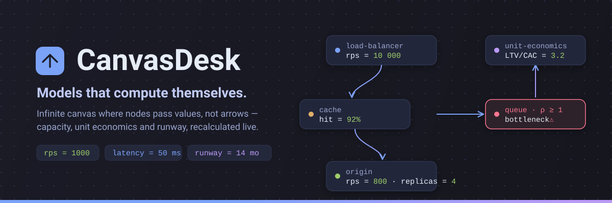
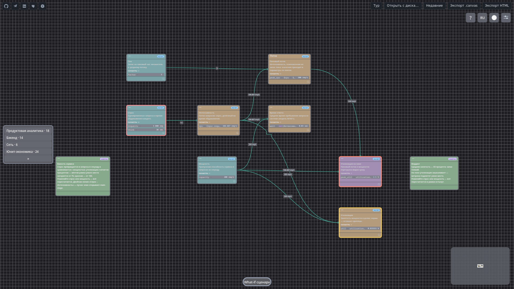

<div align="center">



### Бесконечный канвас, на котором ИТ-сервисы, продукты и юнит-экономика **считаются, а не рисуются**

Соединяете ноды связями — значения проливаются по графу и пересчитываются на лету.
Меняете один параметр — видите, что произойдёт с P&L, runway или пропускной способностью сервиса.

[](https://github.com/danku13/CanvasDesk/releases/latest)
[](https://github.com/danku13/CanvasDesk/actions/workflows/ci.yml)
[](https://github.com/danku13/CanvasDesk/actions/workflows/build-all.yml)
[](LICENSE)
[](CLA.md)
[](CONTRIBUTING.md)

[**🚀 Веб-демо**](https://danku13.github.io/CanvasDesk/app/) ·
[**⬇️ Скачать релиз**](https://github.com/danku13/CanvasDesk/releases/latest) ·
[**📚 Документация**](#-документация) ·
[**🗂 Схемы-примеры**](#-схемы-примеры) ·
[**❓ FAQ**](#-faq) ·
[**🤝 Contributing**](#-участие-в-проекте)

[English](README.en.md) · **Русский**

</div>

---

## ✨ Что это такое

CanvasDesk — это визуальная среда математического моделирования. На бесконечном зумируемом канвасе вы строите **исполняемые модели** из расчётных нод: текстовые заметки с формулами «человеческим языком» и готовые шаблоны (балансировщик нагрузки, кэш, очередь, CAC, LTV, runway, retention…).

Связи между нодами передают не просто «стрелочку», а **значение**. Подставили `rps = 1000` в одну ноду — во всех связанных пересчитаются латентность, утилизация, потребность в репликах. Изменили churn на 1 процентный пункт — увидите дельту по LTV, runway и burn rate в таблице сравнения сценариев. Граф — направленный ацикличный (DAG), циклы блокируются, живой пересчёт — мгновенный.

В ядро встроена доменная математика: единицы измерения конвертируются автоматически (`50 ms`, `1000 rps`, `$10k/mo`), есть формулы теории очередей (`mm1`, `mmc`, `erlang_c`, закон Литтла), финансовые функции (`npv`, `irr`, `cagr`, `cohort_ltv`). Не нужно писать формулы в Excel и синхронизировать их с диаграммой — диаграмма **и есть** формула.

ИИ-агент через [MCP](#-ии-агенты-и-mcp) собирает модели по текстовому описанию и проверяет числа: «спроектируй сервис на 10k rps с кэшем и очередью» — агент раскладывает граф, подставляет эталонные значения, показывает узкие места.

Это инструмент для тех, кто должен одновременно **спроектировать систему**, **посчитать её** и **защитить расчёт** перед командой, C-level или инвесторами — в одном месте, без раскидывания по Miro + Excel + Google Docs + PowerPoint.

<p align="center">
  
  <br><sub><b>Модель «Ёмкость сервиса»</b> — значения протекают по рёбрам графа, узкое место (ρ ≥ 1) подсвечено. Полная галерея — <a href="#-схемы-примеры">ниже</a>.</sub>
</p>

## 👥 Кому это нужно

| Роль | Типовые вопросы, на которые отвечает CanvasDesk |
|---|---|
| **Solution / Technical-архитектор** | Выдержит ли сервис 10k rps? Сколько реплик и воркеров нужно? Где узкое место при ×2? Что с P99, если добавить кэш? |
| **Продакт-аналитик и финансист** | Какой LTV при таком CAC? Что с runway, если churn упадёт на 1 пп? Когда ARPU окупит привлечение? |
| **Продакт-оунер и менеджер** | Что если нагрузка удвоится? Где сломается P&L? Какой сценарий выбрать при горизонте 18 месяцев до profitability? |
| **ИИ-ассистент в петле с человеком** | Собрать модель по описанию за минуты, чтобы человек её исследовал и доработал: агент строит граф, проставляет связи, проверяет корректность. |

## 🚀 Быстрый старт

**1. Веб-версия — без установки** → [danku13.github.io/CanvasDesk/app/](https://danku13.github.io/CanvasDesk/app/)
Тот же движок в браузере: нужен Chrome или Edge (WebGPU), Firefox — экспериментально. Загрузка ~1 секунда.

**2. Готовый бинарь** → [Releases](https://github.com/danku13/CanvasDesk/releases/latest)
Windows x64, Linux, macOS universal2 (`.app`) — ничего компилировать не нужно.

**3. Сборка из исходников** (нужен Rust 1.80+):

```bash
git clone https://github.com/danku13/CanvasDesk.git
cd CanvasDesk
cargo build --workspace --release
cargo run -p canvas-app --release -- path/to/file.canvas
cargo run -p canvas-app --release -- --stress 5000    # нагрузочная сцена
canvasdesk mcp                                        # MCP-посредник для AI-клиентов
```

Платформенные особенности — в [docs/ENVIRONMENT.md](docs/ENVIRONMENT.md).

**4. ИИ-агент** — добавьте `canvasdesk mcp` в конфиг своего AI-клиента: агент собирает модели, проверяет числа, ищет узкие места.

## 💡 Что можно сделать прямо сейчас

- **Открыть эталонную схему** — [галерея схем](#-схемы-примеры) в репозитории и в приложении: unit economics, capacity service, project budget, what-if. Покрутить параметры и посмотреть, как пересчитывается downstream.
- **Использовать 60+ встроенных шаблонов** — палитра слева или кольцевое меню: инфраструктура, юнит-экономика, продуктовая аналитика.
- **Запустить what-if** — подмените строку расчёта и увидите дельты по всему графу; сравните до 3 сценариев таблицей.
- **Работать командой в одном файле** — модель это `.canvas`-файл: коммитьте в git, ревьюйте diff-ом, открывайте у кого угодно.

## 🧠 Как это работает

- **Формулы как текст.** В любой заметке пишете `rps = 1000`, `latency = 50 ms`, `cost = rps * $0.01`. Единицы конвертируются, переменные протекают сверху вниз, как в Numi.
- **Связи передают значения.** Соединили источник с приёмником — значение выхода подставилось в параметр входа. Меняется источник — пересчитывается весь downstream.
- **Готовые шаблоны.** Не нужно с нуля собирать балансировщик, кэш, очередь или формулу LTV — берёте из палитры, подставляете свои числа.
- **Доменная математика в ядре.** Erlang-C для контакт-центров, теория очередей для сервисов, NPV/IRR/CAGR для финансов — встроено, без внешних библиотек.
- **Живой пересчёт и undo.** Всё пересчитывается мгновенно, любая правка откатывается в один шаг. What-if сценарии не портят базовую модель — сравнили, выбрали лучший, применили.

## 🎯 Сценарии использования

**«Выдержит ли сервис 10k rps?»** — собираете граф из шаблонов: балансировщик → API-шлюз → очередь → воркеры → БД. Подставляете rps, видите утилизацию каждого узла, индикатор узкого места (ρ ≥ 1) подсвечивается красным. Добавляете кэш — пересчёт, видите, где разгрузилось.

**«Что с runway, если churn упадёт на 1 пп?»** — открываете эталонную схему unit economics, в what-if подменяете churn, видите дельту по LTV, MRR, runway в таблице сравнения. Экспортируете сценарий для инвесторов.

**«Где сломается P&L при ×2 нагрузки?»** — дублируете граф, удваиваете rps, видите, какие статьи раздуются (инфраструктура, поддержка), где маржа уходит в минус. Защищаете решение перед C-level таблицей «было → стало».

**«Спроектируй MVP Instagram»** — пишете агенту, он раскладывает граф: пользователи → retention → DAU → нагрузка на storage/CDN → cost. Проверяете числа, докручиваете, идёте к инвесторам с моделью, а не с презентацией.

## 🗂 Схемы-примеры

14 эталонных моделей в [`assets/canvas-schemes/`](assets/canvas-schemes/) — открывайте прямо в приложении (галерея на старте или File → Open):

| Категория | Схемы |
|---|---|
| **Инфраструктура** | [capacity-service](assets/canvas-schemes/com.canvasdesk.scheme.capacity-service/scheme.json) · [support-staffing](assets/canvas-schemes/com.canvasdesk.scheme.support-staffing/scheme.json) · [renovation-estimate](assets/canvas-schemes/com.canvasdesk.scheme.renovation-estimate/scheme.json) |
| **Юнит-экономика** | [unit-economics](assets/canvas-schemes/com.canvasdesk.scheme.unit-economics/scheme.json) · [runway](assets/canvas-schemes/com.canvasdesk.scheme.runway/scheme.json) · [investment-case](assets/canvas-schemes/com.canvasdesk.scheme.investment-case/scheme.json) · [project-budget](assets/canvas-schemes/com.canvasdesk.scheme.project-budget/scheme.json) |
| **Продукт и рост** | [ab-testing](assets/canvas-schemes/com.canvasdesk.scheme.ab-testing/scheme.json) · [cohort-launch](assets/canvas-schemes/com.canvasdesk.scheme.cohort-launch/scheme.json) · [cjm-saas](assets/canvas-schemes/com.canvasdesk.scheme.cjm-saas/scheme.json) · [jtbd-saas](assets/canvas-schemes/com.canvasdesk.scheme.jtbd-saas/scheme.json) · [service-blueprint-saas](assets/canvas-schemes/com.canvasdesk.scheme.service-blueprint-saas/scheme.json) |
| **Обучение** | [intro-calculations](assets/canvas-schemes/com.canvasdesk.scheme.intro-calculations/scheme.json) · [intro-whatif](assets/canvas-schemes/com.canvasdesk.scheme.intro-whatif/scheme.json) |

## 📚 Документация

| Документ | Что внутри |
|---|---|
| [docs/SPEC.md](docs/SPEC.md) | Техническая спецификация движка и архитектуры |
| [user-docs/](user-docs/) | Пользовательская документация |
| [docs/RECIPES.md](docs/RECIPES.md) | Рецепты: как собрать типовые модели |
| [docs/ENVIRONMENT.md](docs/ENVIRONMENT.md) | Сборка и платформенные особенности |
| [docs/BYOK.md](docs/BYOK.md) | Подключение своих ИИ-ключей (BYOK) |
| [docs/plans/product-roadmap.md](docs/plans/product-roadmap.md) | Дорожная карта продукта |
| [CONTRIBUTING.md](CONTRIBUTING.md) | Правила участия в разработке |
| [THIRD-PARTY-NOTICES.md](THIRD-PARTY-NOTICES.md) | Сторонние лицензии |

## 🤖 ИИ-агенты и MCP

CanvasDesk поставляется с MCP-посредником (`canvasdesk mcp`): любой AI-клиент, говорящий по [Model Context Protocol](https://modelcontextprotocol.io), может строить и проверять модели прямо на канвасе. Агент раскладывает задачу в граф, проставляет связи, подставляет эталонные значения и подсвечивает риски; человек проверяет и докручивает. Протокол верификации моделей — wasm-проверка на стороне ядра ([docs/SPEC.md](docs/SPEC.md)).

## 🧱 Стек

Rust · wgpu (WebGPU) · winit · cosmic-text · rstar (spatial index) · rusqlite · serde · MCP-протокол. UI-стек — собственный: слои поверхностей, компонентный кит и layout-движок FlexLayoutEngine (подмножество CSS Flexbox/Grid: auto/minmax-треки, sticky, rotate, z-index) без внешних layout-зависимостей. Один бинарь — весь стек: GUI + MCP-посредник для AI-клиентов.

**Возможности канваса:** бесконечный канвас (панорамирование, зум к курсору, pinch, сетка) · markdown-заметки, совместимые с Obsidian (`**жирный**`, `*курсив*`, `==подсветка==`) · файловые карточки с тамбнейлами · миникарта и полнотекстовый поиск · клик по заметке сразу ставит курсор в точку нажатия (без даблклика) · undo/redo глубиной 50 · группировка нод и палитра цветов · 7 тем (tokyo-night, dracula, nord, gruvbox, catppuccin, solarized…) · режим «вместо рабочего стола» на Windows · автосейв с debounce и `.bak`-копией · **5000 нод при 60 fps**.

## 🗺 Статус

Канвас, рендер, заметки, связи, клик-редактирование, миникарта, поиск, undo, MCP, Numi-движок, поток значений, 60 шаблонов, what-if, ИИ-агент, веб-версия — **работают и активно используются**.

| Платформа | Состояние |
|---|---|
| Windows 10/11 x64 | полная функциональность |
| Linux, macOS | канвас и редактирование; платформенные фичи (drag-drop, MCP через Unix-сокеты) — по плану |
| Веб | Chrome/Edge (WebGPU), Firefox — экспериментально |

Проект в активной разработке, сейчас — этап проверки востребованности: **ищем первых 5 внешних пользователей**, которые сами построят модель и вернутся к ней второй раз. Попробуйте [веб-версию](https://danku13.github.io/CanvasDesk/app/) и напишите, что получилось — [@danku13](https://t.me/danku13).

Подробности — в [спецификации](docs/SPEC.md), [пользовательской документации](user-docs/) и [дорожной карте](docs/plans/product-roadmap.md).

## 🤝 Участие в проекте

Приветствуются PR, баг-репорты и идеи схем. Прочитайте [CONTRIBUTING.md](CONTRIBUTING.md) перед первым PR. Отправляя Pull Request, вы принимаете [CLA](CLA.md) — авторство остаётся за вами, право лицензировать вклад в будущем переходит владельцу проекта.

## 📜 Лицензия и правила игры

**Copyright © 2026 danku13.** Проект распространяется под **[GNU AGPLv3](LICENSE)**. Модель простая: код бесплатный и открытый — навсегда; судьба проекта (включая лицензию) — в руках владельца.

| | |
|---|---|
| 💚 **Код бесплатен** | Весь код — под [GNU AGPLv3](LICENSE): свободно используйте, изучайте, изменяйте и распространяйте. Никаких «open core» хитростей — сообщество получает весь проект целиком. |
| 🔒 **Коммерческие права у владельца** | Исключительные права на проект и **право изменять его лицензию в будущем** сохраняет владелец (**danku13**): можно выпустить коммерческую или проприетарную редакцию, применить dual-licensing. Код, уже выпущенный под AGPLv3, для сообщества от этого не закроется. |
| ✍️ **PR = подписание CLA** | Отправляя Pull Request, вы **автоматически принимаете [CLA](CLA.md)**: авторство вашего кода остаётся за вами, но право лицензировать вклад в будущем переходит владельцу. Это защищает проект от юридических рисков при смене лицензии. |

## ❓ FAQ

**Можно ли использовать CanvasDesk в коммерческих целях?**

Да — на условиях AGPLv3: коммерческое использование законно, пока соблюдаются условия лицензии (исходники изменений открываются под AGPLv3; для сетевых сервисов действует §13 AGPL — исходники версии, доступной пользователям, должны быть открыты). Разрешения владельца для этого не требуется.

*Yes — under AGPLv3 terms: commercial use is legal as long as you comply with the license (your modifications stay under AGPLv3; for network services §13 applies).*

**Условия AGPLv3 мне не подходят (закрытая интеграция, OEM, white-label, SaaS без открытия исходников)**

Напишите владельцу — обсудим **коммерческую лицензию** под ваш сценарий: Telegram [@danku13](https://t.me/danku13) или [danku13@yandex.ru](mailto:danku13@yandex.ru).

*Contact the owner to discuss a **commercial license**: Telegram [@danku13](https://t.me/danku13) or [danku13@yandex.ru](mailto:danku13@yandex.ru).*

**На каких ОС работает?**

Windows 10/11 x64 — полная функциональность. Linux и macOS — канвас, редактирование, поиск; платформенные интеграции в работе. Веб-версия — в Chrome/Edge (WebGPU), Firefox — экспериментально.

**Есть ли веб-версия?**

Да — [danku13.github.io/CanvasDesk/app/](https://danku13.github.io/CanvasDesk/app/). Тот же движок, что в десктопе, работает в браузере: ввод, кириллица, поиск, браузерное хранение. Загрузка около секунды.

**Что происходит с моим вкладом?**

Авторство — ваше (git-история сохранит), но по [CLA](CLA.md) владелец получает право лицензировать вклад на любых условиях в будущем. Правила участия — в [CONTRIBUTING.md](CONTRIBUTING.md).

**Поддерживается ли русский язык?**

Интерфейс — русский и английский (переключается в настройках). Формулы и единицы измерения — универсальные.

**Инвестиции и партнёрство?**

Свяжитесь любым способом: Telegram [@danku13](https://t.me/danku13), [danku13@yandex.ru](mailto:danku13@yandex.ru).

*Companies and investors: reach out via Telegram [@danku13](https://t.me/danku13) or [danku13@yandex.ru](mailto:danku13@yandex.ru).*
