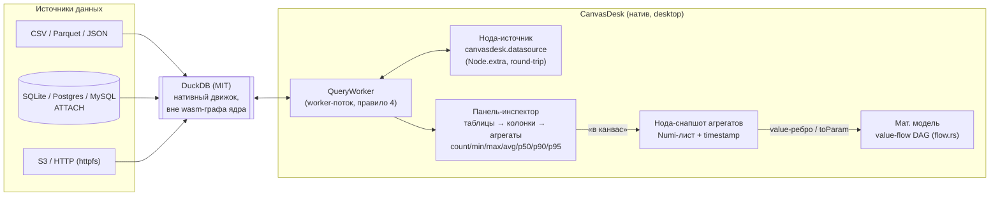

# PRD-0001: DuckDB-коннектор данных — PoC реальных вводных для математического моделирования

- **Статус:** в анализе
- **Тип:** PRD (документ требований продукта; реализация оформляется отдельным `FR-039` по шаблону `docs/change-requests/cr-template.md`)
- **Приоритет:** важно
- **Владелец:** агент (оформление по запросу владельца, сессия 2026-09-20)
- **Источник:** запрос владельца от 2026-09-20 — «плагин типа DuckDB, которым можно подрубаться к любой БД или файлу с данными, из полученных таблиц видеть столбцы и тянуть агрегаты min/max/p50/p90/p95 — PoC-версия получения реальных вводных для мат.моделирования»
- **Связанные документы:** ADR-0007 (позиционирование — визуальная система мат.моделирования), ADR-0008 (стек вычислений, ограничения зависимостей), ADR-0011 (wasm-гейт), `docs/architecture/math-computing-stack.md` (отказ от `polars` — пересматривается этим PRD), `docs/SPEC.md` §6.3 (производительность), `docs/WIDGETS.md` (permissions)
- **Создан:** 2026-09-20
- **Обновлён:** 2026-09-20

---

## 1. Резюме

CanvasDesk — визуальная система математического моделирования (ADR-0007): модели собираются из расчётных нод (Numi-листы и шаблоны), значения проливаются по value-связям DAG-движка (`crates/canvas-core/src/flow.rs`). Сегодня все вводные модели — ручные: аналитик либо набирает числа в Numi-строках, либо копирует их из внешних систем. Модель, построенная на выдуманных вводных, не даёт ответов, которым можно доверять.

Этот PRD описывает **PoC-версию коннектора данных на движке DuckDB**: пользователь подключается к файлу (CSV/Parquet/JSON) или БД (SQLite/Postgres/MySQL), выбирает таблицу, видит её колонки и мгновенно получает агрегаты `count / min / max / avg / p50 / p90 / p95`, после чего одним действием переносит их на канвас как расчётную ноду-источник вводных, связанную value-рёбрами с параметрами модели. Цель PoC — не полноценный BI-инструмент, а замкнутый минимальный цикл «**реальные данные → агрегаты → вводные модели**» без выхода из продукта.

---

## 2. Контекст и проблема

### 2.1 Как это выглядит сегодня

Вводные расчётной ноды задаются текстом Numi-листа (`crates/canvas-core/src/expr.rs`, `eval_lines`), а параметры соседних нод перекрываются проливанием по value-рёбрам — позиционные слоты `$1..$N` (`inbound_slots`, `flow.rs:518`) и именованные порты `toParam` (FR-029). Статистическая база в движке уже есть: функция `percentile(p, …)` с линейной интерполяцией реализована (`eval_percentile` — `expr.rs:1574`, `percentile_inc` — `expr.rs:1602`), домен моделирования покрывают queueing-функции (`expr/queueing.rs`: `mm1`, `mmc`, `erlang_c`, `littles_law`). То есть **приёмная сторона готова** — ей не хватает источника реальных чисел.

### 2.2 Чего не хватает

У продукта нет никакого дата-слоя: поиск по репозиторию `duckdb|polars|arrow|parquet|csv` даёт ноль вхождений в код. Более того, отказ от табличных движков зафиксирован осознанно: «`polars` / табличные движки — продукт не работает с табличными датасетами; возвращаться к вопросу только при появлении домена «данные»» (`docs/architecture/math-computing-stack.md`, §4.3 таблица). Владелец этим запросом фиксирует: **домен «данные» появился** — настоящим PRD решение об отказе пересматривается в ограниченном объёме (read-only инспекция и агрегаты, без ETL).

### 2.3 Почему DuckDB

- Один встраиваемый движок закрывает «любую БД и любой файл»: native CSV/Parquet/JSON-ридеры, `ATTACH` SQLite/Postgres/MySQL, `httpfs` для S3/HTTP — без отдельных драйверов на каждый источник.
- Аналитические агрегаты (percentile-континуум `quantile_cont`) считаются на месте, без выгрузки таблиц целиком в память приложения.
- Лицензия MIT — проходит лицензионный allowlist ADR-0008 (MIT/Apache-2.0/BSD/ISC…).
- Зрелый Rust-клей `duckdb`/`libduckdb-sys` и официальный `duckdb-wasm`, если позже понадобится web-ветка.

---

## 3. Цели и метрики успеха

| # | Цель | Метрика PoC |
|---|---|---|
| G1 | Подключиться к источнику из UI | Подключение к CSV ≤ 30 КБ и к SQLite ≤ 1 МБ — не более 10 с от клика до списка таблиц |
| G2 | Увидеть схему | Список таблиц и колонок (имя, тип) рендерится ≤ 1 с для источника ≤ 100 колонок |
| G3 | Получить агрегаты | `count/min/max/avg/p50/p90/p95` по выбранной колонке ≤ 5 с на выборке ≤ 1 млн строк |
| G4 | Донести агрегаты до модели | От агрегата до value-ребра в параметр модели (`toParam`) — ≤ 3 действия пользователя, без ручного набора текста |
| G5 | Не сломать продукт | wasm-гейт `scripts/wasm_gate.sh` зелёный; single-exe (FR-008) сохранён; автосейв `.canvas` не деградирует |

Не-цели и границы — в §9.

---

## 4. Пользователи и сценарии

**Персона 1 — аналитик/инженер моделирования (основная).** Строит модель пропускной способности сервиса (шаблоны `db-sql-master`, `queue-kafka` — `assets/templates/`). Ей нужны реальные qps, латентности p95, размеры очередей — они лежат в выгрузках и продовых БД.

**Персона 2 — техлид/архитектор.** Проверяет на модели «а что если p95 латентности БД вырастет вдвое»; хочет быстро подставить фактические хвосты распределений, а не «примерно 200 мс».

**Персона 3 — ИИ-агент (MCP, CR-013).** Агент собирает модели автоматически (`canvas-scene/src/mcp.rs`); программная поверхность коннектора позволит ему в будущем самому подтягивать вводные (не входит в PoC — см. §9, фиксируется как точка роста).

---

## 5. User stories и критерии приёмки

### US-1. Подключить файл с данными

> **Как** аналитик, **я хочу** перетащить CSV/Parquet/JSON-файл на канвас и получить ноду-источник данных, **чтобы** вводные модели брались из реального файла, а не из моей памяти.

**Acceptance criteria:**
- AC-1.1: drag-drop файла данных (существующий путь `crates/canvas-app` → `drop_files`) создаёт ноду-источник с конфигом `canvasdesk.datasource` в `Node.extra`; файл НЕ копируется в `.canvas` (источник истины — внешний файл).
- AC-1.2: конфиг сериализуется в `.canvas` и переживает round-trip Obsidian (неизвестные поля — через `extra`, `crates/canvas-core/src/io.rs`).
- AC-1.3: повторное открытие канваса восстанавливает подключение; если файл недоступен — нода помечается «источник недоступен», модель продолжает считаться на последних закэшированных агрегатах.

### US-2. Увидеть таблицы и колонки

> **Как** аналитик, **я хочу** открыть у ноды-источника панель инспектора со списком таблиц и колонок (имя + тип), **чтобы** ориентироваться в источнике без внешних инструментов.

**Acceptance criteria:**
- AC-2.1: панель инспектора открывается с ноды-источника (кнопка/пункт контекстного меню); показывает таблицы, по клику — колонки: имя, тип, доля NULL.
- AC-2.2: для CSV/JSON «таблицы» = файл (или топ-уровень JSON); для БД — список таблиц `information_schema`-запросом движка.
- AC-2.3: панель не блокирует канвас: Esc закрывает (каскад `on_key`, `app.rs:6339`), клик вне — закрывает.

### US-3. Получить агрегаты по колонке

> **Как** аналитик, **я хочу** выбрать колонку и увидеть count/min/max/avg/p50/p90/p95, **чтобы** понять характер распределения перед моделированием.

**Acceptance criteria:**
- AC-3.1: клик по колонке → агрегаты считаются SQL-движком DuckDB (один запрос `count, min, max, avg, quantile_cont`), а не в памяти приложения.
- AC-3.2: результат отображается в панели инспектора; повторный клик по другой колонке — новый расчёт без пересчёта предыдущих (кэш агрегатов сессии).
- AC-3.3: на выборке ≤ 1 млн строк ответ ≤ 5 с (G3); долгие расчёты показывают индикацию и не блокируют рендер-поток (правило 4 «Правил архитектуры» — worker-поток).

### US-4. Перенести агрегат в модель

> **Как** аналитик, **я хочу** кнопкой перенести агрегат (например, p95 колонки `latency_ms`) на канвас как расчётную ноду/параметр, **чтобы** модель считалась на фактических хвостах распределения.

**Acceptance criteria:**
- AC-4.1: действие «в канвас» создаёт Numi-ноду со строками вида `p95 = percentile(95, …)` — фактически статичный снапшот агрегата со ссылкой на источник (в комментарии/метаданных ноды — `canvasdesk.datasource` + колонка + timestamp).
- AC-4.2: созданная нода участвует в value-flow как обычная (`flow.rs`); её выход можно пролить в параметр шаблона через `toParam` (FR-029) — ручная правка формул не нужна.
- AC-4.3: переносимые значения — числа с единицами Numi, если тип колонки их позволяет (мс → `ms`).

### US-5. Понять свежесть и природу данных

> **Как** техлид, **я хочу** видеть на ноде-источнике, откуда данные и когда агрегаты считались, **чтобы** доверять вводным модели.

**Acceptance criteria:**
- AC-5.1: нода-источник показывает: тип источника (файл/БД), путь/строку подключения (без пароля — см. §8.4), время последнего расчёта агрегатов.
- AC-5.2: действие «пересчитать» повторяет SQL-запросы агрегатов и обновляет снапшоты связанных нод.

---

## 6. Решение

### 6.1 Концептуальная схема

### 6.2 Точка интеграции: провайдер по образцу `providers.rs`

Ядро остаётся платформенно-нейтральным (правило 1 «Правил архитектуры»). В `canvas-core/src/providers.rs` — устоявшийся паттерн «трейт + Noop-заглушка + инъекция в `App::new`» (`ThumbnailProvider`, `WatchBackend`, `WidgetStateBackend` и др.). Коннектор проектируется так же:

| Элемент | Решение |
|---|---|
| Трейт ядра | `DataInspectorBackend` в `canvas-core/src/providers.rs`: `open(source: &DataSourceConfig)`, `list_tables()`, `list_columns(table)`, `aggregate(table, column, &[AggKind]) -> AggResult` (`AggKind::{Count, Min, Max, Avg, Percentile(u8)}`) |
| Noop-заглушка | `NoopDataInspector` — для web-сборки, тестов и платформ без движка (панель деградирует в «коннектор недоступен», модель не страдает) |
| Реализация | Крейт `canvas-data` (новый, вне wasm-графа ядра) либо модуль `canvas-shell`: `duckdb` (Rust-клей `libduckdb-sys`) за cargo-feature `data-duckdb`, по образцу отделения `canvas-preview-host` от дерева ядра |
| Рантайм-кэш | Агрегаты и схемы — в памяти сессии (структура по образцу `ExprResults`/`AnalysisState` в `SceneState`, `canvas-scene/src/scene.rs:218`); опционально тёплый кэш в `~/.canvasdesk/cache.db` (пересоздаваемый SQLite, правило 5) |
| Источник истины | Внешний файл/БД. В `.canvas` пишется только конфиг `canvasdesk.datasource` (тип, путь/DNS, опции) — сериализация через `Node.extra`, round-trip без потерь |

### 6.3 Почему не другие варианты интеграции

| Вариант | Вердикт | Причина |
|---|---|---|
| `duckdb` внутри `canvas-core/render/widgets` | Отвергнуто | Ломает wasm-гейт (ADR-0011: эти крейты обязаны собираться под `wasm32`) и правило «без нативных C-зависимостей» для ядра (ADR-0008) |
| Виджет с `duckdb-wasm` (WebView2) | Отложено | Виджет-хост — Windows WebView2, web-виджеты — плейсхолдеры (`canvas-web/src/widgets_web.rs`); в permissions нет «доступ к БД»; «сеть в хосте» запрещена (AGENTS.md). Возврат к варианту — отдельный FR после PoC |
| Внешний процесс `duckdb` CLI (stdin/stdout) | Запасной | Не требует `libduckdb-sys` в бинаре, но ломает single-exe UX (FR-008) и усложняет дистрибуцию; держим как план B, если связка C++ не пройдёт приёмку сборки |

### 6.4 UI-поток (PoC)

1. Пользователь перетаскивает файл данных на канвас (существующий drag-drop путь) или создаёт ноду-источник из меню канваса и задаёт строку подключения.
2. У ноды-источника открывается **панель-инспектор** (оверлей по образцу `docs_ui.rs`/`settings_overlay` — screen-space квады `FrameOverlay`, `renderer.rs:134`): таблицы → колонки → агрегаты выбранной колонки.
3. Кнопка «В канвас» создаёт Numi-ноду-снапшот агрегатов; из неё value-рёбрами/`toParam` значения проливаются в параметры шаблонных нод модели (`db-sql-master` и др.).

Для PoC панель — минимальный список+детали без кастомной типографики; перенос значений — односценарный (снапшот-нода).

---

## 7. Функциональные требования

| ID | Требование | Приоритет | Приёмка |
|---|---|---|---|
| F-1 | Подключение к файлам CSV/Parquet/JSON (нативные ридеры DuckDB) | must | US-1 AC |
| F-2 | Подключение к SQLite/Postgres/MySQL через `ATTACH` (extensions `sqlite_scanner`, `postgres_scanner`, `mysql`) | must (SQLite) / should (PG/MySQL) | US-1, US-2 AC |
| F-3 | Панель-инспектор: таблицы → колонки (имя, тип) | must | US-2 AC |
| F-4 | Агрегаты колонки: `count, min, max, avg, p50, p90, p95` одним SQL-запросом (`quantile_cont`) | must | US-3 AC |
| F-5 | Снапшот агрегатов → Numi-нода на канвасе, участие в value-flow | must | US-4 AC |
| F-6 | Конфиг `canvasdesk.datasource` в `.canvas` с round-trip; результаты — только в рантайм-кэше | must | US-1 AC-1.2 |
| F-7 | Пересчёт агрегатов по команде + метка времени свежести | should | US-5 AC |
| F-8 | S3/HTTP через `httpfs` | could | — |
| F-9 | Кэш агрегатов сессии (без пересчёта при каждом открытии панели) | should | US-3 AC-3.2 |
| F-10 | Индикация долгих запросов + отмена | should | US-3 AC-3.3 |

## 8. Нефункциональные требования

1. **Архитектура.** Ядро (`canvas-core`) не зависит от DuckDB; всё — за трейтом `DataInspectorBackend` и платформенным крейтом. `canvas-core/render/widgets/scene` продолжают собираться под `wasm32` (гейт `scripts/wasm_gate.sh`, ADR-0011).
2. **Производительность.** SQL выполняется в worker-потоке; рендер-поток не блокируется (правило 4). Бюджеты — §3 (G1–G3). Live-пересчёт моделей не затрагивается: снапшот — статичная нода, пересчёт DAG — штатный `recompute_flow` (`canvas-scene/src/scene.rs:325`).
3. **Формат.** Никаких новых обязательных полей JSON Canvas 1.0; только расширение `canvasdesk.datasource` в `Node.extra` (прецеденты: `canvasdesk.flow.kind`, `canvasdesk.pin_ports`).
4. **Безопасность.** Пароли/токены в конфиге подключения не сериализуются в `.canvas` (только DSN без секрета, секрет — в per-session вводе или системном хранилище — открытый вопрос §10-Q4). Read-only: DuckDB открывается в режиме без записи; продукт ничего не пишет в источник.
5. **Лицензии.** `duckdb`/`libduckdb-sys` — MIT (allowlist ADR-0008); объём C++-сборки фиксируется как осознанное исключение по следам bundled SQLite — требует **ADR-0013** до старта реализации (правило «ADR пишется ДО реализации», AGENTS.md).
6. **Собираемость.** `cargo build/test/clippy/fmt --workspace` зелёные на CI-матрице; `cargo deny` — новый граф зависимостей проходит allowlist; single-exe (FR-008) сохраняется (динамических зависимостей не появляется — статическая линковка).

---

## 9. Non-goals

- **Не SQL-редактор.** Никакого произвольного SQL от пользователя в PoC: только фиксированные запросы схемы и агрегатов (защита и от инъекций, и от расползания скоупа).
- **Не ETL/трансформации.** Коннектор ничего не пишет в источники, не создаёт таблиц, не делает joins/joins-конструктор, не строит графики.
- **Не realtime.` Изменения источника не стримятся: данные снимаются снапшотом по команде; file-watcher для автообновления — вне PoC.
- **Не web-версия.** В PoC коннектор — только нативный desktop; web-сборка деградирует в Noop (плейсхолдер панели).
- **Не MCP-поверхность.** Программный доступ агента к коннектору (`data_inspect` и т.п.) — точка роста, отдельный FR после PoC.
- **Не полноценный виджет-пакет.** Инспектор — панель приложения, а не WebView2-виджет; перенос инспектора в виджетную модель — после стабилизации контракта.
- **Не отменяем ADR-0008 целиком.** Исключение — только DuckDB для домена «данные»; ползание Python/GPU/копyleft в стек не предполагается.

---

## 10. Открытые вопросы

- **Q1.** Расширения Postgres/MySQL: тянуть в бинаре (рост размера, время сборки) или ограничить PoC файлами + SQLite, а PG/MySQL — через `httpfs`-подобные сервисные конфиги? Влияет на ADR-0013.
- **Q2.** Форма ноды-источника: отдельный тип ноды (`canvasdesk.datasource` на `NodeKind::Unknown`-совместимом типе) или расширение существующей файловой ноды? Решение — при оформлении FR-039 (влияет на `model.rs` и `docs/interface-objects/node.md`).
- **Q3.** Большие Parquet на сетевых дисках: нужен ли прогресс-бар с возможностью отмены (F-10) в PoC или достаточно «крутящегося» индикатора?
- **Q4.** Хранение секрета подключения: системный keychain (нет крейта в дереве — новая зависимость) vs ручной ввод в сессию (секрет не сохраняется вовсе)? По умолчанию — ручной ввод.
- **Q5.** Нужно ли автосоздание value-рёбер от ноды-снапшота к выделенной расчётной ноде (кнопка «пролить в выделенное») — или ручная проводка рёбер достаточна для PoC?

---

## 11. Риски и митигации

| Риск | Влияние | Митигация |
|---|---|---|
| Сборка `libduckdb-sys` (C++, ~мегабайты бинаря, cmake) удлиняет CI и рвёт матрицу M7 | Сборка/дистрибуция | Изоляция в крейте `canvas-data` за feature; гейт сборки в CI отдельной джобой; план B — внешний процесс `duckdb` CLI (§6.3) |
| Прецедент «нативной C-зависимости» размывает правило ADR-0008 | Архитектура | ADR-0013 фиксирует границу: DuckDB — второе и последнее исключение, только для домена «данные», вне wasm-графа |
| Пользователь подключает источник с PII/секретами | Безопасность | Read-only, секреты не сериализуются (§8.4), DSN маскируется в UI |
| Агрегаты устарели, модель «врёт» | Доверие к продукту | Метка времени свежести на ноде-источнике (US-5), действие «пересчитать» |
| Тяжёлый запрос блокирует UI | UX | Worker-поток + отмена (F-10), бюджеты G3 |

---

## 12. Дорожная карта PoC

| Этап | Содержание | Результат |
|---|---|---|
| D0 | ADR-0013 (зависимость DuckDB, граница ADR-0008) + FR-039 по шаблону `cr-template.md` | Разрешение на реализацию |
| D1 | Трейт `DataInspectorBackend` + Noop в `canvas-core`; конфиг `canvasdesk.datasource` (round-trip тесты `io.rs`) | Контракт без движка |
| D2 | Крейт `canvas-data`: DuckDB, файлы CSV/JSON + SQLite; тесты на фикстурах | AggResult в тестах |
| D3 | Панель-инспектор (оверлей), drag-drop → нода-источник, «в канвас» → Numi-снапшот | Замкнутый цикл US-1…US-4 |
| D4 | Свежесть/пересчёт (US-5), кэш сессии, доки (`user-docs/`, SPEC, ACCEPTANCE) | PoC-приёмка |

---

## 13. Точки входа в документацию (обязательные обновления при реализации)

- `docs/change-requests/fr-039-duckdb-data-connector.md` — реализационный FR (создаётся на D0).
- `docs/adr/adr-0013-*.md` + `docs/adr/README.md` — запись ADR-0013.
- `docs/architecture/math-computing-stack.md` §4.3 — пересмотр строки «polars / табличные движки» (домен «данные» открыт этим PRD).
- `docs/SPEC.md` — §3 (стек: duckdb за feature), §5 (модель: `canvasdesk.datasource`), §10 (критерии готовности PoC).
- `user-docs/` — страница «Данные» (+ синк `user-docs/README.md`, `index.md`; ссылки — относительные `*.html`, чек линков в тестах `docs_ui`).
- `docs/ACCEPTANCE.md` — приёмочный чек-лист PoC.
- `docs/DEPENDENCIES.md` — обоснование зависимости (правило «новые зависимости — только с обоснованием», AGENTS.md).
- `docs/index.md` — ссылка на этот PRD (добавлена при создании).

---

## 14. Проверка (Definition of Done PoC)

- [ ] G1–G5 из §3 воспроизводятся на демо-канвасе (CSV + SQLite) вручную.
- [ ] `scripts/wasm_gate.sh` зелёный; `cargo test --workspace` зелёный; clippy/fmt зелёные.
- [ ] Round-trip `.canvas` с `canvasdesk.datasource` — без потерь (тест в `crates/canvas-core/tests/json_canvas_io.rs`).
- [ ] Web-сборка открывает канвас с нодой-источником: панель деградирует в Noop, модель считается.
- [ ] Секреты подключения отсутствуют в `.canvas` и в логах (`tracing`).
- [ ] Обновлены все точки входа §13.

---

## 15. История изменений

- `2026-09-20` — агент: создан документ (PRD-0001), статус `в анализе`; анализ кодовой базы (отсутствие дата-слоя, готовность приёмной стороны Numi-flow, ограничения ADR-0008/ADR-0011), решение, требования, non-goals, риски, дорожная карта.

## 16. Источники истины

- Запрос владельца (сессия 2026-09-20) — исходная постановка.
- `docs/adr/adr-0007-pivot-math-modeling.md`, `docs/adr/adr-0008-math-computing-stack.md`, `docs/adr/adr-0011-wasm-build-gate.md` — позиционирование, ограничения стека, wasm-гейт.
- `docs/architecture/math-computing-stack.md` §4.3 — текущий отказ от табличных движков (пересматривается).
- `crates/canvas-core/src/expr.rs` (`eval_percentile` — 1574, `percentile_inc` — 1602), `crates/canvas-core/src/flow.rs` (`inbound_slots` — 518, `propagate_with_lines` — 357) — приёмная сторона агрегатов и проливания.
- `crates/canvas-core/src/providers.rs` — паттерн «трейт + Noop + инъекция».
- `crates/canvas-core/src/model.rs` (`Node.extra`, `CanvasdeskExt` — 123), `crates/canvas-core/src/io.rs` — round-trip расширений.
- `crates/canvas-scene/src/scene.rs` (`SceneState` — 218, `recompute_flow` — 325), `crates/canvas-app/src/app.rs` (`on_key` — 6339; оверлеи `docs_ui`/`settings_overlay`) — рантайм и UI-паттерны.
- `docs/WIDGETS.md`, `crates/canvas-widgets/src/permissions.rs` — почему вариант «виджет с duckdb-wasm» отложен.
- `AGENTS.md` — правила архитектуры, TDD, зависимостей и документации.
- Внешнее: DuckDB (https://duckdb.org — docs, extensions, лицензия MIT), jsoncanvas.org/spec/1.0.
