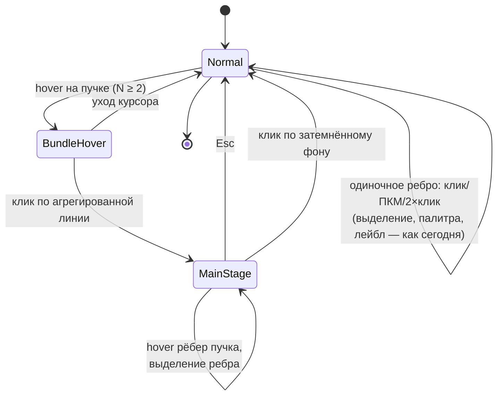

# PRD-0002: LOD-визуализация связей (пучки с весовой толщиной) и режим main stage

- **Статус:** в анализе
- **Тип:** PRD (документ требований продукта; реализация оформляется отдельным `FR-042` по шаблону `docs/change-requests/cr-template.md`)
- **Приоритет:** важно
- **Владелец:** агент (оформление по запросу владельца, сессия 2026-09-20)
- **Источник:** запрос владельца от 2026-09-20 — «переработать визуализацию edge между нодами: LOD-механизм, связи в обычном режиме — одиночная линия с толщиной по числу подключенных input; клик по edge с коннектами открывает режим main stage (две ноды + детальные inputs/edges, фон размыт); выход — Esc или клик по фону; размер main stage не более 70% экрана»
- **Связанные документы:** `docs/interface-objects/edge.md` (§2 `edgeWidth` — «толщина по весу потока» — заявленная точка входа), `docs/SPEC.md` §5.1/§6.2/§8, CR-008 (smart ports), CR-002 (edge rebind), FR-014 (value-flow), FR-025/FR-029 (line/name порты), T23 (focus-режим, `docs/plans/T23-focus-highlight.md`), ADR-0011 (wasm-гейт)
- **Создан:** 2026-09-20
- **Обновлён:** 2026-09-20

---

## 1. Резюме

Связи (`edge`) — второй по значимости объект канваса после нод, но при плотных моделях они превращаются в визуальный шум: каждое ребро рисуется отдельно, пары «шаблон-источник → расчётная нода» дают пучки параллельных линий, а в ограничениях интерфейсного объекта это зафиксировано прямо — «рендер связей в больших сценах (> 500 нод) — линии могут «запутываться» визуально» (`docs/interface-objects/edge.md` §6).

PRD вводит **двухуровневую LOD-модель отображения связей**:

1. **LOD-0 «Обычный режим»** — все рёбра между одной парой нод (пучок) сворачиваются в **одну агрегированную линию**, толщина которой кодирует число подключенных входов (input-коннектов); на линии — бейдж кратности `×N`.
2. **LOD-1 «Main stage»** — режим фокусировки по клику на агрегированную линию: в модальной композиции (≤ 70% вьюпорта) показываются **обе ноды соединения и все рёбра пучка в детальном виде** (стороны, лейблы, построчные истоки `fromLine`, именованные выходы `fromOutput`/`toParam`, kind value/control, текущие значения), остальной канвас затемняется. Выход — `Esc` или клик по затемнённому фону.

Изменения — чисто рендер/UX: модель `.canvas` не меняется, `edgeWidth` и пользовательские рёбра-одиночки ведут себя как сегодня.

---

## 2. Контекст и проблема

### 2.1 Сегодня

- Рёбра хранятся плоским списком `Canvas.edges: Vec<Edge>` (`crates/canvas-core/src/model.rs:678`); **несколько рёбер между одной парой нод разрешены и никак не агрегируются** — покрыто тестом «Дубль пары a↔h» (`crates/canvas-core/src/focus.rs:130`).
- Рендер — «бусины»-кружки по тесселяции кривой: `build_edge_instances` (`crates/canvas-render/src/cards.rs:891`) строит цепочку инстансов на каждое ребро (`EDGE_RENDER_SEGMENTS = 48`, `cards.rs:625`); толщина — **дискретная**: `EdgeThickness::dot()` → 1.8/2.5/3.5 world-px (`model.rs:89`).
- Число входов ноды существует только в семантике потока значений: `inbound_slots`/`inbound_values` (`flow.rs:518/579`) раскладывают входящие value-рёбра по слотам `$1..$N`; визуального отображения «веса» входа нет.
- Фокус-механика есть (T23): `focus_set()` (`focus.rs:56`) строит 1-hop окрестность ноды/ребра, `FocusView` затемняет не-фокусное до `FOCUS_DIM_FLOOR = 0.35` (`cards.rs`) — но это **подсветка при hover**, а не модальный режим с детализацией конкретного соединения.

### 2.2 Что не работает

1. Пучок из K рёбер между A и B рисуется как K линий — плотность растёт квадратично от числа связных нод, сигнальная ценность отдельной линии падает.
2. Толщина не несёт информации о количестве подключений (три дискретных значения — только ручная стилистика).
3. Нет способа «разобрать» соединение на детали, не читая каждую линию по отдельности: лейблы перекрываются, `fromLine`/`toParam`-сегменты сливаются.

### 2.3 Зацепки, оставленные в документации

`docs/interface-objects/edge.md` §2 для поля `edgeWidth` прямо называет точкой входа «Произвольная толщина, **толщина по весу потока**» — настоящий PRD реализует именно её, не трогая формат: вес считается в рендере, `.canvas` не расширяется.

---

## 3. Цели и метрики успеха

| # | Цель | Метрика |
|---|---|---|
| G1 | Снизить визуальный шум пучков | На модельном канвасе (2 ноды, 6 связей) в обычном режиме рисуется 1 линия с бейджем ×6, а не 6 линий |
| G2 | Толщина = вес | Толщина агрегированной линии монотонно растёт по числу input-коннектов (визуально различимы 1, 4, 10) |
| G3 | Детализация в 1 жест | От обычного режима до деталей конкретного соединения — 1 клик; выход — 1 Esc/клик |
| G4 | Не просадить кадр | 60 fps при 1000 нод / 3000 рёбер с включённой агрегацией (пан/зум; бюджет SPEC §6.3) |
| G5 | Без регрессий | Существующие жесты рёбер (выделение, ПКМ-палитра, double-click лейбл, rebind CR-002, создание через порт) работают как раньше для одиночных рёбер |

---

## 4. Терминология

| Термин | Определение |
|---|---|
| **Пучок (bundle)** | Все рёбра с одинаковой упорядоченной парой концов `(from_node, to_node)` — независимо от сторон/портов |
| **Input-коннект** | Один входящий слот приёмника от данного источника: PoC-семантика — 1 ребро = 1 коннект; вес пучка = число его рёбер, направленных в приёмник (расширение на `fromLine`/`toParam` — §10-Q1) |
| **Агрегированная линия** | Одиночная линия, которой в LOD-0 рисуется пучок; толщина ∝ весу |
| **Main stage** | Модальный режим детализации пучка: две ноды + все его рёбра, остальное затемнено |

---

## 5. User stories и критерии приёмки

### US-1. Видеть вес соединения, не пересчитывая линии

> **Как** инженер моделирования, **я хочу** видеть между шаблоном и расчётной нодой одну линию, толщина которой показывает, сколько входов оно питает, **чтобы** по силуэту модели находить перегруженные и недогруженные узлы.

**Acceptance criteria:**
- AC-1.1: пучок (N ≥ 2 рёбер одной пары) в обычном режиме рисуется одной агрегированной линией с бейджем `×N` у середины; одиночное ребро (N = 1) — без изменений.
- AC-1.2: толщина — непрерывная функция веса: `d = clamp(1.8 + (N−1)·0.9, 1.8, 8.0)` world-px (константы — в `cards.rs`, значения уточняются на демо); дискретный `edgeWidth` ребра внутри пучка игнорируется, у одиночного — учитывается.
- AC-1.3: цвет/стиль агрегированной линии наследуется от доминирующего ребра пучка (приоритет: явный `color` пользователя → value (бирюзовый `FLOW_EDGE_COLOR`) → `EDGE_COLOR`).
- AC-1.4: при перемещении нод агрегированная линия перерисовывается в реальном времени (как сегодня, `edge_polyline`).

### US-2. Разобрать соединение на детали

> **Как** инженер, **я хочу** кликом по агрегированной линии открыть main stage с обеими нодами и всеми рёбрами пучка в детальном виде, **чтобы** разобраться, что откуда проливается, не распутывая линии вручную.

**Acceptance criteria:**
- AC-2.1: клик по агрегированной линии (hit-зона — увеличенный допуск вокруг линии, ≥ `EDGE_HIT_TOLERANCE = 6.0` world-px, но не уже визуальной толщины) открывает main stage.
- AC-2.2: main stage занимает **не более 70%** меньшей стороны вьюпорта (чистая функция `main_stage_rect(viewport) -> Rect`), центрирован; внутри — нода-исток слева, приёмник справа, между ними — все рёбра пучка в детальном рендере (стороны портов, стрелки, лейблы, `fromLine`-значения, `toParam`-подписи, kind value/control).
- AC-2.3: остальной канвас затемняется (см. §7.4 про фон); клик по затемнённому фону закрывает main stage.
- AC-2.4: `Esc` закрывает main stage (ветка в ESC-каскаде `on_key`, `app.rs:6572`); повторный клик по той же линии снова открывает его.
- AC-2.5: внутри main stage ввод (пан, зум канваса, drag нод, создание рёбер) заблокирован; доступны hover-подсветка рёбер пучка и их лейблы.

### US-3. Не потерять существующие жесты

> **Как** пользователь, **я хочу**, чтобы одиночные рёбра и все привычные действия со связями работали как раньше, **чтобы** агрегация не сломала мои сценарии.

**Acceptance criteria:**
- AC-3.1: одиночное ребро: клик — выделение (+ хэндлы CR-002), ПКМ — палитра, double-click — лейбл, Del — удаление (без изменений).
- AC-3.2: в main stage: клик по ребру пучка выделяет его в контексте сцены; после закрытия main stage выделение сохраняется (и наоборот — ПКМ-палитра применяется к конкретному ребру).
- AC-3.3: создание нового ребра между уже связанной парой (`Shift+drag` от порта) мгновенно увеличивает вес существующего пучка (бейдж `×N+1`, толщина пересчиталась) — без «распаковки» пучка.

### US-4. Ориентироваться на миникарте и при зуме

> **Как** пользователь с большой сценой, **я хочу**, чтобы LOD-агрегация была консистентна при зуме и на миникарте, **чтобы** не видеть разнобой между обзором и деталями.

**Acceptance criteria:**
- AC-4.1: агрегация не зависит от зума (работает и при `zoom < 0.25`, и при `zoom > 1.5`) — она структурная, а не zoom-based; zoom-LOD нод (SPEC §6.2) не затрагивается.
- AC-4.2: миникарта рисует пучок одной линией (сегодня — отдельные линии центр→центр, `minimap.rs`).
- AC-4.3: фокус-режим T23 (`focus_mode`, тогл `F`) сочетается с агрегацией: затемнение применяется к агрегированной линии как к единому объекту.

---

## 6. Решение: уровни детализации

### 6.1 Схема состояний



Агрегация — **структурный LOD** (по топологии пучков), независимый от зума; это осознанное отличие от zoom-LOD нод (SPEC §6.2) и виджетов (`canvas-widgets/src/lod.rs` — гистерезис по `zoom`): пучок одинаков в любом масштабе, что даёт стабильный силуэт модели.

### 6.2 Композиция main stage (≤ 70% вьюпорта)

```
┌──────────────────────────────────────────────────────────────────┐
│ канвас — затемнён (альфа-оверлей), клик = выход                  │
│                                                                  │
│      ┌───────────────────────────────────────────────┐           │
│      │  main stage: rect ≤ 0.7 × min(vw, vh)         │           │
│      │                                               │           │
│      │  ┌────────────┐  детальные рёбра  ┌─────────┐ │           │
│      │  │  Нода A    │ ══ fromLine=3 ══▶ │ Нода B  │ │           │
│      │  │  (Numi)    │ ── toParam=qps ▶  │ шаблон  │ │           │
│      │  │            │ ── value ×2 ────▶ │ mm1(…)  │ │           │
│      │  └────────────┘  control ┄┄┄┄┄┄▶  └─────────┘ │           │
│      │                                               │           │
│      │  бейдж пучка ×4 · подсказка: Esc — закрыть    │           │
│      └───────────────────────────────────────────────┘           │
└──────────────────────────────────────────────────────────────────┘
```

### 6.3 Вычисление пучков и весов (кэш, а не per-frame)

Пересчитывать пучки на каждый кадр — дорого (сегодня `build_edge_instances` и так ходит по `canvas.edges` линейно). Вводится кэш `EdgeBundleIndex`:

- строится из `canvas.edges` (группировка по паре `(from_node, to_node)`), инкрементально инвалидируется на мутациях графа — точка синхронизации уже есть: `SceneState::recompute_flow()` и мутации нод/рёбер (`canvas-scene/src/scene.rs`);
- результат — срез для рендера через расширение `SceneView` (по образцу передачи `hidden_edge`/`hidden_ids` в `build_edge_instances`), а не глобальное состояние.

Вес пучка (PoC): `weight = число рёбер пары, для которых эта нода — приёмник` (см. §4). Семантика «всё, что льётся в мои input-слоты» (включая `fromLine`-строки и `toParam`-спиллы из `inbound_values`, `flow.rs:579`) — расширение v2 (§10-Q1).

### 6.4 Рендер агрегированной линии

- Та же техника «бусин» (`polyline_dots`, `cards.rs:835`) — диаметр кружка становится непрерывным `f32` (SDF-шейдер `cards.wgsl` изменений не требует: размер — параметр инстанса).
- Бейдж `×N` — screen-space текст `FrameOverlay` у `edge_midpoint` (`edgegeom.rs:377`), по образцу `EdgeLabel` (`text.rs:1030`); при `N = 1` не рисуется.
- Hover на пучке: лёгкое утолщение/подсветка (по образцу `EDGE_DOT_SELECTED = 3.5`), курсор-подсказка «открыть детали».
- Hit-test: для агрегированной линии — существующий `edge_at` (`edgegeom.rs:668`) с допуском `max(EDGE_HIT_TOLERANCE, d/2 + 2.0)`; при попадании в пучок результат маппится в «bundle(A,B)», для одиночных рёбер — в `Selection::Edge` как сегодня.
- Z-порядок не меняется: рёбра рисуются до карточек (`renderer.rs`, `zorder::plan_tail_ranges`).

### 6.5 Main stage: каркас и фон

- **Каркас** — screen-space композиция: два снапшот-рендера нод (карточки с их заголовками/превью) + детальные линии пучка, всё внутри `main_stage_rect(viewport)`. Геометрия — чистая функция (тестируемая) по образцу `card_rect`/`viewer_rect` (`onboarding_ui.rs`/`docs_ui.rs`); лимит ≤ 70% вьюпорта — константой `MAIN_STAGE_MAX_FRACTION = 0.7`.
- **Фон** — затемнение. Настоящего гаусс-блюра в кодовой базе нет ни в одном оверлее (wheel: `FILL_DIM [0,0,0,0.35]`, онбординг: `[0.02,0.02,0.04,0.55]`; фокус-режим — альфа-умножение `dim_color`). Для PoC принимаем **аппроксимацию: затемняющий квад с альфой ~0.55–0.65** — консистентно с существующими оверлеями и совместимо с wasm-гейтом (ADR-0011). Полноценный blur (отдельный wgpu-пасс с даунсэмплом) фиксируется как возможное продолжение (§10-Q4) — он потребует нового пайплайна в `canvas-render` и отдельного ADR-обсуждения.
- **Ввод** — модальность «глотанием»: ветка main stage в начале Pressed-каскада `on_left_button` (до canvas hit-test'ов, как у `dialog`/`docs`), клик вне `main_stage_rect` = выход, внутри — только hover/выделение рёбер пучка; `Esc` — ветка в большой ESC-цепочке `on_key` (после `dialog`, до остальных — main stage поверх всего кроме системных диалогов).

### 6.6 Интеграция с существующими механизмами

| Механизм | Влияние | Политика |
|---|---|---|
| T23 фокус-режим (`focus.rs`, `FocusView`) | Затемнение окрестности | Сочетаются: агрегированная линия — единый объект затемнения/подсветки |
| CR-002 rebind (`retarget_edge`) | Смена концов ребра | Пересчёт кэша пучков; открытие main stage во время drag rebind — закрыть |
| FR-014/FR-025/FR-029 (value, fromLine, toParam) | Детали рёбер | В LOD-0 пучок скрывает детали; в main stage — показываются все (это и есть его задача) |
| ПКМ-палитра (`palette.rs` `edge_groups`) | Стиль/толщина/цвет | В LOD-0 применима к одиночным рёбрам; к пучку — через main stage (клик по конкретному ребру) |
| Миникарта (`minimap.rs`) | Линии центр→центр | Пучок → одна линия |
| Undo (FR-006) | Агрегация — рендер-состояние | В undo не пишется; main stage не создаёт шагов истории |

---

## 7. Функциональные требования

| ID | Требование | Приоритет | Приёмка |
|---|---|---|---|
| F-1 | Группировка рёбер в пучки по паре концов; кэш с инвалидацией на мутациях | must | US-1 AC-1.1, US-3 AC-3.3 |
| F-2 | LOD-0: пучок (N ≥ 2) рисуется одной линией; толщина — непрерывная функция веса | must | US-1 AC-1.2 |
| F-3 | Бейдж кратности `×N` у агрегированной линии (скрыт при N = 1) | must | US-1 AC-1.1 |
| F-4 | Наследование цвета/стиля пучка от доминирующего ребра | must | US-1 AC-1.3 |
| F-5 | Hit-test пучка с допуском от толщины; маппинг в bundle | must | US-2 AC-2.1 |
| F-6 | Main stage: rect ≤ 70% вьюпорта, 2 ноды + детальные рёбра пучка | must | US-2 AC-2.2 |
| F-7 | Затемнение фона main stage (альфа-аппроксимация) | must | US-2 AC-2.3 |
| F-8 | Выход: Esc + клик по фону | must | US-2 AC-2.4/2.3 |
| F-9 | Модальность ввода внутри main stage (без пан/зум/drag) | must | US-2 AC-2.5 |
| F-10 | Одиночные рёбра — поведение без изменений (выделение/палитра/лейбл/rebind) | must | US-3 AC-3.1 |
| F-11 | Миникарта: пучок → одна линия | should | US-4 AC-4.2 |
| F-12 | Сочетаемость с фокус-режимом T23 | should | US-4 AC-4.3 |
| F-13 | Настройка «агрегация связей: вкл/выкл» (`Settings`, по умолчанию вкл) | should | §8.5 |
| F-14 | Расширенный вес: учёт `fromLine`-строк и `toParam`-спиллов в весе | could | §10-Q1 |

## 8. Нефункциональные требования

1. **Производительность.** Бюджеты G4: группировка — O(edges) при мутациях, не per-frame; рендер пучка не дороже рендера одиночного ребра той же длины. Регресс-замер `--stress` (T5) не хуже baseline.
2. **Формат.** `.canvas` не расширяется вовсе (кроме опциональной настройки — она в `Settings`, не в файле). Obsidian-совместимость не затрагивается.
3. **Кроссплатформенность/wasm.** Вся новая логика — чистые функции в `canvas-core` (группировка/веса/`main_stage_rect`) + `canvas-render`; wasm-гейт `scripts/wasm_gate.sh` зелёный (ADR-0011).
4. **Детерминизм.** Группировка и выбор «доминирующего» ребра пучка — детерминированные (стабильный порядок по `edge.id` — прецедент `sort_dedup` в `focus.rs`).
5. **Доступность.** Контраст бейджа и затемнения — по правилам CR-007 (≥ 3:1 к фону, тест контраста на обеих темах).
6. **TDD.** Сначала тесты: группировка пучков (в т.ч. дубль пары, висячие рёбра), функция толщины, `main_stage_rect` (все крайние соотношения сторон вьюпорта, лимит 70%), state-переходы main stage (`app.rs` интеграционные — по образцу `integration_edges.rs`).

---

## 9. Non-goals

- **Не меняем модель данных.** Никаких «объектов-пучков» в `.canvas`: пучок — вычисляемое рендер-представление, рёбра остаются независимыми записями.
- **Не трогаем одиночные рёбра.** Пользовательский `edgeWidth`/`edgeStyle`/`color` на N = 1 работает как сегодня.
- **Не делаем zoom-LOD рёбер.** Линии не исчезают/не упрощаются по зуму (в отличие от нод SPEC §6.2) — структурная агрегация покрывает шум, а «пустые» зум-уровни сломали бы силуэт модели.
- **Не сворачиваем связи групп и не делаем граф-схлопывание поддеревьев** (collapse-механика mindmap FR-011 — отдельная история).
- **Не делаем настоящий blur в PoC.** Затемнение — альфа-оверлей; blur-пасс — отдельное решение (§10-Q4).
- **Не редактируем модель внутри main stage.** Главный кандидат на v2: правка `toParam`/kind/лейблов прямо в main stage; PoC — только просмотр + выделение.
- **Не меняем MCP-контракт.** `edges_list`/`edge_get` (FR-032) отдают рёбра как раньше; агрегированное представление — только визуальное (вопрос `bundles_list` — §10-Q5).

---

## 10. Открытые вопросы

- **Q1.** Вес: считать только рёбра (PoC) или коннекты с учётом `fromLine` (1 ребро с 5 строками = 5 коннектов) и `toParam`-спиллов? Предпочтение владельца зафиксировать в FR-042; влияет на формулу толщины.
- **Q2.** Двунаправленные пары (A→B и B→A): рисовать две линии (по одной на направление) или одну с двусторонними стрелками? PoC-уклон — две (сохраняет семантику направления).
- **Q3.** Порог агрегации: агрегировать все пучки с N ≥ 2 или с настраиваемого N (шум от пар «2 линии»)? По умолчанию N ≥ 2, настройка — F-13.
- **Q4.** Blur фона: оставить аппроксимацию затемнением или закладывать wgpu-пасс (даунсэмпл + гаусс) в `canvas-render` с отдельным ADR? Влияет на сроки и wasm-паритет.
- **Q5.** MCP: нужен ли агенту `bundles_list` (агрегированный взгляд на топологию) как зеркала LOD-0? Полезно для CR-013, не блокирует PoC.
- **Q6.** Взаимодействие main stage с полноэкранными оверлеями (settings/docs/onboarding): main stage закрывается при их открытии или живёт под ними? Предложение: закрывается (модальность не вкладывается).

---

## 11. Риски и митигации

| Риск | Влияние | Митигация |
|---|---|---|
| Конфликт жестов «клик по линии»: выделение vs main stage | UX-регресс | Для пучков клик = main stage, выделение ребра пучка — из main stage (AC-3.2); настройка F-13 как аварийный выключатель; прогон `integration_edges.rs` |
| Скрытие деталей пучка в LOD-0 («куда дели мои линии») | Доверие к UI | Бейдж ×N + hover-подсказка + мгновенная детализация (G3); off-переключатель F-13 |
| Двойной клик по пучку: конфликт с детектором лейбла | UX | В LOD-0 double-click на пучке = main stage (лейбл-редактор у агрегированной линии неопределён — лейблы индивидуальных рёбер показываются в main stage); зафиксировать в FR-042 |
| CPU-стоимость перегруппировки при drag ноды (кэш инвалидируется часто) | fps | Инвалидация только смены топологии (пары концов), геометрия и так пересчитывается per-frame |
| Затемнение фона на светлой теме скрывает контекст | a11y | Контраст-тест CR-007, подбор альфы на обеих темах (0.55–0.65, замер на демо) |
| Регресс zorder/миникарты | Рендер | Смоки `zorder_smoke.rs`, тест миникарты; пучок рисуется в слоте первого ребра пучка |

---

## 12. Дорожная карта

| Этап | Содержание | Результат |
|---|---|---|
| E0 | FR-042 по шаблону `cr-template.md` (фиксация решений §10-Q1/Q2/Q3) | Разрешение на реализацию |
| E1 | `EdgeBundleIndex` в `canvas-core`: группировка, вес, тесты (дубль пары, висячие, детерминизм) | Чистый контракт |
| E2 | Рендер LOD-0: агрегированная линия, непрерывная толщина, бейдж ×N, hit-test | US-1, US-3 |
| E3 | Main stage: `main_stage_rect`, композиция, затемнение, Esc/клик-фона, модальность | US-2 |
| E4 | Миникарта + T23-сочетаемость + настройка F-13; стресс-замер G4 | US-4, G4 |
| E5 | Доки: `edge.md` (§2/§3/§4/§5/§7), `user-docs/interface.md` + `hotkeys.md` (Esc), SPEC §6.2, ACCEPTANCE | Закрытие точек входа |

---

## 13. Точки входа в документацию (обязательные обновления при реализации)

- `docs/change-requests/fr-042-edge-lod-main-stage.md` — реализационный FR (создаётся на E0).
- `docs/interface-objects/edge.md` — §2 (семантика «толщина по весу» реализована), §3 (визуальная структура), §4 (новая строка «Открыть main stage»), §5 (состояние «пучок агрегирован»), §6 (снятие ограничения «> 500 нод запутываются»), §7/§8 (точки входа, чек-лист).
- `docs/SPEC.md` — §6.2 (LOD: структурная агрегация связей рядом с zoom-LOD нод), §8 (ввод: main stage).
- `user-docs/interface.md`, `user-docs/hotkeys.md` (+ синк таблицы `HOTKEYS`, `crates/canvas-app/src/lib.rs`) — новые жесты.
- `docs/ACCEPTANCE.md` — приёмочный чек-лист.
- `docs/index.md` — ссылка на этот PRD (добавлена при создании).

---

## 14. Проверка (Definition of Done PoC)

- [ ] Демо-канвас: 2 ноды × 6 value-рёбер → в LOD-0 одна линия с ×6, толщина заметно больше одиночной; клик → main stage ≤ 70% вьюпорта, фон затемнён; Esc и клик по фону закрывают (G1–G3).
- [ ] Все сценарии `integration_edges.rs` зелёные; новые TDD-тесты пучков/rect/state зелёные.
- [ ] `cargo test --workspace`, clippy, fmt — зелёные; `scripts/wasm_gate.sh` — зелёный.
- [ ] 1000 нод / 3000 рёбер: 60 fps на пан/зум (замер `--stress`).
- [ ] Одиночные рёбра: выделение/ПКМ/лейбл/rebind — без изменений (G5).
- [ ] Контраст бейджа/затемнения ≥ 3:1 на обеих темах (CR-007).
- [ ] Обновлены все точки входа §13.

---

## 15. История изменений

- `2026-09-20` — агент: создан документ (PRD-0002), статус `в анализе`; анализ кодовой базы (плоский `Vec<Edge>` без агрегации, дискретный `EdgeThickness`, рендер «бусинами», T23/CR-002/CR-008/FR-014 интеграции), решение (структурный LOD + main stage ≤ 70%), требования, non-goals, риски, дорожная карта.

## 16. Источники истины

- Запрос владельца (сессия 2026-09-20) — исходная постановка.
- `docs/interface-objects/edge.md` — интерфейсный объект связи: §2 (`edgeWidth`, точка входа «толщина по весу потока»), §6 (ограничение «> 500 нод»), §7 (точки входа), §8 (чек-лист фич связи).
- `crates/canvas-core/src/model.rs` (`Edge` — 416, `EdgeThickness::dot` — 89, `Canvas.edges` — 678, `edges_of` — 722), `crates/canvas-core/src/edgegeom.rs` (`edge_at` — 668, `EDGE_HIT_TOLERANCE` — 10, `edge_polyline` — 340, `edge_midpoint` — 377).
- `crates/canvas-core/src/flow.rs` (`inbound_slots` — 518, `inbound_values` — 579) — семантика входов.
- `crates/canvas-core/src/focus.rs` (`focus_set` — 56, тест «Дубль пары» — 130) и `docs/plans/T23-focus-highlight.md` — фокус-механика.
- `crates/canvas-render/src/cards.rs` (`build_edge_instances` — 891, `EDGE_RENDER_SEGMENTS` — 625, `EDGE_DOT`/`EDGE_DOT_SELECTED` — 627/629, `FLOW_EDGE_COLOR` — 646, `FocusView` — 683, `polyline_dots` — 835), `crates/canvas-render/src/renderer.rs` (`FrameOverlay` — 134, порядок рёбер — ~908), `crates/canvas-render/src/minimap.rs` (линии центр→центр), `crates/canvas-render/src/camera.rs` (`MIN_ZOOM`/`MAX_ZOOM` — 7/9).
- `crates/canvas-app/src/app.rs` (`on_key` — 6339, ESC-цепочка — 6572–6652, `on_left_button` — 6791, edge hit — ~7771, оверлеи `wheel_overlay` — 4242 / `onboarding_overlay` — 4957), `crates/canvas-app/src/palette.rs` (`edge_groups`), `crates/canvas-app/tests/integration_edges.rs`.
- `crates/canvas-scene/src/scene.rs` (`SceneState` — 218, `recompute_flow` — 325) — точки инвалидации кэша.
- `docs/SPEC.md` §5.1/§6.2/§6.3/§8; `docs/adr/adr-0011-wasm-build-gate.md`; `docs/change-requests/cr-007-accessible-card-contrast.md` (контраст); CR-002/CR-008/FR-014/FR-025/FR-029 — смежные контракты рёбер.
- `AGENTS.md` — правила архитектуры, TDD, документации.
