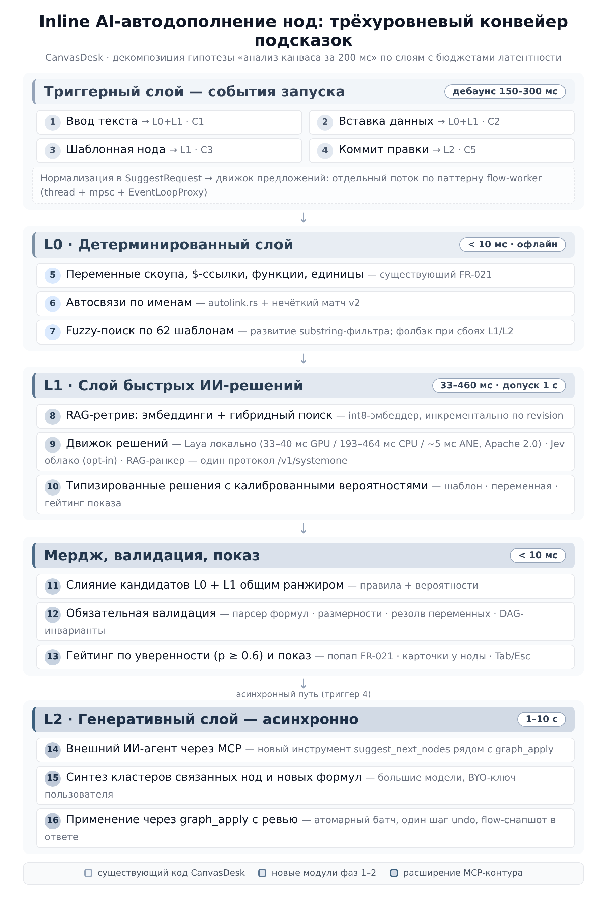
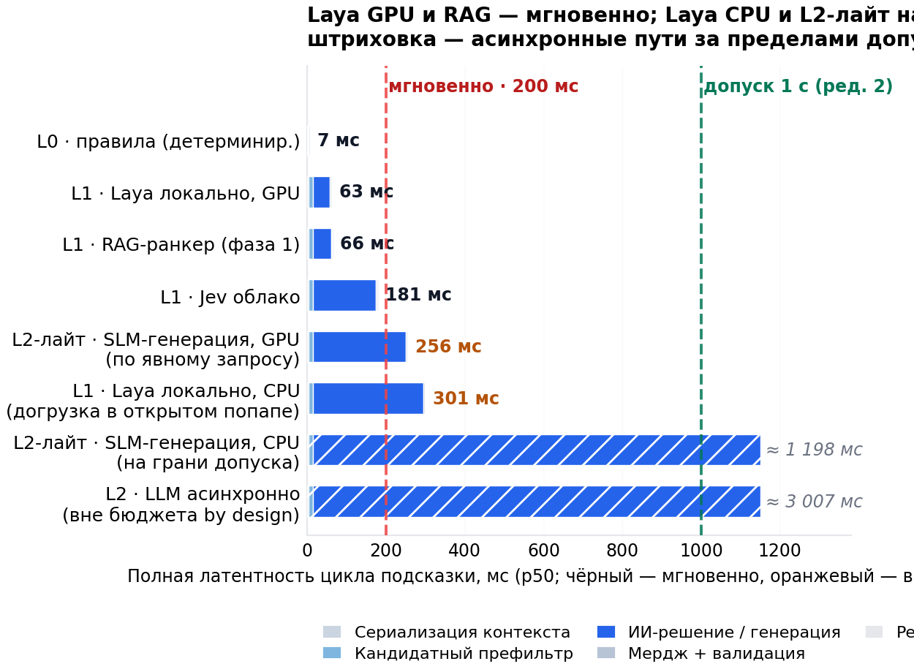
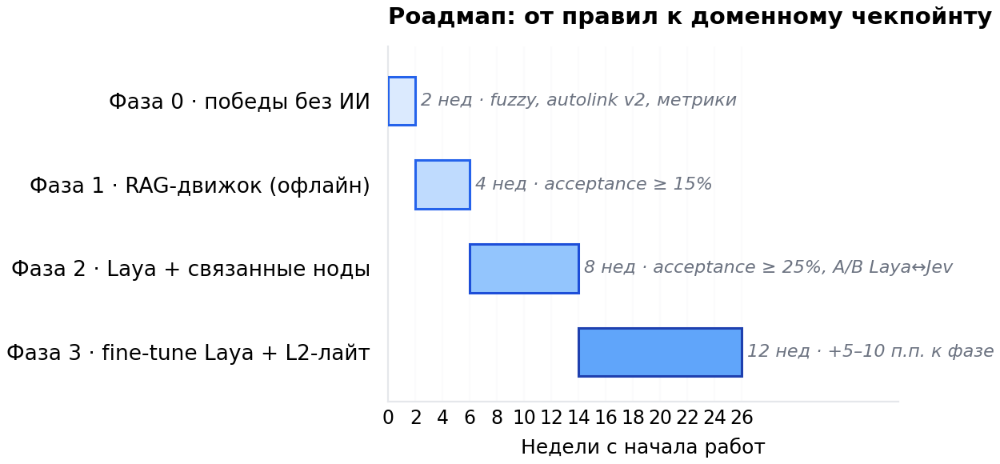

# Inline AI-автодополнение нод в CanvasDesk

**Продуктовая и техническая проработка гипотезы**

| | |
|---|---|
| **Дата** | 27.09.2026 · редакция 2 (дополнение: Laya, бюджет 1 с) |
| **Статус** | Исследование гипотезы (pre-PRD) |
| **Автор** | агент-сессия (Super Z), по заданию владельца |
| **База** | commit `299811a` (FR-071 v3) |
| **Связанные документы** | `docs/plans/product-roadmap.md`, `docs/BYOK.md`, `docs/change-requests/fr-021-numi-input-hints.md`, `AGENTS.md` |
| **Область** | Продукт · UX · ML-архитектура · Интеграция в кодовую базу |
| **Что нового в редакции 2** | Добавлен анализ **Laya** (Convai Innovations, Apache 2.0, релиз 18.09.2026) — открытого Jev-совместимого движка типизированных решений; латентный бюджет расширен с 200 мс до **1 с** (решение владельца) с сохранением цели «мгновенности» 200 мс для основного контура |

---

## 1. Резюме для решения

Гипотеза, которую проверяет этот документ: **при вводе текста, вставке данных или добавлении шаблонной ноды помощник за ~200 мс анализирует канвас и предлагает наполнение ноды расчётами и переменными, а также связанные ноды, подходящие по смыслу**. Целевая задача — максимально упростить создание схем. Проверка выполнена по трём осям: анализ кодовой базы CanvasDesk (что уже готово к интеграции), исследование модельного ландшафта 2026 года (какие ИИ-компоненты физически укладываются в бюджет) и продуктовая проработка (зачем пользователю это нужно и как измерить успех). По решению владельца латентный бюджет расширен до **1 секунды**; ниже показано, что это меняет, а что нет: 200 мс остаются целевым бюджетом «мгновенного» основного контура L0+L1, а 1 с открывает класс «допустимо-медленных» синхронных сценариев — в том числе локальный инференс на CPU и короткую генерацию на способном железе.

**Главный вывод: гипотеза реализуема, но не в наивной формулировке «одна LLM отвечает за 200 мс».** Современные генеративные модели — даже самые маленькие SLM уровня 0.5–1B — на типовом пользовательском железе генерируют текст со скоростью 10–40 токенов в секунду на CPU и ~28 токенов/с на топовых мобильных NPU (замер Gemma 3n E2B на MediaTek NPU, декабрь 2025). Это означает, что генерация 20–40 токенов наполнения занимает 0.5–2 секунды — за пределами бюджета «мгновенности», но, заметим, уже **в пределах расширенного бюджета 1 с** на части железа. Ни дообучение, ни RAG, ни квантизация не изменят этот фундаментальный расклад на сегодняшнем массовом железе. Поэтому единственная честная архитектура — **разделить «понять и выбрать» (быстро) и «сгенерировать новое» (асинхронно или в пределах 1 с)**.

**Ключевое изменение ландшафта после релиза Laya (18.09.2026).** Открытый Jev-совместимый движок **Laya** от Convai Innovations (Apache 2.0, веса на Hugging Face) снимает главный архитектурный конфликт первой редакции: слой быстрых ИИ-решений L1 теперь может работать **полностью локально** — без сети, без облака, без отправки контекста канваса наружу — и при этом говорить с хостом ровно тем же протоколом `POST /v1/systemone`, что и облачный Jev. Один клиент L1 работает с обоими движками сменой base URL; vendor lock-in на ранний доступ TypeSafe исчезает как класс риска. Латентность Laya на GPU — 32.8–39.5 мс на запрос (в 6–8 раз быстрее опубликованных p50 Jev 236–276 мс), на CPU — 193–464 мс, порт под Apple Neural Engine — 4.98 мс; всё это укладывается даже в старый бюджет 200 мс на GPU и с запасом — в новый бюджет 1 с на CPU.

Предлагаемая архитектура — три уровня, каждый со своим бюджетом и своей моделью:

- **L0 — детерминированный слой (< 10 мс).** Всё, что можно посчитать правилами: переменные в скоупе ноды, автосвязи по именам, каталог функций и единиц. В CanvasDesk этот слой **уже существует** (FR-021 Numi-подсказки, `autolink.rs`) и требует лишь расширения.
- **L1 — слой быстрых ИИ-решений (30–460 мс).** Не генерация текста, а классификация, ранжирование и матчинг: какой шаблон предложить, какую переменную подставить, показывать ли подсказку вообще. После релиза Laya кандидатов три, и они образуют один стек: **Laya локально** (Apache 2.0, 32.8–39.5 мс GPU / 193–464 мс CPU / ~5 мс Apple NPU — рекомендуемый дефолт), **Jev облако** (opt-in, ~150 мс, когда нужны максимумы качества на большой кардинальности опций) и **RAG-ранкер** (чистый Rust, фаза 1). Все три — за трейтом `SuggestEngine`; Laya и Jev разделяют один wire-протокол.
- **L2 — генеративный слой (0.5–10 с).** Синтез новых формул и кластеров связанных нод. С расширенным бюджетом 1 с короткая генерация (20–30 токенов) на GPU/NPU-железе может выполняться синхронно с прогрессивным показом; на CPU и для кластеров — по-прежнему асинхронно через существующий MCP-агент (`graph_apply`), который достаточно расширить отдельным инструментом «предложить ноды».

Отдельный стратегический вывод: **ключевой актив CanvasDesk — исполняемость.** Подсказки здесь могут быть не «текстом от ИИ», а проверяемыми конструкциями: предложенная формула валидируется Numi-парсером, единицы сверяются движком размерностей, вставленный кластер — валидатором DAG. Это принципиально отличает продукт от Figma AI или Notion AI, где результат генерации невозможно верифицировать автоматически, и позволяет строить «безгаллюцинационный» UX по построению.

**Ключевой конфликт первой редакции снялся сам.** `AGENTS.md` запрещает сетевые вызовы в хосте, а единственный «System One» движок Jev был облачным — первая редакция предлагала обходы (sidecar, JS-мост, opt-in). Laya делает локальный путь первоклассным: весы Apache 2.0, self-hosting, MCP- и HTTP-серверы в дистрибутиве пакета. Облачной опции (Jev или хостед-Laya) остаётся роль нишевого ускорителя для тех, кому можно. Рекомендованный поэтапный путь: L0+RAG без сети (фазы 0–1), **Laya локально через sidecar** (фаза 2), при наборе 10–50k событий — **fine-tune Laya** под домен CanvasDesk (фаза 3; движок изначально спроектирован под специализацию, цикл обучения воспроизводится на бесплатных Kaggle T4).

### Таблица ключевых выводов

| # | Вопрос | Вывод |
|---|---|---|
| 1 | Реализуемы ли 200 мс / 1 с end-to-end? | 200 мс — только L0+L1 «выбрать из известного». С бюджетом 1 с в синхронную зону входят локальный Laya на CPU и короткая генерация на GPU/NPU; кластеры — по-прежнему асинхронный L2 |
| 2 | Какая модель для L1? | **Laya локально (дефолт):** Apache 2.0, Jev-совместимый протокол, 33 мс GPU / 193–464 мс CPU / ~5 мс Apple NPU, $0. Jev облако — opt-in для большой кардинальности (255 опций из коробки). RAG-ранкер — фаза 1 |
| 3 | Нужен ли fine-tuning? | На старте — нет: RAG + правила. Фаза 3 — **fine-tune Laya** (движок создан под специализацию: 0.362 → 0.766 на доменном бенче; Kaggle 2×T4 бесплатно). LoRA на SLM — запасной путь |
| 4 | Что уже готово в коде? | Триггер (`update_hints`), UI-попап (FR-021), корпус (62 шаблона), атомарная вставка (`graph_apply`), воркер-паттерн, debounce-прецеденты, MCP-транспорт для sidecar. Ghost text в cosmic-text — единственное место средней сложности |
| 5 | Главный риск | Продуктовый, не технический: навязчивость и доверие. Решается гейтингом по уверенности и режимом «только по запросу». Технический — молодость Laya (9 дней) |
| 6 | Сколько стоит? | Laya: $0, ~1 ГБ RAM, догрузка весов 0.6–0.8 ГБ. Jev: < $1/мес на активного пользователя. Хостед-Laya: $0.0294/MTok (на 30% ниже Jev) |

---

## 2. Гипотеза, декомпозиция и метод

### 2.1 Формулировка гипотезы

Пользовательский сценарий: я набираю текст в ноде, вставляю данные извне (числа, таблицу, текст) или добавляю шаблонную ноду из палитры. В этот момент помощник — предположительно ИИ — анализирует текущее состояние канваса и за **не более чем 200 мс** (целевой бюджет «мгновенности»; предельный допустимый бюджет — **1 с**, решение владельца от 27.09.2026) возвращает два типа предложений. Первый тип — **наполнение редактируемой ноды**: готовые расчёты, переменные, формулы, согласующиеся с тем, что уже есть на канвасе. Второй тип — **связанные ноды**: новые узлы, которые по смыслу продолжают модель — либо относительно конкретной редактируемой ноды, либо относительно всей схемы. Целевая функция — максимально упростить и ускорить создание схем: пользователь должен думать о предметной области (сервис, юнит-экономика, бюджет), а не о синтаксисе формул, именах переменных и каталоге шаблонов.

Гипотеза содержит пять скрытых допущений, которые стоит проверить явно. Допущение А: 200 мс — правильный бюджет «мгновенности», то есть подсказка, появляющаяся быстрее, ощущается как «мгновенно», а медленнее — раздражает; расширенный допуск 1 с годится для «догружаемых» элементов (ИИ-строки в попапе, карточки следующих нод), но не для блокировки ввода. Допущение Б: пользователь хочет прерывистую помощь в момент ввода, а не только диалоговый режим (у CanvasDesk уже есть ИИ-агент через MCP, и он диалоговый). Допущение В: контекст канваса достаточно богат, чтобы предложения были релевантны чаще, чем бесполезны. Допущение Г: предложения «связанных нод» не нарушат доверие — пользователь должен сохранять ощущение авторства схемы. Допущение Д (новое в редакции 2): открытый движок Laya достаточно зрел, чтобы строить на нём продуктовую фичу, — проверяется пилотом и гейтингом по калиброванной уверенности.

### 2.2 Критерии истинности

Гипотезу считаем подтверждённой, если одновременно выполняются: (1) медианная латентность полного цикла «событие → подсказка на экране» не превышает 200 мс для основного контура L1 и 1 с для «догружаемых» ИИ-элементов (прогрессивный показ), при этом ни один синхронный путь не блокирует ввод; (2) acceptance rate ИИ-подсказок (доля принятых) достигает ≥ 25–30% — уровня зрелых систем автодополнения (публичные данные GitHub Copilot — порядка 30%); (3) время построения первой рабочей схемы у нового пользователя сокращается измеримо (цель −30%) относительно текущего базлайна; (4) guardrail-метрики не деградируют: dismiss rate < 50%, возвраты к ручному вводу после принятой подсказки (edits-after-accept) < 40% содержимого.

### 2.3 Метод проработки

Документ построен на трёх исследованиях. **Анализ кодовой базы** — репозиторий CanvasDesk разобран по 11 крейтам с целью найти готовые точки интеграции (триггеры, сериализация контекста, UI-примитивы, механизмы вставки) и ограничения (запрет сети, отсутствие async-рантайма, бюджет WASM-бандла). **Исследование моделей** — изучен класс «System One Models» на двух полюсах: облачный Jev от TypeSafe AI (релиз 15.09.2026) и открытый Laya от Convai Innovations (релиз 18.09.2026; веса, код, бенчмарки и экосистема портов изучены по первоисточникам — model card Hugging Face, README GitHub, BENCHMARKS); плюс ландшафт SLM (Gemma 3/3n, Qwen3, Phi-4-mini, SmolLM3, Llama 3.2, LFM2), публичные бенчмарки латентности on-device инференса и паттерны индустрии (Smart Compose, JetBrains local completion, Copilot-роутинг). **Декомпозиция бюджета** — целевые 200 мс разложены на этапы конвейера, для каждого этапа оценены пределы; затем совместно с владельцем бюджет расширен до 1 с и пересмотрен состав синхронной зоны.

### 2.4 Словарь терминов

| Термин | Значение |
|---|---|
| **System One Model** | Класс моделей (термин TypeSafe AI, отсылка к Канеману): не генерируют текст, возвращают типизированные решения с калиброванными вероятностями; сэмплируют параллельно, а не авторегрессионно |
| **Jev** | Коммерческий облачный System One Model от TypeSafe AI (15.09.2026): `POST /v1/systemone`, до 255 опций, $0.042/MTok вход |
| **Laya** | Открытая (Apache 2.0) реализация System One от Convai Innovations (18.09.2026): три чекпойнта (421M/322M), wire-совместима с Jev, локальный и self-hosted инференс, RLCD-обучение |
| **RLCD** | Reinforcement Learning for Calibrated Decisions — обучение с подкреплением против строго правильных scoring rules; честная вероятность — единственный способ максимизировать награду |
| **SLM** | Small Language Model — языковая модель 0.1–4B параметров, пригодная для локального инференса |
| **TTFT / TPOT** | Time-To-First-Token (латентность до первого токена) / Time-Per-Output-Token (время на токен); полная латентность генерации = TTFT + TPOT × N |
| **RAG** | Retrieval-Augmented Generation — выбор релевантных фрагментов из базы (эмбеддинги + векторный поиск) для подачи в контекст |
| **Ghost text** | Серый «призрачный» текст, догружающийся прямо за кареткой (паттерн Copilot); принимается Tab |
| **Acceptance rate** | Доля показанных подсказок, принятых пользователем |
| **Калиброванная вероятность** | Вероятность, соответствующая реальной частоте ошибок: если модель говорит 80%, она права в ~80% случаев |
| **L0 / L1 / L2** | Уровни предлагаемой архитектуры: детерминированный / быстрые ИИ-решения / генеративный асинхронный |

---

## 3. Активы кодовой базы: что уже готово

Анализ репозитория выполнен по всем 11 крейтам workspace (canvas-core, canvas-render, canvas-shell, canvas-app, canvas-mcp, canvas-scene, canvas-web, canvas-widgets, canvas-ui, canvas-mcp-headless, canvas-preview-host). Ниже — то, что напрямую обслуживает гипотезу; формулировки привязаны к конкретным файлам и функциям, чтобы выводы были проверяемыми.

### 3.1 Готовые механизмы

**Единая точка триггера.** После каждого нажатия клавиши, вставки из буфера и IME-коммита в редакторе ноды синхронно вызывается `update_hints()` (`crates/canvas-app/src/app/overlays.rs:1776`). Это уже тот самый «фаннел», в который можно врезать ИИ-пайплайн: событие ввода агрегировано, контекст редактируемой ноды собран (переменные выше каретки, число value-входов, параметры шаблона), UI-попап и клавиатурная маршрутизация уже существуют. Отдельный триггер на добавление шаблонной ноды — `instantiate_template_at()` (`app.rs:4695`), на завершение правки — `finish_editing()` (`app.rs:2156`). Три из четырёх событий гипотезы уже сходятся в существующие функции.

**Прецеденты debounce.** В `about_to_wait` (`app/handler.rs:1204`) уже живут три фоновых процесса с дебаунсом: полнотекстовый поиск — 200 мс, фоновое сканирование автосвязей — 700 мс, автосейв — 2 с. Это готовый образец того, как продукт вешает отложенную работу на ревизию сцены (`scene.revision`) — ИИ-подсказки лягут в тот же паттерн без изобретения нового транспорта.

**UI-попап автокомплита.** FR-021 (`docs/change-requests/fr-021-numi-input-hints.md` + `hints_ui.rs`) реализует детерминированный автокомплит: переменные текущего листа, `$in`/`$1..$N`-ссылки, параметры шаблона, имена функций, единицы измерения; лимит 8 пунктов, попап у каретки, навигация клавишами. Это ровно тот UI-контейнер, в котором могут жить «умные» подсказки L1: визуально пользователь не увидит разницы между «переменная из скоупа» и «переменная, выведенная ИИ из контекста канваса» — а это лучший способ бесшовно подмешать ИИ в существующий UX.

**Семантический корпус.** 62 манифеста шаблонов (`assets/templates/*/template.json`: инфраструктура ~20, юнит-экономика ~25, продуктовая аналитика ~15) содержат структурированные описания: `name_ru/en`, `category`, `description`, `params` с типами, дефолтами, единицами и диапазонами, `expr`, `outputs`. Плюс каталог доменных функций движка (`mm1`, `mmc`, `erlang_c`, `littles_law`, `npv`, `irr`, `cagr`, `cohort_ltv`, статистика, Монте-Карло) и 11 эталонных схем-канвасов в `assets/canvas-schemes/`. Это готовый корпус для RAG-слоя — не нужно ничего придумывать и парсить.

**Вставка предложений.** Два готовых механизма: `instantiate_template_at()` — для одиночной шаблонной ноды; MCP-инструмент `graph_apply` (`canvas-scene/src/mcp.rs:1550`) — атомарный батч до 256 операций (создание нод, рёбер, `param_set`, перемещения) с валидацией, одним шагом undo и flow-снапшотом в ответе. «Предложить кластер связанных нод» изоморфно `graph_apply` — контракт уже отработан на ИИ-агентах.

**Неблокирующий транспорт.** Паттерн flow-worker (`canvas-scene/src/worker.rs`): выделенный поток + mpsc + пробуждение UI через `EventLoopProxy<AppEvent>` + double-buffer результатов + generation-счётчик против накопления устаревших задач. Инференс L1 обязан жить именно в таком паттерне — и он уже выработан проектом.

**Производственный запас.** Полный пересчёт графа — ≤ 10 мс на 1000 нод (SPEC §6.3), рендер держит 5000 нод при 60 fps. «Анализ канваса» не конкурирует с пересчётом за бюджет пользователя: обе величины лежат в разных порядках.

### 3.2 Ограничения и правила

| Ограничение | Источник | Последствие для гипотезы |
|---|---|---|
| Сетевые вызовы в хосте запрещены | `AGENTS.md` («продукт локальный; сеть только внутри виджетов с permission network») | Облачный Jev нельзя вызывать из процесса приложения. Нужен sidecar-процесс (паттерн `canvasdesk mcp`), opt-in пересмотр правила, или локальная модель |
| Нет ML/LLM-зависимостей | `Cargo.lock` (420 пакетов, проверено) | Инференс-стек (llama.cpp bindings, candle, fastembed) — новая территория; добавление тяжёлых зависимостей конфликтует с минимализмом ядра |
| Нет async-рантайма | только `pollster` + `wasm-bindgen-futures` | Не критично: паттерн «thread + mpsc + EventLoopProxy» покрывает потребности L1 |
| WASM-бандл ≤ 8 МБ raw / ≤ 4 МБ brotli | `scripts/web_bundle.sh` | Встроить модель в бандл нельзя; для web — докачка модели отдельно (WebLLM) или серверный L1 через JS-мост |
| В веб-версии нет HTTP-клиента | `canvas-web` (fetch-вызовов нет) | Для облачного L1 в web нужен JS-мост по образцу `ime.rs` |
| Ghost text в cosmic-text | `edit.rs` (EditingSession) | Инлайн-серый текст — самая глубокая точка встраивания (средняя сложность); попап FR-021 — низкая |
| Культура детерминизма и TDD | `AGENTS.md`, golden-тесты FR-013/FR-021 | ИИ-слой стоит оформлять как чистую функцию над сериализованным контекстом (как `autolink.rs`) с фиксируемыми fixtures |

Отдельно отметим **`autolink.rs`** — детерминированный движок предложений связей по точным именам переменных, уже имеющий поле `AutolinkProposal::percent` с комментарием «задел под v2 (нечёткий матч)». Это готовое место для гибрида: точная часть остаётся правилами, нечёткая — уходит в L1.

И существующий **MCP-слой** (`canvas-mcp`: 40+ инструментов, stdio ↔ named pipe, таймауты, реконнекты) — прецедент того, как продукт уже общается с внешним ИИ без сети в хосте. L2-расширение («агент предлагает ноды») ложится в этот контракт без изменений архитектуры.

---

## 4. Продуктовая проработка: JTBD и персоны

### 4.1 Персоны и их «работы»

CanvasDesk адресует четыре аудитории (README): solution/technical-архитектор, продакт-аналитик и финансист, продакт-оунер и менеджер, а также ИИ-ассистент в петле с человеком. Для каждой сформулируем Job-To-Be-Done в терминах «когда… я хочу… чтобы…» и покажем, как автодополнение обслуживает эту работу.

**Архитектор сервиса.** Когда мне нужно спроектировать сервис под целевую нагрузку, я хочу быстро собрать расчётную модель из проверенных блоков, чтобы понять узкие места и защитить решение перед командой. Сегодня это требует помнить имена и параметры шаблонов, знать сигнатуры `mm1`/`erlang_c`, вручную связывать выходы с входами. Автодополнение берёт на себя механику: по мере построения графа оно подставляет следующий логичный блок (за балансировщиком — очередь; за очередью — пул воркеров) и подтягивает переменные из уже посчитанных узлов. Когнитивная работа остаётся предметной («какой кэш hit-rate закладывать»), механическая («как называется параметр и куда его вписать») исчезает.

**Продакт-аналитик / финансист.** Когда я строю юнит-экономику, я хочу видеть, как решения по метрикам (churn, CAC, ARPU) отражаются на LTV и runway, чтобы защищать бюджет цифрами, а не ощущениями. Эта аудитория хуже знает теорию очередей и финансовые функции — для неё ценность подсказок максимальна: система предлагает не синтаксис, а саму формулу («здесь обычно считают cohort_ltv от retention и ARPU») с готовыми параметрами из соседних нод. Барьер входа в «доменную математику» снижается с «выучить каталог» до «узнать конструкцию, когда её предложили».

**Продакт-оунер / менеджер.** Когда готовится решение перед стейкхолдерами, я хочу быстро собрать what-if сценарий, чтобы сравнить варианты таблицей «было → стало». Подсказки ускоряют дублирование и вариацию схем: после коммита ноды система предлагает следующий шаг построения; вставка эталонного кластера (например, «статья затрат на поддержку») становится одношаговой.

**ИИ-ассистент в петле.** Отдельная «персона» из README — агент, собирающий модель по описанию. Для него автодополнение — это инфраструктура ранжирования кандидатов: тот же L1-слой, что обслуживает человека, даёт агенту калиброванные вероятности выбора шаблонов. Существующие MCP-инструменты и будущий L1 образуют единый континуум «помощи».

### 4.2 Ценность гипотезы в терминах продукта

Сведём ценность к трём измерениям. **Скорость:** сокращение времени до первой рабочей схемы — прямое продолжение текущей цели проекта («первые 5 внешних пользователей, которые сами построят модель и вернутся к ней второй раз», README/Status). Подсказки атакуют именно первый барьер: пустой канвас и незнание каталога. **Доступность:** пользователь не обязан помнить 62 шаблона, 40+ функций и соглашения об единицах — знание перестаёт быть входным билетом. **Доверие и защищаемость:** предложения приходят из проверяемого пространства (валидатор формул, размерности, DAG-инварианты), поэтому принятие подсказки не может «сломать» модель незаметно — это важно для аудитории, которая защищает расчёт перед C-level.

Против этого стоят два продукта-риска, которые прорабатываются в разделе 5: навязчивость (подсказки, появляющиеся без спроса, воспринимаются как шум) и атрибуция авторства (если система слишком активно строит схему сама, пользователь перестаёт понимать собственную модель и не может её защитить). Оба решаются гейтингом и режимом показа, а не отказом от гипотезы.

---

## 5. Сценарии использования и UX-концепция

### 5.1 Пять сценариев

**С1. Ввод формулы в ноде (основной, L0+L1).** Пользователь печатает в ноде `cost = rps * `. Локально за миллисекунды FR-021 подставляет переменные скоупа (`$0.01` — цена запроса из соседней ноды). Параллельно L1-слой по контексту графа понимает, что строится модель пропускной способности, и поднимает в попапе строку «`rps * $0.01 / 1000` — стоимость за тысячу запросов» с указанием источника (какая нода предоставила переменную). Бюджет: попап L0 — мгновенно; ИИ-строка — до 200 мс (p50 ~150 мс при облачном Jev, ~60 мс при локальном ранкере).

**С2. Вставка данных (paste, L0+L1, immediate).** Пользователь вставляет в ноду фрагмент таблицы или набор чисел. Система распознаёт структуру (многострочные `имя = значение`), предлагает «разложить на параметры ноды» и подобрать шаблон, куда эти данные ложатся (например, вставленный список `servers`, `server_rate` подсказывает шаблон `mmc`). Триггер — `KeyCommand::Paste`; здесь дебаунс не нужен, вставка сама по себе пауза.

**С3. Добавление шаблонной ноды (L1+L2).** Пользователь ставит из палитры «балансировщик». Система знает контекст (что уже на канвасе, какие входы свободны) и через 150–300 мс показывает карточку под нодой: «Обычно дальше добавляют: очередь (queue-kafka) → пул воркеров (worker-pool) → БД». Один клик — `graph_apply` вставляет кластер с автосвязями и дефолтами, согласованными с уже посчитанными значениями (например, rps из апстрима подставляется в параметр). Это самый «витринный» сценарий: он превращает палитру из справочника в диалог по построению модели.

**С4. Пустая нода в контексте (L1, по запросу).** Пользователь создал ноду рядом с кластером юнит-экономики и не знает, чем её наполнить. По явному действию (Ctrl+Space или кнопка «предложить») система анализирует соседей (lineage 1–2 hop) и предлагает 3–5 вариантов наполнения: продолжение расчёта, сводную метрику, what-if переопределение. Явный вызов — принципиален: это анти-паттерн-гейт против навязчивости.

**С5. Пост-коммит (L2, асинхронно).** Пользователь завершил правку ноды (`finish_editing` → `recompute_flow`). Фоново, без спешки, внешний агент через MCP анализирует обновлённую схему и аккумулирует в панели «Рекомендации» более крупные предложения: добавить недостающий узел для полноты модели, заменить ручную формулу доменной функцией, построить what-if сценарий. Латентность — секунды; пользователь смотрит их, когда сам захотел. Сюда же ложится существующий опыт ИИ-агента CanvasDesk.

### 5.2 UX-паттерны и режимы показа

Инвентарь паттернов (по возрастанию intrusiveness): **попап у каретки** (FR-021-контейнер; подсказки-строки с иконкой источника: 🔒 локальное правило / ✨ ИИ) → **карточка под нодой** (для «следующих нод», UiLayer + kit-компоненты; уже есть паттерн tooltip/whatif-баров) → **ревью-диалог** (для мульти-нодовых предложений; прецедент — диалог ревью автосвязей с undo-тегом `autolink_batch`). Ghost text прямо в редакторе — самый красивый, но и самый дорогой в реализации паттерн (встраивание в cosmic-text `Buffer`), поэтому рекомендуем его на фазу 2+ после того, как попап-вариант докажет ценность метриками.

Ключевые правила взаимодействия. Принятие — Tab/Enter, отклонение — Esc/продолжение печати (подсказка исчезает без следа). Ничего не применяется к схеме без явного действия пользователя — «предложенные ноды» всегда проходят через ревью или минимум через один клик. Гейтинг показа по уверенности: L1 возвращает калиброванную вероятность (Jev — по построению; локальный ранкер — после калибровки на логах), порог показа настраивается и по умолчанию консервативен (показывать только при p ≥ 0.6); это главный инструмент против шума. Режимы работы фичи: «on» (подсказки по триггерам), «on-demand» (только Ctrl+Space — рекомендуемый дефолт первых релизов), «off». Язык подсказок следует за языком интерфейса (ru/en), формулы — универсальные.

### 5.3 Воспринимаемая латентность

Бюджет 200 мс согласуется с классическими порогами Нильсена: ~100 мс — «мгновенно», ~1 с — предел непрерывности потока мысли, 10 с — предел удержания внимания. Решение владельца расширить допуск до 1 с ровно поднимает планку до второго порога Нильсена и открывает практическую зону: 1 с — это верхняя граница, при которой пользователь ещё сохраняет поток мысли и не переключается. Для автодополнения ввода практическая планка индустрии жёстче: Google Smart Compose исторически ориентировался на латентность порядка 100 мс с деградацией до пропуска предсказания; JetBrains full-line completion (локальная модель) целится в «до того, как пользователь напечатает следующий символ»; Copilot-паттерн допускает секунды, потому что подсказка догоняет каретку, а не опережает её. Наш вывод в редакции 2: **двухуровневый бюджет**. Уровень 1 «мгновенно» (цель 200 мс, жёстко): L0-попап и всё, что блокирует восприятие; при превышении подсказка не показывается вовсе (лучше никакой, чем тормозящей). Уровень 2 «догрузка» (допуск 1 с): ИИ-строки подсвечиваются в уже открытом попапе по мере готовности, карточки следующих нод догоняют контекст, синхронная короткая генерация на GPU/NPU-железе возможна с явным индикатором. Debounce ввода (150–300 мс) по-прежнему не входит в бюджет «анализа» — это ожидание паузы пользователя, и в метриках латентности измеряется интервал от «пальцы подняты / вставка / клик» до «подсказка видима».

### 5.4 Анти-паттерны (чего не делать)

Не показывать подсказки на каждое нажатие без дебаунса — мигающий попап разрушает поток ввода. Не перекрывать редактируемый текст — каретка и напечатанное всегда поверх. Не предлагать несуществующие переменные: каждый идентификатор в ИИ-подсказке обязан резолвиться в скоупе (проверка `expr.rs` до показа — дешёвая и абсолютная). Не генерировать «от себя» длинный текст в ноду — наполнение comes from проверяемого пространства (шаблоны, функции, переменные канваса); свободная генерация — только в L2, где пользователь видит diff и подтверждает. Не показывать «создать связанные ноды» чаще, чем раз на коммит, и никогда — во время активного ввода. Не делать подсказки единственным путём к функции: всё, что предлагает ИИ, достижимо и руками через палитру.

---

## 6. Метрики и план валидации

### 6.1 Пирамида метрик

**North Star:** `time-to-first-working-schema` (TTFWS) — время от открытия нового канваса до первой схемы, где пересчёт даёт осмысленные значения по всему графу (детектируемо: первая конфигурация с N ≥ 5 нодами, 0 ошибок валидации, ≥ 1 значением, протёкшим через 2+ уровня DAG). Целевое изменение на первом этапе — −30% к базлайну у новых пользователей.

**Прокси-метрики фичи:** acceptance rate ИИ-подсказок (цель ≥ 25–30% — паритет с зрелыми системами; ниже 15% после 2 недель полировки — сигнал переосмыслить гейтинг); доля нод, созданных через подсказки (цель 20–40% — выше 60% тревожный сигнал по авторству); edits-after-accept (доля символов предложенного содержимого, изменённых после принятия; < 40% — нормально); время построения схемы по эталонному заданию; частота Ctrl+Space в on-demand режиме (спрос на фичу).

**Guardrails:** dismiss rate (< 50%; выше — шум); латентность p50/p95/p99 полного цикла (двухуровневые цели: «мгновенный» контур 200/350 мс, допуск «догрузки» 1 с; фиксируется отдельно по деплоям — Laya GPU / Laya CPU / облако); доля показов, прерванных вводом (масштаб навязчивости); стоимость ИИ на активного пользователя в день; отказы/деградации L1 (timeout → показ только L0).

**Инфраструктура метрик** — обязательная часть фазы 1: разметка событий `suggest_shown / suggest_accepted / suggest_dismissed / suggest_edited` с источником (L0/L1), латентностью по этапам конвейера и хэшем контекста (без содержимого — приватность). Существующий HUD (F3: fps, p95) показывает культуру измерений — расширяем её на ИИ-слой.

### 6.2 Дизайн валидации

Стадия проекта («ищем первые 5 внешних пользователей») подсказывает порядок: **(а) качественная проверка ценности** — 5–8 сессий с прототипом L0+L1 на эталонных задачах («собери модель сервиса 10k rps», «посчитай runway»); критерий — добровольное использование подсказок без подсказки модератора и желание вернуться. **(б) Замер базлайна** до включения фичи на тех же задачах (TTFWS, число обращений к документации). **(в) A/B по фича-флагу** на внедрённой фиче (on / on-demand / off), минимум по 30 сессий на руку; смотрим TTFWS + guardrails. **(г) Критерий перехода к фазе 3 (fine-tune):** накоплено ≥ 10k событий accept/dismiss и acceptance rate перестал расти от улучшения правил и промптов — plateau означает, что оставшаяся ошибка требует обучения.

---

## 7. Конкурентный ландшафт и позиционирование

| Система | Что делает ИИ | Форма | Латентность | Чего нет |
|---|---|---|---|---|
| **n8n AI** | AI Agent-нода, генерация воркфлоу по промпту, 400+ интеграций | Диалог/промпт | Секунды | Inline-подсказок в момент редактирования нет; ноды — интеграции, не расчёты |
| **Figma AI / FigJam** | Генерация макетов/диаграмм по описанию, поиск по содержимому | Промпт-панель | Секунды | Исполняемости: результат — картинка; автодополнения формул нет |
| **Miro AI Assist** | Генерация и суммаризация стикеров/диаграмм | Промпт + панель | Секунды | Модели не исполняются; метрик расчёта нет |
| **Notion AI** | Дописывание текста, Q&A по базе | Inline + диалог | 0.5–3 с | Только текст; нет доменной математики |
| **GitHub Copilot / Cursor Tab** | Ghost text кода, мульти-модельный роутинг (малая — на строку, большая — на блок) | Inline ghost text | ~0.3–2 с | Паттерн перенесён, но предметная область другая |
| **JetBrains full-line completion** | Локальная модель прямо в IDE, офлайн | Inline ghost text | Десятки–сотни мс | Ближайший аналог по технике; подтверждает жизнеспособность локального инференса |
| **Google Smart Compose / Sheets Smart Fill** | Дописывание фраз/формул по паттерну | Inline | ~100 мс (жёсткий бюджет) | Доказательство жанра «подсказка в момент ввода со строгим бюджетом» |
| **CanvasDesk (гипотеза)** | Наполнение нод расчётами и переменными + связанные ноды, по контексту исполняемого графа | Popup + карточки + ревью | L1 ≤ 200 мс | — |

Позиционирование вытекает из двух столпов. Первый: **подсказки на исполняемом графе**. Все перечисленные конкуренты генерируют артефакты (текст, картинку, воркфлоу-заготовку); CanvasDesk первым предлагает помощника, чьи предложения **исполняются и проверяются на месте**: формула проходит Numi-парсер, единицы — движок размерностей, кластер — валидатор DAG, а значение сразу пересчитывается по графу. Ошибка ИИ здесь обнаружима и безопасна по построению — уникальное доверие для аудитории «защитить расчёт перед C-level». Второй: **гибрид локальности**. JetBrains доказал жизнеспособность локального инференса в редакторах; Google — жёсткие латентные бюджеты подсказок. CanvasDesk может предложить спектр от полностью офлайн (L0 + локальный ранкер) до облачного (Jev, LLM через MCP) — в мире, где конкуренты жёстко привязаны к облаку.

---

## 8. Техническая архитектура: трёхуровневый пайплайн и двухуровневый бюджет (200 мс / 1 с)

### 8.1 Почему «одна LLM за 200 мс» не работает: арифметика

Полная латентность генеративного ответа складывается по формуле `T = TTFT + TPOT × N` (Databricks, метрики NVIDIA NIM). Оценим каждый член для реальных классов железа (данные: публичные бенчмарки llama.cpp/vLLM, замер Gemma 3n E2B на MediaTek NPU — 28 ток/с decode при 4K контекста, Liquid AI LFM2 — 2× Qwen3 на CPU; состояния на осень 2026):

| Железо | Модель | TTFT (контекст ~500 ток) | TPOT | N = 24 токена | Итог |
|---|---|---|---|---|---|
| CPU 4–8 ядер (типовой ноутбук) | 0.5–1B Q4 | 80–300 мс | 25–80 мс | 0.6–1.9 с | **мимо бюджета в 3–10×** |
| CPU (то же, LFM2-класс, 2025+) | 1.3B | 60–200 мс | 15–40 мс | 0.4–1.2 с | мимо |
| NPU мобильный (MediaTek) | Gemma 3n E2B | ~25 мс (prefill 1600 ток/с) | ~36 мс | ~0.9 с | мимо |
| GPU дискретная (класс RTX 3060+) | 0.5–1B Q4 | 20–60 мс | 5–12 мс | 140–350 мс | впритык, но это миноритарное железо |
| WebGPU в браузере (WebLLM) | 0.5B Q4 | 200–600 мс | 30–60 мс | 0.9–2 с | мимо |
| Облачный LLM API (малые модели) | 0.5–2B hosted | 150–400 мс (RTT+queue) | 20–50 мс | 0.6–1.6 с | мимо |

Вывод для бюджета «мгновенности» (200 мс) устойчив к прогрессу: на массовом железе 2026 года **авторегрессионная генерация ~25 токенов не помещается в 200 мс**. Дообучение сокращает длину промпта и повышает качество, но не меняет TPOT; RAG заменяет генерацию поиском; квантизация ускоряет в 1.5–2 раза — всё это полезно, но не закрывает порядок величины. Зато в 200 мс свободно помещаются операции без авторегрессии: детерминированные вычисления (< 10 мс), векторный поиск (5–15 мс), **один forward pass классификатора/ранкера (20–80 мс на CPU)** и System One решения — облачные (~150 мс) и, с релизом Laya, локальные (32.8–39.5 мс на GPU, 193–464 мс на CPU).

**Что меняет расширенный бюджет 1 с (редакция 2).** Во-первых, локальный Laya на CPU становится полноправным синхронным путём: худший опубликованный показатель 464 мс — менее половины допуска, а типичные 200–300 мс ощущаются как «догрузка» в уже открытом попапе. Во-вторых, короткая авторегрессионная генерация (20–30 токенов) на дискретной GPU укладывается целиком (140–350 мс) — это открывает эксперимент с «синхронным L2-лайт»: генерация одной формулы-строки по требованию, с явным индикатором и отменой. В-третьих, длинноконтекстные запросы Laya (4k токенов, ~1.7 с на Apple GPU) остаются за пределами — но нашим сценариям столько и не нужно (бюджет контекста — 300–800 токенов, §9.1). На массовый CPU-железе генерация по-прежнему 0.4–1.9 с — на грани или за пределами допуска, поэтому принцип «генерация — не в основном контуре» сохраняется как архитектурный, а допуск 1 с используется точечно: на способном железе (GPU/NPU) и в некритичных к мгновенности местах UX.

### 8.2 Трёхуровневая архитектура



**Триггерный слой.** Четыре события запускают конвейер: `on_type` (после дебаунса 150–300 мс — пауза набора), `on_paste` (немедленно), `on_node_add` (немедленно после `instantiate_template_at`), `on_commit` (фоново после `finish_editing`). Все события нормализуются в единый `SuggestRequest { node_id, caretted_text, revision, trigger }` и передаются в движок предложений — выделенный поток по паттерну flow-worker (`std::thread` + mpsc + `EventLoopProxy`), полностью вне UI-треда.

**L0 — детерминированный слой (бюджет < 10 мс).** Чистые функции над сериализованным контекстом: переменные скоупа и автодополнение идентификаторов (сегодняшний FR-021), точные автосвязи (`autolink.rs`), лексический поиск по шаблонам (сегодняшний substring-фильтр `template_ui.rs` — заменить на fuzzy), валидатор предложенной формулы (`expr.rs::parse`). L0 всегда выполняется первым и мгновенно наполняет попап; он же — деградационный фолбэк при любом сбое L1/L2. Расширения фазы 0: fuzzy-матч имён, ранжирование по частоте использования, нечёткие автосвязи (то самое «v2» из комментария в `autolink.rs`).

**L1 — слой быстрых ИИ-решений (бюджет: цель 70–300 мс, допуск 460 мс+).** Вход: сериализованный контекст (раздел 9) + кандидаты от L0/RAG. Выход: типизированные решения — `suggest_template(template_id, params) -> p`, `match_variable(var_name) -> p`, `show_suggestion -> {yes/no, p}`, `rank(candidates) -> scores`. Реализация — взаимозаменяемые движки за одним трейтом `SuggestEngine` (раздел 10): **Laya локально** (рекомендуемый дефолт: Jev-совместимый протокол через sidecar/MCP), **Jev облако** (opt-in) и **RAG-ранкер** (чистый Rust, фаза 1). Протокол Laya и Jev общий (`POST /v1/systemone`, схемы choice/score/noul) — один клиент покрывает оба движка и хостед-Laya как третий вариант деплоя; оба движка тестируются на одних golden-фикстурах. Результат мерджится с L0-кандидатами по общему ранжиру (правила + вероятности), проходит обязательную детерминированную валидацию (переменные резолвятся, формула парсится, единицы сходятся) — и только потом показывается.

**L2 — генеративный слой (0.5–10 с).** Внешний ИИ-агент через существующий MCP-контракт: новый инструмент `suggest_next_nodes(context) -> graph_apply-batch` рядом с существующими `graph_apply`/`analyze_bottlenecks`. Результат — всегда через ревью-диалог (прецедент `autolink_batch`). Для пользователя это панель «Рекомендации», а не inline-подсказка; для продукта — мост к уже работающей волне «агент строит модель». Новое в редакции 2: на GPU/NPU-железе допустим **L2-лайт** — синхронная генерация одной формулы (20–30 токенов, 150–350 мс) по явному действию пользователя, с индикатором и отменой; за пределами способного железа автоматически деградирует в асинхронный L2.

### 8.3 Бюджет по этапам: пять конфигураций L1



Разложение полного цикла для пяти конфигураций L1 (рекомендуемые целевые значения; p50/p95; для Laya — опубликованные замеры Convai на T4 GPU и CPU):

| Этап | L0 only | RAG-ранкер (фаза 1) | L1 · Laya локально, GPU | L1 · Laya локально, CPU | L1 · Jev облако |
|---|---|---|---|---|---|
| Сериализация контекста (инкрементальная, по revision) | 1–2 мс | 2–3 мс | 2–3 мс | 2–3 мс | 2–3 мс |
| Кандидатный префильтр (эмбеддер int8 / `predict_shortlist`) | 0 (не нужен) | 8–15 мс | 8–15 мс | 8–15 мс | 8–15 мс |
| ИИ-решение (один forward pass / облачный вызов) | 0 | 20–60 мс | 33–40 мс (1 вопрос) / 72 мс (батч 10) | 193–464 мс | 70–300 мс e2e |
| Валидация + мердж + ранжирование | 1–2 мс | 2–3 мс | 2–3 мс | 2–3 мс | 2–3 мс |
| Рендер попапа | 2–3 мс | 2–3 мс | 2–3 мс | 2–3 мс | 2–3 мс |
| **Итого p50** | **~8 мс** | **~50–80 мс** | **~55–70 мс** | **~220–330 мс** | **~150–200 мс** |
| **Итого p95** | **~12 мс** | **~120 мс** | **~90–110 мс** | **~480–500 мс** | **~350–450 мс** |

Четыре следствия. Первое: **Laya на GPU — лучшая из обеих миров**: быстрее облачного Jev в 3–4 раза и при этом полностью локальная; даже p95 не выходит из старого бюджета 200 мс. Второе: Laya на CPU не вписывается в «мгновенный» контур, но отлично живёт в новом допуске 1 с — режим прогрессивного показа (L0-мгновенно, ИИ-строки догружаются за 200–500 мс) здесь обязателен, а не желателен. Третье: облачной конфигурации остаются правила «не показывать опоздавшую подсказку, если пользователь продолжил печатать» и префетч на `on_focus`/hover (за 300–800 мс до первого нажатия) с generation-счётчиком отмены устаревших ответов. Четвёртое: для web-версии (без HTTP в wasm) локальный L1 разворачивается как JS-мост к `laya-serve`/браузерному порту, облачный — тем же мостом к Jev; накладные 5–15 мс некритичны. Отдельно отметим: Apple Silicon с портом под Neural Engine (4.98 мс) даёт «мгновенный» L1 даже без дискретной GPU — лучший пользовательский опыт из возможных.

### 8.4 Деградация и надёжность

Конвейер проектируется по принципу «слоёного фолбэка»: L1 не ответил за 250 мс (локальный рантайм GPU/ранкер) / 600 мс (Laya CPU) / 400 мс (облако) → показываем только L0; L2 недоступен → панель «Рекомендаций» просто пустая. Холодный старт Laya (первая догрузка чекпойнта — секунды; смена языка с `max_loaded=1` — 7–10 с) прячется за префетчем при старте приложения в фоне и режимом `preload` в sidecar. Ни одна ошибка ИИ не блокирует ввод: движок предложений не имеет права на длинные блокировки общего с UI состояния (паттерн double-buffer из flow-worker). Все решения движка логируются с латентностями по этапам — это и телеметрия, и данные для фазы 3.

---

## 9. Контекст канваса и RAG-слой

### 9.1 Сериализация контекста

Контекст для L1 собирается из уже существующих проекций (ничего нового не изобретается): компактный список нод с текстом и типами (MCP `nodes_list(text=true)`), рёбра и их flow-вид (`edges_list`), значения по строкам (`flow_recalc`), происхождение (`lineage`), каталог шаблонов (`template_list`). Полную схему отправлять не нужно: окно контекста — **подграф 1–2 hop от редактируемой ноды** (по рёбрам в обе стороны, учитывая `from_line`/`to_param`) + «шапка» всего канваса (число нод по категориям, список глобальных переменных верхнего уровня, названия шаблонов в использовании). Инкрементальность: контекст версионируется по `scene.revision`; между событиями переотправляется только дельта, эмбеддинги нод кэшируются и пересчитываются по мере правок (правка одной ноды инвалидирует её эмбеддинг, не весь канвас).

Бюджет токенов: целевые 300–800 входных токенов на запрос L1 (пример сериализации — Приложение А). Этого достаточно: 10–20 нод подграфа с усечёнными текстами + 5–8 кандидатов-шаблонов с параметрами + вопрос. Для сравнения: типичные few-shot запросы к SLM начинаются от 1.5k токенов — ещё один аргумент в пользу решающих, а не генерирующих моделей на L1.

### 9.2 RAG: корпус, поиск, ранжирование

**Корпус (статическая часть, пересобирается с релизом):** 62 шаблона (имя, категория, описание, параметры с единицами, формула, выходы) → ~150 документов; 40+ доменных функций с сигнатурами и примерами; справочник единиц и конверсий; 11 эталонных схем как «графы-паттерны» (для L2 и для few-shot); типовые фрагменты формул из схем. **Динамическая часть:** переменные и строки текущего канваса (эмбеддинг на ноду, кэш по revision). Мультиязычность корпуса (ru/en имена и описания) важна — пользователи пишут формулы латиницей, а думают по-русски.

**Поиск — гибридный трёхкомпонентный:** (1) лексический (fuzzy по именам/идентификаторам — развитие текущего substring-фильтра); (2) векторный (эмбеддер класса multilingual-E5-small / bge-small в int8, инференс 5–10 мс CPU; в Rust — fastembed или candle ONNX-рантайм, без Python-зависимостей); (3) структурные эвристики (`autolink`-логика: совпадение единиц, типов параметров и имён выходов/входов). Финальное ранжирование — слияние (reciprocal rank fusion + бонусы структурных совпадений), а для топ-кандидатов — опциональный L1-реранк. Индекс 150–300 документов — это наивный линейный скан за < 1 мс; HNSW не понадобится до десятков тысяч документов (будущие пользовательские сниппеты).

**Что именно ретривится в каждом сценарии:** С1 (ввод) — переменные скоупа + функции по префиксу + шаблоны, чьи входы совпадают с типами апстрим-значений; С2 (paste) — шаблоны под структуру вставленных данных; С3 (шаблон добавлен) — шаблоны, чьи входы тип-совместимы с выходами нового и отсутствующие звенья эталонных схем («в схеме unit-economics после этого узла идёт X»); С4 (пустая нода) — наполнения из корпуса + продолжения по lineage соседей.

Отдельно: **RAG-слой не требует сети и не является «ИИ-зависимым»** — это чистый Rust-код с локальными эмбеддингами. Поэтому фаза 1 (L0+RAG) полностью сохраняет офлайн-природу продукта, что снимает главный архитектурный конфликт как минимум на первые две фазы.

---

## 10. Модельный анализ: Laya, Jev, SLM и собственный ранкер

### 10.1 Кандидаты на слой L1

**Вариант A. Jev (TypeSafe AI) — облачный «System One Model».** Релиз 15.09.2026, ранний доступ. Ключевые свойства (по материалам TypeSafe и независимым обзорам): не генерирует строки вообще — выход всегда типизированная структура, заданная заранее, с калиброванными вероятностями и confidence; сэмплирование параллельное (все опции считаются одним проходом, а не токен-за-токеном); 70–500 мс end-to-end, ~150 мс типично; $0.042 за миллион входных токенов, выход бесплатный; до 255 опций на один вопрос-выбор (для большей кардинальности — двухступенчатая схема «скоринг → выбор»); 1200 запросов/мин. Обучен по методу RLCD (Reinforcement Learning for Calibrated Decisions) на «верифицируемых» задачах; по заявлениям и обзорам достигает уровня фронтирных LLM на задачах классификации/маршрутизации/скоринга при цене на два порядка ниже.

Почему Jev почти идеально совпадает с задачей L1: наши запросы — это ровно «classify / route / score / gate»: выбрать шаблон из 62 (кардинальность в пределах 255), сматчить переменную, решить «показывать ли» (гейтинг по уверенности), отранжировать кандидатов. Калиброванные вероятности — готовый механизм гейтинга показа, которого нет у обычных LLM (те систематически самоуверенны). Отсутствие генерации строк — не минус, а спецификация: в нашем дизайне наполнение и так строится из проверяемых конструкций, «свободный текст» L1 не нужен by design. Наконец, параллельный сэмплинг — единственный способ получить «ИИ-решение» в 150 мс через сеть.

Ограничения и риски: (1) облако — конфликт с «продукт локальный» из `AGENTS.md`, плюс телеметрия содержимого канваса уходит на сторонний сервис (приватность); (2) ранний доступ — API и цены могут меняться, SLA нет; (3) зависимость от внешнего рантайма превращается в продукт-риск недоступности; (4) 255 опций достаточно для текущих 62 шаблонов, но не для будущей пользовательской библиотеки неограниченного размера. Существенно ослабим пункт (3): с релизом Laya появился wire-совместимый локальный фолбэк — клиент Jev переключается на локальный `laya-serve` сменой base URL, так что vendor lock-on перестал быть односторонней ставкой.

### 10.1a Laya (Convai Innovations): открытый Jev-совместимый движок — разбор по первоисточникам

**Происхождение и статус.** Laya выпущена 18 сентября 2026 — через три дня после Jev — компанией Convai Innovations; предыстория изложена самим автором (dev.to): неавтогрессивные решающие модели он строил ещё с марта 2025 (arXiv:2503.23303, сентябрь 2025 — arXiv:2510.01237), Laya — горизонтальная переработка того подхода. Проект стремительно набрал тракцию: ~26k звёзд GitHub и ~3.9k лайков на Hugging Face за первые девять дней, вокруг него уже сложилась экосистема сторонних портов и каталог laya.tools. Лицензия Apache 2.0 (совместима с AGPLv3 CanvasDesk, включая коммерческое использование).

**Архитектура.** Это не LLM, а энкодер-бэкбон + решающая головка: ModernBERT-large (395M, полностью дотюненный) + обученная с нуля головка (2 трансформерных слоя, скоринг опций по опционным маркерам, act/escalate-голова) — 421M параметров суммарно. Каждая опция оценивается в своём маркерном токене, softmax — по опциям одного вопроса; пространство ответов задаётся в момент запроса, поэтому новые схемы вопросов не требуют переобучения. Обучение — RLCD: награда строго правильной scoring rule (log + spherical + ранговая для порядковых), честное отражение вероятностей — единственный способ максимизировать награду. Вопросы трёх типов — `choice` / `score` / `noul` (да/нет с вероятностью) — ровно те примитивы, из которых состоит наш L1-контракт. Пакет — `pip install laya` (Python 3.10+), Router-режим детектирует язык за <0.5 мс и маршрутизирует на нужный чекпойнт.

| Чекпойнт | Бэкбон | Параметры | Контекст | Назначение | Размер весов |
|---|---|---|---|---|---|
| `laya` (английский, корень репо) | ModernBERT-large | 421M | 512 | английский текст, guardrails, триаж | ~808 МБ |
| `laya-multilingual` | mmBERT-base | 322M | 1024 (до 8192 в энкодере) | 100+ языков (45/51 пригодны), ~2.2× быстрее | ~647 МБ |
| `laya-typed-decisions` | ModernBERT-large | 421M | 1024 | дообучен на 4 workflow типизированных решений (0.766) | ~808 МБ |

**Производительность (опубликованные замеры Convai, Tesla T4).** Один вопрос: 32.8 мс (мультиязычный) / 39.5 мс (английский); батч из 10 вопросов — один forward pass — 72.3 мс (7.2 мс/вопрос); 50 вопросов — 337 мс; пропускная способность 103–332 вопроса/с на одной T4. CPU (preload-режим): 193–464 мс на запрос. Память — ~1 ГБ RAM на инференс. Независимый порт под Apple Neural Engine (laya-apple, MLX + ANE) отвечает на типизированный вопрос за 4.98 мс. Длинные документы: до 8192 токенов, устойчивая точность до ~4k токенов (16–18 из 20 верных), 4k-вход — ~1.7 с на Apple GPU — нам неактуально при контексте 300–800 токенов.

**Jev-совместимость и транспорт (главное для CanvasDesk).** `laya-serve` (extra `laya[serve]`) поднимает HTTP-сервер на `POST /v1/systemone` с идентичной Jev схемой запроса/ответа (`choice`/`score`/`noul` + блок usage) — существующие Jev-клиенты работают сменой base URL (проверено авторами на Haskell-клиенте hs-jev). Extra `laya[mcp]` поднимает MCP-сервер (stdio) с инструментами `laya_predict`, `laya_route`, `laya_shortlist`, `laya_preset`, `laya_status` — это точно паттерн существующего `canvasdesk mcp`-пайпа. Экосистема портов уже включает 42 Rust-проекта (candle-порты, Jev-совместимые HTTP-серверы: laya-candle, laya-rs, keel, sys1, ollaya и др.), ONNX Runtime-путь без PyTorch, OpenVINO, браузерные порты, TypeScript SDK (laya-ts) и сторонний хостед-API (laya.studio: ~120 мс из Европы, $0.0294/MTok — на 30% ниже Jev). Для десктопа Python-рантайм не обязателен: существуют Rust/ONNX-порты, и можно выбрать между (а) MCP/HTTP-сайдкаром на оригинальном Python-пакете, (б) ONNX-инференсом через крейт `ort`, (в) чистым Rust-портом на candle.

**Бенчмарки против Jev (по данным Convai; цифры Jev — сторонние опубликованные, не замерялись авторами Laya).**

| Метрика | Jev 1.13.0 | Laya (routed) | Комментарий |
|---|---|---|---|
| typed-decisions (2,000 решений, 4 workflow) | 0.727 | **0.766** | Laya (дообученный чекпойнт) выше и пробивает потолок согласия учителя (0.735) |
| AG News (4 класса) | 0.910 | **0.950** | простая классификация — Laya впереди |
| DAIR Emotion (6 классов) | 0.480 | **0.595** | +0.115; Jev в 16% случаев даёт нулевую вероятность верному классу |
| Banking77 (72/77 опций) | **0.870** | 0.425 | Jev сильнее на >20 опциях: у Laya бюджет head_max_len делится между опциями (~3–4 токена на метку при 77) |
| ECE (после калибровки, ниже = лучше) | 0.246 | **0.081** | калибровка Laya в 3× лучше — критично для гейтинга показа |
| p50, один вопрос | 236–276 мс | **32.8 мс** | 7.8× быстрее (GPU-инференс) |
| Пригодные языки | нет публичного бенча | **45 из 51** | включая русский — важно для ru-аудитории CanvasDesk |
| Веса / деплой | закрыты, API | **Apache 2.0, on-premise** | $0 self-hosted против $0.042/MTok |

**Честные ограничения (из раздела Honest Limits самой Laya — важный сигнал зрелости проекта).** Первое: базовые чекпойнты zero-shot на сложных типизированных решениях близки к случайности (0.362 против 0.318 random на typed-decisions; 0.461 у класса-мажоритарного) — «Laya — быстрая база для специализации, а не zero-shot решатель»; на простых задачах выбора zero-shot силён (AG News 0.950), но для наших доменных вопросов нужен пилот и, вероятно, дообучение. Второе: кардинальность — опции делят общий бюджет head_max_len (192/256 токенов), поэтому при >20 опциях качество падает; потолок — ~126 опций (английский) / ~254 (прочие) с ошибками дальше; лечение — поднять `head_max_len` до 512 или префильтр. Третье: мягкое распределение — Jev лучше передаёт форму распределения вероятностей учителя (soft acc 0.580 против 0.471). Четвёртое: сырая калибровка до temperature-скейлинга хуже Jev (ECE 0.213 против 0.144) — заявленные 0.081 получены после доменной калибровки. Пятое: `confidence` считается иначе, чем у Jev (1 − нормализованная энтропия), и пороги Jev не переносятся напрямую — гейтить надо по `answer_confidence`.

**Паттерн `predict_shortlist` — готовая реализация нашего L0→L1.** Laya умеет двухступенчатую схему: эмбеддинг-префильтр (mean-pooling уже загруженного энкодера — отдельная модель не нужна) отбирает top-k меток, решающая головка работает только по ним; кэш эмбеддингов (`cached_embed_fn`, LRU 4096, ~12 МБ) делает повторные вызовы почти бесплатными — для CanvasDesk с неизменными 62 шаблонами это идеально: эмбеддинги шаблонов считаются один раз, каждый ввод эмбеддит только запрос. Публичный кейс: top-20 shortlist поднял Banking77 с 54.3% до 60.8%. Наша архитектура L0 (префильтр) → L1 (решение по топ-к) буквально совпадает с документированным паттерном движка.

**Дообучение.** Fine-tuning — заявленный сценарий жизненного цикла Laya: ноутбук выполняет весь цикл (датасет → обучение → калибровка температур → оценка → публикация в Hub) на бесплатных Kaggle 2×T4. Эффект на домене: 0.362 → 0.766. Сторонний прецедент stuntd: обучение головки на замороженном энкодере по своим размеченным строкам — 12-классовая intent-задача с 89.5% до 100%. Это делает фазу 3 нашего роадмапа дешевле и прицельнее, чем LoRA на SLM: обучается 30–100M-головка, а не 0.5–1.7B-модель, калибровка встроена в RLCD-награду, веса остаются Apache 2.0.

**Вариант B. Локальная SLM как классификатор/ранкер (0.5–1.7B).** Qwen3-0.6B/1.7B, Gemma 3 1B / 3n-E2B, Phi-4-mini, SmolLM3-1.7B, Llama 3.2 1B, LFM2 — весь этот класс умеет работать в режиме «без генерации»: logprob-ранжирование кандидатов, классификация одним forward pass, constrained decoding для коротких структурных ответов. На CPU forward pass 0.5B int8 — 20–80 мс; logprob-скоринг 8 кандидатов одним проходом — те же десятки миллисекунд. Прецедент жанра — JetBrains full-line completion: локальная модель в редакторе, офлайн, латентность на уровне «пока печатаешь следующий символ». Интеграция в Rust: llama.cpp через bindings (llama-cpp-2) либо candle/burn для ONNX; модель ~0.4–1.2 ГБ Q4 на диске, догрузка отдельно от бандла. С появлением Laya роль этого варианта сместилась: для решающих задач L1 специализированный движок быстрее, калиброваннее и меньше (421M против 0.5–1.7B); зато SLM остаётся единственным локальным кандидатом для **L2-лайт** — короткой синхронной генерации в допуске 1 с на GPU/NPU. Ограничения те же: качество решающих задач у сырых instruct-моделей без дообучения ниже специализированных; «текстовая» модель на не-текстовой задаче; длительная поддержка ML-стека в AGPL-проекте.

**Вариант C. Собственный решающий модуль («свой System One»).** Не LLM вообще, а компактная специализированная модель: cross-encoder (Bi-encoder + реранкер) для пары «контекст ↔ кандидат-шаблон», обученный на синтетике + логах. Параметров 30–150M, инференс 5–30 мс CPU, полный офлайн, калибровка (temperature scaling на валидации) — управляемая. С появлением Laya аргументация изменилась: строить свой решатель с нуля больше не нужно — Laya и есть открытая платформа для такой специализации (обучение головки на своих данных, тот же класс качества, Apache 2.0). Вариант C сохраняется как запасной путь на случай, если Laya-экосистема деградирует или понадобится экстремальная оптимизация размера (5–30M против 421M). Отметим прецедент: S1-mini (600M, Superwhisper) — свежий пример «модель дообучена под одну задачу» как жизнеспособной стратегии.

**Вариант D. Встроенный помощник в браузере (WebLLM / transformers.js).** Для web-версии: Qwen2.5-Coder-0.5B/Qwen3-0.6B в WebGPU, загрузка модели по требованию (мимо бандла 8 МБ), RAM ~0.5–1 ГБ. Латентность генерации — 0.7–2 с, поэтому роль та же, что у B: решающие задачи (скоринг/классификация) — да, генерация — асинхронно. Ценность — полный офлайн веб-версии без серверов; риск — поддержка WebGPU-специфики и памяти в браузере. Приоритет — после нативных вариантов.

### 10.2 Матрица сравнения

| Критерий | Laya локально (421M) | A: Jev (облако) | B: SLM локально (0.5–1.7B) | C: Свой рантайм-ранкер | D: WebLLM (web) |
|---|---|---|---|---|---|
| Латентность p50 / p95 полного цикла | GPU: ~55–70 / ~90–110 мс; CPU: ~220–330 / ~480–500 мс; ANE: ~10–20 мс | ~150–200 / 350–450 мс | 50–80 / 120 мс (решающие) | 15–40 / 70 мс | 100–300 / 600 мс (решающие) |
| Качество решающих задач | Zero-shot: сильно на простых (AG News 0.950), слабо на сложных (0.362); после дообучения — 0.766, выше Jev | Высокое из коробки (фронтир-уровень на System One задачах) | Среднее; растёт с few-shot и дообучением | Зависит от данных; потенциально высоко на домене | Среднее |
| Калиброванные вероятности | Да (RLCD; ECE 0.081 после доменной калибровки) | Да, по построению | Требует калибровки | Да (после temperature scaling) | Нет |
| Офлайн / приватность | Да — весы локально, сеть не нужна | Нет: контекст уходит в API | Да | Да | Да |
| Стоимость на юзера | $0 (self-hosted) | < $1/мес (§13) | $0 | $0 (разовая разработка) | $0 |
| Зависимость от внешнего сервиса | Нет (Apache 2.0, веса на руках) | Высокая (early access) | Нет | Нет | Нет |
| Сложность интеграции в Rust-хост | Низкая–средняя: MCP/HTTP-сайдкар без ML-депов, либо ONNX/candle в процессе | Низкая (sidecar/мост, HTTP вне хоста) | Средняя (ML-стек в dependency tree) | Средняя + data-петля | Средняя (JS-мост) |
| Соответствие правилу «нет сети в хосте» | Полное (даже без сети вообще) | Через sidecar/opt-in | Полное | Полное | Полное |
| Кардинальность опций | Комфортно до ~20, потолок ~126/254; лечится shortlist-префильтром | До 255 из коробки | Не ограничена (но качество падает) | Не ограничена | Не ограничена |
| Мультиязычность (ru) | 45/51 языков, включая русский | Нет публичного бенча | Хорошая у Qwen/Gemma-класса | Зависит от корпуса | Хорошая |
| Генерация свободного текста | Невозможна (и не нужна для L1) | Невозможна | Возможна — главный остаточный козырь для L2-лайт | Невозможна | Возможна асинхронно |
| Зрелость (сентябрь 2026) | 9 дней, но: 26k звёзд, 158 PR, экосистема 42+ Rust-порта, честный Honest Limits | Early access закрытого продукта | Многолетний класс моделей | Своя разработка | Молодая технология |

### 10.3 Рекомендация

Стратегия редакции 2: **один протокол — три деплоя**. L1-интерфейс (`SuggestEngine`-трейт) получает единственную сетевую реализацию — **клиент `POST /v1/systemone`** (Jev-совместимый), а за ним стоят взаимозаменяемые эндпойнты: `LayaLocal` (sidecar `laya-serve`/`laya-mcp-server` на машине пользователя — рекомендуемый дефолт), `LayaHosted` (сторонний хостед-API) и `JevCloud` (облако TypeSafe, opt-in). Плюс несетевые реализации: `RagEngine` (фаза 1, чистый Rust) и, в фазе 3, `LayaFineTuned` (собственный чекпойнт под домен CanvasDesk, публикуется в HF Hub и подключается тем же клиентом). Пользователь выбирает режим в настройках («Помощник: локальный / облачный / выключен»), дефолт — локальный; A/B между деплоями не требует дублирования кода — меняется только base URL.

Почему дефолт — именно локальный Laya, а не облако: (1) правило «продукт локальный» из `AGENTS.md` соблюдается не обходом, а по построению; (2) приватность — контекст канваса не покидает машину, аргумент для аудитории «защитить расчёт перед C-level»; (3) латентность — на GPU/ANE быстрее облака в 3–8 раз, на CPU сравнима с облаком, но без сети; (4) стоимость — $0; (5) риск ревизии — веса на руках у пользователя, перерывы чужого API не выключают фичу. Что оставляет облако (Jev или хостед-Laya): качество zero-shot на сложных решениях (до набора данных для дообучения Laya), большая кардинальность (255 опций против ~20 комфортных) и нулевой размер установки. Поэтому роадмап фазы 2 включает оба пути за одним клиентом: Laya локально — как дефолт, Jev — как opt-in для ранних энтузиастов, а выбор окончательного дефолта происходит по метрикам A/B.

Критическое отличие от редакции 1: исчезла необходимость «пробовать оба и выбирать между несравнимыми движками» — теперь движки сравнимы по построению (один протокол, одни golden-фикстуры, одна метрика acceptance rate), а переключение — конфиг, а не рефакторинг.

---

## 11. RAG против fine-tuning против prompting: стратегия обучения

### 11.1 Дерево решений по этапам

**Этап 1 — RAG + правила (фаза 1 роадмапа).** Ответ на вопрос «дообучение или RAG» для CanvasDesk на старте однозначен: RAG. Причины: (а) корпус уже существует и мал (62 шаблона, 40+ функций — релевантность решается гибридным поиском без обучения); (б) RAG обновляется с релизом каталога мгновенно, без ML-конвейера; (в) детерминированная валидируемость (переменная резолвится / формула парсится) сохраняется; (г) нулевая стоимость инференса. Prompting в чистом виде (few-shot в L1) добавляется на этом же этапе как второй источник ранжирования — Jev и локальная SLM оба умеют работать с few-shot примерами, взятыми из RAG-хитов.

**Этап 2 — сбор данных (фазы 1–2).** Каждый показ/принятие/отклонение подсказки логируется (хэш контекста + кандидат + действие + латентность + источник). Целевой объём для обучения — 10–50k событий. Дополнительно: 11 эталонных схем разворачиваются в синтетические пары «контекст подграфа → следующий узел» (сотни пар на схему), а L2-агент (существующий MCP-помощник) генерирует дополнительные синтетические сценарии с последующей ручной фильтрацией.

**Этап 3 — fine-tuning (фаза 3, при plateau метрик).** Триггер: acceptance rate перестал расти от правил/промптов, накоплен датасет. Техника (редакция 2 — приоритет изменён): **дообучение Laya** как основной путь. Обоснование: движок спроектирован под специализацию (обучается компактная головка над замороженным энкодером, а не вся модель); калибровка встроена в RLCD-награду; воспроизводимый цикл обучения бесплатен (ноутбук Kaggle 2×T4); собственный чекпойнт публикуется в HF Hub и подключается существующим клиентом тем же протоколом; задокументированный эффект на домене — 0.362 → 0.766. Запасной путь — LoRA (rank 8–32) на 0.5–1.7B-модели (Qwen3-0.6B — кандидат по соотношению размер/качество; прецедент: 75.9% BFCL после прицельного SFT) — остаётся для L2-лайт-генерации, где Laya неприменима by design. Fine-tune решает три задачи: доменный стиль (какие подсказки пользователи принимают), калибровку порогов гейтинга, сокращение контекста (короче промпт — ниже латентность). Fine-tune НЕ решает: появление новых шаблонов (их по-прежнему доставляет RAG) и фундаментальную генерацию кластеров (остаётся в L2).

### 11.2 Что даёт каждый механизм — сводка

| Механизм | Решает | Не решает | Стоимость входа | Когда оправдан |
|---|---|---|---|---|
| Правила/эвристики (L0) | Точные совпадения, валидация | Нечёткость, смысл | Уже сделано | Всегда — базовый слой |
| RAG | Наполнение из известного каталога, fresh-контент | Ранжирование в контексте конкретного канваса | Низкая (фаза 1) | Всегда |
| Few-shot prompting (L1) | Контекстное ранжирование, гейтинг | Офлайн-режим; стоимость при масштабе | Низкая | Фаза 2 |
| **Fine-tune Laya (головка)** | Доменный стиль, калибровка, латентность | Новые знания; генерация | Низкая–средняя: Kaggle 2×T4 бесплатно, цикл в ноутбуке | Фаза 3, ≥ 10k событий — основной путь |
| LoRA на SLM | То же + короткая генерация (L2-лайт) | Те же | Средняя (нужны данные + ML-петля) | Фаза 3, если L2-лайт признан |
| Большая LLM (L2, MCP) | Синтез нового, сложные кластеры | Латентность; цена; доверие | Уже есть (агент) | Асинхронные рекомендации |

---

## 12. Интеграция в кодовую базу

### 12.1 Точки встраивания и сложность

| # | Точка | Файл / функция | Сложность | Комментарий |
|---|---|---|---|---|
| 1 | Триггер ввода/вставки/IME | `app/overlays.rs:1776` `update_hints()` | Низкая | Единый фаннел уже существует; добавить debounce и постановку `SuggestRequest` в очередь движка |
| 2 | Триггер шаблонной ноды | `app.rs:4695` `instantiate_template_at()` | Низкая | Событие «нода без данных» → С3 |
| 3 | Триггер коммита | `app.rs:2156` `finish_editing()` | Низкая | Асинхронный С5 |
| 4 | Debounce-инфраструктура | `app/handler.rs:1204` `about_to_wait` | Низкая | Готовый паттерн (поиск 200 мс / автосвязь 700 мс / автосейв 2 с) |
| 5 | Сериализация контекста | Переиспользование MCP-проекций (`nodes_list`, `edges_list`, `flow_recalc`, `lineage`, `template_list`) | Низкая–средняя | Нужен отбор и токен-бюджет (§9.1) |
| 6 | Движок предложений | Новый модуль по паттерну `worker.rs` (thread + mpsc + EventLoopProxy + generation) | Средняя | Ядро фазы 1; чистые функции над контекстом → golden-тесты |
| 7 | RAG-ретрив | Новый модуль в `canvas-core` (чистый, wasm-совместимый) + fastembed/candle | Средняя | ML-зависимость — первое появление в dependency tree |
| 8 | UI: ИИ-строки в попапе | `hints_ui.rs` (FR-021) + источник-иконка | Низкая | Мердж L0/L1-кандидатов в общем списке |
| 9 | UI: карточки «следующие ноды» | UiLayer + kit-компоненты (паттерн tooltip/whatif-бар) | Низкая–средняя | С3; появляется у ноды после `instantiate_template_at` |
| 10 | Ревью мульти-нодовых предложений | Диалог по прецеденту `autolink_batch` | Средняя | С5/L2; undo одним шагом |
| 11 | Вставка кластера | `graph_apply` (уже есть) / `scheme_apply` | Низкая | Контракт отработан |
| 12 | Ghost text в редакторе | `edit.rs` `EditingSession` (cosmic-text Buffer) | Средняя | Фаза 2+; попап доказывает ценность первым |

### 12.2 Новые сущности (минимальный дизайн)

Крейт `canvas-core` (чистый, тестируемый): `SuggestRequest { node_id, caretted_text, revision, trigger }`, `Suggestion { kind: Template|Variable|Formula|Cluster, payload, score, source: L0|L1, confidence }`, трейт `SuggestEngine { fn suggest(&self, ctx: &SuggestContext) -> Vec<Suggestion> }` с реализациями `RuleEngine` (L0), `RagEngine` (фаза 1), `SystemOneClient` (фаза 2: один Jev-совместимый HTTP-клиент за эндпойнтами `LayaLocal` sidecar / `LayaHosted` / `JevCloud` opt-in) и `LayaFineTuned` (фаза 3: собственный чекпойнт в HF Hub, тот же протокол). Крейт `canvas-app`: `SuggestWorker` по образцу flow-worker, события `AppEvent::SuggestReady(Vec<Suggestion>)`. Всё, что выше движка (мердж, валидация, показ), — детерминированный Rust, покрываемый golden-тестами по культуре проекта.

### 12.3 Метрический слой

Локальный счётчик событий `suggest_shown/accepted/dismissed/edited` с записью в per-user журнал (формат `~/.canvasdesk/suggest-log.jsonl`, опционально выключаемый) — он же источник данных фазы 3. HUD-панель латентностей конвейера в dev-режиме (по образцу F3).

### 12.4 Транспорт L1: локальный Laya, облачный Jev — один клиент

**Путь 1 (рекомендуемый дефолт). Sidecar `laya-serve` / `laya-mcp-server`.** Отдельный процесс на машине пользователя, поднимается по требованию (или живёт фоново): HTTP-вариант — `LAYA_PRELOAD=1 laya-serve` на localhost с тем же `POST /v1/systemone`, что и Jev; MCP-вариант — stdio-сервер с инструментами `laya_predict`/`laya_shortlist`, интегрируемый по существующему паттерну `canvasdesk mcp` (named pipe/stdio + таймауты + реконнекты). Ноль ML-зависимостей в хосте, ноль сети, правило `AGENTS.md` соблюдено буквально. Управление жизненным циклом: догрузка весов 0.6–0.8 ГБ при первом включении фичи (явное согласие пользователя — это и размер, и новая компонента), префетч при старте приложения, `preload` + `max_loaded=2` после старта.

**Путь 2. In-process через ONNX / candle.** Порт чекпойнта в ONNX и инференс крейтом `ort` (или чистый Rust-порт семейства laya-candle) убирает sidecar целиком — движок становится частью процесса. Плюс: нет IPC-накладных (−2–5 мс), нет управления процессом. Минус: тяжёлая ML-зависимость в dependency tree AGPL-хоста и ~1 ГБ RAM внутри процесса приложения. Оправдан, если экосистема Rust-портов стабилизируется; до тех пор — путь 1.

**Путь 3. Облачный (Jev / хостед-Laya) — opt-in.** Настройка «Помощник: облачный»: пользователь явно соглашается, что контекст подграфа отправляется в API. В web-версии без вариантов: fetch к Jev-совместимому эндпойнту через JS-мост по образцу `ime.rs` (тот же мост обслуживает и локальный laya-serve, и облако).

Во всех путях клиент один: Jev-совместимый запрос/ответ, одинаковые golden-фикстуры, одинаковая валидация ответов. Разница — только адрес эндпойнта.

---

## 13. Экономика инференса

**Jev.** Типичный запрос L1: ~500 входных токенов (контекст подграфа + кандидаты + вопрос), выход бесплатен. Стоимость запроса: 500 / 1 000 000 × $0.042 ≈ **$0.000021**. При интенсивном использовании — 1000 запросов в день на активного пользователя (30k в месяц) — 15M входных токенов ≈ **$0.63 на пользователя в месяц**. Даже десятикратная интенсивность оставляет стоимость ниже $7/мес. Для сравнения из первоисточника: демо TypeSafe с 10 запросами в секунду непрерывно стоит ~$7/час — наш профиль несопоставимо легче. Лимит 1200 запросов/мин на ключ — не узкое место для персонального использования. Вывод: экономика Jev пренебрежима на стадии поиска product-market fit; вопрос не в деньгах, а в приватности и зависимости.

**Laya локально (основной путь L1 редакции 2).** Переменная стоимость $0: весы Apache 2.0, инференс на железе пользователя (~1 ГБ RAM; веса 647–808 МБ догружаются один раз при включении фичи). Прямых плат нет; косвенные — размер дистрибутива опциональной компоненты и поддержка sidecar-процесса. Для команд без локальных мощностей — сторонний хостед-API Laya (laya.studio): $0.0294 за миллион входных токенов (на 30% ниже Jev), ~120 мс из Европы.

**Локальная SLM (запасной путь / L2-лайт).** Переменная стоимость $0; фиксированные издержки — ML-стек (fastembed ~ десятки МБ; SLM 0.5–1.7B Q4 — 0.4–1.2 ГБ на диске, догрузка опционально). Полноценная SLM в дистрибутиве — продуктовое решение о размере установщика.

**L2 (существующий MCP-агент).** Уже сегодня работает на моделях пользователя (BYO-ключ AI-клиента) — экономика не меняется.

---

## 14. Роадмап внедрения



| Фаза | Срок | Содержание | Выходные критерии |
|---|---|---|---|
| **0. Быстрые победы без ИИ** | 1–2 нед | Fuzzy-поиск шаблонов; нечёткие автосвязи (`autolink` v2); ранжирование L0 по истории использования; метрический слой (`suggest_*` события) | Базлайн-метрики собираются; L0 стал заметно лучше |
| **1. RAG-движок (локальный, офлайн)** | 2–4 нед | `SuggestEngine` + гибридный ретрив + ИИ-строки в попапе FR-021; сценарии С1, С2, С4 (on-demand) | Acceptance rate ≥ 15%; p95 полного цикла < 120 мс; 5–8 качественных сессий |
| **2. L1 на Laya + связанные ноды** | 4–8 нед | Sidecar `laya-serve`/`laya-mcp-server` + Jev-совместимый клиент; гейтинг по калиброванной уверенности; карточки С3; ревью-диалог С5; префетч на focus; A/B: Laya локально vs Jev облако (opt-in) за одним клиентом | Acceptance rate ≥ 25%; p50 < 200 мс (GPU) / < 500 мс (CPU, прогрессивный показ); p95 в допуске 1 с; решение о дефолте движка по метрикам |
| **3. Обучение и L2-лайт** | 2–4 мес | Датасет accept/dismiss; **fine-tune Laya** (головка на замороженном энкодере, Kaggle 2×T4) с публикацией чекпойнта; калибровка порогов; ghost text; эксперимент L2-лайт (синхронная короткая генерация на GPU/NPU в допуске 1 с) | Plateau снят: acceptance +5–10 п.п. к фазе 2; офлайн-режим не уступает облачному на доменных задачах |

Фазы 0–1 не требуют ни сети, ни ML-зависимостей, ни изменения правил — это осознанный дизайн: гипотеза проверяется без необратимых решений. Фаза 2 впервые приносит ML-компонент, но изолированным sidecar-процессом с явным согласием на догрузку весов; отказ от неё в любой момент возвращает продукт к фазе 1 без потери работоспособности. Каждая фаза независимо ценна и отменяема.

---

## 15. Риски и открытые вопросы

**Технические.** (1) ~~Сеть в хосте запрещена~~ — снято выбором Laya в качестве дефолта L1 (полный офлайн); для облачного opt-in по-прежнему нужен sidecar/JS-мост. (2) Молодость Laya: проекту 9 дней — API и форматы чекпойнтов могут меняться (уже 0.3.x), экосистема портов юна; лечится пином версии в sidecar, абстракцией `SuggestEngine` и возможностью переключиться на Jev/хостед-Laya тем же клиентом. (3) Zero-shot качество Laya на сложных доменных решениях не доказано (базовые чекпойнты близки к случайности на typed-decisions) — до fine-tune фазы 3 качество держится на RAG+правилах и простых выборах; обязателен пилот на 200–500 реальных контекстах CanvasDesk до product-решения. (4) Кардинальность: комфортно ~20 опций у Laya против 255 у Jev — для 62 шаблонов решается shortlist-префильтром (он и так в архитектуре L0). (5) Дистрибутив: догрузка 0.6–0.8 ГБ весов и ~1 ГБ RAM — продуктовое решение; для web-версии локальный L1 фактически недоступен в бюджете бандла (только серверный или браузерный порт как эксперимент). (6) ML-стек в dependency tree при выборе in-process пути (ONNX/candle) — новое бремя поддержки AGPL-проекта; путь sidecar обходит. (7) Ghost text в cosmic-text — самая глубокая модификация редактора; отложена до доказательства ценности попапом. (8) WebGPU-разброс в браузерах для WebLLM.

**Продуктовые.** (1) Навязчивость — главный риск гипотезы; управляется on-demand-дефолтом, гейтингом по уверенности, лимитами частоты показов и полной отключаемостью. (2) Атрибуция авторства: если подсказки принимаются чаще ~60% контента схемы, пользователь рискует не понимать собственную модель при защите перед стейкхолдерами; метрика edits-after-actept и «объяснение источника» у каждой подсказки — обязательные противовесы. (3) Ожидание «ИИ как в чате» vs реальный «ассистент из каталога»: коммуникация фичи должна обещать ровно то, что делает — проверяемые подсказки, а не магию генерации. (4) Языковой разброс формул/прозы в канвасах (ru/en вперемешку) — корпус и эмбеддинги должны быть мультиязычными с первого дня.

**Открытые вопросы владельцу.** Готовы ли вы к облачному помощнику как opt-in-настройке (нарушение духа «нет сети») — или локальный Laya закрывает потребность полностью? Приоритет desktop-first или web-паритет подсказок (в web локальный L1 ограничен бандлом)? Включать ли телеметрию качества (анонимизированные хэши) для фазы 3 по умолчанию? Нужен ли русский язык метаданных шаблонов в контексте L1 отдельным полем (laya-multilingual покрывает ru, но качество на техническом ru-тексте стоит померить в пилоте)? Пилот Laya на реальных контекстах — до или после фазы 1?

---

## 16. Приложения

### Приложение А. Пример сериализации контекста L1 (С1, ввод формулы)

```json
{
  "trigger": "on_type_debounced",
  "node": { "id": "n42", "type": "text", "editing": "cost = rps * ", "template": null },
  "subgraph_1hop": {
    "nodes": [
      { "id": "n31", "type": "text", "vars": ["rps = 1000"], "outputs": ["rps"] },
      { "id": "n38", "type": "template", "template_id": "api-gateway",
        "params": { "rps": 1000, "latency": "50 ms" }, "outputs": ["latency", "rps"] }
    ],
    "edges": [
      { "from": "n31", "to": "n38", "kind": "value", "to_param": "rps" }
    ]
  },
  "canvas_header": { "nodes_total": 14, "templates_used": ["tcp-lb", "api-gateway"],
    "top_level_vars": ["rps", "latency", "server_rate"] },
  "candidates": [
    { "kind": "variable", "ref": "rps", "source": "n31" },
    { "kind": "template", "id": "cache-redis", "match_reason": "inputs_compatible" }
  ],
  "locale": "ru"
}
```

### Приложение Б. Пример типизированного вопроса к Jev/Laya (С3, следующие ноды)

```
DECIDE suggest_next_nodes:
  context: <сериализация из Приложения А, ~500 токенов>
  choose_template: one_of["queue-kafka","worker-pool","db-postgres","cache-redis","none"]
  show_suggestion: bool
  confidence_floor: 0.60
```

Параллельный сэмплинг возвращает все вероятности одним проходом: `{"choose_template": {"worker-pool": 0.72, "queue-kafka": 0.41}, "show_suggestion": true}` — вероятности калиброваны, что напрямую управляет гейтингом показа. Тот же JSON-контракт (HTTP `POST /v1/systemone`) обслуживает и облачный Jev, и локальный `laya-serve` — смена base URL переключает деплой без изменения клиента; массив вопросов (до 10) выполняется одним forward pass за 72 мс (Laya, T4).

### Приложение В. Контур нового MCP-инструмента для L2

`suggest_next_nodes(context_window) -> { graph_apply_batch, rationale }` — рядом с существующими `graph_apply` и `analyze_bottlenecks`; результат всегда проходит ревью-диалог; применяется существующий атомарный контракт с одношаговым undo.

### Приложение Г. Запрос к Laya: тот же протокол, локальный деплой (С3)

```
POST http://127.0.0.1:8000/v1/systemone        # laya-serve на машине пользователя
{
  "state": { "document": "<сериализация из Приложения А, ~500 токенов>" },
  "questions": {
    "choose_template": {
      "type": "choice",
      "instructions": "Which template continues this model?",
      "criteria": {
        "queue-kafka": "message queue between LB and workers",
        "worker-pool": "pool of workers consuming the queue",
        "cache-redis": "cache layer for hot reads",
        "none": "no template fits"
      }
    },
    "show_suggestion": {
      "type": "noul",
      "instructions": "Is the context specific enough to suggest?"
    }
  }
}
```

Ответ идентичен по схеме Jev: `{"answers": {"choose_template": {"choice": "worker-pool", "answer_confidence": 0.71}}, "usage": {"input_tokens": 512, "output_tokens": 0}}` — один forward pass, 33–40 мс на GPU / 193–464 мс на CPU. `answer_confidence` (вероятность ответа) — число для гейтинга показа; метрики `latency_ms` и routing-метаданные приходят в том же ответе. Для >20 кандидатов — `predict_shortlist`/MCP-инструмент `laya_shortlist`: эмбеддинг-префильтр до топ-k, затем выбор.

### Приложение Д. Источники

1. TypeSafe AI — «Introducing System One Models & Jev» (15.09.2026): типизированные решения, RLCD, параллельный сэмплинг, 70–500 мс, $0.042/MTok, ≤ 255 опций — typesafe.ai/blog/introducing-system-one-models-and-jev
2. Обзоры Jev: oflight.co.jp («~150 ms typed AI decisions»), omniakey.com (лимиты 1200 req/min), cometapi.com, thenextlevelsoftware.com (сентябрь 2026)
3. Laya (Convai Innovations, релиз 18.09.2026): model card Hugging Face `convaiinnovations/laya` (архитектура, чекпойнты, бенчмарки vs Jev 1.13.0, Honest Limits, predict_shortlist, self-hosting) — huggingface.co/convaiinnovations/laya
4. Laya GitHub: NandhaKishorM/laya (README: установка, laya-serve Jev-совместимый сервер, MCP-сервер, Router, predfabric hooks, NixOS-модуль; 26k звёзд; BENCHMARKS.md) — github.com/NandhaKishorM/laya
5. Авторская статья о происхождении Laya: dev.to, «I Built Non-Autoregressive Decision Models a Year Ago…» (arXiv:2503.23303, arXiv:2510.01237)
6. Экосистема Laya: laya.tools (каталог: 42 Rust-порта — laya-candle, laya-rs, keel, sys1, ollaya; ONNX, Core ML, OpenVINO, браузерные порты, laya-ts); laya-apple (MLX + Apple Neural Engine, 4.98 мс); stuntd (обучение головки, 89.5% → 100%)
7. Хостед-Laya: laya.studio (Швейцария, Jev-совместимый API, $0.0294/MTok, ~120 мс из Европы)
8. Core ML-порт Laya: darkfactory.dev (4.98 мс на Apple Neural Engine)
9. MediaTek + LiteRT: Gemma 3n E2B на NPU — 1600+ ток/с prefill, 28 ток/с decode (4K контекст), декабрь 2025
10. Liquid AI LFM2: 2× decode/prefill против Qwen3 на CPU (июль 2025)
11. Databricks — LLM Inference Performance Engineering: latency = TTFT + TPOT × N; NVIDIA NIM Benchmarking Metrics
12. S1-mini (Superwhisper): 600M-модель, дообученная под одну задачу — пример стратегии специализированных SLM
13. Qwen3-0.6B после SFT: 75.9% BFCL без chain-of-thought (публичные бенчмарки 2026)
14. Анализ кодовой базы CanvasDesk — собственное исследование этой сессии (все ссылки на файлы и функции проверяемы в репозитории)
