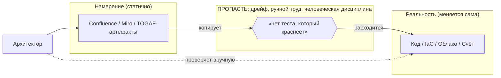

# 01. Executive Summary — вердикты комитета

> Документ для принятия решений. Всё остальное — доказательства.

## 1. Вердикт продуктового стратега: мета-проблема

Девять болей (ниже) не независимы. Они — симптомы одного разрыва:

> **Между намерением архитектора (моделью в голове и в документах)
> и реальностью (кодом, облаком, бюджетом) нет исполняемого моста.**

Каждый существующий инструмент занимает одну сторону пропасти:

Confluence хранит намерение и молча протухает; облако живёт своей жизнью.
Дисциплина человека — единственный механизм синхронизации, и он отказывает
под нагрузкой (боль №1, №2, №3). Включение в воронку денег (№6, №7) и ИИ,
генерирующего изменения быстрее, чем их успевают документировать (№8),
делает ручной мост не просто дорогим — невозможным.

**Продуктовый тезис:** побеждает не «ещё один редактор диаграмм», а инструмент,
где модель *считается и проверяется* — оживающая при каждом изменении входа.
Это ось, на которой стоит CanvasDesk (Numi-листы, value-flow, MCP-агент).

## 2. Матрица девяти болей (сводка)

Полная версия с цитатами — [pain-points/README](pain-points/README.md).

| # | Боль | Тяжесть | Распространённость | Готовность платить | Доказательства |
|---|---|:---:|:---:|:---:|---|
| 1 | Документация/диаграммы устаревают | 5 | 5 | 2 | высокая (7+ независимых источников) |
| 2 | Артефакты «непонятно для кого» | 4 | 5 | 2 | высокая |
| 3 | ADR пишут, но не читают | 3 | 4 | 2 | средняя |
| 4 | Разрыв с бизнесом | 5 | 4 | 4 | высокая |
| 5 | Роль без полномочий | 4 | 4 | 1 | высокая (но это не продуктовая боль) |
| 6 | Техдолг не монетизируется | 5 | 5 | **5** | высокая (Stripe 42%, McKinsey 40%) |
| 7 | Облако: затраты ≠ ответственность | 4 | 4 | **4** | высокая (State of FinOps) |
| 8 | ИИ ломает архитектурные нормы | 4 | 3 | 3 | средняя (формируется сейчас) |
| 9 | Когнитивная перегрузка, карьера | 3 | 4 | 1 | средняя |

Чтение матрицы: продукты продают туда, где **готовность платить ≥4** — боли
№4, №6, №7. Боли №1–№3 — это «входная дверь» (все узнают себя), но монетизация
только через привязку к №4/№6/№7: «живая документация, которая *считает деньги*,
а не рисует квадратики».

## 3. Семь продуктовых возможностей

1. **Исполняемая архитектурная модель** вместо статичной диаграммы: значения
   (RPS, latency, ₽) текут по связям и пересчитываются live. Проверка: боль №1+№2.
2. **Дрейф-детекция на уровне модели**: сравнение декларативной модели с
   фактами из репозитория/среды через MCP/CI. Проверка: боль №1, №8.
3. **«Почему так?» — граф решений, привязанный к узлам модели** (ADR-ки
   живут рядом с расчётом, а не в отдельном вики-кладбище). Проверка: боль №3.
4. **Язык денег для бизнеса**: боль №4 закрывается не «архитектурными вью»,
   а бюджетными моделями — NPV/IRR/unit-economics прямо на канвасе
   (у CanvasDesk это шаблоны «защита бюджета», P&L, unit economics).
5. **Техдолг-денежный мост**: калькулятор «цена бездействия в ₽/мес» —
   Stripe и McKinsey уже доказали размер пирога, но считать его всё равно
   вручную в Excel. Проверка: боль №6.
6. **FinOps-модель на этапе проектирования**: стоимость решения как первое
  -class значение модели (RPS → ноды → $/мес), а не постфактум-счёт.
   Проверка: боль №7.
7. **RU-ниша governance-инструментов**: Habr/Telegram-культура (чаты-комьюнити
   типа @it_arch, ~16K подписчиков) сговорчива к инструментам «нашего»
   производителя при цене на порядок ниже LeanIX/Ardoq. Проверка: RQ4.

## 4. Вердикт экономиста: платёжеспособность

- **RU:** медиана SA ≈ **465K ₽/мес** (вилка 300–800K, h.careers, 06.2026);
  альтернативная оценка 282–533K ₽ (quick-offer). Т.е. годовая стоимость
  «архитектор-часа» для компании — миллионы рублей: инструмент за 2–5K ₽/мес
  окупается, если экономит ≥5% времени.
- **Global:** медиана SA **$215K** (levels.fyi, 1 317 профилей). Сид-рынок
  по $20–40/editor/мес уже существует (IcePanel: $40–50/editor/мес).
- **EA-платформы:** $50K–$750K/год (Ardoq, 2025) — бюджет на «архитектурную
  правду» у enterprise есть, но недоступен mid-market. Mid-market — наша
  зона.

## 5. Вердикт конкурентного разведчика: окно времени

Категория «живой документации» только формируется: Multiplayer (auto-doc),
scopedocs.ai (docs из PR), InstantDocs, Uxxu, SonarSource («living software
architecture documentation… That changes now», 02.2026). Прямых конкурентов
в классе **исполняемых расчётных моделей для архитекторов** не найдено;
соседи по оси — Simulink/AnyLogic (тяжёлые, инженерные) и Causal/Excel
(деньги без архитектуры). Окно ~2–3 года до консолидации.

## 6. Вердикт UX-исследователя и аналитика сообществ

- Говорить с аудиторией нужно **на языке денег и времени**, не «C4/ArchiMate»:
  даже русскоязычные теоретики устали от терминов («Олимп айтишников», Habr).
- Каналы подтверждены: RU — Habr + Telegram (@it_arch, @itarchitect);
  global — r/softwarearchitecture, dev.to, LinkedIn, Architecture Weekly.
- Опасный сигнал: профессия выгорает от роли без власти (боль №5). Продукт,
  который «даёт архитектору цифры вместо мнений», попадает в эмоциональную
  струю — это надо тестировать в интервью как эмоциональный триггер покупки.

## 7. Решение комитета

**GO на фазу проверки** (не на разработку фич):

1. Провести 15–20 интервью по скрипту из [research-plan](research-plan.md)
   (2–3 недели, почти бесплатно).
2. Параллельно — teardown пяти конкурентов ( IcePanel, Multiplayer,
   scopedocs, InstantDocs, Structurizr) с регистрациями и тарифами.
3. Собрать fake-door на «живую модель архитектуры с деньгами» и измерить
   конверсию из двух каналов (Habr-статья + пост в @it_arch-сообществах).
4. Kill-критерии — в research-plan §4: если ≥60% интервью не называют
   самостоятельно ни боль №4, №6, №7 — пересмотр позиционирования.

*Условия пересмотра вердикта: см. research-plan §5 (что должно случиться,
чтобы комитет сказал «STOP»).*
