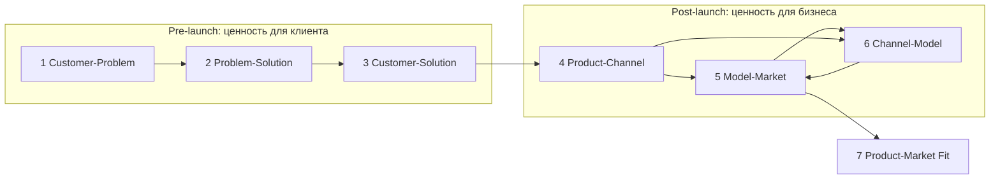

# Наложение исследования на 7 Fits Framework

> [research-plan](research-plan.md) описывает **что делаем** (фазы 0–3,
> гипотезы H1–H8). Этот файл отвечает на вопрос **какой уровень уверенности
> это даст и когда**: каждый этап программы двигает конкретный «фит» из
> фреймворка [7-fit-framework.com](https://www.7-fit-framework.com/), и у
> каждого фита — свой численный гейт. Провал гейта трактуется по правилу
> из [README](README.md): не «подкрутить метрику», а пересмотреть гипотезу.

Статус: v1.0, 22.09.2026 · Роли-авторы: продуктовый стратег + экономист продукта.

## 1. Что это за фреймворк (в терминах авторов)

7 Fits — лестница от идеи к Product-Market Fit из двух блоков: три
pre-launch фита проверяют **ценность для клиента**, четыре post-launch фита
(построены на Four Fits Growth Framework Брайана Бальфура) — **ценность для
бизнеса**. Авторы опираются на Christensen/Ulwick (JTBD), Osterwalder,
Blank/Ries, Ash Maurya (Innovator's Bias), Teresa Torres / Tim Herbig /
David Bland (continuous discovery, тестирование бизнес-идей).

| Блок | Фит | Вопрос фита |
|---|---|---|
| Pre-launch | **Customer-Problem Fit** | У достаточно большого сегмента есть достаточно большая проблема? |
| Pre-launch | **Problem-Solution Fit** | Наше решение решает эту проблему? |
| Pre-launch | **Customer-Solution Fit** | Клиенты хотят именно наше решение — pull, а не push? |
| Post-launch | **Product-Channel Fit** | Есть канал, приводящий пользователей экономично и масштабируемо? |
| Post-launch | **Model-Market Fit** | Бизнес-модель (цена, юнит монетизации) соответствует рынку? |
| Post-launch | **Channel-Model Fit** | Экономика канала сходится с экономикой модели (CAC vs ARPU)? |
| Итог | **Product-Market Fit** | Продукт повторно используют и не хотят терять |

Постлаунч-фиты образуют не цепочку, а связку (квадрат Бальфура):
продукт↔рынок, продукт↔канал, канал↔модель, модель↔рынок — но порядок
доказательств фреймворк задаёт жёстко: **коммерческие фиты (4–6)
бессмысленно тестировать до поведенческого подтверждения фит-ов 1–3.**

## 2. Где мы сейчас: уровень уверенности по фитам

Шкала доказательств (расширяет лестницу фаз из [research-plan](research-plan.md)):

- **L1** — вторичные данные: цитаты сообществ, отчёты, teardown конкурентов;
- **L2** — первичные вербальные: интервью, опросы;
- **L3** — поведенческие: fake-door, PoC, предзаказ, LOI;
- **L4** — деньги: платные пилоты, контракты.

| Фит | Статус | Уровень | Главный дефицит |
|---|---|---|---|
| 1 Customer-Problem | качественно подтверждён: [9 болей](pain-points/README.md), [35+ цитат](quotes-bank.md), teardown ×5 | L1→L2 | самоселекция сообществ; боли не деноминированы в деньги; нет размеров сегмента |
| 2 Problem-Solution | концепт «исполняемая модель» (Numi + value-flow + MCP) сформулирован, реакция не измерена | L0 | не выбран клин — какая из 9 болей первая; нет отстройки от суррогатов (Backstage, Terraform graph, AI-ассистенты) |
| 3 Customer-Solution | поведенческих сигналов нет вообще | L0 | весь фит: fake-door, PoC, предзаказ — только фаза 3 |
| 4 Product-Channel | гипотезы каналов из [teardown](competitive/README.md) | L1 | CAC не мерян; флагманский канал не выбран |
| 5 Model-Market | ценовые якоря: Miro $8–25, IcePanel $40–50/editor, Ardoq $50K+/год | L1 | Van Westendorp только в фазе 2; не выбран юнит (editor / модель / viewer) |
| 6 Channel-Model | не начинался | L0 | вилка LTV/CAC хотя бы на бумаге |
| 7 Product-Market | впереди; критерии PMF нигде не зафиксированы | — | pre-registration критериев до фазы 3 (§7) |

**Вывод:** текущее desk-исследование уверенно закрывает пока только
Customer-Problem Fit — и то «на глаз», из-за самоселекции сообществ.
Всё остальное — сформулированные, но не проверенные гипотезы. Это нормально
для фазы 0; опасно лишь одно — принять L1 за L2–L3.

## 3. Fit 1 Customer-Problem: что ещё проанализировать, чтобы верить болям

### 3.1 Четыре дефицита уверенности

1. **Самоселекция.** В сообществах пишут обиженные и энтузиасты; молчаливое
   большинство репрезентативнее. → Квотированный опрос (фаза 2) с квотами
   §3.3 вместо голосований в чатах.
2. **Вербальное ≠ поведенческое.** «Боль есть» ≠ «за неё платят». →
   Анализ revealed preferences (§3.2) — боли, видимые в чужих тратах.
3. **Боли не деноминированы в деньги.** «Доки гниют» не конвертируется в
   бюджет, пока не переведено в часы и рубли. → В интервью фазы 1 фиксировать
   эпизоды в часах/деньгах (скрипт п. 2 и 6 уже требует — добавить таблицу
   пересчёта: часы × ставка; медиана SA 465K ₽/мес ≈ 2 900 ₽/час, глобальная
   $215K/год ≈ $100/час).
4. **Нет анти-доказательств.** Сообщества страдальцев создают
   survivorship-эффект. → Раунд фальсификации: в каждом интервью один
   встречный вопрос «почему текущий способ вас всё-таки устраивает?»; мининг
   тредов «docs die anyway, и нормально» (HN Algolia, lobste.rs); разбор,
   почему Backstage / Terraform graph / springdoc / AI-ассистенты не закрыли
   проблему — ответы становятся отстройкой для фита 2.

### 3.2 Revealed preference: где боли уже видны в деньгах (1–2 недели, ~0 ₽)

| Источник | Что ищем | Что это доказывает |
|---|---|---|
| hh.ru, Habr Career (RU), LinkedIn Jobs (global) | частота требований C4/TOGAF/ArchiMate и «architecture documentation» в обязанностях | спрос на арх-дисциплину — боль существует и нанимают под неё |
| zakupki.gov.ru (RU) | закупки Confluence/Ardoq/LeanIX, обучения по TOGAF | реальные бюджеты предприятий на арх-инфраструктуру |
| Хабр Фриланс, Upwork, Kwork | заказы «привести доки в порядок», «нарисовать архитектуру» | готовность платить разово, текущие цены |
| G2/Capterra/Gartner PI: 1–3★ на 5 вендоров из [competitive/](competitive/README.md) | повторяющиеся жалобы (цена, устаревание, барьер входа) | чужие недовольные клиенты — наши лиды; язык боли |
| GitHub issues: drawio, mermaid, structurizr, backstage | рекуррентные реквесты: авто-синк, дрейф, «диаграмма из кода» | открытый код как бесплатный опрос недовольных |
| Яндекс Wordstat / Google Keyword Planner | объёмы: «диаграмма архитектуры», «c4 model tool», «альтернатива confluence» | размер активного поискового спроса |
| DORA, Stack Overflow, CNCF, FinOps State of | тренды документации, дрейфа, облачных затрат | внешняя валидация масштаба и тренда |

Каждая находка — карточка в research corpus с датой и ссылкой; итог —
пересчёт [матрицы болей](pain-points/README.md) с колонкой «платят сейчас».
Это дешёвое расширение фазы 0 и вход в задачу 0.5 (TAM/SAM/SOM).

### 3.3 Квоты для фаз 1–2 (чтобы не опросить одних «хабражителей»)

- размер компании: 10–50 / 50–300 / 300+ инженеров — поровну;
- зрелость архитектуры: монолит / микросервисы / в миграции;
- роль: чистый SA / SA+техлид / EA / TA;
- рынок: RU 60% / global 40% (как в плане).

**Гейт фита 1** (собирает H1 + H4 из плана): ≥60% выборки ставят боли
№4/№6/№7 в топ-3 по тяжести **и** ≥40% уже тратят деньги или ≥4 ч/нед на
обход проблемы → двигаемся дальше без пересмотра концепта. Иначе —
пересматриваем ранжирование болей, а не продукт.

## 4. Fit 2 Problem-Solution: выбор клина и проверка концепта

Клин — первая боль, которую «открывает» продукт. Рабочее предположение
([01-executive-summary](01-executive-summary.md)) — №4/№6/№7 (алигнмент,
техдолг, облачные затраты), потому что за смежное уже платят. Проверяем:

- **MaxDiff по 7 возможностям** в каждом интервью фазы 1: «какое из этих
  изменений вы бы выкупили завтра?» — вместо обсуждения «нравится/не нравится».
- **JTBD-switch**: последний переход между инструментами (Confluence→Notion,
  Visio→drawio, Miro→?) — триггер, критерии выбора, полная цена перехода.
  Это предсказывает, сколько будет стоить наш имплементационный барьер.
- **«Почему это не сделали X?»** про каждый суррогат (Backstage catalog,
  Terraform graph, springdoc, AI-ассистенты): ответ на этот вопрос — готовая
  формулировка отстройки в лендинге.
- **Прототип-фальшак** (без бэкенда): модель *их* системы с живыми цифрами
  (нагрузка, ₽) в Figma/PDF. Меряем не мнение, а поведение: узнали свою
  систему? задали what-if вопрос? попросили продолжить?

**Гейт фита 2** (из H2 + H3): ≥30% интервью просят «покажите как можно
раньше», у ≥50% демо «счёт из модели» вызывает спонтанный what-if вопрос.
Провал → меняем клин (не «продукт целиком»).

## 5. Fit 3 Customer-Solution: поведенческие тесты (фаза 3)

Всё по плану (fake-door, Wizard-of-Oz PoC на 5–8 команд) плюс четыре
усиления, поднимающие уровень доказательства с L3 до L4:

1. **Предзаказ вместо waitlist**: оффер «платный пилот 30 дней за 10–20K ₽»
   прямо в Wizard-of-Oz — реальный чек сильнее email-конверсии;
2. **LOI от 2+ команд** — письменная фиксация условий, при которых купят;
3. **Ретеншн-эпизод**: вернулись ли к модели через 2 недели (H5;
   kill-критерий плана: >60% не вернулись);
4. **Time-to-first-value < 1 дня** — архитектор обязан получить первую
   расчётную цифру в первой сессии, иначе инструмент попадёт в «поставлю,
   когда будет время» (главное кладбище арх-инструментов).

## 6. Fits 4–6: каналы и модель (после гейтов фит-ов 1–3)

Типичная ошибка категории — тратить бюджет на каналы и цены до
поведенческого подтверждения. Здесь фиксируем только заготовки:

- **Product-Channel.** Кандидаты из teardown + наши: контент на Habr с CTA,
  Telegram-каналы (RU); Reddit/dev.to, LinkedIn outreach (global); «бесплатные
  рычаги» — MCP-реестры и интеграции (H8), open-core демо-репозиторий, SEO по
  почти пустой семантике «исполняемая модель архитектуры» (проверить объём в
  §3.2). Тест: 2 канала × 2 сообщения, $200–500 на каждый, после зондов фазы 1.
- **Model-Market.** Van Westendorp-лайт (уже в фазе 2) + Gabor-Granger как
  альтернатива; A/B двух прайсов на fake-door (per editor vs per model);
  отдельно RU- и global-зоны (H4: $20–40/editor против 1–3K ₽). Отдельный
  вопрос интервью: кто физически подписывает чек — команда, CTO, личная карта.
- **Channel-Model.** Вилка LTV при чурне 5%/20% в месяц × ARPU из H4 →
  требование CAC ≤ ⅓ LTV; self-serve (контент/SEO/MCP) против sales-assisted
  (LinkedIn, партнёры-консультанты) — выбрать 2 «скрещённые» комбинации до
  фазы 3.

**Гейт фит-ов 4–6:** хотя бы одна комбинация «канал × модель» с CAC ≤ ⅓ LTV
в тест-масштабе; ценовая зона не убита (kill из плана: медиана «дорого»
< $5/editor).

## 7. Fit 7 Product-Market Fit: pre-registration критериев

Критерии фиксируются **сейчас, до разработки** — чтобы потом не двигать
планку под результат (то же правило, что kill-критерии H1–H8):

| # | Критерий PMF | Порог |
|---|---|---|
| 1 | Sean Ellis: «очень расстроимся без продукта» | ≥40% |
| 2 | Ретеншн N3 командных аккаунтов | ≥35% |
| 3 | Экспансия: отношение viewers/editors в аккаунте за 6 мес | ≥2× |
| 4 | Доля сессий PoC через MCP-агента (машинный контракт архитектуры, H8) | ≥30% |

Изменение любого порога после фазы 3 — только отдельным датированным
коммитом с обоснованием (принцип ADR, применённый к research).

## 8. Где искать аудиторию: карта каналов

### RU

| Канал | Сегмент | Рекрутинг интервью | Мининг спроса | Дистрибуция (фаза 3+) |
|---|---|---|---|---|
| Habr: хаб «Проектирование ИТ-систем», Q&A | SA/TA | да, через личку после публикации | да, статьи+комменты | статьи-кейсы |
| @it_arch, @itarchitect и смежные чаты (с согласия модераторов) | SA/TA | да | опросы-зонды | да |
| Habr Career, hh.ru | SA/EA/TA | рекрутеры, вакансии-компании | частоты требований | — |
| zakupki.gov.ru | EA (enterprise) | — | бюджеты на инструменты | тендеры позже |
| Podlodka Crew, HighLoad++, ArchDays | SA/EA | нетворкинг со спикерами | программы докладов = карта актуальных болей | выступления |
| Яндекс Wordstat | — | — | объём поискового спроса | SEO после запуска |

### Global

| Канал | Сегмент | Рекрутинг интервью | Мининг спроса | Дистрибуция (фаза 3+) |
|---|---|---|---|---|
| r/softwarearchitecture, r/EnterpriseArchitect, r/ExperiencedDevs | SA/EA/TA | DM после публичного участия | да | show-посты |
| HN (Algolia API), lobste.rs, dev.to | TA | да | да | статьи |
| LinkedIn Sales Navigator | **EA — основной канал** | булева строка: «Enterprise Architect» OR «Head of Architecture» AND размер компании | посты, вакансии | outreach, позже ads |
| G2/Capterra/Gartner PI | EA/mid-market | рецензенты вендоров как лиды | жалобы 1–3★ | reviews |
| User Interviews, Respondent.io | все | платные интервью $50–100 | — | — |
| Iasa Global, The Open Group | EA | ассоциации, вебинары | — | партнёрства |
| KubeCon, QCon | TA/SA | нетворкинг | программы докладов | спонсорство позже |
| CNCF Slack, DevOps-сообщества | TA | да | да | да |

**Механика рекрутинга** (отсекает «болтунов»): скрин-вопрос «что вы делали
последние две недели — рисовали модель, считали что-то, писали ADR?» —
берём только с недавним эпизодом работы; инцентив ₽2–3K / $25–50 (на
респондент-платформах выше); EA — в основном через консультантов и интро:
в открытых сообществах они почти не сидят.

**Приоритет по фитам:** фит 1 — RU: Telegram+Habr, global: Reddit +
респондент-платформы, EA: 2–3 интро через LinkedIn; фиты 2–3 — те же +
трафик зондов на fake-door; фиты 4–6 — SEO/MCP/интеграции против
LinkedIn sales.

## 9. Сводная таблица: фаза → фиты → гипотезы → гейт

| Фаза [плана](research-plan.md) | Двигает фиты | Гипотезы | Гейт фазы |
|---|---|---|---|
| 0 (цитаты, teardown, зонды) | 1 — доказательная база | — | чистый банк цитат; teardown ×5; зонды запущены |
| 0+ (§3.2 revealed preference) | 1 | — | матрица болей с колонкой «платят сейчас» |
| 1 (интервью 15–20) | 1, 2 | H1, H2 + фальсификация §3.1 | ≥14 интервью; ≥60% топ-3 = №4/6/7 |
| 2 (опрос N≥100) | 1, 5 | H4, H6, H7 | матрица с доверительными интервалами; ценовые зоны |
| 3 (fake-door, PoC) | 2, 3, 4 | H3, H5, H8 | CTR ≥8%; возвраты >40%; TTFTV <1 дня |
| Пилоты/предзаказы | 3, 4, 5, 6 | — | LOI 2+; предзаказ ≥1; CAC ≤ ⅓ LTV |
| PMF-трек (после запуска) | 7 | — | критерии §7 |

## 10. Ограничения

- 7-fit-framework.com — консалтинговый фреймворк (сайт из двух страниц,
  коучи-практики), а не отраслевой стандарт. Ценность для нас — порядок и
  дисциплина доказательств; численные пороги гейтов — наши, из бенчмарков
  dev-tools (CTR 3–8% на сегментный трафик, reply 3–10% на холодный
  outreach) и kill-критериев плана, а не из фреймворка.
- Post-launch фиты (4–6) намеренно не тестируются до гейтов фит-ов 1–3 —
  экономия бюджета важнее раннего «прощупывания каналов».
- Фреймворк предполагает один ICP за раз; у нас два рынка (RU + global).
  Решение: гейты общие, пороги и каналы — раздельные строки в фазах 2–3
  (как в H4: $-зона и ₽-зона).
