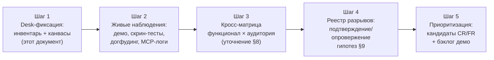
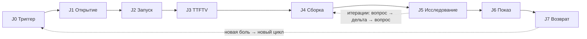

# 04. План CJM-аудита: весь функционал через призму каждой целевой аудитории

> **CJM** (Customer Journey Map) — карта пути пользователя: этапы от триггера
> боли до возврата к продукту. **CJM-аудит** в наших терминах — проверка того,
> что каждая функция продукта стоит на нужном этапе пути нужной аудитории и
> что ни один этап пути не проваливается «в пустоту». Аудит отвечает на вопрос
> «где путь рвётся», а не «что ещё построить»: это дисциплина против
> накопления функций без пути (боль №2 — «артефакты непонятно для кого» —
> может стать болезнью и самого продукта).

- **Статус:** v1.0 — план принят к выполнению; desk-часть (инвентарь §3,
  предварительные карты §5–§7, стартовый реестр разрывов §9) выполнена этим
  документом и подлежит проверке живыми наблюдениями (§11).
- **Дата:** 2026-09-22
- **Роли-авторы:** UX-исследователь + продуктовый стратег (комитет
  [market-researches](README.md))
- **Заказчик:** владелец (приказ: «спланируй аудит CJM всего функционала
  через призму каждой целевой аудитории», сессия 2026-09-22)
- **Связанные:** [research-plan](research-plan.md) — внешние фазы 0–3;
  [02-seven-fits-mapping](02-seven-fits-mapping.md) — гейты фит-ов 1–3;
  [03-interview-guide](03-interview-guide.md) — скрипт интервью;
  `docs/plans/product-roadmap.md` §8 — демо-гейт волны V и метрика
  возврата; `docs/SPEC.md` + `docs/change-requests/index-cr-fr.md` —
  источники инвентаря §3; `user-docs/` — наблюдаемое поведение пользователя.
- **Чем НЕ является:** не UX-ревью отдельных экранов (зона CR/FR и
  layout-линтов PRD-0009), не конкурентный teardown (зона
  [competitive/](competitive/README.md)), не замер конверсии лендинга
  (телеметрии нет до гейта — решение роадмапа §8).

---

## 1. Зачем аудит нужен сейчас

Функциональная масса продукта выросла быстрее, чем проверенные пути
пользователей. В индексе [CR/FR](../change-requests/index-cr-fr.md) — 61
запись, из них ~48 выполнено: расчётное ядро с единицами и доменными
функциями, порты значений и проливание (FR-029/FR-050 со всеми решениями
Р-1…Р-6, Н1–Н10), what-if и индикаторы узких мест (FR-017/FR-016),
lineage-объяснения и режим защиты (PRD-0007 X1–X5), библиотека 45 шаблонов
и 6 готовых схем (FR-019/FR-049), MCP-контур ~34 инструментов с атомарным
`graph_apply` (FR-032/FR-033), онбординг, встроенные доки, RU/EN, темы,
web-версия на GitHub Pages. Каждая функция закрывала свою постановку — но
постановки писались пофрагментарно, и целостного ответа «не рвётся ли путь
каждой аудитории на стыках функций» в репозитории нет.

Момент для аудита выбранный роадмапом: **волна V** — живые демо 5–10
знакомым архитекторам/аналитикам + догфудинг владельца, гейт «≥ 5 внешних
пользователей сами построили модель и вернулись второй раз». Демо — это
прохождение пути на глазах у владельца: именно там видны разрывы, которые
desk-анализ не ловит. Аудит готовит демо тремя способами: (а) чек-листы
«что должно сработать на каждом этапе» для наблюдателя; (б) стартовый реестр
разрывов — гипотезы, которые наблюдение подтверждает или опровергает;
(в) кросс-матрица «функционал × аудитория» — чтобы не показывать TA то, что
закрывает боли SA, и наоборот.

Наконец, аудит — это мост между исследованием и разработкой:
[01-executive-summary](01-executive-summary.md) декларирует продукт как
«исполняемую модель, закрывающую пропасть между намерением и реальностью»;
аудит проверяет, что внутри продукта пользователь проходит тот же мост без
обрывов — от осознания боли (J0) до возврата (J7). Разрыв пути = место, где
пользователь возвращается в Excel/Miro — то самое «тянуло вернуться в
Excel/Numi» из догфудинг-журнала.

## 2. Метод аудита

### 2.1. Единица аудита

Единица — не функция и не экран, а **шаг пути**: «аудитория на этапе пути
решает свою работу (JTBD) такими средствами». Функция продукта — «точка
контакта» шага. Аудиторский вопрос к каждой точке контакта: она
(а) существует, (б) обнаруживаема аудиторией без подсказки, (в) доводит
до следующего этапа. Разрыв — любой этап, где точек контакта нет, они не
обнаруживаемы или тупиковые.

### 2.2. CJM-канвас (формат записи)

Для каждой аудитории — таблица этапов пути J0–J7 (§4) с колонками:

| Колонка | Содержание |
|---|---|
| JTBD шага | работа, которую аудитория «нанимает» продукт сделать на этом этапе |
| Точки контакта | функции из инвентаря §3 (ссылки на FR/CR) |
| Ожидаемое поведение | что аудитор считает «успехом шага» — критерий прохождения |
| Барьер / трение | известное или гипотетическое: что мешает пройти шаг |
| Связь с болями | №1–№9 из [pain-points](pain-points/README.md) |
| Наблюдаемая метрика | прокси без телеметрии (§10) |

Правило канваса: **строка без ссылки на функцию — это разрыв; строка со
ссылкой, но без наблюдаемой метрики — это непроверяемость** (аудит не может
завершиться, метрику надо назначить до наблюдения).

### 2.3. Источники наблюдений

Телеметрии в продукте нет и до гейта не планируется (роадмап §8) — аудит
работает на наблюдаемых источниках:

1. **Живые демо** (волна V): наблюдатель с чек-листом §10 фиксирует «где
   потерял интерес» по сценариям роадмапа (5 мин эталон №1 + 5 мин №5 +
   свободное исследование);
2. **Догфудинг-журнал** `docs/devlog/` (формат SPEC §12): что считал, что
   мешало, что тянуло вернуться в Excel/Numi;
3. **Скрин-тесты онбординга** (A2 §11): свежий пользователь/агент без
   контекста проходит путь установки → первой цифры, шаги и тайминги
   фиксируются;
4. **MCP-сессии агентов** (TA-путь): логи вызовов показывают, на каком
   инструменте агент-пользователь спотыкается (коды E-*/W-* — сигнал);
5. **Desk-проход** (этот документ): реконструкция пути по документации,
   user-docs и README — гипотезы до живых данных.

Приоритет: живое наблюдение > догфудинг-журнал > desk-гипотеза. Разрыв,
подтверждённый живым наблюдением, получает статус «подтверждён» и приоритет
в реестре §9; неподтверждённый остаётся «гипотеза».

### 2.4. Пять шагов аудита

Выход аудита — три артефакта: (1) подтверждённый реестр разрывов с
приоритетами; (2) обновлённые демо-чеклисты волны V; (3) список кандидатов
в CR/FR (или решений «не строим — осознанный разрыв», фиксируется как ADR
только при продуктовых последствиях).

## 3. Инвентарь функциональности (стартовая фиксация)

Сводный каталог по доменам — точка отсчёта аудита. Источники: SPEC, индекс
CR/FR, user-docs, роадмап, `crates/`. Статусы: ✅ работает · 🚧 в работе ·
🔍 в анализе/плане. Идентификаторы доменов Д1–Д9 используются в картах §5–§7
и матрице §8.

| Домен | Что входит (ключевые FR) | Статус |
|---|---|---|
| **Д1 Носитель-канвас** | бесконечный канвас (пан/зум/миникарта T13, поиск Ctrl+F T14), файловые карточки с системными тамбнейлами и broken-link, текстовые заметки (форм. Ctrl+B/I/H), связи с умными портами (CR-008), группы FR-011/012, drag-drop из Explorer, вотчер файлов, виджеты M5, автосейв 2 с + `.bak`, undo 50 шагов FR-006 | ✅ |
| **Д2 Расчётное ядро** | Numi-движок `canvasdesk.expr` (2470+ стр.), размерная система единиц, доменные функции: queueing (13 шаблонов) + финансовые `npv`/`cagr`/`irr`/`cohort_ltv`, DAG-поток с live-ревалом (≤1000 нод < 10 мс), индикаторы узких мест/queue-risk FR-016 (ρ, L, пороги 0.7/0.9) | ✅ |
| **Д3 Композиция значений** | value-рёбра FR-014, порты значений FR-029 (toParam/fromOutput, outputs-манифесты), построчные порты FR-025, проливание FR-050: приоритет Р-1, именованные ссылки «Объект.Поле» Р-6, авто-строка Р-4, наклонное моно Р-2, пульс-волна Н9-1, карта проливаний Н9-4, контекст-меню параметра Н9-3, тултипы Н9-2, тосты Н9-6, unmapped-диагностика Р-3 | ✅ |
| **Д4 Шаблоны и схемы** | 45 builtin-шаблонов FR-019 в 3 категориях, палитра Ctrl+P (wheel-навигация FR-018/022, Miro-стиль FR-030), свои шаблоны FR-020, галерея 6 готовых схем FR-049 (Ctrl+T: бюджет проекта, юнит-экономика, capacity-service, интро-расчёты, what-if, ремонт-смета) + empty-state мост + web `?template=` | ✅ |
| **Д5 Исследование модели** | what-if FR-017 (построчные подмены, сценарии ≤3, дельты «было→стало», таблица сравнения, Apply одним undo), what-if из дерева X3 (живая модель, Stale-чип, дельты по адресу), lineage FR-048/PRD-0007 (дерево происхождения X1, explain-окно X2, «?» у цифры, CSV-листы), автосвязь по именам X4 (детектор, ревью-диалог, undo-бат), режим защиты X5 (×1.5, пошаговое раскрытие, Esc-выход) | ✅ (X6 MCP explain — план) |
| **Д6 MCP-агентный контур** | ~34 инструмента: CRUD нод/рёбер (`node_*`, `edge_*`), `template_instantiate`, `schemes_*`, `flow_recalc`/`flow_cycle_check`, `graph_validate` (коды E-*/W-*), `graph_apply` (атомарный батч, один undo), `whatif_*` ×9, `analyze_bottlenecks`, `param_set`; рецепт агента `user-docs/agent-recipe.md`; скиллы `skills/` (canvasdesk-mcp/model-build/model-verify/whatif); WASM-верификация FR-036/037 (гейты CI, headless-оракул ±1 %) | ✅ |
| **Д7 Обмен и совместимость** | формат JSON Canvas 1.0 (Obsidian-совместимый, human-readable), файл = единица обмена; всеядный импорт FR-043 (mermaid/DOT/PlantUML/draw.io/compose/terraform/ansible → IR → канвас); web-версия GitHub Pages `/app`; дифф-виджет W11 | 🚧 FR-043 «в анализе»; экспорта артефактов нет |
| **Д8 Оболочка UX** | онбординг-тур 8 шагов FR-028 (3 возврата, «Пройти заново»), встроенная документация FR-031 (8 страниц user-docs), оверлей хоткеев FR-004, настройки FR-039 (Obsidian-стиль, группы/дропдауны), RU/EN FR-040, темы и токены FR-046/047 (Nord, Catppuccin), контекст-меню FR-009, буфер FR-003 | ✅ |
| **Д9 Дистрибуция** | Windows-бинарь (демо-канал решения 1 роадмапа), CI-сборки ubuntu/macos/windows (гейты + артефакты ×3), web-версия (trunk/wasm, Pages), MSI — план (cargo-wix); лицензионный каркас M0 (cargo-deny, SBOM, THIRD-PARTY-NOTICES) | ✅ сборки · 🚧 M7/M8-хвосты |

Примечание к инвентарю: здесь зафиксирован функционал **пользовательского**
пути; инженерная инфраструктура (CI 12/12, токен-линты, layout-линты G4)
входит в путь только как «не мешает» — её аудит вынесен из настоящего
плана (см. Ограничения).

## 4. Общая модель пути: этапы J0–J7

Одна лестница для всех трёх аудиторий — различаются вес этапов и точки
контакта. Модель привязана к гейтам: J3 проверяется метрикой TTFTV < 1 дня
([02-seven-fits §5](02-seven-fits-mapping.md)), J7 — метрикой возврата
(роадмап §8: «построил ≥ 10 нод, вернулся, внёс изменения»).

| Этап | Название | Суть работы пользователя | Гейт этапа |
|---|---|---|---|
| **J0** | Триггер | боль проявилась (провал защиты, инцидент, директива) | узнаёт себя в описании боли |
| **J1** | Открытие продукта | статья / демо от коллеги / репозиторий / web-ссылка | понял, чем это отличается от Miro/Excel |
| **J2** | Первый запуск | установка / открытие web-версии; первый канвас | продукт запустился, не отвалился |
| **J3** | Онбординг → TTFTV | тур → первая **своя** расчётная цифра | первая цифра в первой сессии |
| **J4** | Сборка модели | своя модель: вручную, шаблоном, схемой или агентом | модель «моя система» построена |
| **J5** | Исследование | крутит параметры, смотрит дельты, спрашивает «почему» | получил ответ на свой what-if вопрос |
| **J6** | Показ другим | стейкхолдерам, команде, комитету | зритель понял и поверил цифрам |
| **J7** | Возврат / адвокация | вернулся к модели; принёс коллегу / агента | возврат без напоминания (гейт §8) |

Два структурных замечания модели: (а) J5 — не линейный, а циклический этап
(«вопрос → дельта → вопрос» — это и есть «вау-петля» решения 2 роадмапа);
(б) J6 — этап, где продукт сегодня заканчивается «окном»: показ происходит
живьём, артефакта для показа асинхронно (слайд, письмо, wiki) не возникает —
см. разрывы GAP-01/06.

## 5. CJM: Solution Architect — основной покупатель-чемпион

**Профиль:** [audiences/solution-architect.md](audiences/solution-architect.md).
Боли: №6 техдолг, №4 разрыв с бизнесом, №1 дрейф доков. Успех: бюджет
согласован без третьего круга; команды не спрашивают «как устроено».
Продукт покупает через личный win («защитил бюджет с нашими моделями»).

**JTBD-формулировка:** «Когда я проектирую решение и защищаю бюджет, я хочу
соединить структуру системы с расчётами (нагрузка, стоимость, риски) в одном
живом артефакте, чтобы стейкхолдеры видели цифры там же, где структуру, и
не гоняли меня на третий круг согласований».

| Этап | JTBD шага | Точки контакта (домены §3) | Ожидаемое поведение | Барьер / трение | Боли | Метрика |
|---|---|---|---|---|---|---|
| **J0** | «мне сказали принести цифры» | — (рынок: статьи/каналы) | узнаёт боль №4/№6 в нашем языке | продукт не участвует | №6, №4 | отклик на зонд-статью |
| **J1** | понять, чем это ≠ Miro+Excel | web-версия `/app` (Д9), README, статья-туториал с расчётной моделью | открыл ссылку, увидел живой пересчёт | лендинг должен показывать «считает», а не «рисует» | №4 | клик → открытие web-версии |
| **J2** | запустить без боли | Windows-бинарь CI (Д9); web-версия без установки; Linux/macOS — сборки CI (M7 🚧) | канвас открылся, автосейв работает | флагманский канал — Windows-бинарь (решение 1); SA на macOS вне демо-канала | — | успешный запуск без помощи |
| **J3** | первая своя цифра ≤ 1 сессии | онбординг 8 шагов (Д8), empty-state → галерея схем (Д4): «Бюджет проекта», «Юнит-экономика»; правка числа → живой пересчёт (Д2); тосты/подсветки не нужны | взял схему, поменял 1 число, увидел пересчёт цепочки | тур показывает базу канваса, а не «цифру за 2 минуты» (первые шаги — навигация) | №9 | TTFTV: время до первой правки числа; tour completion |
| **J4** | собрать модель СВОЕЙ системы | палитра 45 шаблонов Ctrl+P (Д4), Numi-листы «= …» (Д2), value-связи Shift+drag → порты (Д3), автосвязь по именам X4, агент по рецепту `graph_apply` (Д6), импорт mermaid/draw.io FR-043 🚧 (Д7) | модель «их системы» построена за минуты (демо-эталон №1/№5) | import существующих диаграмм — в анализе (GAP-04); шаблоны универсальны, а его домена может не быть | №6, №4 | время сборки эталона; доля ручной сборки vs агент |
| **J5** | крутить и объяснять | what-if бар Ctrl+Shift+I: сценарии, дельты, сравнение, Apply (Д5); индикаторы узких мест Ctrl+B, ρ/L (Д2); lineage «почему эта цифра» + «Что если…» из дерева (Д5); волна/карта проливаний/тултипы (Д3) | сам задал what-if вопрос и получил дельту; объяснил цифру стейкхолдеру | сценарный лимит 3 (осознанный v1); статистика — волна S | №4, №6 | спонтанный what-if вопрос (гейт фита 2: ≥50 % демо) |
| **J6** | показать и защитить | режим защиты X5 (×1.5, пошаговое раскрытие — окно проверки стейкхолдером); минимапа; main stage FR-042/044 🚧 | стейкхолдер понял структуру и цифры без SA-«перевода» | **нет артефакта для асинхронного показа** (PNG/PDF/слайд из модели) — защита вне живой встречи невозможна (GAP-01) | №4 | вопрос стейкхолдера «пришлите это» → ? |
| **J7** | вернуться; принести команду | автосейв `.canvas` + `.bak` (Д1), модель в git/Obsidian (Д7), MCP+скиллы для команды агентов (Д6) | вернулся и внёс изменения; сохранил в свой репозиторий | «повторно используемые подсхемы» — композиты R4 (волна S); нет напоминаний/дайджеста — и не надо до гейта | №1 | возврат без напоминания (гейт §8) |

**Desk-вывод по SA:** путь J2→J5 плотный (сильнейшая часть продукта —
исследовательская петля на живой модели), два тонких места: **J3** —
онбординг ведёт по канвасу, а не к цифре (риск: SA не доходит до «вау»
в первой сессии; компенсация — empty-state мост к галерее схем уже есть);
**J6** — показ только живым окном, артефакта нет (GAP-01, главный кандидат
в CR после аудита).

## 6. CJM: Technical Architect — руки на коде, продажа снизу вверх

**Профиль:** [audiences/technical-architect.md](audiences/technical-architect.md).
Боли: №1 дрейф доков, №3 ADR не читают, №8 ИИ-хаос. Успех: нет арх-инцидентов;
быстрый онбординг инженеров; каркас проверяется машиной. Продукт должен жить
в его окружении: git, PR, CI, Obsidian.

**JTBD-формулировка:** «Когда я держу каркас и ревью PR с архитектурными
последствиями, я хочу модель, которая живёт в моём репозитории рядом с кодом
и проверяется машиной (CI, агент), чтобы документация не врала про прод и
ИИ-агенты не ломали правила молча».

| Этап | JTBD шага | Точки контакта | Ожидаемое поведение | Барьер / трение | Боли | Метрика |
|---|---|---|---|---|---|---|
| **J0** | инцидент/ИИ-PR сломал каркас | — | узнаёт боль №1/№8 | продукт не участвует | №1, №3, №8 | отклик HN/dev.to |
| **J1** | найти «executable model» | репо GitHub, README, skills/ пакет (Д6), демо «диаграмма, которая сама считает и краснеет» | клонировал репо, прочитал SPEC/ADR | README говорит на языке продукта, а не на языке TA («fitness functions для денег и нагрузки» — GAP-09) | №1 | звёзды/форки ≠ вовлечение; глубина чтения |
| **J2** | поставить в своём окружении | `cargo build` (Rust 1.80+), бинари CI ×3 ОС, web-версия (Д9); MCP-сервер stdio (Д6) | собралось/запустилось на его ОС | Linux/macOS — рабочий стол M7 в бэклоге; MCP — Windows/stdio фокус | — | сборка без правки кода |
| **J3** | первый «машинный» контакт | рецепт агента `agent-recipe.md` (Д6): свежий агент собирает эталон по рецепту; скиллы `skills/` для внешних агентов; WASM-верификация FR-037 (headless-оракул ±1 %) — «у этого есть тесты» | агент TA собрал модель; TA увидел отчёт `graph_validate` | рецепт требует MCP-клиента рядом; web-версия MCP не отдаёт | №8 | сборка эталона агентом без подсказок (гейт CP4) |
| **J4** | модель рядом с кодом | `.canvas` в репозитории (JSON Canvas, git-diffable текст, Д7), `template_instantiate`/`graph_apply` (Д6), единицы и E-UNIT (Д2) | модель закоммичена рядом с ADR | нет линтерской проверки модели в его CI (паттерн mcp-wasm-гейта есть, «из коробки» нет — GAP-02); конфликт-мердж `.canvas` не объясняется в ревью (GAP-05) | №1, №8 | `.canvas` в его PR; вопрос «как в CI?» |
| **J5** | проверить и объяснить | `graph_validate` коды E-*/W-*, `flow_cycle_check`, `analyze_bottlenecks` (Д6); lineage (Д5); whatif через MCP `whatif_set_override`/`deltas` (Д6) — машиночитаемо | прогнал валидацию, получил точные код/нода/ребро | дрейф-детекция модель↔код/облако отсутствует (GAP-02 — ядро возможности №2) | №1, №8 | валидация в его сценарии; красная модель |
| **J6** | показать команде | .canvas открывается у коллег (Obsidian-совместимость Д7); скиллы для агентов команды; README/SPEC/ADR как публичные доки | команда открыла модель без установки продукта | нет read-only ссылки «поделиться моделью» вне web-инстанса; ADR-связности нет (ADR рядом с моделью — задумка CR-013, не UI) | №3 | коллега открыл модель; ADR-вопрос |
| **J7** | вернуться = модель живёт | вотчер файлов (Д1) подхватит правки; MCP-агент обновляет модель (Д6); `.bak`/undo | вернулся к актуальной модели | без синхронизации «код изменился → модель устарела» возврат упирается в ручное обновление (та же боль №1, теперь внутри продукта — GAP-02) | №1 | возврат к модели после изменений в коде |

**Desk-вывод по TA:** сильный машинный путь J3→J5 (валидация с кодами,
оракул-тесты, скиллы — «тесты для денег и нагрузки» почти честно работают),
но **J4/J6/J7 держатся на ручной дисциплине** — модель не проверяется в его
CI и не синхронизируется с кодом; дрейф-детекция (возможность №2 из
executive summary) — самый большой разрыв пути TA (GAP-02) и его «тренд-союзник»
fitness functions ждёт упаковки (GAP-09).

## 7. CJM: Enterprise Architect — второй клиент, язык денег и рисков

**Профиль:** [audiences/enterprise-architect.md](audiences/enterprise-architect.md).
Боли: №4 разрыв с бизнесом, №2 артефакты «непонятно для кого», №7 облако,
№8 ИИ-governance. Успех: инициативы проходят комитет; портфель консолидирован.
Покупает через in-house PoC после того, как продукт доказал ценность у SA/TA
(вывод GTM №1 аудитории). Цикл длинный, консервативный.

**JTBD-формулировка:** «Когда я управляю ландшафтом и портфелем, я хочу
считать сценарии и деньги на уровне моделей команд (what-if по портфелю:
облачный счёт, консолидация, техдолг), чтобы говорить с советом директоров
на языке рисков и бюджета, а не диаграмм».

| Этап | JTBD шага | Точки контакта | Ожидаемое поведение | Барьер / трение | Боли | Метрика |
|---|---|---|---|---|---|---|
| **J0** | директива «снизить счёт на N%» / M&A / провал аудита | — | узнаёт боль №7/№4 | продукт не участвует | №4, №7, №8 | — |
| **J1** | услышать от чемпиона | демо SA/TA-чемпиона (решение 1: EA почти не сидит в открытых сообществах); web-ссылка чемпиона | понял: «это считает, а не рисует» | вход почти только через интро — план каналов §8 seven-fits | №2 | интро-демо состоялось |
| **J2** | PoC без настройки | web-версия `/app` (Д9) — открыть и смотреть; лицензионная чистота M0 (cargo-deny, SBOM — Д9) снимет вопрос security-ревью | открыл модели команд в браузере | web-версия — персональный инстанс, не командный (осознанно до Go) | — | PoC-сессия без установки |
| **J3** | первый портфельный вопрос | схемы «Юнит-экономика», «Бюджет проекта» (Д4); финфункции npv/irr/cagr/cohort_ltv (Д2); what-if «что будет, если…» (Д5) | задал сценарий про деньги | схемы — уровень одного решения, не портфеля | №4, №6 | спонтанный what-if по деньгам |
| **J4** | модели всех команд в одном месте | — (композиты R4 — волна S; мульти-модель/агрегация нет) | портфель из моделей команд | **разрыв уровня продукта**: сегодня EA работает с одной моделью за раз (GAP-03) | №2, №6 | запрос «а по всем проектам?» |
| **J5** | сценарии и governance | what-if дельты в деньгах (Д5); unmapped-диагностика Р-3 как «что не подставлено» (Д3); `analyze_bottlenecks` (Д6) | получил дельты; увидел «дыры» в данных | экспорта в его реестр (LeanIX/Ardoq/CMDB) нет (GAP-10); импорт из terraform/compose FR-043 🚧 — частично закроет «реальность» | №7, №8 | дельта по счёту; вопрос об экспорте |
| **J6** | совет директоров / комитет | режим защиты X5 (живое окно проверки) | показал живую модель комитету | **нет бюджетного отчёта-артефакта из модели** (PDF/слайд — GAP-06); язык EA-платформ (матрицы, roadmaps) не поддерживается — и не должен (стратегия: интеграция, не конкуренция) | №2, №4 | «пришлите материал к совету» → ? |
| **J7** | закупить «портфельную версию» | — (лицензирование/седы/тим — вне скоупа до Go) | PoC/предзаказ | путь закупки не определён (осознанно; триггер — после гейта) | — | LOI/предзаказ (фаза 3 плана) |

**Desk-вывод по EA:** путь J0→J3 рабочий через чемпиона и web-версию,
но J4–J7 — это фактически **продукт следующего цикла** (портфель,
экспорт/импорт с реестрами, артефакты для совета, лицензирование).
Аудит фиксирует это как осознанные разрывы «после Go» (GAP-03/06/10), чтобы
(а) не пытаться закрыть их раньше гейта, (б) готовить язык/импорт уже сейчас
(FR-043), (в) в демо EA не обещать того, чего нет.

## 8. Кросс-матрица «функционал × аудитория»

Вес домена §3 для каждой аудитории: **ядро** (путь ломается без него) ·
**полезно** (усиливает, но путь жив) · **фон** (не дифференциатор для этой
аудитории). Этап — где домен впервые становится решающим.

| Домен | SA | TA | EA | Комментарий |
|---|---|---|---|---|
| Д1 Носитель-канвас | полезно (J2–J4) | полезно (J4: файл в репо) | фон | гигиенический базис; wow не рождается |
| Д2 Расчётное ядро | **ядро** (J3–J5) | полезно (J5: проверяемость) | **ядро** (J3–J5: деньги) | двойной якорь: SA-«вау» и EA-«язык денег» |
| Д3 Композиция и проливание | **ядро** (J4–J5) | полезно (J4: адресация для агента) | фон | наглядность петли — главный демо-актив SA |
| Д4 Шаблоны и схемы | **ядро** (J3: TTFTV) | фон | полезно (J3: юнит-экономика) | галерея = мост к первой цифре SA |
| Д5 Исследование (what-if/lineage/защита) | **ядро** (J5–J6) | **ядро** (J5–J6) | полезно (J5–J6) | lineage/защита X1–X5 закрывают боли №1/№4/№3 одновременно |
| Д6 MCP-агентный контур | полезно (J4: агент собирает) | **ядро** (J3–J7) | фон → полезно (governance-агенты, J5) | для TA — среда обитания; для SA — ускоритель сборки |
| Д7 Обмен и совместимость | полезно (J7: git/Obsidian) | **ядро** (J4/J6/J7) | **разрыв → ядро** (J4–J6: импорт/экспорт) | самый недостроенный домен относительно потребностей |
| Д8 Оболочка UX | **ядро** (J3: онбординг) | фон | фон | окупается там, где TTFTV |
| Д9 Дистрибуция | полезно (J2: Windows-демо) | полезно (J2: его ОС) | полезно (J2: web PoC) | M7/M8-хвосты бьют по TA сильнее всех |

**Чтение матрицы:** у SA и TA пути сегодня «ядерно» покрыты (SA — Д2+Д3+Д4+Д5+Д8;
TA — Д5+Д6+Д7), у EA ядровой разрыв в Д7 (обмен) и Д4 (портфельный уровень).
Матрица также защищает демо от ошибки «показывать своё»: для EA-демо решают
Д2/Д4-деньги и web-доступ, а не палитра и волны; для TA — MCP, валидация,
`git diff` модели, а не тур.

## 9. Стартовый реестр разрывов (desk-гипотезы)

Формат реестра: ID · аудитория · этап · разрыв · гипотеза решения · связь с
существующими планами · влияние на гейты. Статус до живых наблюдений —
«гипотеза». Приоритет P1/P2/P3 — по влиянию на гейт возврата (волна V) и
гейты фит-ов 2–3.

| ID | Аудитория | Этап | Разрыв | Гипотеза решения | Связь | Приоритет |
|---|---|---|---|---|---|---|
| **GAP-01** | SA | J6 | нет артефакта для асинхронного показа: защита бюджета вне живой встречи невозможна («пришлите это» → нечего слать) | экспорт выбранной области/схемы в PNG (+PDF позже) из меню; водяной/подпись версии модели | новый FR-кандидат (после подтверждения демо) | **P1** |
| **GAP-02** | TA | J4–J7 | нет дрейф-детекции и CI-упаковки: модель не проверяется машиной в ЕГО конвейере; «диаграмма, которая краснеет» не автоматизирована | (а) лайт: документ-рецепт «модель в CI» поверх mcp-wasm-гейта; (б) полный: `canvasdesk check` CLI + дрейф-сравнение модель↔факты | возможность №2 exec-summary; FR-037 паттерн; CR-013 | **P1** (а — дёшево) |
| **GAP-03** | EA | J4 | нет портфельного уровня: EA не агрегирует модели команд | композитные шаблоны R4 + «папка моделей» с суммарной панелью | волна S4 (триггер — Go); не форсировать | P3 |
| **GAP-04** | SA, TA | J4 | существующие диаграммы не поднимаются в живую модель (миграция с Miro/draw.io вручную) | всеядный импорт FR-043 | FR-043 «в анализе» — поддержать приоритет | **P2** |
| **GAP-05** | TA | J4/J6 | `.canvas`-конфликты в git не читаемы в ревью: PR с моделью непонятен коллеге | diff-виджет/док «как мержить модели» (W11 — витрина?) | FR-043/W11; пока — док-рецепт | P2 |
| **GAP-06** | EA | J6 | нет бюджетного отчёта из модели для совета директоров | PDF-вывод «одностраничного резюме модели» (позже GAP-01) | после GAP-01; язык денег | P2 |
| **GAP-07** | TA, SA | J2 | рабочий стол за пределами Windows (M7) — TA-сегмент на Linux/macOS | M7 по плану (триггер S6) | роадмап §7 | P3 |
| **GAP-08** | SA | J3–J4 | «модель ИХ системы» не возникает быстро: эталоны есть, персонализации под кейс клиента нет | демо-скрипт «опишите 3 числа — агент соберёт черновик» (agent-recipe + graph_apply уже позволяют) | 7-fits §4 прототип-фальшак; демо-чеклист | **P2** |
| **GAP-09** | TA | J1 | README/лендинг не говорят на языке TA («fitness functions для денег и нагрузки», «модель в CI») | пересказ README-секции «для кого» + пример CI | контент, не код | **P1** (дёшево) |
| **GAP-10** | EA | J5–J7 | нет импорта/экспорта с EA-реестрами (CMDB/LeanIX/Ardoq) и нет пути закупки | после Go: экспорт CSV/Excel как минимальный мост; интеграции — позиция «не конкурировать, интегрироваться» | GTM-вывод №2 аудитории EA | P3 |

Правила ведения реестра: (а) живое наблюдение (демо волны V, скрин-тест,
догфудинг) переводит строку в «подтверждён» с датой и источником — или
вычёркивает; (б) новый разрыв, найденный в живом наблюдении, добавляется с
тем же форматом и источником; (в) каждая строка либо становится кандидатом
CR/FR, либо закрывается решением «осознанный разрыв» (с фиксацией причины);
(г) реестр живёт в этом файле — единое место, как матрица болей.

## 10. Метрики аудита (без телеметрии)

| Этап | Наблюдаемый прокси | Как собираем | Порог внимания |
|---|---|---|---|
| J1 | открытие web-версии после демо/статьи | счётчик недоступен (нет телеметрии) — ручная фиксация: «открыл при мне / сказал что открыл» | качественно |
| J2 | запуск без помощи | скрин-тест A2: число обращений за помощью | 0 обращений |
| J3 | TTFTV — время до первой правки числа в схеме/модели | скрин-тест A2 (тайминг по шагам) | < 10 мин; вопрос what-if в первой сессии |
| J4 | сборка модели «их системы» | демо-наблюдение + MCP-лог сессии агента | сессия ≤ 1 дня (7-fits §5.4) |
| J5 | спонтанный what-if вопрос | протокол демо (чек-лист §8 роадмапа + карта §5–§7) | ≥ 50 % демо (гейт фита 2) |
| J6 | реакция зрителя; запрос артефакта | протокол демо: «пришлите это» — прямой сигнал GAP-01 | каждый случай — в реестр |
| J7 | возврат без напоминания | контрольный контакт по слову пользователя (метрика §8 роадмапа) | гейт: ≥ 5 вернувшихся |

Протокол демо (дополняет чек-лист роадмапа §8): наблюдатель отмечает по
этапам J1–J7 — что сработало само, что потребовало подсказки, где потерял
интерес, что спросил «пришлите/покажи ещё». Бланк — одна строка реестра
разрывов или «гладко» на этап. После каждого демо — 10 минут на запись,
пока свежо (правило девлога SPEC §12).

## 11. План выполнения аудита

| # | Шаг | Что делается | Кто | Когда | Выход |
|---|---|---|---|---|---|
| А1 | Desk-фиксация | инвентарь §3, канвасы §5–§7, матрица §8, реестр §9 | агент | **выполнено** (этот документ) | v1.0 плана |
| А2 | SA-путь живьём | скрин-тесты пути J2→J4 (1–2 «свежих» пользователя из демо-листа); протокол по §10 | владелец (демо) + агент (скрин-тест сценария в Xvfb-стенде DEMO.md) | волна V, первые 3–5 демо | подтверждение/опровержение GAP-01/04/08; тайминги TTFTV |
| А3 | TA-путь self-audit | агент-«свежак» (без контекста репо) проходит: клон → README → cargo build → MCP по рецепту → модель в git → `graph_validate`; все спотыкания — в реестр | агент | 1 день, ближайшая сессия | проверка GAP-02/05/09; факт «сборка без правки кода» |
| А4 | EA-путь desk+интро | уточнение §7 по 1–2 интро-интервью (вопросы уже в [audiences/enterprise-architect.md](audiences/enterprise-architect.md)) | владелец | по мере интро (фаза 1 плана) | уточнение GAP-03/06/10 |
| А5 | Свод и приоритизация | обновление матрицы §8 и реестра §9 по живым данным; топ-разрывы → кандидаты CR/FR с оценкой «влияние на гейт ÷ стоимость» | агент | после А2–А4 (или пакетно после 5 демо) | отчёт-запись в этом файле (обновление §9 реестра + запись в «Истории изменений») + список кандидатов |
| А6 | Решения владельца | по каждому P1/P2: FR сейчас / после Go / осознанный разрыв | владелец | после А5 | новые FR или ADR-решения «не строим» |
| — | Ритм | повтор А2-наблюдений на каждом демо волны V; полный проход А1–А6 — после гейта Go (переоценка путей для следующего цикла) | все | непрерывно / по вехе | живой реестр |

Трудоёмкость desk-части уже вложена (этот документ). Живые части А2–А4
не требуют новых бюджетов: демо уже запланированы волной V, скрин-тест и
self-audit — рутина агента в существующем стенде.

## 12. Открытые вопросы владельцу

1. **Порядок аудиторий:** предложен SA → TA → EA (по готовности канала
   наблюдений: демо волны V идут SA; TA проверяется self-audit'ом агента;
   EA — desk до интро). Подтвердить или переупорядочить?
2. **GAP-01 (экспорт артефакта)** — единственный P1-кандидат в новый FR из
   desk-прохода: ждать подтверждения живыми демо (А2) или ставить в работу
   до волны V (демо сразу получат «пришлите это»)?
3. **GAP-02(а)** — док-рецепт «модель в CI» поверх существующего
   mcp-wasm-гейта: дёшево, чистая документация. Делать отдельным FR или
   разделом `user-docs/agent-recipe.md`?
4. **Глубина EA-этапа J4–J7:** зафиксировать ли позицию «EA-портфель —
   продукт следующего цикла» отдельным ADR (сейчас это вывод §7 без
   формального статуса)?
5. **Связь с FR-044/FR-045 (в работе):** их приёмочные демо — готовые
   наблюдения для этапа J5/J6 SA-карты; включить в протокол А2?

## Ограничения

- Desk-карты §5–§7 — реконструкция по документации; они намеренно
  оптимистичны к «функция существует» и пессимистичны к «функция
  обнаружима»: реальная обнаруживаемость меряется только живыми
  наблюдениями (А2–А4).
- Инвентарь §3 — срез на 2026-09-22 (merge 1c68404, FR-050 закрыт);
  движущиеся цели (FR-043/044/045, X6) помечены статусами и требуют
  пере-среза при выполнении.
- Модель пути J0–J7 — наша адаптация CJM под дособытийный продукт
  (нет воронки продаж и телеметрии); после запуска модель расширится
  левыми этапами (каналы, конверсии) — тогда план подлежит ревизии.
- Аудит не заменяет: юзабилити-тесты поверхностей (G4-линты PRD-0009),
  интервью фазы 1 (вербальные данные), фейк-дор фазы 3 (поведение на
  оффере). Он связывает их в один путь.

## Источники истины

- `docs/market-researches/audiences/` — портреты EA/SA/TA (боли, метрики,
  триггеры) — основа карт §5–§7.
- `docs/market-researches/01-executive-summary.md` — 9 болей, 7 возможностей
  (GAP-02 = возможность №2; GAP-08 = §4 прототип-фальшак).
- `docs/plans/product-roadmap.md` — волны 0/A/B/V/S, гейт возврата §8,
  демо-чеклист, решения владельца 1–8.
- `docs/SPEC.md` + `docs/change-requests/index-cr-fr.md` — функциональный
  инвентарь §3.
- `user-docs/` (quick-start, agent-recipe, templates, calculations,
  interface, hotkeys) — наблюдаемое поведение пользователя.
- `docs/DEMO.md` + `docs/demo-environment.md` — стенд для скрин-тестов А2/А3.

## История изменений

- `2026-09-22` — v1.0: план создан по приказу владельца; desk-часть
  выполнена (инвентарь Д1–Д9, канвасы SA/TA/EA, матрица, реестр
  GAP-01…10, метрики, план А1–А6); живая валидация — А2–А4 (волна V).
