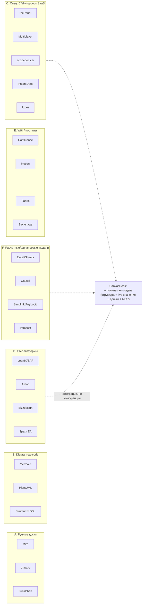

# Конкурентный анализ

> Задача: показать, кто уже пытается монетизировать боли архитекторов,
> чем именно они слабы, и где белое пятно CanvasDesk. Все цены — публичные
> данные на сентябрь 2026; у каждого факта указан источник.
>
> **Teardown ×5 (09.2026):** детальные разборы IcePanel, Multiplayer,
> Structurizr, Miro и Ardoq — с ценами, цитатами похвал/жалоб и счётом
> покрытия болей — вынесены в [competitive/](competitive/README.md).
> Этот файл остаётся картой категорий; teardown-файлы — глубиной по вендорам.

## Карта категорий

CanvasDesk стоит на стыке C (поймёт архитектор) и F (умеет считать), чего
не делает ни одна из категорий.

## A. Ручные доски — Miro, draw.io, Lucidchart

- **Что делают:** рисование диаграмм; Miro добавляет воркшопы.
- **Цены:** draw.io почти бесплатен; Miro/Lucidchart ~$8–20/место/мес.
- **Почему не решают:** модель = картинка; любые числа (RPS, $) — текст,
  не значение. Дрейф не обнаруживается никогда. Прямое подтверждение
  слогана боли: «Я тут в Miro накидал» ([Habr 1009402](pain-points/02-diagrams-nobody-uses.md)).
- **Слабое место для отстройки:** «рисунок, который ничего не знает о системе».

## B. Diagram-as-code — Mermaid, PlantUML, Structurizr

- **Что делают:** диаграмма как текст в репозитории; Structurizr —
  референсная реализация C4 (Simon Brown).
- **Реальность практики:** «So instead of a diagram you fail to update…
  now you've got PlantUML you fail to update» ([lobste.rs, 10.01.2023](pain-points/01-documentation-drift.md));
  «C4 diagrams are only useful when teams can actually navigate and maintain
  them» ([uxxu.io](https://uxxu.io)).
- **Ограничения:** диффы кода не порождают диффов модели; расчётов нет;
  entry-барьер DSL отсекает стейкхолдеров. Structurizr остаётся нишевым
  (сообщество ценило его именно за модельность — обзоры 2024–2026).
- **Вывод:** идея «модель важнее картинки» подтверждена рынком, исполнение — нет.

## C. Специализированные SaaS «живой архитектуры» — главная конкуренция

| Продукт | Ставка | Что известно (источник) | Слабое место |
|---|---|---|---|
| **IcePanel** | совместные C4-модели + ADR + flow | $50/editor/мес, $40 годовой, enterprise $25 от 50 мест ([сравнение на Medium](https://medium.com)); путь к $2M ARR с ~$8K MRR на личных сбережениях, поддержка Simon Brown ([блог IcePanel, 23.07.2025](https://icepanel.io)); «The IcePanel Loop: Define, Visualise, Validate, Adapt» | модель по-прежнему рисуется и поддерживается людьми; расчётов (нагрузка/деньги) нет; цена на команду |
| **Multiplayer** | auto-documentation из live-сессий/платформы | «How to recover your architecture after drift and erosion» ([блог, 2025](https://www.multiplayer.app/blog/how-to-recover-your-architecture-after-drift-and-erosion)); System Auto-Documentation ([dev.to, 27.12.2024](https://dev.to)) | фокус на рантайм-сессиях/API; не финансовая и не нагрузочная модель |
| **scopedocs.ai** | генерация архитектурной документации из PR и code review | «The most effective approach is generating architecture documentation from pull requests…» ([сайт, 25.05.2026](https://scopedocs.ai)) | документация ≠ модель; считать ничего не может |
| **InstantDocs** | «how a system is structured, why it was built that way…» | ([блог, 13.05.2026](https://instantdocs.com)) | ранний продукт, непубличные данные |
| **Uxxu** | C4 + dependency intelligence + AI | «Try free, start modeling» ([сайт, 2026](https://uxxu.io)) | та же категория C4-инструментов без исполняемых расчётов |
| **SonarSource** | вход Sonar в living architecture docs | «Some form of living software architecture documentation… is missing. That changes now» ([26.02.2026](https://www.sonarsource.com)) | снизу от кода (статика), не модель для людей и денег |

**Итог по C:** категория признана рынком (IcePanel ~$2M ARR — есть спрос),
но все решают задачу *поддержания актуальности описания*, никто —
*исполнения модели* (нагрузка, стоимость, окупаемость). Именно сюда
целится возможность №1/№5/№6 из [executive summary](01-executive-summary.md).

## D. EA-платформы — LeanIX (SAP), Ardoq, Bizzdesign, Sparx

- **Цены (публичные ориентиры):** разбор Ardoq: $5–15K/год (старт),
  $50–200K/год (мид), $250–750K/год (enterprise) ([ardoq.com, 15.08.2025](https://www.ardoq.com));
  нишевый Essential — $21 999/год плоско ([enterprise-architecture.org](https://enterprise-architecture.org)).
  LeanIX «The Cost of Self-Made EA» — сами вендоры считают экономику отказа от инструментов.
- **Рейтинги:** Gartner: Ardoq 4.8 (233 отзыва), LeanIX 4.7 (479).
- **Почему не конкуренты mid-market:** цена и бюрократия; боль EA «Lack of
  business buy-in» они не закрывают (см. [боль 04](pain-points/04-business-misalignment.md));
  what-if сценарии и живые деньги — нет. **Стратегия CanvasDesk:** интеграция
  (импорт реестров) вместо лобовой войны.
- **RU-особенность:** уход западных EA-платформ → пустая ниша governance-инструмента
  (возможность №7).

## E. Wiki и порталы — Confluence, Notion, Fabric, Backstage

- **Диагноз сообщества:** «Your Confluence wiki is confidently giving people
  wrong information right now» ([Atlassian Community, 02.2026](https://community.atlassian.com/forums/App-Central-articles/Your-Confluence-wiki-is-confidently-giving-people-wrong/ba-p/3192612));
  «Confluence is where information goes to die» ([dev.to, 25.10.2017](https://dev.to/pabloportugues/confluence-is-where-information-goes-to-die-25n) —
  актуально до сих пор); Fabric продаёт «docs that write themselves».
- **Вывод:** категория хранит тексты, но не структуру и не значения.
  Для CanvasDesk это скорее источник импорта (уже есть совместимость с Obsidian).

## F. Расчётные и финансовые инструменты — Excel, Causal, Simulink/AnyLogic, Infracost

- **Excel/Sheets** — главный реальный конкурент везде, где деньги: гибко,
  но не связан с архитектурой, не версионирован вместе с дизайном, умирает
  вместе с автором.
- **Causal** (финансовое моделирование SaaS) — живые формулы и данные,
  но домен финансов; архитектурной структуры нет.
- **Simulink / AnyLogic** — исполняемые модели (потоки, очереди) — тяжёлые,
  инженерные, не про ИТ-архитектуру и деньги команд; ориентир сложности.
- **Infracost** — цена на уровне IaC-диффа; самый близкий сосед снизу,
  кандидат на интеграцию ([боль 07](pain-points/07-cloud-cost-finops.md)).

## Сводная таблица

| Категория | Модель поддерживается | Считает нагрузку | Считает деньги | Понятно бизнесу | Цена входа |
|---|:---:|:---:|:---:|:---:|---|
| A. Доски | руками | — | — | частично | $0–20/место |
| B. As-code | руками (текст) | — | — | — | $0 |
| C. Living-docs SaaS | частично авто | — | — | частично | $40–50/editor |
| D. EA-платформы | руками + импорт | — | стат. атрибуты | частично | $50K+/год |
| E. Wiki | руками | — | — | да | $0–10/место |
| F. Расчётные | формулами | да (спец.) | да (спец.) | да | $0–100+/мес |
| **CanvasDesk (план)** | **значениями (live)** | **да (queueing)** | **да (NPV/ue)** | **да (шаблоны-отчёты)** | TBD |

## Белые пятна и риски

1. **Белое пятно (ядро ставки):** исполняемая архитектурная модель, где
   структура и деньги/нагрузка — один граф. Прямых конкурентов не найдено;
   ближайшие соседи по одному признаку — C (структура) и F (расчёт).
2. **Риск скорости:** категория C растет (3 новых продукта за 2026 год);
   через 2–3 года кто-то из них добавит расчётный слой.
3. **Риск стандарта:** MCP-паттерн может приватизировать платформа
   ([боль 08](pain-points/08-ai-governance.md)).
4. **Риск цены:** сид-рынок нормализован на $40–50/editor — бесплатно
   персонально + платно командно выглядит единственной реалистичной моделью.
5. **Что мониторить ежемесячно:** releases IcePanel/Multiplayer/scopedocs,
   SonarSource architecture-направление, вендорские прайсы, RU-входы
   (Yandex Cloud cost-инструменты).

## Вывод

Конкуренция подтверждает спрос (категория C существует и растёт), но не
занимает ставку CanvasDesk: **никто не превращает архитектурную модель в
исполняемый расчёт с деньгами**. Стратегия: зайти через боль №6/№7
(деньги), доказать демо «счёт из модели», интегрироваться с D и F, не воевать
с A/B/E — их недостатки уже сформулированы самим рынком.
