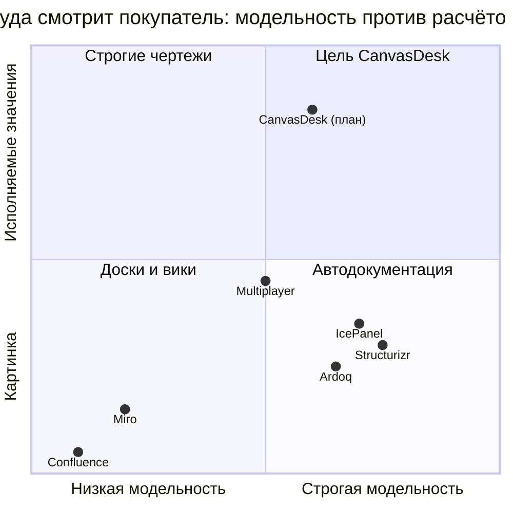

# Teardown пяти конкурентов

> Разбор «под микроскопом» пяти вендоров, с которыми CanvasDesk столкнётся
> первым. Ландшафт по категориям — в [competitive-analysis](../competitive-analysis.md);
> здесь наоборот: один продукт = один файл, максимум проверяемых фактов,
> цитат и ссылок. Даты проверки цен: сентябрь 2026. Статусы ссылок — как в
> [quotes-bank](../quotes-bank.md): ✅ прямая · 🌐 зеркало/вторичная/домен · ⚠️ сниппет.

## Критерий отбора пятёрки

1. **Пересечение с клином CanvasDesk** (структурная модель + расчёты + деньги),
   а не просто «инструмент архитектора».
2. **Есть доказанное желание платить** (публичный прайс, ARR или раунд) —
   teardown вымышленных конкурентов бесполезен.
3. **Покупатель уже смотрит на них сегодня**: если мы появимся в шорт-листе
   команды, сравнение пойдёт именно с этими пятью.

По этим трём критериям в пятёрку вошли: **IcePanel** и **Multiplayer**
(категория C — прямые соседи), **Structurizr** (интеллектуальный референс C4
и диаграмм-as-code), **Miro** (дефолтная доска, где архитекторы рисуют
сейчас), **Ardoq** (держатель enterprise-бюджета категории D).
Eraser, Uxxu, scopedocs.ai, InstantDocs, Revision, SonarSource — в watchlist.

## Файлы

| Файл | Вендор | Категория | Роль в шорт-листе покупателя |
|---|---|---|---|
| [icepanel.md](icepanel.md) | IcePanel | C. Living-docs SaaS | прямой конкурент №1, C4-стандарт |
| [multiplayer.md](multiplayer.md) | Multiplayer | C. Living-docs SaaS | ставка на auto-doc из рантайма |
| [structurizr.md](structurizr.md) | Structurizr | B. Diagram-as-code | модельность без UX, переход к vNext |
| [miro.md](miro.md) | Miro | A. Ручная доска | «как сейчас» у большинства команд |
| [ardoq.md](ardoq.md) | Ardoq | D. EA-платформа | enterprise-бюджет, mid-market обходит |

## Позиционная карта

## Сводный счёт: кто закрывает боли

Легенда: **±** частично / платно и руками · **—** нет. Обоснование каждого
балла — в файле вендора, ссылки на боли — в [pain-points](../pain-points/README.md).

| Боль | IcePanel | Multiplayer | Structurizr | Miro | Ardoq |
|---|:---:|:---:|:---:|:---:|:---:|
| 01 документация дрейфует | ± | ± | ± | — | ± |
| 02 артефакты не используют | ± | ± | — | — | ± |
| 03 ADR не читают | ± (ADR-фичи) | — | ± (ADR-рядом) | — | — |
| 04 разрыв с бизнесом | — | — | — | ± (доска видна) | ± (портфель) |
| 05 роль без власти | — | — | — | — | — |
| 06 техдолг не монетизируется | — | — | — | — | ± (реестр без ₽) |
| 07 FinOps на этапе дизайна | — | — | — | — | — |
| 08 ИИ ломает нормы | — | ± (MCP-контекст) | — | ± (AI-фичи) | — |
| 09 когнитивная перегрузка | ± | ± | — (DSL грузит) | ± | — |

**Ни один из пяти не закрывает ни одной боли полностью** — это и есть
пространство CanvasDesk (см. возможности №1–№7 в
[01-executive-summary](../01-executive-summary.md) §3).

## Сводный счёт по осям CanvasDesk

| Ось | IcePanel | Multiplayer | Structurizr | Miro | Ardoq | **CanvasDesk (план)** |
|---|:---:|:---:|:---:|:---:|:---:|:---:|
| Модель живёт сама (значения, не картинка) | — | ± | — | — | — | **да** |
| Считает нагрузку (RPS → очередь) | — | — | — | — | — | **да (queueing)** |
| Считает деньги (NPV, ₽/мес) | — | — | — | — | стат-атрибуты | **да** |
| Понятно стейкхолдеру без обучения | ± | ± | — | ± | ± | **да (шаблоны)** |
| Цена входа для команды 10 чел. | ~$400–500/мес | не публична | ~$0–лицензия | ~$80–200/мес | от ~$5K/год | TBD (см. H4) |
| Машинный контракт (MCP/агенты) | — | ± (MCP-сервер) | — | — | — | **да (MCP-first)** |

## Watchlist (мониторить ежемесячно, teardown по мере роста)

| Продукт | Ставка | Почему в списке |
|---|---|---|
| [Eraser](https://www.eraser.io/pricing) ✅ | diagram-as-code + DiagramGPT | ИИ-генерация диаграмм, Cloud Diagrams; отъедает у B-категории ([обзор 26.05.2026](https://www.reviewmytools.com) 🌐) |
| [Uxxu](https://uxxu.io) ✅ | C4 + dependency intelligence + AI | агрессивный контент-маркет против IcePanel/Structurizr |
| [scopedocs.ai](https://scopedocs.ai) ✅ | docs из pull request | та же ставка «документация сама», источник — код |
| [InstantDocs](https://instantdocs.com) ✅ | «why it was built that way» | ранний, следить за выходом из стелса |
| [Revision](https://revision.app) 🌐 | practical C4 docs | прямое сравнение с IcePanel уже публикует |
| [SonarSource](https://www.sonarsource.com) ✅ | living docs снизу от кода | дистрибуция Sonar делает ставку серьёзной |

## Как читать teardown-файлы

Единый шаблон: паспорт → позиционирование → как работает продукт → цены →
что хвалят → на что жалуются → покрытие болей → разрыв (возможность
CanvasDesk) → что мониторить → источники. Все цены — публичные данные на
сентябрь 2026, у каждого факта источник; цены без прямого прайса помечены.
Обновление: дописывать с датой, не стирать старое (принцип ADR).
