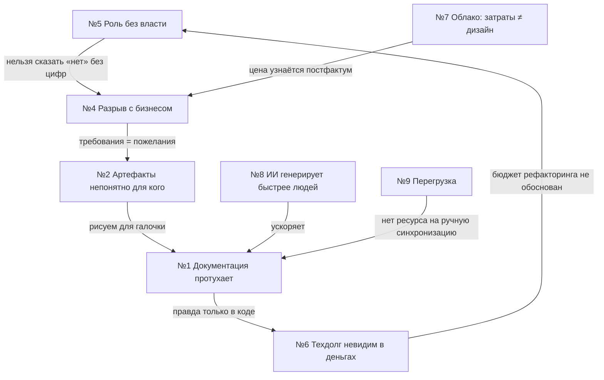

# Pain Points: сводная матрица

> Девять болей, восстановленных из публичных высказываний архитекторов
> (Habr, Telegram, Reddit, dev.to, LinkedIn, вендорские блоги). Каждая боль —
> отдельный файл: механизм, цитаты, существующие обходы, разрыв рынка,
> продуктовые гипотезы, вопросы для интервью.

## Матрица

Оценки 1–5: **Т** — тяжесть (насколько больно, когда происходит);
**Р** — распространённость (как часто встречается в популяции);
**П** — готовность платить (есть ли бюджет/процесс покупки);
**Д** — сила доказательной базы (количество и независимость источников).

| # | Боль | Т | Р | П | Д | Файл | Кого бьёт сильнее |
|---|---|:--:|:--:|:--:|:--:|---|---|
| 1 | Документация и диаграммы устаревают молча | 5 | 5 | 2 | 5 | [01](01-documentation-drift.md) | SA, TA |
| 2 | Артефакты строятся «непонятно для кого» | 4 | 5 | 2 | 4 | [02](02-diagrams-nobody-uses.md) | SA, EA |
| 3 | ADR пишут, но не читают | 3 | 4 | 2 | 3 | [03](03-adr-ignored.md) | TA, SA |
| 4 | Разрыв с бизнесом и стейкхолдерами | 5 | 4 | **4** | 4 | [04](04-business-misalignment.md) | EA, SA |
| 5 | Роль без полномочий и власти | 4 | 4 | 1 | 4 | [05](05-authority-without-power.md) | все роли |
| 6 | Техдолг: никто не считает деньги | 5 | 5 | **5** | 5 | [06](06-tech-debt-economics.md) | SA, TA |
| 7 | Облако: платит не тот, кто проектирует | 4 | 4 | **4** | 4 | [07](07-cloud-cost-finops.md) | SA, EA |
| 8 | ИИ ломает архитектурные нормы | 4 | 3 | 3 | 2 | [08](08-ai-governance.md) | TA, EA |
| 9 | Когнитивная перегрузка и карьерная лестница в тумане | 3 | 4 | 1 | 3 | [09](09-cognitive-overload.md) | переходящие в роль |

## Как читать матрицу

- **Продуктовые боли** (П ≥ 4): №4, №6, №7 — за них уже платят (EA-платформы,
  FinOps-стек, консалтинг). Сюда ведёт монетизация.
- **Эмпатийные боли** (Т=Р=5, П≤2): №1, №2 — все узнают себя мгновенно,
  хороши для контент-маркетинга и онбординга, но напрямую не продаются.
- **Системные боли** (№5, №9): боль реальна, но решается культурой/наймом,
  а не инструментом; продукт может *ослаблять симптом* (дать архитектору
  цифры → аргументы → авторитет), что и проверяем в интервью.
- **Срочные боли** (№8): окно формируется прямо сейчас — те, кто сегодня
  положит guardrails в продукт, застолбят категорию.

## Взаимосвязи болей

Практический вывод: боли образуют **цикл** (нет власти → нет алигнмента →
артефакты для галочки → документация протухает → правду знает только код →
техдолг не обоснован → власти всё меньше). Разрывать цикл проще всего в точках
№1/№6 — там работает автоматизация, а не убеждение людей. Это поддерживает
позиционирование из [executive summary](../01-executive-summary.md) §1.

## Метод оценки

Оценки выставлены комитетом по правилам из [00-methodology](../00-methodology.md)
§5–6: по частоте независимых упоминаний (Р), силе эмоций и последствиям (Т),
наличию существующих бюджетов на смежные категории (П), числу независимых
источников (Д). Оценки — гипотезы для калибровки интервью фазы 1, не выводы.
