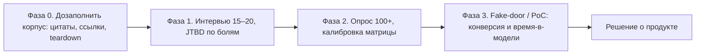

# План дальнейшего исследования

> Desk research (фаза 0) выполнена. Дальше — доказательство того, что боли
> из [матрицы](pain-points/README.md) оплачиваются. Принцип: каждая фаза
> дешёвая, быстрая и может убить гипотезу до того, как на неё потрачены
> месяцы разработки.
>
> Наложение этой программы на фреймворк [7 Fits](https://www.7-fit-framework.com/)
> (уровни доказательств по фитам, численные гейты, карта каналов):
> [02-seven-fits-mapping](02-seven-fits-mapping.md).

## 0. Лестница доказательств

Переход между фазами — только при выполнении критериев выхода (§6).

## 1. Фаза 0 — быстрые победы (1–2 недели, ~0 ₽)

| # | Задача | Результат | Где живёт |
|---|---|---|---|
| 0.1 | Восстановить все ⚠️-ссылки в [quotes-bank](quotes-bank.md) (точные фразы в site:reddit.com, Algolia HN API, lobste.rs поиск) | банк без задолженностей | quotes-bank.md |
| 0.2 | Teardown 5 конкурентов: IcePanel, Multiplayer, scopedocs.ai, InstantDocs, Uxxu — регистрации, онбординг, тарифы, ограничения | раздел в competitive-analysis.md с датой проверки | competitive-analysis.md |
| 0.3 | Три публикации-зонда (см. §3) — собирать реакции и вопросы | сырые комментарии → цитаты | research corpus |
| 0.4 | Собрать PDF-выжимку executive summary для внешних переговоров (генерация из этих md, в репо не коммитить) | файл вне репо | — |
| 0.5 | Оценить TAM/SAM/SOM RU по данным hh.ru (число вакансий архитектора, число компаний 100+ ИТ-спецов) | расчёт в research corpus | — |

## 2. Фаза 1 — глубинные интервью (недели 3–6, главный приоритет)

**Цель:** услышать боли своими ушами, проверить ранжирование матрицы и
эмоциональные триггеры (особенно «числа вместо мнений» из боли 05).

**Выборка (15–20):**
- 6 SA (3 RU, 3 global) — отрасли: e-com, финтех, enterprise-интегратор;
- 4 EA (2 RU enterprise, 2 global mid-market);
- 4 TA/техлида с арх. обязанностями;
- 2–4 «пограничных» (SA+TL, EA+SA в одном лице) — RU-специфика.

**Рекрутинг:** личные сети, чаты @it_arch/@itarchitect (правила чатов
соблюдать: сначала согласовать с модератором), r/softwarearchitecture,
покупка интервью через респондент-платформы для global.

**Скрипт (JTBD-каркас, 45–60 мин):**
1. Контекст роли и последних 2–3 проектов (без слов про продукт!).
2. Эпизод-глубинка: «расскажите про последний раз, когда вам пришлось
   доказывать/считать/объяснять архитектуру» — что делал, чем считал,
   сколько времени, что болело.
3. Обход 9 болей по крючкам из pain-points (вопросы §6 каждого файла) —
   фиксируем: спонтанно / по крючку / не узнал.
4. Текущий стек и последние траты на инструменты (свои/компании).
5. Реакция на 3-минутное демо-концепт «живая модель со счётом»
   (допустимо как макет-картинка): первый вербальный ответ + вопросы возражений.
6. Метрики эпизода: время, деньги, последствия.

**Протокол:** запись с согласия, транскрипт, теги по болям, цитата в банк
(анонимно по правилам [methodology](00-methodology.md) §7).

**Критерии выхода:** ≥14 завершённых интервью; ≥60% спонтанно назвали одну
из болей №4/№6/№7 как топ-фрустрацию; ≥5 человек сказали «покажите как можно
раньше» про демо-концепт.

## 3. Публикации-зонды (параллельно с фазой 1)

| Публикация | Канал | Что меряем |
|---|---|---|
| «Диаграмма, которая считает счёт: исполняемая модель архитектуры» (тех-статья с расчётным кейсом) | Habr | плюсы/склады, вопросы, подписки, CTR в комменте-ссылку |
| Пост-опрос «что из этого болит сильнее всего?» (9 болей) | @it_arch и смежные чаты (с разрешения модераторов) | распределение голосов = бесплатная мини-калибровка матрицы |
| Show-post «executable architecture model» | r/softwarearchitecture / dev.to | вовлечение, возражения global-аудитории |

Этика зонда: честный research-пост (мы изучаем проблему), не скрытая реклама.

## 4. Фаза 2 — количественный опрос (недели 7–10)

- N ≥ 100 архитекторов/техлидов (RU 60/40 global), распространение через
  публикации-зонды + платные панели.
- Блоки: калибровка матрицы (тяжесть/частота), готовность платить (Ван
  Вестендорп-лайт: дешево/дорого/очень дорого для $/₽-тарифов), текущий стек,
  кто принимает решение о покупке.
- Результат: обновлённая матрица болей с доверительными интервалами;
  ценовые зоны; сегментация ICP.

## 5. Фаза 3 — fake-door и PoC (недели 11–16)

- **Fake-door лендинг** «живая модель архитектуры: нагрузка + счёт в ₽/$» —
  трафик из зонда; метрики: CTR ≥ 8% на «попробовать», email-конверсия ≥ 25%
  от кликнувших.
- **Wizard-of-Oz PoC** для 5–8 записавшихся: собираем модель их системы
  руками (на движке CanvasDesk) → замеряем: время до первой полезной цифры,
  спросили ли what-if, вернулись ли.
- **Kill/Go:** см. §6.

## 6. Реестр гипотез и kill-критерии

| ID | Гипотеза | Проверка | Kill-критерий (когда говорим СТОП идее) |
|---|---|---|---|
| H1 | Архитекторы спонтанно называют деньги/алигнмент (№4/6/7) топ-болью | интервью фазы 1 | <30% спонтанных упоминаний → пересмотр позиционирования, не продукта |
| H2 | «Числа вместо мнений» — эмоциональный триггер (боль 05) | интервью, вопрос §6.4 боли 05 | нулевой отклик у 10+ респондентов |
| H3 | Демо «счёт из модели» вызывает «wow» и просьбу доступа | фазы 1/3 | <20% просят доступ после демо |
| H4 | Готовность платить $20–40/editor/мес (RU: 1–3K ₽) | опрос фазы 2 | медиана «слишком дорого» < $10 |
| H5 | Модель поддерживают (не бросают) — ретеншн через инварианты | PoC фазы 3 | >60% не возвращаются после первой сессии |
| H6 | EA mid-market возьмёт «портфельную версию» поверх командной | 3 EA-интервью + фаза 2 | EA-сегмент не отвечает за инструментальные бюджеты |
| H7 | RU-ниша governance открыта (уход западных EA-платформ) | 0.5 + фаза 2 RU-блок | RU-предприятия уже закрыли потребность self-made |
| H8 | ИИ-агентам нужен машинно-читаемый контракт архитектуры | эксперт-интервью 3× + MCP-сообщество | интеграция MCP не даёт роста вовлечённости в PoC |

**STOP-условия всей программы:** (а) H1 и H3 провалены одновременно;
(б) фаза 2 показывает ценовую зону < $5/editor; (в) конкурент из категории C
выкатил исполняемый расчётный слой до нашей фазы 3 → тогда переключиться на
позиционирование «RU-рынок + деньги» или интеграционную стратегию.

## 7. Источники для расширения цитатной базы

- Reddit: r/softwarearchitecture, r/EnterpriseArchitect, r/ExperiencedDevs
  (поиск через old.reddit + Algolia);
- Hacker News (Algolia API: architecture documentation, tech debt, C4);
- InfoQ, Architecture Weekly (О'Рейлли) — дайджесты практик;
- Telegram: полнотекстовая выгрузка @it_arch/@itarchitect (квоты на бумагу
  — сообщество добровольно делится «болями недели»);
- Конференции: ArchDays (RU), O'Reilly SA Conf, Gartner EA Summit —
  программы докладов = список актуальных тем боли;
- Вендорские annual surveys: DORA, Stack Overflow, CNCF, FinOps State Of.

## 8. Метрики программы исследования

- Заполненность банка цитат: 0 ⚠️-ссылок к концу фазы 0;
- ≥14 транскриптов интервью с тегами болей к концу фазы 1;
- Ответы опроса ≥100 к концу фазы 2;
- Решение Go/No-Go по каждому H1–H8 зафиксировано в этой папке коммитом
  (датированная правка, старый вывод не удаляется).

## 9. Бюджет и сроки (сводка)

| Фаза | Сроки | Бюджет | Ключевой артефакт |
|---|---|---|---|
| 0 | 1–2 нед | ~0 ₽ | чистый банк цитат, teardown, зонды запущены |
| 1 | 3–6 нед | 30–80K ₽ (рекрутинг/стимулы) | отчёт по интервью, ранжирование болей |
| 2 | 7–10 нед | 50–150K ₽ (панели) | калиброванная матрица, ценовые зоны |
| 3 | 11–16 нед | 20–50K ₽ | конверсии fake-door, PoC-метрики |
| Итого | ~4 мес | 100–280K ₽ | решение о полноценном продуктовом цикле |

Сравнение: даже нижняя граница бюджета меньше одной зарплаты SA-мес в RU
(медиана 465K ₽/мес) — цена ошибки исправима, цена непроверенной разработки
— нет.
