# PRD-0003: Всеядный импорт машиночитаемых описаний архитектуры — от UML и draw.io до terraform/ansible

- **Статус:** в работе (FR-043 создан, статус FR — «в анализе»)
- **Тип:** PRD (документ требований продукта; реализация оформляется отдельным `FR-043` по шаблону `docs/change-requests/cr-template.md`; структура — единый шаблон `docs/prd/TEMPLATE.md`)
- **Приоритет:** важно
- **Владелец:** агент (оформление по запросу владельца, сессия 2026-09-20)
- **Источник:** запрос владельца от 2026-09-20 — «сделать сервис всеядным в плане импорта машиночитаемых описаний архитектуры, чтоб можно было в него закинуть любое описание от uml и drawio до конфиг-файлов terraform/ansible»
- **Связанные документы:** PRD-0001 (данные → вводные), PRD-0002 (LOD для плотных графов), ADR-0007 (позиционирование), ADR-0008 (зависимости), ADR-0011 (wasm-гейт), FR-032 (`graph_validate`, коды E-*/W-*), FR-033 (`graph_apply` — батч-мутации графа), FR-011/FR-012 (группы/mindmap), FR-010 (автораскладка), SPEC §5.1/§6.3/§8
- **Создан:** 2026-09-20
- **Обновлён:** 2026-09-20

---

## 1. Резюме

Описание архитектуры у команды почти всегда уже существует — просто не в CanvasDesk: draw.io-диаграмма в вики, mermaid в README, terraform в репозитории, docker-compose на сервере, ansible-инвентарь у эксплуатации. Сегодня CanvasDesk понимает только родной `.canvas` (JSON Canvas 1.0): чужой файл, брошенный на канвас, становится файловой нодой без структуры, и архитектуру приходится перерисовывать руками нода за нодой.

Этот PRD описывает **PoC всеядного импорта**: пользователь бросает на канвас файл поддержанного формата (или вставляет текст диаграммы) — продукт распознаёт формат, строит структурный граф (ноды, связи, группы), показывает превью с предупреждениями и после подтверждения раскладывает архитектуру на канвасе. Импортированная топология — «носитель»: на неё навешиваются расчётные шаблоны и value-рёбра, и архитектура становится исполняемой мат.моделью (шаг к связке с PRD-0001 — реальные вводные, и PRD-0002 — читаемость плотных графов).

Ядро решения — унифицированное промежуточное представление (IR) и детерминированные pure-Rust парсеры в `canvas-core`: это сохраняет wasm-гейт (импорт работает и в web-версии), тестируемость (golden-фикстуры) и соответствует правилу «импорт = батч детерминированных мутаций графа» (по духу — контракт `graph_apply`, FR-033).

---

## 2. Контекст и проблема

### 2.1 Как это выглядит сегодня

- Родной формат — `.canvas` (JSON Canvas 1.0): `Canvas { nodes: Vec<Node>, edges: Vec<Edge> }` (`crates/canvas-core/src/model.rs:678`, `Node` — `model.rs:171`, `Edge` — `model.rs:416`); round-trip неизвестных полей через `extra` (`crates/canvas-core/src/io.rs`) — Obsidian-совместимость.
- Drag-drop чужих файлов создаёт файловые ноды с превью (нативно — `crates/canvas-shell/src/dragdrop/`, web — `crates/canvas-web/src/drop_files.rs`, лимит `MAX_DROP_FILE_BYTES = 64 МБ`); **структура из файла не извлекается**.
- Графовый слой зрелый и готов принимать внешние структуры: валидация с кодами E-*/W-* из чистой функции ядра (`crates/canvas-core/src/validate.rs`, FR-032), батч-мутации через MCP `graph_apply` (FR-033), автораскладка (`crates/canvas-core/src/layout.rs`, FR-010), группы — ноды `type: "group"` + `children` (FR-011/FR-012, `model.rs`).
- ИИ-агент строит модели через MCP (`crates/canvas-scene/src/mcp.rs`) — программная поверхность мутаций графа уже есть.

### 2.2 Чего не хватает

- Нет ни одного парсера сторонних форматов (grep `mermaid|plantuml|drawio|hcl|terraform` по коду — ноль вхождений).
- Нет промежуточного представления (IR) «структура архитектуры → граф канваса» и конвертера IR → `Canvas` с маппингом id, групп и координат.
- Нет UI-контракта импорта: распознавание формата, превью-отчёт (что понял / что потерял), опции размещения (координаты vs автолейаут), происхождение (откуда импортировано).
- Нет политики безопасности входных файлов: лимиты, XML-сущности, внешние инклюды.

### 2.3 Зацепки в коде и документации

- `validate.rs` (FR-032) даёт готовый формат отчёта E-*/W-* — превью импорта может переиспользовать его семантику.
- `graph_apply` (FR-033) доказывает, что батч-мутации графа детерминированно применяются с проверкой; импорт — тот же контракт, только источник — парсер, а не агент.
- `layout.rs` (FR-010) закрывает случай «в формате нет координат».
- `canvasdesk.*`-расширения в `extra` (прецеденты `canvasdesk.flow.kind`, `canvasdesk.pin_ports`) — место для метаданных происхождения.
- Шаблоны расчётных нод (`assets/templates/com.canvasdesk.db-sql-master`, `queue-kafka`, …) — целевой слой «дооснащения» импортированной архитектуры.

---

## 3. Цели и метрики успеха

| # | Цель | Метрика |
|---|---|---|
| G1 | Быстрый импорт | Граф ≤ 100 нод из файла готов на канвасе ≤ 10 с от drag-drop (парсинг + конвертация + раскладка) |
| G2 | Полнота маппинга | На golden-фикстурах ≥ 95% структурных элементов поддержанного подмножества маппится без предупреждений |
| G3 | Без «тихих» потерь | Превью всегда показывает счётчики (ноды/связи/группы) и полный список предупреждений W-* до вставки; нераспознанное — видно до подтверждения |
| G4 | Web-паритет | wasm-гейт `scripts/wasm_gate.sh` зелёный: импорт работает и в web-сборке (pure-Rust парсеры) |
| G5 | Не просадить канвас | После импорта 500 нод — 60 fps на пан/зум (SPEC §6.3); автолейаут ≤ 2 с |

---

## 4. Пользователи и сценарии

**Персона 1 — архитектор/техлид (основная).** Имеет draw.io-диаграмму системы и UML-описание; хочет прикинуть числовые характеристики (пропускную способность, узкие места) до релиза — накинуть расчётные шаблоны на существующую топологию, а не рисовать её заново.

**Персона 2 — SRE/DevOps.** Живёт в terraform/ansible/compose: инфраструктура уже описана кодом; хочет перенести её в CanvasDesk и моделировать отказы, очереди и ёмкости.

**Персона 3 — аналитик/пресейл.** Собирает схемы из mermaid-блоков в README и конфлюэнс-доках; хочет быстро получить презентуемый канвас и посчитать эффект от изменения архитектуры.

**Персона 4 — ИИ-агент (MCP).** Точка роста: программный импорт (`graph_import`) как источник топологии для агентной сборки моделей (CR-013) — вне PoC, см. §10.

---

## 5. User stories и критерии приёмки

### US-1. Импортировать draw.io-диаграмму

> **Как** архитектор, **я хочу** перетащить `.drawio` на канвас и получить ноды, связи и группы, **чтобы** не перерисовывать систему руками.

**Acceptance criteria:**
- AC-1.1: drag-drop файла `.drawio`/`.xml` (mxfile, сжатый и несжатый) открывает превью импорта; после подтверждения создаются ноды из вершин (`mxCell vertex`), связи из рёбер (`mxCell edge`), контейнеры (`container=1`/swimlane) — группы.
- AC-1.2: координаты из `geometry` сохраняются в world-пространстве канваса; цвет заливки (`fillColor`) переносится в цвет ноды.
- AC-1.3: несколько страниц (mxfile с `diagram`) — превью предлагает страницу или импорт всех страниц как отдельных групп.

### US-2. Импортировать текстовую диаграмму (mermaid/plantuml/DOT)

> **Как** аналитик, **я хочу** вставить mermaid-блок из README (или PlantUML/DOT-файл) и получить граф, **чтобы** превратить текстовую архитектуру в живой канвас.

**Acceptance criteria:**
- AC-2.1: вставка текста (Ctrl+V) с распознаванием `@startuml`/`flowchart`/`digraph` открывает превью; файлы `.mmd`/`.puml`/`.dot` — drag-drop.
- AC-2.2: mermaid `flowchart`: узлы с метками, `A -->|label| B` — связи с лейблами; `subgraph` — группа.
- AC-2.3: PlantUML (component/deployment подмножество): `component/actor/database/queue/node` — ноды с иконками по типу, `-->`/`..>` — сплошные/пунктирные связи, `package/rectangle` — группы; `!include` не разворачивается — предупреждение W.
- AC-2.4: Graphviz DOT: `digraph`, атрибуты `label/color/style`, `subgraph cluster_*` — группы; атрибут `pos` (при наличии) — координаты.

### US-3. Импортировать docker-compose

> **Как** SRE, **я хочу** бросить `docker-compose.yml` и получить сервисный граф, **чтобы** моделировать зависимости контейнеров.

**Acceptance criteria:**
- AC-3.1: `services` → ноды (лейбл = имя сервиса, image — в теле/метаданных); `depends_on`/`links` → связи; `networks` → группы (при неоднозначности — W).
- AC-3.2: profiles/volumes/healthcheck — не маппятся, фиксируются в W-отчёте.

### US-4. Импортировать terraform-конфигурацию

> **Как** SRE, **я хочу** указать `.tf`-файлы репозитория и получить инфраструктурный граф с зависимостями, **чтобы** считать ёмкости и отказные сценарии на реальной инфраструктуре.

**Acceptance criteria:**
- AC-4.1: `resource`-блоки → ноды (тип и имя — в лейбле; вид ноды по словарю provider/типа); `depends_on` и ссылки вида `aws_lb.front.dns_name` → связи.
- AC-4.2: `module`-блоки (1 уровень вложенности из репозитория) → группы с внутренними нодами.
- AC-4.3: `count`/`for_each` — нода-одиночка с пометкой множественности; `variables/outputs/locals` — не маппятся, W-отчёт; HCL-выражения в атрибутах — как непрозрачные строки (не вычисляются).

### US-5. Импортировать ansible-инвентарь и playbook

> **Как** SRE, **я хочу** импортировать inventory (группы хостов) и playbooks, **чтобы** видеть топологию управления конфигурацией.

**Acceptance criteria:**
- AC-5.1: inventory (INI и YAML): группы → группы канваса, хосты → ноды; вложенные группы (`children`) — иерархия групп.
- AC-5.2: playbook: `hosts: <pattern>` → связь «роль/плей → группа-цель»; `vars/handlers` — W.

### US-6. Увидеть, что понял импорт, до вставки

> **Как** любая персона, **я хочу** превью с счётчиками и предупреждениями и опциями (новый канвас/мерж, координаты/автолейаут), **чтобы** не портить канвас «кашей».

**Acceptance criteria:**
- AC-6.1: превью показывает: формат, счётчики нод/связей/групп, список предупреждений W-* (с пагинацией), опции размещения.
- AC-6.2: отмена превью не меняет канвас; подтверждение — один undo-шаг (FR-006) при мерже.
- AC-6.3: нераспознанный файл — внятная диагностика: причина + список поддержанных форматов + лимиты.

### US-7. Дооснастить импортированную архитектуру расчётом

> **Как** архитектор, **я хочу** на импортированные ноды навесить расчётные шаблоны и value-рёбра, **чтобы** получить исполняемую модель.

**Acceptance criteria:**
- AC-7.1: импортированные ноды — обычные ноды канваса: к ним применимы шаблоны, value-связи, группы и все существующие жесты.
- AC-7.2: у ноды есть след происхождения (формат + файл + время) в тултипе/метаданных.

---

## 6. CJM (Customer Journey Map)

Персона CJM — **архитектор/техлид** (§4, Персона 1); канал — desktop (web-паритет по G4). CJM зафиксирован для PoC-границы и пересматривается после первых юзабилити-прогонов (§13, I5).

### 6.1 Краткий CJM (шаги)

| # | Этап | Действие пользователя | Поверхность |
|---|---|---|---|
| 1 | Исходная задача | Получил описание архитектуры (draw.io в вики, .tf в репо) и вопрос «а потянет ли» | вне продукта |
| 2 | Импорт | Перетаскивает файл (или вставляет текст диаграммы) | drag-drop / диалог импорта |
| 3 | Превью | Проверяет отчёт: ноды/связи/группы, предупреждения W-* | диалог-превью |
| 4 | Размещение | Подтверждает → координаты из файла или автолейаут | канвас |
| 5 | Дооснащение | Навешивает расчётные шаблоны и value-рёбра | канвас |
| 6 | Моделирование | Считает сценарий на реальной топологии | канвас |

### 6.2 Детальный CJM (мысли, эмоции, боли, точки отвала)

Шкала эмоций: от −2 (резко негативные) до +2 (восторг).

| Этап | Действия | Мысли | Эмоции | Боли | Точка отвала (условие → реакция) | Возможности |
|---|---|---|---|---|---|---|
| 1. Исходная задача | Читает репозиторий/диаграмму, формулирует вопрос к модели | «Диаграммы есть — чисел нет» | скепсис (−1) | Описание живёт в трёх местах: код, диаграмма, голова | D1: «проще в экселе посчитать» → не открывает продукт → митигация: G1 (импорт ≤ 10 с), zero-config | Ассоциации файлов ОС с продуктом |
| 2. Импорт | Drag-drop файла; вставка текста | «Работать должно из коробки» | ожидание (0) | Неизвестно, какие форматы поддержаны | D2: файл не распознан без внятной ошибки → пробует второй файл и уходит → митигация: F-15 (диагностика: причина + список форматов) | Автоопределение формата по содержимому (F-2) |
| 3. Превью | Читает отчёт, снимает галочки с мусорных групп | «Что оно поняло из моего файла?» | настороженность (−1) при куче W | Предупреждений много, формулировки туманны | D3: 200 нод без групп «кашей» → отменяет импорт → митигация: F-13 (группы из контейнеров/subgraph) + F-12 (счётчики и W-отчёт до вставки) | Вкл/выкл групп в превью (v2) |
| 4. Размещение | Подтверждает, осматривает результат | «Похоже на мою архитектуру» | облегчение (+1) | Ручная раскладка сотни нод невозможна | D4: хаос из-за отсутствия координат → полчаса правит руками → митигация: F-13 (координаты draw.io/DOT сохраняются, иначе автолейаут) | Выбор алгоритма раскладки (v2) |
| 5. Дооснащение | Навешивает шаблоны, value-рёбра | «Для этой kafka-ноды — готовый шаблон очереди» | вовлечённость (+2) | Каждую ноду надо осмыслить заново | D5: нода «обезличена» при маппинге → недоверие к графу → митигация: F-14 (origin-метаданные, тултип с исходником) | Подсказки шаблонов по эвристикам (F-17) |
| 6. Моделирование | Строит расчёт, крутит what-if | «Модель на реальной архитектуре, а не на выдумке» | уверенность (+2) | — | D6: импортированный граф устарел относительно репозитория → решения по стухшей схеме → митигация: F-14 (origin + timestamp), реимпорт | Реимпорт с диффом (v2) |

### 6.3 Трассировка точек отвала

Каждая точка отвала CJM обязана иметь митигацию в требованиях (§8) или рисках (§12): D1 → G1; D2 → F-15; D3 → F-12/F-13; D4 → F-13; D5 → F-14 (+F-17 как усилитель); D6 → F-14 + §11-Q8. Скоуп-крип «форматного зоопарка» — в §12 (первая строка).

---

## 7. Решение

### 7.1 Концептуальная схема

```mermaid
flowchart LR
    subgraph IN ["Входные форматы"]
        DIO["draw.io (mxGraph XML)"]
        UML["UML XMI 2.x (should)"]
        MM["Mermaid (flowchart)"]
        PU["PlantUML (component/deployment)"]
        DOT["Graphviz DOT"]
        CMP["Docker Compose (YAML)"]
        TF["Terraform (.tf, HCL)"]
        ANS["Ansible (inventory + playbook)"]
    end
    subgraph CORE ["canvas-core (pure Rust, wasm-safe)"]
        P["Парсеры import/*<br/>(quick-xml, serde_yaml, hcl-rs)"]
        IR["Унифицированная IR<br/>ImportGraph {nodes, edges, groups, warnings}"]
        C["Конвертер IR → Canvas<br/>id-маппинг, группы, координаты/автолейаут"]
        V["validate.rs: E-*/W-* (FR-032)"]
    end
    subgraph APP ["Приложение"]
        UI["Диалог-превью:<br/>счётчики + W-отчёт + опции"]
        CN["Канвас: новый / мерж в текущий (undo-шаг)"]
        T["Подсказки шаблонов (could):<br/>kafka → queue-kafka, sql → db-sql-master"]
    end
    IN --> P --> IR --> C --> V --> UI --> CN
    T -.-> CN
```

### 7.2 Точка интеграции в архитектуре

| Элемент | Решение |
|---|---|
| IR | `canvas-core/src/import/` — платформенно-нейтральный модуль: `ImportGraph { nodes, edges, groups, warnings }`, узел — `{source_id, label, kind_hint, pos?, size?, color?, group?}`; детерминированные чистые функции |
| Парсеры | Соседние модули `import/mermaid.rs`, `import/plantuml.rs`, `import/dot.rs`, `import/drawio.rs`, `import/compose.rs`, `import/terraform.rs`, `import/ansible.rs`; зависимости — pure Rust (quick-xml, serde_yaml, hcl-rs, flate2+base64 для сжатых mxfile) — allowlist ADR-0008, wasm-безопасны |
| Конвертер | IR → `Canvas` (`model.rs`): маппинг id с префиксом (по образцу `next_edge_id`, `model.rs:732`), типы нод (включая `type: "group"`), связи с `label`/`edgeStyle`; валидация через `validate.rs` (FR-032) до применения |
| Раскладка | Координаты формата (draw.io `geometry`, DOT `pos`) — сохраняются; иначе автораскладка `layout.rs` (FR-010); группы — bbox/`children` (FR-011/FR-012) |
| Происхождение | `canvasdesk.import` = `{format, source, ts}` в `Canvas.extra` (+ на нодах) — round-trip через `extra` (`io.rs`), Obsidian не страдает |
| UI | Drag-drop расширение + пункт «Импорт…» + вставка текста; превью — оверлей по образцу `dialog`/`docs_ui.rs` (screen-space квады `FrameOverlay`, `renderer.rs:134`); подтверждение — мутация `SceneState` + undo-шаг (FR-006) при мерже |
| Трассировка форматов | Словарь маппинга «тип источника → вид ноды/иконка/цвет» — приложение к FR-043; редактируется без изменения парсеров |

### 7.3 Отвергнутые варианты

| Вариант | Вердикт | Причина |
|---|---|---|
| Парсинг в JS-виджете (WebView2) | Отложено | Web-виджеты — плейсхолдеры (`canvas-web/src/widgets_web.rs`); парсинг в Rust-ядре даёт golden-тесты, wasm-паритет и переиспользование в MCP |
| LLM-парсер «пойми любой файл» | Отвергнуто | Недетерминизм ломает golden-гейты и воспроизводимость (ADR-0008: CPU-детерминизм эталонов); детерминированные парсеры обязательны |
| Внешние CLI-конвертеры (plantuml.jar, `dot`, `tflint`) | Отвергнуто | Java/Graphviz — тяжёлые внешние зависимости: ломают single-exe (FR-008) и правило «без нативных C-зависимостей» (ADR-0008) |

---

## 8. Функциональные требования

| ID | Требование | Приоритет | Приёмка |
|---|---|---|---|
| F-1 | IR + конвертер IR → Canvas: id-маппинг, группы, детерминизм | must | US-6 AC-6.2 |
| F-2 | Автоопределение формата по содержимому (не по расширению) | must | US-2 AC-2.1 |
| F-3 | Mermaid: flowchart-подмножество (узлы/метки/лейблы связей/subgraph) | must | US-2 AC-2.2 |
| F-4 | PlantUML: component/deployment-подмножество | must | US-2 AC-2.3 |
| F-5 | Graphviz DOT: digraph, атрибуты, cluster | must | US-2 AC-2.4 |
| F-6 | draw.io: mxfile (сжатый/несжатый), geometry, контейнеры/страницы | must | US-1 AC-1.1–1.3 |
| F-7 | Docker Compose: services, depends_on/links, networks | must | US-3 AC |
| F-8 | Terraform: resources, modules (1 уровень), depends_on/ссылки; выражения — opaque | must | US-4 AC |
| F-9 | Ansible: inventory (INI/YAML) группы/хосты; plays → связи | must | US-5 AC |
| F-10 | UML XMI 2.x: классы/компоненты, ассоциации/зависимости, пакеты | should | §11-Q4 |
| F-11 | Kubernetes: Deploy/Service/Ingress/ConfigMap, namespace → группа | should | §11-Q5 |
| F-12 | Диалог-превью: счётчики, W-отчёт, опции (новый/мерж, координаты/автолейаут, группы) | must | US-6 AC |
| F-13 | Координаты формата сохраняются, иначе автолейаут; контейнеры/subgraph → группы | must | US-1 AC-1.2, US-6 |
| F-14 | Origin-метаданные `canvasdesk.import` в `extra`, round-trip без потерь | must | US-7 AC-7.2 |
| F-15 | Диагностика ошибок: причина + список поддержанных форматов + лимиты | must | US-6 AC-6.3 |
| F-16 | Мерж в текущий канвас: префиксация id, один undo-шаг | should | US-6 AC-6.2 |
| F-17 | Подсказки расчётных шаблонов по эвристикам типов | could | §11-Q6 |
| F-18 | Вставка текстом (Ctrl+V) mermaid/plantuml из буфера | should | US-2 AC-2.1 |

---

## 9. Нефункциональные требования

1. **Архитектура/wasm.** Всё в `canvas-core/src/import/` — pure Rust, платформенно-нейтрально; зависимости (quick-xml, serde_yaml, hcl-rs, flate2, base64) — MIT/Apache (allowlist ADR-0008), без нативного C; wasm-гейт `scripts/wasm_gate.sh` зелёный (ADR-0011) — импорт работает и в web-сборке (G4).
2. **Производительность.** Парсинг файлов > 1 МБ — в worker-потоке (правило 4 «Правил архитектуры»); бюджеты G1/G5; рендер-поток не блокируется.
3. **Формат.** `.canvas` не получает новых обязательных полей; только `canvasdesk.import` в `extra`; round-trip Obsidian сохраняется (`io.rs`-тесты).
4. **Безопасность.** Лимиты: текст ≤ 5 МБ, ≤ 2000 импортируемых нод (уточнить — §11-Q2); XML — без резолвинга внешних DTD-сущностей, ограничение глубины; PlantUML `!include`/`!includeurl` — не разворачиваются; deflate-«зип-бомбы» — ограничение коэффициента распаковки; **импорт не исполняет** terraform/ansible — только структурный парсинг деклараций; никаких сетевых вызовов (AGENTS.md).
5. **Детерминизм.** Стабильная сортировка входов и id-маппинг; одинаковый файл → одинаковый канвас; golden-тесты обязательны для каждого парсера.
6. **TDD/a11y.** Тесты до реализации (AGENTS.md); контраст текстов превью — CR-007; клавиатурная навигация превью не хуже `dialog`.

---

## 10. Non-goals

- **Не экспорт обратно.** Канвас → draw.io/mermaid/terraform — вне PoC (обратимость — отдельное решение, §11-Q5).
- **Не пиксельный рендер исходников.** Импортируем структуру (ноды/связи/группы), а не картинку диаграммы; стили переносятся ограниченно (цвет/заливка).
- **Не исполнение IaC.** Никакого `terraform plan/apply`, `ansible-playbook`, docker-подключений: только парсинг деклараций как источника структуры.
- **Не облачные коннекторы.** Lucidchart/Miro/diagrams.net по API — вне PoC; только локальные файлы/вставка текста.
- **Не Visio (.vsdx) и не sequence/gantt/class-диаграммы mermaid** — только структурные графы (flowchart-подобные); .vsdx — кандидат v2.
- **Не автоподстановка математики.** Расчётные шаблоны и value-рёбра пользователь навешивает сам; эвристические подсказки — could (F-17).
- **Не гарантия семантической эквивалентности.** Импорт — структурный best-effort с явными W-предупреждениями о том, что не смаппилось.
- **Не tfstate/live-инфраструктура.** Фактическое состояние облака (мост к реальным вводным PRD-0001) — §11-Q8.

---

## 11. Открытые вопросы

- **Q1.** Приоритет внутри must-набора диаграмм: mermaid → DOT → PlantUML → draw.io (от простого к сложному) — согласовать порядок I2 с владельцем.
- **Q2.** Лимиты PoC: 5 МБ текстовых форматов / 2000 нод — достаточны? Влияет на F-15 и на D3/D4 в CJM.
- **Q3.** draw.io: swimlane/pool маппить в группу или ноду? Страницы mxfile — отдельные канвасы или группы одного?
- **Q4.** UML XMI: какие инструменты-продюсеры поддерживать в should-волне (Enterprise Architect, Eclipse EMF)? Влияет на фикстуры F-10.
- **Q5.** Kubernetes в should-волне: достаточно ли статических манифестов, или ждать Helm-шаблоны (это уже рендеринг — другой класс задачи)?
- **Q6.** Подсказки шаблонов (F-17): в PoC или v2? Если в PoC — нужен ли словник эвристик в FR-043?
- **Q7.** Кодировки: ограничиться UTF-8 или добавить windows-1251 для старых draw.io/инвентарей?
- **Q8.** `.tfstate` как источник фактической инфраструктуры (реальные размеры инстансов → вводные PRD-0001): зафиксировать как v2-идею в роадмапе?

---

## 12. Риски и митигации

| Риск | Влияние | Митигация |
|---|---|---|
| Форматный зоопарк: скоуп-крип, «вечный полумесяц» парсеров | Сроки/качество | IR — единственный контракт; ранжирование must/should/could; правило «парсер без golden-фикстур не принимается»; форматы outside — через non-goals |
| Зрелость `hcl-rs`: полный HCL (for/динамика) сложен | I3 | Ограниченное подмножество (блоки/атрибуты/depends_on/ссылки), выражения — opaque-строки с W; план B — собственный парсер заголовков блоков |
| draw.io: сжатые mxfile, многостраничники, вложенные группы | F-6 | flate2+base64; фикстуры из реальных экспортов; политика страниц/слоёв — §11-Q3 |
| Потеря семантики при маппинге | Доверие (D5) | F-14 origin-метаданные + W-отчёт + превью до вставки (G3) |
| Большие графы (300+ нод) | Перф/UX (D3/D4) | Лимиты §11-Q2, автолейаут-бюджет G5, пагинация W-отчёта; сочетание с PRD-0002 (агрегация связей) для читаемости |
| XML-атаки (entity expansion), deflate-бомбы | Безопасность | Лимиты размера/глубины/коэффициента распаковки; quick-xml без DTD-резолвинга; тесты на зловредные фикстуры |
| Дубли id/имён при мерже в текущий канвас | Целостность | F-16: префиксация импортированных id; превью-дифф перед подтверждением |

---

## 13. Дорожная карта

| Этап | Содержание | Результат |
|---|---|---|
| I0 | FR-043 по шаблону `cr-template.md` + обоснование зависимостей (`DEPENDENCIES.md`); фиксация решений Q1–Q3 | Разрешение на реализацию |
| I1 | IR + конвертер + подключение `validate.rs` + инфраструктура golden-фикстур | Чистый контракт |
| I2 | Диаграммы в порядке Q1: mermaid → DOT → PlantUML → draw.io | Импорт диаграмм (US-1, US-2) |
| I3 | IaC: compose → terraform → ansible | Импорт конфигов (US-3–US-5) |
| I4 | UI: диалог-превью, drag-drop расширение, вставка текста, автолейаут, origin-метаданные, мерж (should) | Замкнутый цикл US-1…US-6 |
| I5 | Доки (SPEC, `node.md`, user-docs, ACCEPTANCE), юзабилити-прогон CJM, stress-замер G5 | PoC-приёмка |

---

## 14. Точки входа в документацию (обязательные обновления при реализации)

- `docs/change-requests/fr-043-universal-architecture-import.md` — реализационный FR (создаётся на I0).
- `docs/SPEC.md` — §3 (зависимости pure-Rust), §5 (модель: `canvasdesk.import`), §8 (ввод: вставка текста, расширения drag-drop).
- `docs/interface-objects/node.md` — происхождение импортированных нод, группы (FR-011/FR-012).
- `docs/DEPENDENCIES.md` — обоснование quick-xml/serde_yaml/hcl-rs/flate2/base64.
- `user-docs/` — страница «Импорт» (+ синк `user-docs/README.md`, `index.md`; относительные `*.html`-ссылки, чек линков в тестах `docs_ui`).
- `docs/ACCEPTANCE.md` — приёмочный чек-лист PoC.
- `docs/prd/README.md` — индекс каталога PRD (статус, ссылка).
- `docs/index.md` — ссылка на этот PRD (раздел «PRD — требования продукта»).

---

## 15. Проверка (Definition of Done PoC)

- [ ] Golden-фикстуры: по каждому must-формату ≥ 2 (минимальный + реальный), тесты парсеров и конвертера зелёные.
- [ ] Демо: draw.io на 30 нод → канвас ≤ 10 с; terraform-пример (50 ресурсов) → граф с зависимостями; mermaid-текст из README → граф вставкой.
- [ ] G1–G5 воспроизведены (G5 — замер `--stress`).
- [ ] `cargo test --workspace`, clippy, fmt — зелёные; `scripts/wasm_gate.sh` — зелёный (G4).
- [ ] Round-trip `.canvas` с `canvasdesk.import` — без потерь (`json_canvas_io.rs`).
- [ ] Превью: ни одна вставка не происходит без показанных счётчиков и W-отчёта (G3).
- [ ] Обновлены все точки входа §14.

---

## 16. История изменений

- `2026-09-20` (2) — агент: этап **I0 выполнен** — создан реализационный FR-043 (`docs/change-requests/fr-043-universal-architecture-import.md`) по шаблону `cr-template.md`: скоуп PoC перенесён (US-1…US-7, F-1–F-18), зафиксированы решения Q1 (порядок форматов mermaid → DOT → PlantUML → draw.io), Q2 (лимиты 5 МБ / 2000 нод), Q3 (swimlane → группа; страницы mxfile — выбор в превью) и Q6 (F-17 — вне PoC); план I1–I5, зависимости с замечанием по `serde_yaml` (архивирован), DoD. Статус PRD → «в работе (FR-043 создан)»; индекс `index-cr-fr.md` актуализирован, указатель «следующий номер FR» → FR-044.
- `2026-09-20` — агент: создан документ (PRD-0003), статус `в анализе`; анализ кодовой базы (графовый слой готов: model/validate/layout/graph_apply; парсеров и IR нет), решение (IR + pure-Rust парсеры в canvas-core), требования F-1–F-18, CJM с трассировкой точек отвала, non-goals, риски, дорожная карта I0–I5.

## 17. Источники истины

- Запрос владельца (сессия 2026-09-20) — исходная постановка.
- `crates/canvas-core/src/model.rs` (`Canvas` — 678, `Node` — 171, `Edge` — 416, `next_edge_id` — 732), `crates/canvas-core/src/io.rs` (round-trip `extra`), `crates/canvas-core/src/validate.rs` (E-*/W-*, FR-032), `crates/canvas-core/src/layout.rs` (автораскладка, FR-010), `crates/canvas-core/src/dragdrop.rs`, `crates/canvas-web/src/drop_files.rs` (`MAX_DROP_FILE_BYTES`), `crates/canvas-shell/src/dragdrop/`.
- `docs/change-requests/fr-032-graph-read-validate.md`, `docs/change-requests/fr-033-graph-apply-batch.md`, `docs/change-requests/fr-010-related-cards-auto-layout.md`, `docs/change-requests/fr-011-mindmap-object.md`, `docs/change-requests/fr-012-node-insert-into-group.md`.
- `docs/adr/adr-0008-math-computing-stack.md` (allowlist, без нативных C), `docs/adr/adr-0011-wasm-build-gate.md`, `docs/SPEC.md` §5.1/§6.3/§8.
- Соседние PRD: `docs/prd/prd-0001-duckdb-data-connector.md` (данные → вводные), `docs/prd/prd-0002-edge-lod-main-stage.md` (читаемость плотных графов).
- `AGENTS.md` — правила архитектуры, TDD, зависимостей, безопасности.
- Внешние спецификации: jsoncanvas.org/spec/1.0; mermaid.js (flowchart); plantuml.com (component/deployment); graphviz.org (DOT); draw.io/mxGraph (mxfile format, deflate+base64); hashicorp HCL spec; docs.ansible.com (inventory, playbook); compose-spec (docker-compose); OMG UML 2.x XMI.
