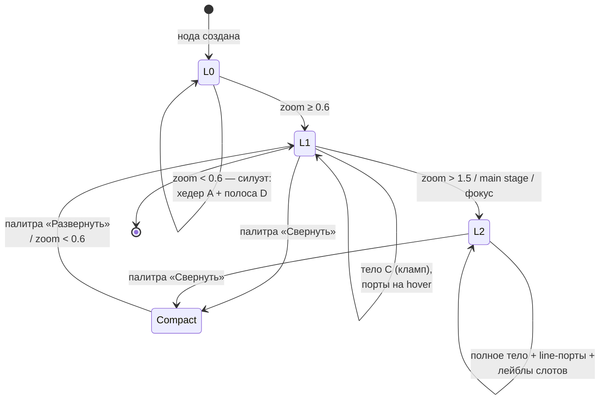

# PRD-0004: Единая анатомия ноды — реструктуризация объекта node по практикам node-style UI

- **Статус:** в работе (N-волна PRD-0004: N0–N1 выполнены 2026-09-23 — FR-044 закрыт, контракт зон A–E и LOD в `anatomy.rs`; далее N2 хедер F-2 + полоса D F-6 + демо-точка владельцу, N3 рейлы F-3/F-4, N4 статусный слой F-7, N5 LOD/компакт F-8/F-9; см. §13/§16)
- **Тип:** PRD (документ требований продукта; реализация оформляется отдельным `FR-044` по шаблону `docs/change-requests/cr-template.md`; структура — единый шаблон `docs/prd/TEMPLATE.md`)
- **Приоритет:** важно
- **Владелец:** агент (оформление по запросу владельца, сессия 2026-09-20)
- **Источник:** запрос владельца от 2026-09-20 — «нужно прописать PRD концепцию для реструктуризации объекта node на основании UX/UI стратегии, и лучших практик дизайна с учётом доработок для визуального математического моделирования, PRD-0002 и потребности в простоте восприятия. Нужно взять лучшие практики в Node-style ui»
- **Связанные документы:** `docs/interface-objects/node.md` (интерфейсный объект «нода»), `docs/SPEC.md` §5.1/§6.2/§6.3/§7.6, PRD-0002 (LOD связей + main stage), ADR-0002/0003/0007/0008, FR-006/011/012/013/014/016/018/025/029/038/039/040, CR-003/007/008/010/012
- **Создан:** 2026-09-20
- **Обновлён:** 2026-09-21

---

## 1. Резюме

Нода — первичный объект канваса: после пивота в визуальную систему математического моделирования (ADR-0007) именно расчётные ноды (Numi-листы и шаблоны) несут контент модели, а всё остальное — носитель. Но анатомия ноды никогда не проектировалась целиком: она росла волнами фич (FR-013 Numi-формулы, FR-014 поток значений, FR-018 шаблоны, FR-025 построчные порты, FR-029 именованные выходы, FR-016 индикаторы узких мест), и сегодня каждая подсистема привнесла собственное представление: итог формулы у text-ноды — строка под текстом, у шаблона — отдельный футер; категорийная полоса есть только у шаблона; порты — одинаковые кружки на сторонах без типовой кодировки; состояния (выделение, анализ, broken, hover) делят одну рамку по ad-hoc правилам кода.

PRD-0004 вводит **единую анатомию расчётной ноды** из пяти зон: (A) хедер-идентичность с категорийным чипом и именем, (B) порт-рейлы «входы слева / выходы справа» с типовой кодировкой value/control, (C) тело по типу ноды, (D) единая результирующая полоса, (E) статусный слой с фиксированным приоритетом состояний. Анатомию дополняют **прогрессивное раскрытие** (силуэт L0 → стандарт L1 → полный L2 по зуму) и **компакт-режим** сворачивания ноды до хедера + результата.

Решение консолидирует лучшие практики node-style UI (Unreal Blueprints, Blender Geometry Nodes, TouchDesigner, Simulink, n8n/ComfyUI — маппинг в §7.2) и синхронизировано с PRD-0002: агрегированные пучки и main stage получают стабильную анатомию нод, на которую опираются (main stage рендерит ноды в L2). PoC-граница: расчётные ноды (`text`, включая шаблонные); `file`/`group`/`widget` — аудит без регрессий. Формат `.canvas` не расширяется обязательными полями: компакт-режим — опциональный `canvasdesk.compact` в `extra` (round-trip Obsidian сохраняется).

---

## 2. Контекст и проблема

### 2.1 Как это выглядит сегодня

**Модель.** `Node` (`crates/canvas-core/src/model.rs:171`) — плоская структура JSON Canvas: `id/type/file/text/label/color/x/y/width/height` + расширения `brokenLink`, `previewState`, `canvasdesk`, `collapsed`, `children` и сквозной `extra` для round-trip неизвестных полей. Дискриминация — строкой `node_type` (`NodeKind`, `model.rs:216`). Типов пять: `file`, `text`, `group`, `widget`, `link` (последний — legacy при чтении чужих канвасов).

**Рендер-анатомия разная у каждого типа** (`docs/interface-objects/node.md` §3):

- `file` — заголовочная полоса `HEADER_HEIGHT = 34` (`cards.rs:19`) + тамбнейл/превью по zoom-LOD (`SPEC.md` §6.2: `< 0.25` прямоугольник + иконка; `0.25–0.6` + тамбнейл + имя; `0.6–1.5` + превью; `> 1.5` живое превью, максимум 3);
- `text` — заголовок из первой строки текста (`text.rs:68-105`: `TITLE_LINE_HEIGHT = 22`, `TITLE_PADDING = 12`), тело `BODY_FONT_SIZE = 14` / `BODY_LINE_HEIGHT = 20` / `BODY_PADDING = 10`, итог формулы — строкой под телом (FR-013), построчные результаты — рядом со строками (FR-013/FR-025);
- шаблонная нода (частный случай `text` + `canvasdesk.template`) — своя анатомия: полоса категории `TEMPLATE_BAND_H = 6` + квад-иконка роли (`cards.rs:349-390`), лист параметров, отдельный футер итога с lazy-refit резерва (CR-010/CR-012);
- `group` — подпись на верхней кромке рамки, без заголовочной полосы; дети следуют за рамкой (FR-012);
- `widget` — карточка с прозрачностью live/snapshot (CR-004) и собственной LOD-стратегией (`SPEC.md` §7.6).

**Порты.** Четыре стороны ноды (`port_at`, `edgegeom.rs:613`); стороны подключения авто — кратчайший путь (`best_sides`, `edgegeom.rs:174`, CR-008); зона захвата настраивается `port_zone_px` 10–40 px (CR-003), диаметр кружка следует зоне (`port_dot_diameter`, `cards.rs:639`); кружки видны при hover (`build_port_instances`, `cards.rs:957`). Построчные порты FR-025 — кружки на правом крае у рядов результата (`build_line_port_instances`, `cards.rs:1014`; вертикаль — `result_row_y`, `text.rs:225`). Тип связи (value/control) виден только **после** проведения связи — цветом линии (`FLOW_EDGE_COLOR` бирюзовый, `cards.rs:646`): сам порт до соединения типизирован не визуально.

**Слоты входов.** Адресация `$in`/`$1..$N`/`toParam` существует только в семантике потока (`inbound_slots`, `flow.rs:518`; `inbound_values`, `flow.rs:579`; FR-029): нода не показывает, в какой слот какое значение приходит, — это видно из `docs/SPEC.md` §5.1 и MCP-инструментов, но не с карточки.

**Состояния** (node.md §5): `selected` — синяя рамка (`SELECTION_BORDER`, `cards.rs:24`), `brokenLink` — серая (`BROKEN_BORDER`, `cards.rs:26`), серьёзность анализа — рамки/кольцо/бейджи по порогам ρ (FR-016/CP5: `severity_border` `cards.rs:57`, кольцо рядом с selected-рамкой `analysis_ring_instance` `cards.rs:123`, LOD-пороги бейджей `cards.rs:32-36`), focus-затемнение (`FocusView`, `FOCUS_DIM_FLOOR = 0.35`, `cards.rs:669`). Приоритеты наложения решены точечно в коде рендера, контракта нет.

### 2.2 Чего не хватает

1. **Единого контракта анатомии.** Зоны ноды не зафиксированы ни в коде (константы рассыпаны по `cards.rs` (2109 строк) и `text.rs` (3466 строк)), ни в документации (node.md §3 перечисляет слои, но не задаёт правила зон и их приоритеты).
2. **Типовой кодировки портов** (цвет/форма до проведения связи) — базовая практика всех node-редакторов (§7.2); сейчас тип читается только по цвету уже проведённой линии.
3. **Видимой привязки входов к слотам**: адресованные рёбра FR-029 (`toParam`, `$1..$N`) нечитаемы с ноды — диагностическая ценность потока теряется в UI.
4. **Единого места результата**: три представления итога (строка под телом text, построчные ряды, футер шаблона) — у инженера нет одного места, куда смотреть.
5. **Прогрессивного раскрытия для расчётных нод**: zoom-LOD (`SPEC.md` §6.2) определён для file-карточек и виджетов; text/template всегда рендерят всё тело — на плотной модели это шум, главный фактор «простоты восприятия», запрошенный владельцем.
6. **Компакт-режима ноды**: сворачивается только поддерево mindmap (`collapsed`, FR-011), сама нода свернуться не может (в UE/Blender — базовая операция).
7. **Фиксированного приоритета статусных слоёв**: выделение + узкое место + broken ссылка конфликтуют за одну рамку (кольцо анализа — точечный патч, не контракт).

### 2.3 Зацепки в коде и документации

- `node.md` §7/§8 прямо просит расширять ноду слоями по чек-листу совместимости — PRD фиксирует контракт зон, чтобы расширять по нему, а не перечислением.
- Полоса категории + квад-иконка шаблона (`cards.rs:349-390`) — готовый паттерн «категорийный чип + иконка роли»; обобщается на все расчётные ноды без новых механизмов.
- Авто-стороны CR-008 (`best_sides`) уже реализуют «входы слева / выходы справа» на уровне геометрии связей — порт-рейлы лишь фиксируют это визуально на карточке.
- Построчные порты FR-025 уже выстроены в вертикальный ряд по `result_row_y` (`text.rs:225`) — фактически первый порт-рейл; обобщение дёшево.
- Кольцо анализа рядом с рамкой выделения (FR-016) — прецедент многослойных рамок; статусный слой формализует и вытесняет ad-hoc.
- Бюджеты `SPEC.md` §6.3 и стресс-режим `--stress` (T5) — готовая методика проверки производительности (G4).
- i18n-инфраструктура FR-040 (`crates/canvas-app/src/i18n.rs`, RU/EN) — все новые подписи (hover-лейблы портов, пункт «Свернуть») сразу двуязычны.
- PRD-0002 (§7.5, §7.6): main stage рендерит «карточки с их заголовками/превью» и детальные рёбра — единая анатомия даст стабильную композицию внутри main stage и в hover-подсветке пучков.
- Модалка настроек FR-039 (таб «Внешний вид») — готовая поверхность для аварийного выключателя новой анатомии (F-12).

---

## 3. Цели и метрики успеха

| # | Цель | Метрика |
|---|---|---|
| G1 | Опознание с одного взгляда | По скриншоту модели (эталоны ADR-0006) пользователь называет тип ноды и её текущий результат ≤ 2 с на ноду в силуэт-режиме L0 (чек-лист демо, 5 нод на модель) |
| G2 | Снизить визуальную нагрузку | ≤ 2 визуальных акцента на ноду в стандартном режиме (аудит: категорийный чип + один статус; текст без рамок-конкуренции) |
| G3 | Единая анатомия расчётных нод | 100% text/template-нод рендерятся по контракту зон A–E; file/group/widget — без визуальных регрессий (скрин-аудит эталонов до/после) |
| G4 | Не просадить кадр | 60 fps при 1000 нод / 3000 рёбер пан/зум (замер `--stress`, бюджет `SPEC.md` §6.3) |
| G5 | Без поломки формата | Round-trip `.canvas` зелёный (включая Obsidian-сценарии node.md §8); новые поля — только опциональные `canvasdesk.*` в `extra` |
| G6 | Совместимость с PRD-0002 | Бейдж ×N пучка и main stage работают поверх новой анатомии (интеграционные тесты edges + main stage) |

---

## 4. Пользователи и сценарии

1. **Инженер моделирования** (основная персона, герой CJM §6) — собирает и отлаживает модели из 10–50 расчётных нод (эталоны ≤ 45 нод, роадмап волна B). Ему нужно за один взгляд понять: что нода считает, что в неё втекает и здорова ли она; при плотной модели — быстро убрать с глаз то, что сейчас не в фокусе.
2. **ИИ-агент (MCP)** — строит и валидирует модели программно (FR-032/FR-033, `graph_validate`). Стилистика агенту безразмерна, но важен единый контракт зон: предсказуемая геометрия хедера/футера/портов упрощает раскладки при `node_edit`/`template_instantiate` и диагностику по снапшотам (widget snapshot, W11).
3. **Наблюдатель/демо** — смотрит скриншоты и GIF (`docs/DEMO.md`, README): модель должна читаться на одном кадре — силуэт с результатами, без чтения текста нод.

---

## 5. User stories и критерии приёмки

### US-1. Считать ноду в силуэте

> **Как** инженер моделирования, **я хочу** видеть на отдалении только категорию, имя и результат ноды, **чтобы** читать модель как «таблицу с потоками», не разбирая текст карточек.

**Acceptance criteria:**
- AC-1.1: в LOD L0 (zoom < 0.6) расчётная нода рисует: хедер A (чип категории + имя) + результирующую полосу D (если есть); тело C скрыто; высота сворачивается к двум зонам.
- AC-1.2: в L1 (0.6–1.5) добавляется тело: первые строки Numi-листа/параметров (кламп по высоте ноды); в L2 (> 1.5) — полное тело + построчные результаты FR-013/FR-025.
- AC-1.3: переключение уровней — чистая функция `node_lod_level(zoom)` (тестируемая), без перескока камеры; порог L0/L1 = 0.6 (единая шкала с `SPEC.md` §6.2 — уточняется §11-Q4).
- AC-1.4: file-ноды продолжают существующий zoom-LOD `SPEC.md` §6.2 (не регрессируют); виджеты — `SPEC.md` §7.6.

### US-2. Видеть, куда втекают значения

> **Как** инженер, **я хочу** видеть порты ноды типизированными (value/control) и понимать, какой слот питает каждая связь, **чтобы** диагностировать модель, не открывая формулы.

**Acceptance criteria:**
- AC-2.1: входные порты выровнены в левый рейл (вертикальная ось `x = node.x`), выходные — в правый (`x = node.x + width`); семантика сторон CR-008 (`best_sides`) не нарушается, зона захвата CR-003 сохранена.
- AC-2.2: порт value — бирюзовый круг (`FLOW_EDGE_COLOR`), control — нейтральный; различим **без цвета** (форма/кольцо — финальное решение §11-Q2).
- AC-2.3: hover на порту — тултип-лейбл: `$1..$N` (слот), `to:<param>` (приёмник FR-029), `out:<имя>` (источник FR-029), `строка N` (построчный порт FR-025) — через i18n-ключи RU/EN.
- AC-2.4: построчные порты FR-025 остаются в правом рейле на своих рядах (`result_row_y`) и наследуют типовую кодировку.

### US-3. Один результат в одном месте

> **Как** инженер, **я хочу** видеть итог вычисления ноды в единой нижней полосе, **чтобы** не искать результат глазами по карточке.

**Acceptance criteria:**
- AC-3.1: text-нода: итог формулы (сейчас строка под телом, FR-013) переносится в полосу D; построчные результаты остаются в теле, рядом со строками.
- AC-3.2: шаблонная нода: футер итога (CR-012) совпадает с полосой D по высоте/типографике — визуально один и тот же элемент анатомии.
- AC-3.3: ошибка вычисления — красная полоса с тултипом (как сейчас); вне полосы D ничего красного не рисуется.
- AC-3.4: у `file`/`group`/`widget` полоса D отсутствует и не резервирует высоту (посадочные размеры этих типов не меняются).

### US-4. Свернуть ноду без потери контекста

> **Как** инженер плотной модели, **я хочу** свернуть ноду до хедера + результата вручную, **чтобы** освободить место, не скрывая поддерево mindmap.

**Acceptance criteria:**
- AC-4.1: пункт «Свернуть/Развернуть» в палитре ноды (группа «Действия», `palette.rs`); хоткей — §11-Q3.
- AC-4.2: свёрнутая нода = хедер A + полоса D; связи пересчитывают стороны (CR-008), построчные порты скрыты.
- AC-4.3: состояние сериализуется как `canvasdesk.compact: bool` в `extra` ноды (опционально, round-trip без потерь; по умолчанию поле не пишется).
- AC-4.4: компакт — чисто визуален: поток значений, расчёт, MCP-контракты не меняются; тогл — undo-шаг (паттерн FR-006).

### US-5. Состояния, которые не спорят

> **Как** инженер, **я хочу** однозначно читать состояние ноды (выделена / узкое место / битая ссылка), **чтобы** не гадать, что означает рамка.

**Acceptance criteria:**
- AC-5.1: фиксированный приоритет статусного слоя: `selection > analysis > broken > hover`; рисуется ровно одна рамка цвета старшего состояния; при analysis + selection — кольцо анализа рядом с рамкой (сохранение текущего паттерна FR-016).
- AC-5.2: бейджи анализа (severity, FR-016) собираются в один бейдж-стек у правого верхнего угла; LOD-пороги бейджей сохраняются (≥ 0.6 эфф. зума, Overload — всегда).
- AC-5.3: контраст рамок/чипов/полосы D ≥ 3:1 на обеих темах (правила CR-007, тест на тёмной и светлой).

### US-6. Main stage и пучки на той же анатомии

> **Как** инженер, работающий с PRD-0002, **я хочу**, чтобы детализация пучка (main stage) показывала ноды в полной анатомии, **чтобы** детали соединения читались без переключения стилистики.

**Acceptance criteria:**
- AC-6.1: внутри main stage ноды рендерятся в L2 (полная анатомия: рейлы, лейблы портов, полоса D) независимо от текущего зума канваса.
- AC-6.2: hover на агрегированной линии пучка (PRD-0002 §7.4) подсвечивает соответствующие порты обоих концов соединения.
- AC-6.3: бейдж `×N` пучка не пересекается с бейдж-стеком ноды (зоны разнесены: пучок — у линии, нода — у правого верхнего угла).

---

## 6. CJM (Customer Journey Map) — обязательный раздел

Персона CJM — **инженер моделирования** (§4, персона 1) с плотной моделью (30+ расчётных нод, value- и control-связи, 2–3 узких места); канал — desktop. CJM зафиксирован для PoC-границы и пересматривается после юзабилити-прогонов этапа N2 (§13, демо-точка).

### 6.1 Краткий CJM (шаги)

| # | Этап | Действие пользователя | Поверхность |
|---|---|---|---|
| 1 | Обзор модели | Пан/зум, читает силуэты: категории, имена, результаты | канвас (L0) |
| 2 | Наведение | Hover на ноду → порты и их типы | канвас (L1) |
| 3 | Связывание | Drag от выходного рейла к входному (Shift — value) | канвас |
| 4 | Чтение результата | Смотрит полосу D ноды-приёмника | канвас (L1/L2) |
| 5 | Диагностика | Читает статусный слой: рамка анализа, бейдж ρ | канвас |
| 6 | Уборка модели | Свёртывает нерабочие ноды в компакт | канвас |

### 6.2 Детальный CJM (мысли, эмоции, боли, точки отвала)

Шкала эмоций: от −2 (резко негативные) до +2 (восторг).

| Этап | Действия | Мысли | Эмоции | Боли | Точка отвала (условие → реакция) | Возможности |
|---|---|---|---|---|---|---|
| 1. Обзор | Пан/зум по силуэтам | «Вот нагрузка, вот расчёт — картина видна» | ясность (+1) | Раньше: текст всех нод шумел | D1: силуэт не отличает вычислительную ноду от заметки → смотрит каждую → митигация: F-2 (чип категории) + AC-1.1 | Легенда категорий (v2) |
| 2. Наведение | Hover ноды, чтение портов | «Входы слева, выходы справа — понятно» | контроль (+1) | Раньше: тип порта виден только по линии | D2: не понять, куда втекает значение → открывает формулы → митигация: F-4/F-5 (типизация + лейблы слотов) | Подсветка цепочки upstream (v2, PRD-0002 Q) |
| 3. Связывание | Drag от рейла | «Тяну из результата в параметр» | поток (+2) | Мелкая зона попадания у тонких портов | D3: промах мимо порта → связь «в никуда» → митигация: зона CR-003 сохраняется + рейл увеличивает предсказуемость позиции | Магнит-подсветка ближайшего валидного порта (v2) |
| 4. Чтение результата | Взгляд на полосу D | «Итог всегда здесь — внизу» | привычка (+1) | Раньше: у text итог под текстом, у шаблона — футер | D4: ищет итог «где был» → раздражение при переучивании → митигация: единая полоса F-6 + демо-точка N2 + F-12 (откат) | Дельта what-if в полосе (v2, FR-017) |
| 5. Диагностика | Чтение рамки/бейджей | «Красная рамка — узкое место, здесь ρ ≥ 1» | уверенность (+1) | Раньше: рамки конфликтовали | D5: две рамки — что старше? → митигация: приоритет F-7 + AC-5.1 | Паттерны рамки для цветовой слепоты (v2 — уже в FR-016 v2) |
| 6. Уборка | Компакт нерабочих нод | «Свернул — модель чище, связи целы» | облегчение (+1) | Страх потерять детали | D6: свернул — «куда делись параметры?» → митигация: результат остаётся в полосе (AC-4.2), main stage PRD-0002 показывает L2 (F-10), undo FR-006 | Авто-компакт по зуму как настройка (v2) |

### 6.3 Трассировка точек отвала

Каждая точка отвала CJM обязана иметь митигацию в требованиях (§8) или рисках (§12): D1 → F-2/AC-1.1; D2 → F-4/F-5; D3 → CR-003 (сохранение) + §12 (строка «плотность рейла»); D4 → F-6/AC-3.2 + F-12; D5 → F-7/AC-5.1; D6 → AC-4.2/F-10.

---

## 7. Решение

### 7.1 Концептуальная схема: анатомия зон A–E

```
        ┌────────────────────────────────────────────────┐
   E ─▶ │ ▓ статусный слой: одна рамка + бейдж-стек (ρ)   │  поверх, геометрию не меняет
        ├────────────────────────────────────────────────┤
        │ ▌A  [чип категории][иконка роли] Имя ноды      │  хедер-идентичность (всегда)
        ├──▲────────────────────────────────────────▲──┤
   B ─▶ │  ● │  C. Тело: Numi-лист / параметры       │ ● │ ◀─ B: рейлы портов
 входов   │  ● │     шаблона / тамбнейл (file)         │ ● │    выходов (value ◉ /
          │  ● │     построчные результаты (L2)        │ ◉ │    control ● / line ●)
        ├──┴────────────────────────────────────────┴──┤
        │ ▐ D  итог: `112 req · W: 34 ms`  | ОШИБКА ▌   │  единая полоса результата
        └────────────────────────────────────────────────┘
```



Ключевые свойства:

1. **Зоны ортогональны типу.** Тип ноды определяет только содержимое тела C (и наличие полосы D); хедер, рейлы, статусный слой — одинаковы для всех расчётных нод. Это и есть «реструктуризация»: вместо N индивидуальных карточек — один контракт с точками вариации.
2. **Порты — часть анатомии**, а не артефакт связей: рейлы принадлежат ноде, тип порта задается до проведения связи, лейблы слотов связывают порт с семантикой потока (`inbound_slots`, FR-029).
3. **Простота восприятия = меньше акцентов, не меньше информации**: силуэт L0 несёт 3 сигнала (категория/имя/результат), деталь — по требованию (hover, зум, main stage). Это прямая реализация запроса владельца «потребность в простоте восприятия».
4. **Совместимость с PRD-0002**: пучок агрегирует линии, main stage детализирует; нода в обеих картинах — стабильный объект с известными зонами (порты на рейлах, результат в полосе D).

### 7.2 Лучшие практики Node-style UI → применение в CanvasDesk

Референсы: Unreal Engine Blueprints, Blender Geometry Nodes, TouchDesigner, MathWorks Simulink, LabVIEW (dataflow), n8n/ComfyUI (card-style node-редакторы), Max/MSP. Полный список — §17.

| # | Практика (источник) | Как применяем | Этап PoC? |
|---|---|---|---|
| P1 | Входы слева, выходы справа — универсальный инвариант (UE, Blender, Simulink, LabVIEW) | Порт-рейлы B фиксируют стороны; согласовано с `best_sides` CR-008 | Да (F-3) |
| P2 | Порт — первоклассный объект с типом: цвет + форма (Blender socket shapes, UE pin colors) | Типовая кодировка F-4: value/control различимы без цвета; лейблы слотов на hover | Да (F-4, F-5) |
| P3 | Прогрессивное раскрытие: силуэт на дальнем зуме (все node-редакторы) | LOD L0/L1/L2 (F-8) — обобщение zoom-LOD `SPEC.md` §6.2 на расчётные ноды | Да (F-8) |
| P4 | Коллапс ноды без потери семантики (UE collapse, Blender collapse) | Компакт-режим F-9 (хедер + полоса D), сериализация `canvasdesk.compact` | Да (F-9) |
| P5 | Категорийный цвет как быстрый фильтр восприятия (TouchDesigner family colors, UE header colors) | Чип категории в хедере A: обобщение полосы шаблона (`cards.rs:349`) | Да (F-2) |
| P6 | Результат исполнения виден на ноде (n8n output badges, Simulink displayed values, ComfyUI previews) | Единая полоса результата D (F-6): итог/ошибка в одном месте | Да (F-6) |
| P7 | Инспектор деталей — отдельная поверхность, а не раздувание ноды (n8n drawer, Figma) | Отложено в v2: у нас роль инспектора уже играет main stage (PRD-0002); не дублируем | Нет |
| P8 | Рерут-ноды и фреймы-комментарии (UE/Blender) | Вне скоупа: пучки PRD-0002 решают шум линий, группы FR-012 — контейнеры | Нет |
| P9 | Мьют/байпас ноды (Blender mute) | Вне скоупа PoC: изменение потока — отдельный FR (кандидат после FR-017 what-if) | Нет |
| P10 | Живой просмотр значения на проводе/ноде (Blender viewer node) | Частично уже есть (полоса D, бейджи FR-016); постоянные слоты — F-14 could | Частично |

Осознанные отличия от референсов: CanvasDesk не переходит на «порты-строки» (row pins) для всех значений — построчные порты FR-025 уже покрывают кейс адресации строк; мы не вводим типизированные «шины» (bus) Simulink — доменные единицы и валидация (`graph_validate`, FR-032) несут эту роль в модели.

### 7.3 Точка интеграции в архитектуре

| Элемент | Решение |
|---|---|
| Контракт зон | Чистые функции геометрии: новый модуль `canvas-render/src/anatomy.rs` (`header_rect`, `ports_rail`, `result_strip`, `node_lod_level`) + юнит-тесты; потребители — `cards.rs`, `text.rs` |
| Design-токены | Модуль токенов (высоты/отступы/типографика зон): консолидация существующих констант (`HEADER_HEIGHT` `cards.rs:19`, `TITLE_*`/`BODY_*`/`RESULT_LINE_HEIGHT` `text.rs:68-105`, `TEMPLATE_BAND_H` `cards.rs:349`) с сохранением текущих значений на первом шаге — ноль визуального скачка |
| Модель | Не меняется (`model.rs`); компакт — опциональный `canvasdesk.compact` в `extra` (`Node.extra`, `model.rs:210`) |
| Поток/слоты | Лейблы портов читают готовые `inbound_slots`/`inbound_values` (`flow.rs:518/579`) и `TemplateRef.outputs` (`templates.rs:368`) — движок не трогается |
| Настройки | Тумблер «Единая анатомия нод» в модалке FR-039, раздел «Внешний вид»; i18n RU/EN (FR-040); значение — `config.toml` по паттерну существующих настроек |
| PRD-0002 | Main stage запрашивает L2-анатомию независимо от зума; hover пучка → подсветка портов концов; бейдж `×N` остаётся у линии |
| Undo | Компакт-тогл — один undo-шаг (паттерн FR-006 `pending_undo`/`restore_canvas`) |
| MCP | Контракт не меняется; `node_edit` не управляет анатомией (компакт — только UI-жест, v2 — MCP-поле при спросе) |
| Статусные состояния | Приоритетная стопка в одном месте рендера (F-7) вместо ad-hoc по веткам `cards.rs` |

### 7.4 Отвергнутые варианты

| Вариант | Вердикт | Причина |
|---|---|---|
| Единая анатомия сразу для всех типов (file/widget/group в PoC) | отвергнуто для PoC | тамбнейлы/WebView2 имеют собственные LOD-контракты (`SPEC.md` §6.2/§7.6); совмещение — риск регрессий без ценности для матмоделирования; value-зоны нужны только расчётным нодам |
| Side-drawer инспектор ноды (n8n) вместо инлайн-полос | отложено (v2) | новая поверхность оверлея; дублирует роль main stage PRD-0002; против принципа «всё на канвасе» |
| Радикальная стилистика (капсулы, glow, безрамочные карточки) | отвергнуто | чистая стилистика без функциональной ценности; дороже в hit-test/портах; «простота восприятия» трактуется как меньше акцентов, а не меньше привычных деталей |
| Обязательные новые поля `.canvas` (версия анатомии, зоны) | отвергнуто | нарушает round-trip Obsidian (node.md §8); всё опционально через `canvasdesk.*` в `extra` |
| Постоянные порты-слоты `$1..$N` слева для всех входов | отложено (v2, F-14 could) | при N > 6 рейл перегружается и ломает силуэт L0; PoC — лейблы на hover (F-5) |
| Перенос итога формулы в заголовок ноды | отвергнуто | конфликт с длинными именами и категорийным чипом; итог — семантика нижней кромки (согласуется с футером шаблона CR-012 и полосой анализа FR-016) |

---

## 8. Функциональные требования

| ID | Требование | Приоритет | Приёмка |
|---|---|---|---|
| F-1 | Модуль design-токенов анатомии (высоты/отступы/типографика зон A–D) — единая точка правды; на первом шаге значения = текущие константы (без визуального скачка) | must | G2, §15 |
| F-2 | Хедер A: чип категории + имя + иконка роли для text/template (обобщение `cards.rs:349-390`); клип имени по образцу CR-010 | must | AC-1.1, G3 |
| F-3 | Порт-рейлы: входы выровнены слева, выходы справа; совместимость с CR-003 (зона) и CR-008 (авто-стороны) | must | AC-2.1 |
| F-4 | Типовая кодировка портов: value/control различимы цветом + формой; line-порты FR-025 наследуют кодировку | must | AC-2.2, AC-2.4 |
| F-5 | Hover-лейблы портов: `$1..$N`, `to:<param>`, `out:<имя>`, «строка N» — i18n RU/EN (FR-040) | should | AC-2.3 |
| F-6 | Единая результирующая полоса D для text/template (итог/ошибка); у file/group/widget полосы нет и высота не резервируется | must | AC-3.1–3.4 |
| F-7 | Статусный слой E с фиксированным приоритетом `selection > analysis > broken > hover`; один бейдж-стек анализа | must | AC-5.1, AC-5.2 |
| F-8 | LOD-уровни ноды L0/L1/L2 по зуму (чистая функция `node_lod_level`); file — прежний `SPEC.md` §6.2, widget — §7.6 | should | AC-1.1–1.4 |
| F-9 | Компакт-режим ноды (хедер + полоса D) из палитры; сериализация `canvasdesk.compact`; undo-шаг; связи/расчёты не затронуты | should | AC-4.1–4.4 |
| F-10 | Интеграция PRD-0002: main stage рендерит ноды в L2 независимо от зума; hover пучка подсвечивает порты концов; бейдж `×N` не пересекается с бейдж-стеком | must | AC-6.1–6.3 |
| F-11 | Аудит без регрессий: file/group/widget рендер и все текущие жесты ноды (drag, ПКМ, двойной клик, resize, snap FR-038) работают как раньше | must | G3, G5 |
| F-12 | Настройка «Единая анатомия нод» (вкл/выкл, default вкл) в модалке настроек FR-039 — аварийный выключатель переходного периода | should | Раздел «Внешний вид», i18n |
| F-13 | Темы: все зоны анатомии на тёмной и светлой теме, контраст ≥ 3:1 (CR-007) | must | AC-5.3 |
| F-14 | Постоянные слоты `$1..$N` в левом рейле при их числе ≤ порога (значение — по демо N2) | could | §11-Q1 |

## 9. Нефункциональные требования

1. **Архитектура/wasm.** Геометрия анатомии и LOD — чистые функции в `canvas-render` (без платформенного кода, паттерн `providers.rs` не требуется); wasm-гейт `scripts/wasm_gate.sh` зелёный (ADR-0011).
2. **Производительность.** Бюджет G4: геометрия зон считается на батч-билде (не per-frame аллокации); LOD-переключения без инвалидации текстовых кэшей за пределами затронутых нод; регресс-замер `--stress` (T5) не хуже baseline.
3. **Формат.** `.canvas` не расширяется обязательными полями; `canvasdesk.compact` — опциональный bool в `extra`; round-trip Obsidian (node.md §8, тест round-trip) — зелёный.
4. **Детерминизм/TDD.** Контракты зон (`header_rect`/`ports_rail`/`result_strip`), `node_lod_level` и раскладки рейлов — тесты до реализации (AGENTS.md); крайние случаи: узкая нода (width < 2×BODY_PADDING), нода без результата, 0 портов, N > 6 портов.
5. **Доступность.** Контраст CR-007 (≥ 3:1) для чипа, рамок, полосы D на обеих темах; value/control различимы без цвета (форма/диаметр) — преемственность с паттернами FR-016 v2 для цветовой слепоты.
6. **i18n.** Все новые строки (лейблы портов, пункты палитры, настройка) — через ключи RU/EN (FR-040); хардкод запрещён.
7. **Зависимости.** Новых зависимостей нет (лицензионный allowlist ADR-0008 не расширяется).

## 10. Non-goals

- **Не меняем модель и формат.** `Node`/`Edge` без новых обязательных полей; `canvasdesk.compact` — единственное дополнение, опциональное.
- **Не редизайним file/group/widget в PoC.** Только аудит совместимости (F-11): тамбнейлы и виджеты живут по своим LOD-контрактам.
- **Не трогаем движок потока и расчётов.** Лейблы портов читают готовые `inbound_slots`/`inbound_values`; никаких изменений в `flow.rs`, `expr.rs`.
- **Не делаем side-инспектор (n8n-drawer).** Роль инспектора у main stage (PRD-0002).
- **Не делаем reroute-ноды и фреймы-комментарии.** Пучки (PRD-0002) и группы (FR-012) покрывают соответствующие боли.
- **Не делаем mute/bypass ноды.** Изменение семантики потока — вне визуального PRD (кандидат в отдельный FR после FR-017).
- **Не анимируем переходы LOD и компакт в PoC.** Кандидат v2 (после обкатки порогов).
- **Не меняем миникарту.** Нода на миникарте остаётся упрощённым прямоугольником (`minimap.rs`).

## 11. Открытые вопросы

- **Q1.** Слоты входов: постоянные порты слева при N ≤ K (F-14) или только hover-лейблы? Влияет на плотность рейла и силуэт L0. Решение владельца по демо N2.
- **Q2.** Форма порта: круг=value / кольцо=control (сохраняет силуэт) или круг/квадрат (грубее, но читается на любом фоне)? Связано с доступностью (§9.5).
- **Q3.** Хоткей компакт-режима: `C` без модификатора (свободно: копирование — `Ctrl+C`) или пункт только в палитре? Синк `HOTKEYS` (`lib.rs`) + `user-docs/hotkeys.md` обязателен.
- **Q4.** Порог L0/L1: `zoom < 0.6` (граница тамбнейл→превью `SPEC.md` §6.2) или отдельный порог для расчётных нод? Предложение: 0.6 — единая шкала зумов.
- **Q5.** Компакт: persist в `.canvas` (`canvasdesk.compact` — предложение) или UI-state как `selected`? Влияет на round-trip и на работу агента (MCP видит поле или нет).
- **Q6.** Демо-гейт владельца: после N2 (токены + хедер + полоса) или после N3 (рейлы)? Предложение: N2 — раньше получить обратную связь по «простоте восприятия».

## 12. Риски и митигации

| Риск | Влияние | Митигация |
|---|---|---|
| Регресс привычного вида нод («всё переехало») | Доверие к UI, UX | F-12 аварийный выключатель; токены стартуют с текущих значений (ноль скачка); скрин-аудит эталонов до/после; демо-точка N2 |
| Конфликт с реализацией PRD-0002 (FR-042): оба меняют рендер связей/нод | Слики, двойная работа | Контракт стыка зафиксирован (F-10, AC-6.*); интеграционные тесты edges + main stage; порядок этапов согласовать в FR |
| Изменение высоты нод (полоса D у text) переукладывает существующие `.canvas` | Данные, diff-шум | Переиспользование `fit_note_size`/резервов (app.rs:1845, CR-012); полоса не резервирует высоту у не-вычислительных типов; старые файлы без `canvasdesk.*` полей — валидны |
| Плотность рейла при N > 6 портах | Читаемость | Вертикальное распределение с клампом по высоте; hover-лейблы вместо постоянных слотов (PoC); F-14 порог — по демо |
| Лейблы портов перекрывают связи/лейблы рёбер | Читаемость | Screen-space тултипы по образцу `EdgeLabel` (`text.rs:1030`), кламп к вьюпорту, показ только на hover |
| Двойной рендер-путь (F-12 off) удлиняет поддержку | Код, тесты | Выключатель — на переходный период, удаление в v2; старый путь не получает новых фич |
| Дальтонизм: value/control только цветом | a11y | F-4 требует различимости без цвета (форма/диаметр); проверка на обеих темах (CR-007) |

## 13. Дорожная карта

| Этап | Содержание | Результат |
|---|---|---|
| N0 | FR-044 по шаблону `cr-template.md` (фиксация решений Q1–Q6); ADR не требуется (новых зависимостей и правил архитектуры нет) | Разрешение на реализацию |
| N1 | Модуль токенов F-1 + `anatomy.rs`: перенос констант без изменения значений, тесты зон | Чистый контракт, ноль визуальных изменений — **выполнено 2026-09-23**: `canvas-render/src/anatomy.rs` — зоны A–E (`header_rect`/`body_rect` (обёртка `body_area` — единый расчёт с рендером)/`ports_rail_rect` (кромка B, вертикаль портов)/`result_strip_rect` (футер шаблона, текст — None)/`status_layer_rect`), LOD `node_lod_level` (пороги 0.6/1.5 = границам file-LOD SPEC §6.2), 8 тестов зон/инвариантов/клампов; константы зон ре-экспортированы (единая точка импорта F-1), значения не менялись — ноль визуального скачка; физический перенос объявлений констант — после завершения серии FR-061 (файлы тела — её территория, координация worklog) |
| N2 | Хедер F-2 + полоса результата F-6 (text/template) + настройка F-12 | **Демо-точка владельцу (Q6)**: G1/G2 замер |
| N3 | Порт-рейлы F-3 + типовая кодировка F-4 + hover-лейблы F-5 | US-2 |
| N4 | Статусный слой F-7 + темы F-13 | US-5 |
| N5 | LOD L0/L1/L2 F-8 + компакт-режим F-9 | US-1, US-4 |
| N6 | Интеграция PRD-0002 F-10; аудит F-11; доки §14; приёмка §15 (G1–G6) | Закрытие PoC |

## 14. Точки входа в документацию (обязательные обновления при реализации)

- `docs/change-requests/fr-044-node-anatomy.md` — реализационный FR (создаётся на N0).
- `docs/interface-objects/node.md` — §3 (контракт зон A–E и LOD L0/L1/L2), §4 (компакт-режим в таблице действий), §5 (статусный слой и приоритеты), §7/§8 (точки входа, чек-лист).
- `docs/SPEC.md` — §6.2 (LOD расчётных нод рядом с file-LOD), §5.1 (расширение `canvasdesk.compact`).
- `docs/prd/README.md` — индекс каталога PRD (статус, ссылка); `docs/index.md` — ссылка на PRD.
- `user-docs/interface.md`, `user-docs/hotkeys.md` (+ синк `HOTKEYS`, `crates/canvas-app/src/lib.rs`) — компакт-режим, лейблы портов.
- `docs/ACCEPTANCE.md` — приёмочный чек-лист PoC.
- Онбординг (`onboarding_ui.rs`, FR-028) — вопрос владельцу по правилу AGENTS.md: меняет ли анатомия шаги тура (шаг про порты/связи).

## 15. Проверка (Definition of Done PoC)

- [ ] Демо на эталоне №1 (ADR-0006): силуэт L0 различает категории; полоса D у text и template выглядит одинаково; порты типизированы и подписаны на hover; main stage (PRD-0002) показывает ноды в L2 (G1, G3, G6).
- [ ] Юнит-тесты: токены, зоны (`header_rect`/`ports_rail`/`result_strip`), `node_lod_level`, раскладка рейлов (включая крайние случаи §9.4), компакт-сериализация `canvasdesk.compact`.
- [ ] Интеграционные тесты `integration_edges.rs` и main stage зелёные (G6); все текущие жесты ноды работают (F-11).
- [ ] `cargo test --workspace`, clippy, fmt — зелёные; `scripts/wasm_gate.sh` — зелёный.
- [ ] Стресс-замер: 1000 нод / 3000 рёбер → 60 fps пан/зум (G4).
- [ ] Round-trip `.canvas` зелёный, включая Obsidian-сценарий неизвестных полей (G5).
- [ ] Скрин-аудит file/group/widget — без визуальных регрессий (G3).
- [ ] Контраст чипа/рамок/полосы ≥ 3:1 на обеих темах (G2, CR-007).
- [ ] Все точки входа §14 обновлены; вопрос онбординга задан владельцу.

## 16. История изменений

- `2026-09-23` — агент: **N1 выполнен** (F-1 первый шаг): `canvas-render/src/anatomy.rs` —
  единая точка контракта зон A–E и LOD-уровней (`NodeLod` L0/L1/L2, пороги
  0.6/1.5 = границам file-LOD SPEC §6.2); чистые функции `header_rect` /
  `body_rect` (обёртка `text::body_area` — инвариант с рендером) /
  `ports_rail_rect` (кромка-рейл B: вертикаль от низа хедера до линии нижнего
  пада — покрывает все вертикали портов FR-025/FR-050/футера) /
  `result_strip_rect` (сегодня — футер шаблонной ноды, у text-нод результаты
  инлайн — `None`; единая полоса F-6 — N2) / `status_layer_rect` (E — поверх,
  геометрию не меняет); константы зон ре-экспортированы из design-токенов
  FR-046 и `text.rs`/`cards.rs` (единая точка импорта F-1; физический перенос
  объявлений — после серии FR-061, чтобы не конфликтовать с её файлами —
  координация worklog). 8 тестов (пороги LOD, паритет с `body_area`/
  `result_footer_y`, неперекрытие A/C, вертикали портов внутри рейла,
  клампы вырожденных размеров). Ноль визуальных изменений, потребители
  переключаются в N2+ (§13). Локальные гейты зелёные.

- `2026-09-22` — агент: запрос владельца на полный редизайн Node/Edge
  («не нравится UI и UX связывания, особенно отдельные точки для значений и
  отдельные для простых связок»). Выполнен пре-PRD анализ
  [`docs/interface-objects/node-edge-redesign-analysis.md`](../interface-objects/node-edge-redesign-analysis.md):
  инвентарь 26 use case, 12 требований, три варианта модели портов/жестов
  (В-А двухконтурный / В-B единый рейл / В-C кромки-зоны — рекомендация),
  прототип [`ux-node-edge-redesign.html`](../prototypes/ux-node-edge-redesign.html).
  Анатомия зон A–E этого PRD ортогональна модели портов и вливается в любой
  вариант; судьба F-3 (порт-рейлы «всегда видны») — открытый вопрос Q3 анализа.

- `2026-09-21` — агент: **расширен FR-045** (вводные владельца о прозрачности
  данных, сессия 2026-09-21; приоритет FR-045 при коллизиях — решение
  владельца): R-1 слой описания в зоне C (`canvasdesk.desc`); R-2 категория
  «данные» + нода «Входные данные» (`canvasdesk.data`, value-порты на поля,
  полоса D — состояние источника); R-3 pending-состояние слота «значение не
  подставлено» в статусном слое E и полосе D; R-4 группы «Переменные» /
  «Расчёт · формулы» в построчных результатах L2; **R-5 — амендмент F-5/F-14**:
  нотация лейблов слотов — «Объект.Поле» (единая точка сборки —
  `canvas-core/src/dataref.rs`; короткая форма «Поле» на канвасе, полный
  путь в stage/тултипах) вместо `$N`. Этап-ядро реализовано в canvas-core;
  N-волна (N1–N5) — первый потребитель (`anatomy.rs`, N1).
- `2026-09-20` — агент: создан документ (PRD-0004), статус `в анализе`; аудит анатомии ноды по коду (`model.rs`, `cards.rs`, `text.rs`, `edgegeom.rs`, `flow.rs`, `templates.rs`) и `node.md`; концепция единой анатомии зон A–E + LOD L0/L1/L2 + компакт-режим; маппинг практик node-style UI (UE/Blender/TouchDesigner/Simulink/n8n); CJM с трассировкой D1–D6; требования F-1..F-14; дорожная карта N0–N6.

## 17. Источники истины

- Запрос владельца (сессия 2026-09-20) — дословная постановка в поле «Источник».
- `docs/interface-objects/node.md` — интерфейсный объект «нода»: §2 (типы), §3 (визуальная структура и LOD), §4 (взаимодействия), §5 (состояния), §6 (связи и порты), §7 (точки входа), §8 (чек-лист совместимости), §12 (источники).
- `docs/SPEC.md` — §5.1 (модель нод и расширения), §6.2 (zoom-LOD), §6.3 (бюджеты производительности), §7.6 (виджеты).
- `docs/prd/prd-0002-edge-lod-main-stage.md` — пучки, main stage, hover-подсветка: стык с анатомией ноды.
- `docs/adr/adr-0002-value-flow-composition.md`, `adr-0003-named-value-ports.md`, `adr-0007-pivot-math-modeling.md`, `adr-0008-math-computing-stack.md` — позиционирование и контракты потока.
- Код: `crates/canvas-core/src/model.rs:171` (`Node`), `:210` (`extra`), `:216` (`NodeKind`); `crates/canvas-render/src/cards.rs:19,21` (хедер/радиус), `:123` (кольцо анализа), `:349-390` (полоса/иконка шаблона), `:639` (диаметр порта), `:646` (цвет value), `:957` (порты), `:1014` (line-порты); `crates/canvas-render/src/text.rs:68-105` (типографика), `:202` (видимость заголовков), `:225` (`result_row_y`), `:1030` (EdgeLabel), `:1355` (`line_ports`); `crates/canvas-core/src/edgegeom.rs:174` (`best_sides`), `:613` (`port_at`); `crates/canvas-core/src/flow.rs:518,579` (слоты/входы); `crates/canvas-core/src/templates.rs:90,368` (манифест/снимок); `crates/canvas-app/src/app.rs:544,1845` (резервы/`fit_note_size`); `crates/canvas-app/src/palette.rs` (группы палитры).
- FR/CR: FR-006 (undo), FR-011 (collapsed), FR-012 (группы), FR-013 (Numi), FR-014 (поток), FR-016 (индикаторы), FR-018 (шаблоны), FR-025 (построчные порты), FR-029 (именованные выходы), FR-038 (snap), FR-039/FR-040 (настройки/i18n), CR-003 (зона портов), CR-007 (контраст), CR-008 (умные порты), CR-010/CR-012 (вёрстка шаблонной ноды).
- Внешние референсы практик node-style UI (качественные): Unreal Engine Blueprints — https://dev.epicgames.com/documentation (Blueprints Visual Scripting); Blender Geometry Nodes — https://docs.blender.org (node editor, socket types); TouchDesigner Operators — https://derivative.ca/userguide (operator families); MathWorks Simulink — https://mathworks.com/help/simulink (ports and signals); LabVIEW Dataflow — https://www.ni.com/docs (block diagram); n8n — https://docs.n8n.io (node UI); ComfyUI — https://docs.comfy.org (node canvas).
