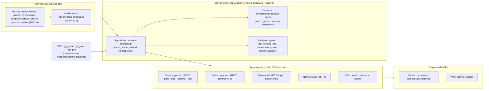

# PRD-0005: Синхронизация канвасов с Git — GitHub, GitLab и произвольные Git-репозитории

- **Статус:** в анализе
- **Тип:** PRD (документ требований продукта; реализация оформляется отдельным `FR-045` по шаблону `docs/change-requests/cr-template.md`; структура — единый шаблон `docs/prd/TEMPLATE.md`)
- **Приоритет:** важно
- **Владелец:** агент (оформление по запросу владельца, сессия 2026-09-20)
- **Источник:** запрос владельца от 2026-09-20 — «Нужно проработать PRD по поводу добавления функционала, работы с GitLab, GitHub и вообще Git-репозиториями и отправки canvas в Git»
- **Связанные документы:** PRD-0001 (вводные из данных), PRD-0003 (импорт описаний архитектуры — естественный потребитель файлов из репозитория), ADR-0007 (позиционирование), ADR-0008 (зависимости, без нативного C), ADR-0011 (wasm-гейт), ADR-0012 (headless-верификация MCP), FR-008 (один exe), FR-034/FR-035 (транспорт и чистота stdout MCP), FR-037 (headless MCP), FR-039 (настройки), FR-040 (i18n), SPEC §5.1/§5.3/§6.3/§7.6/§13
- **Создан:** 2026-09-20
- **Обновлён:** 2026-09-20

---

## 1. Резюме

Модель в CanvasDesk живёт в одном `.canvas`-файле (JSON Canvas 1.0) — и сегодня этот файл существует только на локальном диске (нативно) или в OPFS/FS Access (web). Команды, в которых работает целевой пользователь, живут в Git: код, IaC, документация — всё проходит через commit/pull-request. Модель архитектуры, собранная за час работы, остаётся локальным артефактом: её нельзя отправить на ревью рядом с кодом, не видно истории изменений, коллега не получит обновление без ручного копирования файла, а ИИ-агент не может зафиксировать результат сборки модели там, где живёт остальная работа, — в репозитории.

Предлагается встроенная **Git-синхронизация канваса**: подключение открытого `.canvas` к файлу в репозитории GitHub/GitLab (токен-доступ BYOK) или произвольному Git-remotу (HTTPS), публикация детерминированного снапшота канваса коммитом с осмысленным сообщением, подтягивание чужих изменений с безопасной (без мержа) политикой конфликтов, открытие модели прямо из Git и MCP-инструменты для агента (`git_status`/`git_push`/`git_pull`). Метаданные подключения (`canvasdesk.git`) живут в `extra` файла и переносятся вместе с ним; токены — никогда.

Граница PoC: **один канвас ↔ один путь в репозитории, одна ветка, ручная синхронизация** (кнопки «Опубликовать»/«Обновить»), провайдеры GitHub и GitLab через REST API — этот транспорт работает и в нативной, и в web-сборке; произвольные Git-remotes (Gitea/self-hosted) — отдельным этапом через pure-Rust gitoxide (`gix`, только native). Фича требует **ADR-0014** — первого осознанного отступления от правила «никаких сетевых вызовов в хосте» (AGENTS.md): сеть вводится как явная, опциональная, пользовательски согласованная способность с узким контрактом (только HTTPS к явно настроенному remote, только операции sync, токены в системном хранилище, без телеметрии), а не как общее «разрешаем интернет».

---

## 2. Контекст и проблема

### 2.1 Как это выглядит сегодня

- Источник истины — `.canvas`-файл (SPEC §5.3): `Canvas { nodes, edges }` (`crates/canvas-core/src/model.rs:678`, `Node` — `model.rs:171`, `Edge` — `model.rs:416`). Расширения формата — только в `canvasdesk.*`-секции `extra` с чистым round-trip (SPEC §5.1, `io.rs`).
- Хранение абстрагировано трейтом `CanvasStorage` (`crates/canvas-core/src/io.rs:69`): нативно `FsCanvasStorage` с бэкапом `.canvas.bak` прежней версии (`io.rs:78`, `save_with_backup` — `io.rs:53`), для тестов `MemStorage` (`io.rs:93`), web — OPFS (`crates/canvas-web/src/opfs.rs:64,112`) и FS Access API (`crates/canvas-web/src/fs_access.rs`, W6).
- Автосейв с debounce 2 с (`AUTOSAVE_DEBOUNCE`, `crates/canvas-scene/src/scene.rs:24`; `autosave_if_due` — `scene.rs:854`, вызов — `crates/canvas-app/src/app.rs:11163`). История версии — ровно один `.bak`: сравнить «что изменилось с прошлой недели» нельзя.
- Сети в хосте нет и по правилам быть не должно: «Никаких сетевых вызовов в хосте — продукт локальный» (AGENTS.md:158) и «Не добавлять сетевые вызовы в хост» (AGENTS.md:242). Grep по workspace на `reqwest|ureq|git2|gix|keyring|http` — ноль зависимостей; единственное упоминание «github» в коде — рендер GFM-разметки (`crates/canvas-render/src/gfm.rs`), к сети отношения не имеет.
- MCP-инструменты (SPEC §13, `crates/canvas-mcp/src/lib.rs`, константа `TOOLS`) — только графовые и расчётные операции; инструментов персистентности/публикации нет. MCP-сервер локальный (BYOK.md §4, FR-034/ADR-0009).

### 2.2 Чего не хватает

- Нет Git-слоя как класса: ни remote-хранилища канвасов, ни push/pull, ни истории изменений, ни diff-основы для ревью (grep `git2|gix|github|gitlab` по крейтам — пусто, кроме `gfm.rs`).
- Нет конфигурации подключений: некуда записать «этот канвас → этот remote/ветка/путь», нет хранилища токенов (grep `keyring|credential|dpapi` — пусто).
- Нет политики сетевого доступа хоста: действующее правило AGENTS.md блокирует любую сетевую фичу — без ADR, уточняющего границу, реализация невозможна.
- Нет MCP-поверхности персистентности: агент собирает модель, но не может зафиксировать её в репозитории (рецепт `user-docs/agent-recipe.md` заканчивается валидацией, а не публикацией).

### 2.3 Зацепки в коде и документации

- Шов `CanvasStorage` (`io.rs:69`) — проверенный паттерн «сервис хранилища за трейтом» (`ThumbnailProvider`/`NoopThumbnailProvider`): Git-sync встраивается рядом, не трогая ядро модели.
- Детерминированная сериализация `Canvas::to_json` (`io.rs:28`) и golden-тесты round-trip — готовая база снапшота и детекта «изменений нет».
- `canvasdesk.*`-расширения `extra` (прецеденты `canvasdesk.flow.kind`, `canvasdesk.pin_ports`, `canvasdesk.whatif` — SPEC §5.1) — место для метаданных `canvasdesk.git` без ломки формата и Obsidian-совместимости.
- Worker-потоки обязательны (правило 4 «Правил архитектуры» AGENTS.md) — сетевые операции не должны блокировать рендер; пул тамбнейлов даёт образец каналов результатов.
- canvas-scene — платформенно-нейтральный, wasm-гейт (`ADR-0011`) и headless-верификация MCP (`FR-037`/`ADR-0012`): MCP-инструменты sync реализуются с injected-транспортом (в headless — `NoopTransport`), гейты остаются зелёными без сети.
- Настройки — модалка FR-039 (готовая секция под «Git-аккаунты»), i18n RU/EN — FR-040; пользовательская документация — `user-docs/` с линк-чеком в тестах `docs_ui` (FR-031).

---

## 3. Цели и метрики успеха

| # | Цель | Метрика |
|---|---|---|
| G1 | Быстрая публикация | «Опубликовать в Git» для модели ≤ 100 нод: снапшот ≤ 1 с (замер локально, без сети), полный цикл с сетью ≤ 15 с при RTT ≤ 200 мс |
| G2 | Детерминизм и отсутствие шума | Одинаковый канвас → байт-в-байт одинаковый JSON-снапшот (golden-тест); повторный push без изменений — 0 новых коммитов (no-op) |
| G3 | Секрет-гигиена | 0 вхождений токена в `.canvas`, логи `tracing`, stderr, stdout MCP (FR-035), сообщения об ошибках — автотест сканирует все сериализации и лог-буфер |
| G4 | Web-паритет | Push/pull в GitHub/GitLab из web-сборки; `scripts/wasm_gate.sh` зелёный — сетевые транспорты за трейтами, ядро без сети |
| G5 | Не просадить канвас | Все сетевые операции — в worker-потоке; во время активного push/pull — 60 fps на пан/зум (SPEC §6.3); операция отменяема (Esc) |

---

## 4. Пользователи и сценарии

**Персона 1 — архитектор/техлид (основная, герой CJM).** Модель пропускной способности/стоимости собрана; команде и стейкхолдерам она нужна так же, как код — через репозиторий: ревью в PR, история «что поменяли и почему», ссылка на файл вместо «прикреплю последнюю версию в чат».

**Персона 2 — SRE/DevOps.** Держит модели инфраструктуры в том же репозитории, что и terraform/compose (импорт которых закрывает PRD-0003): модель рядом с описанной ею системой, изменения инфраструктуры → изменения модели в одном PR.

**Персона 3 — ИИ-агент (MCP).** Собирает и проверяет модель по рецепту (`user-docs/agent-recipe.md`); после сборки публикует канвас в репозиторий ветки (`git_push`), где владелец ревьюит результат агента как обычный PR-коммит.

---

## 5. User stories и критерии приёмки

### US-1. Подключить канвас к репозиторию и опубликовать впервые

> **Как** архитектор, **я хочу** привязать открытый канвас к файлу в GitHub/GitLab-репозитории и отправить его туда, **чтобы** модель появилась в командном Git без ручного копирования.

**Acceptance criteria:**
- AC-1.1: «Опубликовать в Git…» открывает мастер: провайдер (GitHub/GitLab/произвольный Git HTTPS), URL репозитория, ветка, путь файла в репо, токен; поля валидируются до сетевых вызовов (формат URL, формат ветки, путь `.canvas`).
- AC-1.2: проверка доступа читает remote (список веток/файла) и показывает человекочитаемый итог: «репозиторий доступен, файл отсутствует — будет создан» / «файл существует — покажу сравнение».
- AC-1.3: успешная публикация создаёт коммит с каноническим сообщением (шаблон §7.2) и записывает `canvasdesk.git` в `extra` канваса; токен не пишется в файл (AC → G3).
- AC-1.4: ошибка 401/403 — диагностика с причиной и подсказкой о минимальных правах токена (fine-grained, Contents: Read/Write); ошибка сети — «офлайн/недоступен», без потери локальных данных.

### US-2. Публиковать изменения канваса коммитом

> **Как** архитектор, **я хочу** отправлять обновлённую модель в тот же репозиторий с осмысленным сообщением коммита, **чтобы** история Git отражала эволюцию модели.

**Acceptance criteria:**
- AC-2.1: повторный «Опубликовать» показывает диалог: предзаполненное сообщение (шаблон + счётчики нод/связей + сводка изменений с прошлого снапшота: добавлено/удалено/изменено), размер снапшота, цель (remote/ветка/путь) — публикация одним подтверждением.
- AC-2.2: если снапшот байт-в-байт равен последнему опубликованному — кнопка неактивна с пояснением «изменений нет», сетевых записывающих вызовов нет (G2).
- AC-2.3: если remote ушёл вперёд с последнего снапшота (чужой коммит) — публикация не выполняется молча: диалог конфликта (US-3).

### US-3. Подтянуть изменения коллеги и разрулить конфликт без мержа

> **Как** архитектор, **я хочу** обновить канвас из репозитория, **чтобы** работать на актуальной версии, и не потерять свои правки при конфликте.

**Acceptance criteria:**
- AC-3.1: «Обновить из Git» читает remote-версию и сравнивает с локальной (и с last_synced_sha из `canvasdesk.git`): remote новее, локальных правок нет → замена с подтверждением; локальных правок нет, remote не менялся → «уже актуально».
- AC-3.2: конфликт (локальные правки + чужой коммит) — диалог трёх исходов: «взять remote» (локальная версия — в `.canvas.bak` + копия `*.conflict-<ts>.canvas`), «оставить локальную» (публикация поверх — только при подтверждении, remote-версия сохраняется в копию), «отложить» (ничего не меняется). Ни один исход не теряет ни одну из версий.
- AC-3.3: мерж JSON-канвасов в PoC не выполняется; в диалоге конфликтов явная формулировка «автослияния нет» и предложение открыть обе копии.

### US-4. Открыть модель прямо из Git-репозитория

> **Как** SRE, **я хочу** указать URL репозитория, ветку и путь (или вставить ссылку на файл GitHub/GitLab), **чтобы** открыть модель, которой у меня локально ещё нет.

**Acceptance criteria:**
- AC-4.1: «Открыть из Git…»: URL/ветка/путь/токен → файл скачивается и открывается как обычный канвас (в web — через существующий web-сценарий хранения; в native — сохраняется в выбранное место).
- AC-4.2: если в файле есть `canvasdesk.git` — подключение подтягивается (remote/ветка/путь), остаётся запросить только токен.
- AC-4.3: ошибка (файл не найден, 404, не `.canvas`) — диагностика с причиной; повреждённый JSON не открывается, локальное состояние не меняется.

### US-5. Агент публикует модель через MCP

> **Как** ИИ-агент, **я хочу** узнать состояние sync и опубликовать канвас в привязанный репозиторий инструментами `git_status`/`git_push`, **чтобы** результат сборки модели оказался в ветке владельца как обычный коммит.

**Acceptance criteria:**
- AC-5.1: `git_status` возвращает `{connected, provider, remote, branch, path, dirty, ahead, behind, last_synced_sha}` без секретов; для неподключённого канваса — `{connected: false}` (не ошибка).
- AC-5.2: `git_push { message? }` публикует снапшот (эквивалент US-2); конфликт и отсутствие подключения — `isError` с кодами `E-GIT-CONFLICT`/`E-GIT-NOT-CONNECTED`, без побочного эффекта.
- AC-5.3: инструменты доступны только при подключённом канвасе и настроенном транспорте; в headless/wasm-сессии (`canvas-mcp-headless`) `NoopTransport` отвечает детерминированным `E-GIT-UNAVAILABLE` — гейты `scripts/mcp_wasm_gate.sh` остаются зелёными (FR-037/ADR-0012).

### US-6. Управлять доступами и отзывами токенов

> **Как** любая персона, **я хочу** видеть список подключений и хранимых токенов, удалить/заменить токен, **чтобы** контроль над секретами оставался у меня.

**Acceptance criteria:**
- AC-6.1: секция «Git-аккаунты» настроек (модалка FR-039) показывает подключения канвасов и хосты, кнопки «заменить токен» и «забыть токен» (удаление из хранилища секретов немедленно).
- AC-6.2: токен хранится только в системном хранилище секретов (native; решение — ADR-0014) или в памяти сессии (web, без записи в localStorage); в web при перезапуске сессии токен запрашивается заново — предупреждение показывается при вводе.
- AC-6.3: ни одна операция sync не выполняется без ранее данного согласия пользователя на конкретный remote; список разрешённых remote виден в настройках и редактируется.

---

## 6. CJM (Customer Journey Map)

Персона CJM — **архитектор/техлид** (§4, Персона 1); канал — desktop (web-паритет по G4). CJM зафиксирован для PoC-границы и пересматривается после первых юзабилити-прогонов (§13, S7).

### 6.1 Краткий CJM (шаги)

| # | Этап | Действие пользователя | Поверхность |
|---|---|---|---|
| 1 | Модель готова | Собрал/обновил модель, автосейв записал `.canvas` | канвас |
| 2 | Подключение | «Опубликовать в Git…» → провайдер, URL, ветка, путь, токен | мастер подключения |
| 3 | Первая публикация | Проверка доступа → подтверждение → коммит в репозиторий | мастер + канвас (статус sync) |
| 4 | Команда | Ссылается на файл в PR/обсуждении; коллеги правят модель у себя | вне продукта |
| 5 | Обновление | «Обновить из Git» → чужие изменения применяются | диалог обновления/конфликта |
| 6 | Ритуал | Правки → «Опубликовать» с готовым сообщением; агент делает то же через MCP | канвас / MCP |

### 6.2 Детальный CJM (мысли, эмоции, боли, точки отвала)

Шкала эмоций: от −2 (резко негативные) до +2 (восторг).

| Этап | Действия | Мысли | Эмоции | Боли | Точка отвала (условие → реакция) | Возможности |
|---|---|---|---|---|---|---|
| 1. Модель готова | Доделывает модель, хочет поделиться | «Схема есть — но она у меня в файле, а у команды — нет» | нетерпение (+1) | Ручное копирование файла в репозиторий ломает привычку: проще переслать в чат | D1: «надо создавать токен/разбираться» → откладывает подключение → митигация: мастер US-1 с подсказкой-инструкцией по токену (мин. права, ссылка на user-docs) | Ссылка из мастера на страницу «Создание токена» (v2 — автопереход) |
| 2. Подключение | Вводит URL/ветку/путь/токен | «Хочу быть уверен, что права минимальные» | настороженность (−1) | Страх дать лишнее; непонятно, что куда запишется | D2: 401/403 без объяснения → бросает настройку → митигация: F-14 (человекочитаемая диагностика + подсказка о правах) | Вставка URL прямо из адресной строки GitHub/GitLab (v2) |
| 3. Первая публикация | Подтверждает публикацию | «Что именно уйдёт в коммит?» | облегчение (+1) | Непрозрачность содержимого снапшота | D3: «а токен не уедет в файл?» → недоверие → митигация: G3 (секрет-гигиена, токен только в keystore) + F-2 (превью снапшота: счётчики, размер) | Показ первого коммита ссылкой в веб-интерфейс провайдера (v2) |
| 4. Команда | Обсуждает модель в PR | «Модель ревьюится как код» | вовлечённость (+2) | Ревью JSON «в лоб» тяжеловат — но история коммитов читаема | D4: диффы шумят из-за переупорядочивания → недоверие к diff → митигация: G2 (детерминированный снапшот — diff только по реальным изменениям) | pretty-diff канвасов в PR-описании (v2) |
| 5. Обновление | «Обновить из Git», коллега изменил модель | «Только бы не потерять мои правки» | тревога (−1) | Конфликты; страх автослияния «каши» | D5: конфликт при локальных правках → потеря данных → митигация: F-4 (диалог трёх исходов, обе версии сохраняются: `.bak` + копия `*.conflict-<ts>`) | Визуальное сравнение копий рядом (v2) |
| 6. Ритуал | Публикует по мере работы; агент публикует сам | «Одна кнопка — и у команды актуальная модель» | уверенность (+2) | Лень писать сообщения коммитов | D6: push падает в офлайне/лимите молча → «опубликовано», а на деле нет → митигация: F-15 (журнал sync и явный статус) + F-14 (ошибки 429/офлайн) | Планировщик автопубликации (v2, §11-Q5) |

### 6.3 Трассировка точек отвала

Каждая точка отвала CJM обязана иметь митигацию в требованиях (§8) или рисках (§12): D1 → F-13 (+US-1 AC-1.1); D2 → F-14; D3 → G3 + F-2; D4 → G2; D5 → F-4 (+F-3); D6 → F-15 + F-14. Сквозной риск «сеть в локальном продукте» — §12 (первая строка) и ADR-0014.

---

## 7. Решение

### 7.1 Концептуальная схема

### 7.2 Точка интеграции в архитектуре

| Элемент | Решение |
|---|---|
| Новый крейт | `crates/canvas-sync/`: чистая машина состояний sync (`SyncModel`), построитель снапшота, конфликт-детект, построитель сообщений коммитов. Не зависит от GUI; сетевой I/O — только через трейт `GitTransport` (паттерн `ThumbnailProvider`/`CanvasStorage`) |
| Снапшот | `Canvas::to_json` (`io.rs:28`) — уже детерминированная сериализация; golden-тест «одинаковый канвас → одинаковые байты»; no-op-детект — сравнение текста с последним опубликованным (по `last_synced_sha` + хэш содержимого) |
| Метаданные | `Canvas.extra.canvasdesk.git = { provider, remote, branch, path, last_synced_sha? }` — round-trip через `extra` (SPEC §5.1, прецеденты `canvasdesk.whatif`/`pin_ports`); **токены и секреты в файл не пишутся никогда** |
| Транспорты | Трейт `GitTransport` (read_blob/write_commit/list_refs): провайдеры GitHub REST (GET contents, blob/tree/commit, PATCH ref), GitLab REST (commits API), generic Git — `gix` (pure Rust, MIT/Apache-2.0, allowlist ADR-0008; native-only на этапе S7); HTTP: rustls (native), fetch (web) — выбор за ADR-0014 |
| Секреты | BYOK: native — системное хранилище (windows-rs Credential Manager уже в стеке / keyring — решает ADR-0014); web — память сессии, без localStorage; никакой токен не попадает в `extra`, логи, stdout (FR-035) и сообщения ошибок (санитизация URL) |
| Поток исполнения | Все сетевые вызовы — в worker-потоке (правило 4 AGENTS.md), прогресс и отмена (Esc) — через каналы; рендер-поток не блокируется (G5) |
| UI | Пункты «Опубликовать в Git…» / «Обновить из Git…» / «Открыть из Git…» (меню «Файл»), индикатор sync-состояния канваса, мастер подключения, конфликт-диалог; секция «Git-аккаунты» в модалке настроек FR-039; все тексты — i18n RU/EN (FR-040) |
| MCP | Инструменты `git_status`/`git_push`/`git_pull` в каталоге `TOOLS` (SPEC §13): dispatch в canvas-scene, транспорт инжектится хостом; headless/wasm — `NoopTransport` → детерминированный `E-GIT-UNAVAILABLE` (гейты FR-037/ADR-0012 зелёные). Коды ошибок — стабильный контракт рецепта агента |
| Шаблон сообщения | `<действие>: <имя канваса> — <сводка> (ноды +N/−M, связи +K/−L; что-если: сценарий)`; агентное сообщение — свободное, с префиксом `agent:` — договорённость для ревью |
| Хранилище канваса | Не меняется: локальный `.canvas` остаётся источником истины (SPEC §5.3); remote — публикуемая копия; `.bak`-семантика переиспользуется для защитных копий при конфликтах |

### 7.3 Отвергнутые варианты

| Вариант | Вердикт | Причина |
|---|---|---|
| `git2`/libgit2 | Отвергнуто | Нативная C-зависимость — запрещена ADR-0008 (allowlist, single-exe FR-008, лицензионный каркас B2B) |
| Вызов системного `git` CLI | Отвергнуто | Внешняя зависимость окружения: ломает «один exe» (FR-008), на чистой Windows git отсутствует, поведение зависит от версии клиента |
| Сеть через виджет (permission `network`) | Отвергнуто | Обход правила AGENTS.md вместо явного ADR; токен и канвас пришлось бы гнать через bridge виджетов — расширение поверхности атаки и грязный контракт; виджеты — песочница контента, а не транспорт хоста |
| OAuth-приложение/device-flow | Отложено (v2) | PoC-усложнение (redirect-хосты, регистрация приложения); PAT по BYOK проще и отзывается владельцем; OAuth — кандидат после подтверждения спроса |
| Собственный облачный sync-сервис | Отвергнуто | Против позиционирования локального продукта (ADR-0007); сервер = новые обязательства по данным, против которых и делается Git-синхронизация |
| Автокоммит на каждый автосейв | Отвергнуто (v1) | Шум истории, rate-limit'ы провайдеров, риск частично-осмысленных коммитов; PoC — ручная публикация (планировщик — §11-Q5) |

---

## 8. Функциональные требования

| ID | Требование | Приоритет | Приёмка |
|---|---|---|---|
| F-1 | Мастер подключения: провайдер (github/gitlab/git), URL, ветка, путь, токен; валидация до сети; проверка доступа с человекочитаемым итогом | must | US-1 AC-1.1–1.2 |
| F-2 | Публикация: превью снапшота (счётчики нод/связей/групп, размер), сообщение коммита (шаблон + сводка изменений), подтверждение одним действием | must | US-2 AC-2.1 |
| F-3 | No-op-публикация: байт-в-байт равный снапшот — 0 коммитов, кнопка неактивна с пояснением | must | US-2 AC-2.2, G2 |
| F-4 | Конфликт-политика без мержа: диалог трёх исходов, обе версии сохраняются (`.bak` + `*.conflict-<ts>.canvas`), формулировка «автослияния нет» | must | US-3 AC-3.2–3.3 |
| F-5 | Обновление из Git: сравнение remote/локально/last_synced_sha; замена с подтверждением; «уже актуально» без действий | must | US-3 AC-3.1 |
| F-6 | Метаданные `canvasdesk.git` в `extra` (provider/remote/branch/path/last_synced_sha) — без секретов; чистый round-trip (Obsidian не страдает) | must | US-1 AC-1.3, G3 |
| F-7 | GitHub-адаптер REST: чтение файла/ветки, создание blob→tree→commit, обновление ref; уважение 4xx/429 с бэкоффом | must | US-1, US-2 |
| F-8 | GitLab-адаптер REST (commits API): аналогично F-7 | must | US-1, US-2 |
| F-9 | Открыть из Git: URL/ветка/путь/токен → канвас; подтягивание подключения из `canvasdesk.git` | must | US-4 AC-4.1–4.3 |
| F-10 | Хранилище секретов: native — системное keystore (выбор механизма — ADR-0014); web — память сессии; «забыть/заменить токен» в настройках; санитизация URL в ошибках | must | US-6 AC-6.2–6.3, G3 |
| F-11 | Секция «Git-аккаунты» в настройках FR-039: список подключений, разрешённые remote, отзыв согласия | must | US-6 AC-6.1 |
| F-12 | MCP-инструменты `git_status`/`git_push`/`git_pull` + коды `E-GIT-*`; NoopTransport в headless (гейты зелёные) | should | US-5 AC-5.1–5.3 |
| F-13 | Мастер содержит шаг «токен» с инструкцией минимальных прав (GitHub fine-grained Contents:RW; GitLab project token) и ссылкой на user-docs | must | US-1 AC-1.1, D1 |
| F-14 | Диагностика: 401/403 — причина + подсказка о правах; 429 — бэкофф и повтор; офлайн/таймаут — явный статус; URL без токена в текстах | must | US-1 AC-1.4, D2/D6 |
| F-15 | Журнал sync (локальный): время, действие, remote, результат (sha/ошибка) — доступен из настроек | should | D6 |
| F-16 | Generic Git HTTPS (gix): pull для произвольных remotes; push — по готовности gix (§11-Q1) | could | §11-Q1, S7 |
| F-17 | Индикатор sync-состояния канваса (clean/ahead/behind/conflict/off) — без скрытых состояний | must | D6, US-3 |
| F-18 | i18n RU/EN всех поверхностей (FR-040); документация user-docs «Git-синхронизация» + обновление `agent-recipe.md` (F-12) | must | §14 |

---

## 9. Нефункциональные требования

1. **Архитектура/wasm.** Ядро (`canvas-core`) не получает ни сетевых, ни Git-зависимостей: sync — отдельный крейт `canvas-sync` поверх трейта `GitTransport`; web-транспорт — fetch, native — rustls. `scripts/wasm_gate.sh` остаётся зелёным (ADR-0011) — G4. Платформенные реализации секретов — за трейтом (правило 2 «Правил архитектуры»).
2. **Сетевая политика (ADR-0014).** Правило AGENTS.md:158/242 уточняется, а не отменяется: сеть разрешена ТОЛЬКО транспорту Git-sync, ТОЛЬКО по HTTPS к явно настроенным пользователем remote, ТОЛЬКО для операций публикации/чтения канваса. Запрещено: произвольные URL, телеметрия, автообновления, любые фоновые соединения без действия пользователя. Каждое нарушение — дефект уровня блокера.
3. **Производительность.** Все сетевые операции — в worker-потоке (правило 4); бюджеты G1/G5; снапшот ≤ 100 нод ≤ 1 с; открытие канваса не ждёт сети (подключение — асинхронная декорация).
4. **Формат.** `.canvas` не получает обязательных полей; только `canvasdesk.git` в `extra`; round-trip Obsidian подтверждён тестами `io.rs`; результаты sync (sha) — метаданные, не контент.
5. **Безопасность.** Токены: минимальные права (F-13), системное keystore/память сессии (F-10), санитизация во всех текстах (F-14), автотест G3 сканирует сериализации, логи и stdout (FR-035). TLS — rustls (native) / браузерный fetch (web). Секрет-скан golden-фикстур не содержит реальных токенов.
6. **Детерминизм/TDD/a11y.** Машина состояний sync и конфликт-детект — чистые функции с таблицами решений (remote-ревизия × локальные правки); тесты до реализации (AGENTS.md); контраст и клавиатурная навигация мастера/диалогов — не хуже модалки настроек FR-039 (CR-007).
7. **Лицензии.** Новые зависимости — pure Rust из allowlist ADR-0008: `gix` (MIT/Apache-2.0), rustls-стек (MIT/Apache-2.0/ISC), keystore-крейт по решению ADR-0014; обоснование в DEPENDENCIES.md и коммите.

---

## 10. Non-goals

- **Не git-клиент.** Управление ветками (создание/переключение), rebase, stash, cherry-pick, теги — вне PoC: ветка фиксируется строкой при подключении.
- **Не мерж канвасов.** Автослияние JSON-канвасов (и трёхстороннее, и эвристическое) — не делаем: политика «обе версии сохранены» (F-4) закрывает потерю данных; merge — отдельное будущее решение.
- **Не синхронизация внешних файлов-ассетов.** `file`-ноды ссылаются на локальные абсолютные пути (SPEC §5.1) — в репозиторий уходит только `.canvas`; комплектование ассетов (картинки/PDF) — v2-решение.
- **Не совместное редактирование в реальном времени.** Одновременная работа двух пользователей в одном канвасе — другой класс задачи (CRDT/блокировки).
- **Не Issues/PR-операции.** Создание PR, комментарии, статусы CI — v2-could; PoC ограничен файловым уровнем Git.
- **Не OAuth и не «войти через GitHub/GitLab».** Только пользовательские токены BYOK (§7.3).
- **Не SSH-remote.** Только HTTPS; SSH-ключи — вне PoC (безопасность хранения ключей — отдельная задача).
- **Не автосинхронизация.** Никаких фоновых push/pull по таймеру в PoC (§11-Q5) — каждое сетевое действие инициирует пользователь или явный вызов MCP.
- **Не Git LFS и не большие бинарные ассеты.** Канвас — JSON; лимит размера снапшота (§11-Q9) с понятной диагностикой.

---

## 11. Открытые вопросы

- **Q1.** Generic Git push через `gix`: зрелость push-пути gitoxide на момент ADR-0014. Варианты: (а) push есть → F-16 полный; (б) нет → generic remotes read-only (pull), push только GitHub/GitLab. Решает владелец на ADR-0014; влияет на формулировку non-goals.
- **Q2.** Механизм keystore native: windows-rs Credential Manager (уже в стеке) vs крейт `keyring` (кроссплатформенно, но на Linux тянет dbus/zbus). Влияет на DEPENDENCIES.md и M7-кроссплатформенность. Решение — ADR-0014.
- **Q3.** Метаданные подключения: в `extra` файла (переносятся с файлом, видны коллегам) vs локальный конфиг (не путешествуют). Рекомендация — `extra`; риск «коллеге не нужен чужой remote» — низкий (remote без токена не секрет). Подтвердить владельцем.
- **Q4.** Политика конфликта: достаточно ли трёх исходов F-4 или нужен четвёртый «создать ветку conflict-<ts> и опубликовать туда» (требует ветковых прав)? Влияет на F-4 и на ревью-сценарий.
- **Q5.** Автосинхронизация в v2: планировщик «публиковать каждые N минут при изменениях» vs «публиковать при закрытии». Влияет на rate-limit-политику и историю; PoC — только ручной режим.
- **Q6.** Минимальные scopes токенов: GitHub fine-grained (Contents: Read/Write на один репозиторий) и GitLab project access token (`write_repository` vs `api` для commits API) — уточнить фактические права REST-эндпоинтов на этапе F-7/F-8 и зафиксировать в F-13/user-docs.
- **Q7.** Web: токен в памяти сессии (теряется на перезапуск) — приемлемо ли для v1, или сразу допустить хранение в browser-хранилище с явным предупреждением? Рекомендация — память сессии (безопасность > удобства).
- **Q8.** Позиция в роадмапе (`docs/plans/product-roadmap.md`): волна B (аналитика/окружение) или вне волн до волны V? Влияет только на очерёдность, не на состав PRD. Решает владелец при постановке FR-045.
- **Q9.** Лимиты PoC: максимальный размер снапшота (рекомендация 20 МБ) и максимальное число подключённых канвасов на аккаунт — достаточно ли? Влияет на F-14 и диагностику.

---

## 12. Риски и митигации

| Риск | Влияние | Митигация |
|---|---|---|
| Прецедент «сети в хосте» размывает правило локальности (ADR-0007) | Архитектура/репутация | ADR-0014 ДО реализации: узкий контракт транспорта, явный opt-in, запрет телеметрии/фоновых соединений; ядро (canvas-core) остаётся без сети — правило формулируется точечно для `canvas-sync`/хоста |
| Утечка токена (логи, файл, stdout MCP, скриншоты ошибки) | Безопасность | G3 автотестом (сканирование сериализаций/лог-буфера/stdout), санитизация URL (F-14), секреты вне `.extra` (F-6), keystore/сессия (F-10); FR-035-чистота stdout сохраняется |
| Зрелость `gix` push (Q1) | S7 срывается | REST-first стратегия: GitHub/GitLab покрывают целевых пользователей без gix; generic remotes стартуют read-only; решение фиксируется в ADR-0014 |
| Конфликты при активной команде (D5) | Потеря данных/доверие | Политика без мержа: обе версии материально сохранены (`.bak` + копия), никаких тихих перезаписей (AC-3.2); last_synced_sha-детект (F-5) |
| CORS/CSP провайдеров в web-сборке | G4 | GitHub REST и GitLab API поддерживают CORS — проверить на этапе ADR-0014 реальными запросами; фолбэк — «sync только в native» с честной пометкой в web-UI |
| Rate-limit'ы провайдеров (массовые публикации) | UX | Бэкофф 429 (F-7/F-8), no-op-детект (F-3) исключает пустые коммиты, автосинхронизация вне PoC (non-goals) |
| Большие канвасы (снапшот > лимита) | UX/лимиты API | Лимит §11-Q9 с диагностикой до сетевой фазы; предупреждение при публикации > 5 МБ |
| Регресс гейтов (wasm/headless) от новых инструментов MCP | CI | Транспорт инжектится (NoopTransport в headless — детерминированный `E-GIT-UNAVAILABLE`), `mcp_wasm_gate.sh` в DoD (FR-037/ADR-0012) |

---

## 13. Дорожная карта

| Этап | Содержание | Результат |
|---|---|---|
| S0 | FR-045 по шаблону `cr-template.md` (следующий свободный номер; сейчас зарезервирован за PRD-0005) + ADR-0014 (сетевая политика, транспорты, keystore) + DEPENDENCIES.md; фиксация решений Q1–Q3, Q6 | Разрешение на реализацию |
| S1 | Крейт `canvas-sync`: SyncModel (состояния), снапшот + golden-тесты детерминизма, конфликт-детект (таблицы решений), построитель сообщений | Чистый контракт без сети |
| S2 | Трейт `GitTransport` + native rustls-транспорт + GitHub-адаптер (F-7); интеграционные тесты против мок-сервера | Push/pull GitHub нативно |
| S3 | UI: мастер подключения (F-1/F-13), публикация с превью (F-2), конфликт-диалог (F-4), индикатор (F-17), настройки «Git-аккаунты» (F-11), i18n (F-18) | Замкнутый цикл US-1…US-3 |
| S4 | GitLab-адаптер (F-8); журнал sync (F-15); диагностика (F-14) | US-1…US-3 на двух провайдерах |
| S5 | Web-паритет: fetch-транспорт, «Открыть из Git» (F-9), токен в памяти сессии (F-10); `wasm_gate.sh` | G4, US-4 |
| S6 | MCP-инструменты `git_status`/`git_push`/`git_pull` (F-12) + NoopTransport-гейт + рецепт агента (`user-docs/agent-recipe.md`) + SPEC §13 | US-5, агентный контур |
| S7 | Generic Git HTTPS через `gix` (F-16, native-only) по решению Q1; приёмка: метрики G1–G5, юзабилити-прогон CJM, доки (ACCEPTANCE, user-docs «Git-синхронизация») | PoC-приёмка |

---

## 14. Точки входа в документацию (обязательные обновления при реализации)

- `docs/change-requests/fr-045-git-sync-canvas.md` — реализационный FR (создаётся на S0).
- `docs/adr/adr-0014-*.md` — сетевая политика Git-sync, транспорты, keystore (создаётся на S0, ДО реализации).
- `docs/SPEC.md` — §3 (зависимости), §5.1 (`canvasdesk.git` в `extra`), §7 (worker/сеть), §13 (MCP-инструменты + коды `E-GIT-*`).
- `docs/DEPENDENCIES.md` — обоснование gix/rustls/keystore (allowlist ADR-0008).
- `docs/interface-objects/` — при необходимости `sync.md` (индикатор состояния, мастер, конфликт-диалог).
- `user-docs/` — страница «Git-синхронизация» (+ синк `user-docs/README.md`, `index.md`; относительные `*.html`-ссылки, чек линков в тестах `docs_ui`), обновление `agent-recipe.md` (F-12) и `hotkeys.md` при появлении хоткеев.
- `docs/ACCEPTANCE.md` — приёмочный чек-лист PoC.
- `docs/prd/README.md` — индекс каталога PRD (статус, ссылка).
- `docs/index.md` — ссылка на этот PRD (раздел «PRD — требования продукта»).

---

## 15. Проверка (Definition of Done PoC)

- [ ] Демо: модель ≤ 100 нод публикуется в GitHub (fine-grained PAT) ≤ 15 с; повторная публикация без правок — no-op (0 коммитов); конфликт-сценарий с коллегой — обе версии сохранены.
- [ ] Демо: GitLab-публикация; открытие модели из GitHub по URL (US-4).
- [ ] Web: публикация из wasm-сборки (fetch-транспорт); `scripts/wasm_gate.sh` зелёный (G4).
- [ ] MCP: `git_status`/`git_push` в живой сессии; headless-гейт `scripts/mcp_wasm_gate.sh` зелёный (`E-GIT-UNAVAILABLE` от NoopTransport) (F-12).
- [ ] G1–G5 воспроизведены: G2 — golden-тест байт-в-байт; G3 — автотест секрет-гигиены (0 вхождений токена в сериализации/логи/stdout); G5 — замер 60 fps при активном push.
- [ ] Round-trip `.canvas` с `canvasdesk.git` — без потерь (`io.rs`-тесты); Obsidian открывает файл.
- [ ] `cargo test --workspace`, clippy, fmt — зелёные; интеграционные тесты адаптеров против мок-сервера провайдеров.
- [ ] Обновлены все точки входа §14.

---

## 16. История изменений

- `2026-09-20` — агент: создан документ (PRD-0005), статус `в анализе`; анализ кодовой базы (сеть в хосте отсутствует по AGENTS.md:158/242, шов `CanvasStorage` io.rs:69, автосейв 2 с, MCP без инструментов персистентности), решение (крейт canvas-sync + трейт GitTransport + REST-адаптеры GitHub/GitLab + gix для generic remotes + BYOK-секреты), требования F-1–F-18, CJM с трассировкой точек отвала, non-goals, риски, дорожная карта S0–S7, открытые вопросы Q1–Q9.

## 17. Источники истины

- Запрос владельца (сессия 2026-09-20) — исходная постановка: «Нужно проработать PRD по поводу добавления функционала, работы с GitLab, GitHub и вообще Git-репозиториями и отправки canvas в Git».
- Код: `crates/canvas-core/src/io.rs:28,53,69,78,93` (сериализация, `.bak`, трейт `CanvasStorage`, реализации), `crates/canvas-core/src/model.rs:171,416,678` (`Node`/`Edge`/`Canvas`), `crates/canvas-scene/src/scene.rs:24,854` (автосейв debounce/`autosave_if_due`), `crates/canvas-app/src/app.rs:11163` (вызов автосейва), `crates/canvas-web/src/opfs.rs:64,112` (OPFS-хранилище), `crates/canvas-web/src/fs_access.rs` (FS Access API), `crates/canvas-render/src/gfm.rs` (единственное упоминание GitHub — GFM-рендер).
- Документы: `AGENTS.md:105-128` (правила архитектуры), `AGENTS.md:158,242` (сетевое правило), `docs/SPEC.md` §5.1/§5.3/§6.3/§7.6/§13, `docs/BYOK.md` §4 (локальность MCP), `docs/adr/adr-0007` (позиционирование), `adr-0008` (зависимости/allowlist), `adr-0011` (wasm-гейт), `adr-0012` (headless MCP), `docs/change-requests/fr-008` (один exe), `fr-034`/`fr-035` (транспорт/чистота stdout), `fr-037` (headless-верификация), `fr-039` (настройки), `fr-040` (i18n), `docs/prd/prd-0001` (данные → вводные), `prd-0003` (импорт описаний архитектуры).
- Внешние спецификации: GitHub REST API (contents/git data: blob, tree, commit, ref; fine-grained PAT permissions), GitLab REST API (commits API, project access tokens), gitoxide (`gix` — pure-Rust реализация Git), rustls (TLS), JSON Canvas 1.0 (jsoncanvas.org/spec/1.0).
