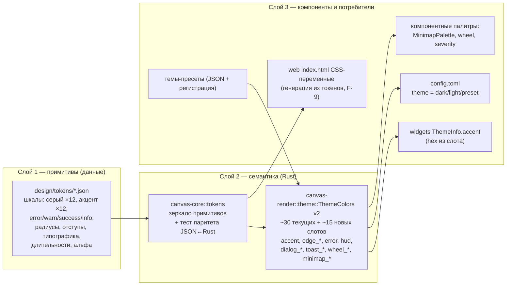

# PRD-0006: Дизайн-система и design-токены — единая точка правды визуальных характеристик

- **Статус:** в анализе
- **Тип:** PRD (документ требований продукта; реализация оформляется отдельным `FR-046` по шаблону `docs/change-requests/cr-template.md`; структура — единый шаблон `docs/prd/TEMPLATE.md`)
- **Приоритет:** важно
- **Владелец:** агент (постановка по запросу владельца, сессия 2026-09-21)
- **Источник:** запрос владельца (сессия 2026-09-21): «Можем ли мы взять перечень из UI библиотек и на основании неё реализовать свою дизайн-систему?» — в связке с предыдущим вопросом сессии об адаптации UI/визуализации и переносе тем из VSCode/Obsidian
- **Связанные документы:** PRD-0004 (§F-1 «модуль design-токенов анатомии» — первый потребитель метрических токенов, контракт стыка фиксируется в §7.2), CR-007 (урок контраста, WCAG 1.4.11), FR-038 (паттерн добавления цветового слота `guide_align`/`guide_grid` с тестами), FR-039 (модалка настроек — поверхность выбора тем/акцента), FR-040 (i18n), FR-042/FR-044/FR-045 (параллельные правки рендера — координация), ADR-0008 (allowlist зависимостей), ADR-0011 (wasm-гейт), SPEC §6.2–6.3 (рендер, бюджеты)
- **Создан:** 2026-09-21
- **Обновлён:** 2026-09-21

---

## 1. Резюме

CanvasDesk рисует весь интерфейс собственным wgpu/SDF-конвейером без UI-фреймворков (egui в стеке нет и не заводится — `crates/canvas-render/src/search_ui.rs:8`), поэтому «дизайн-система» здесь — это **система данных и правил**, а не набор DOM-компонентов. Предлагается трёхслойная система design-токенов: **примитивы** (шкалы цветов, радиусы, отступы, типографика, длительности, альфа-ступени) → **семантика** (расширенный `ThemeColors`: фон, карточки, рёбра, акцент, состояния, оверлеи) → **компонентные токены** (палитры минимапы, wheel-меню, severity-таблиц). Источник правды — JSON-файлы токенов в репозитории (структура совместима с W3C Design Tokens), зеркалируемые в платформенно-нейтральный Rust-модуль `canvas-core::tokens` с тестом паритета.

Заимствуется **контракт** (таксономия слоёв и шкал, правило шагов 1–12, минимальный семантический набор, гovernance-дисциплина) из зрелых систем — W3C Design Tokens, Material 3, Radix Colors, shadcn/Obsidian-переменные, IBM Carbon; реализация — собственная, под wgpu/SDF (заимствовать реализации DOM-библиотек невозможно и не нужно). Система стартует со значений, равных текущим константам (ноль визуального скачка — принцип PRD-0004 F-1), ликвидирует **~25 бродячих цветовых констант**, живущих мимо темы, сводит акцентный цвет к одному слоту и создаёт базу для тем-пресетов, пользовательских палитр и импорта тем VSCode/Obsidian (этапы V2).

Граница PoC: модуль токенов + `ThemeColors` v2 + полная миграция констант + единый акцент + WCAG-тесты на новые слоты + 2–3 темы-пресета как данные. Не входит в PoC: редизайн значений, color-picker в настройках, импорт чужих форматов тем, эффекты (градиенты/glow/MSAA).

---

## 2. Контекст и проблема

### 2.1 Как это выглядит сегодня

Палитровая инфраструктура существует и частично работает: `ThemeColors` (`crates/canvas-render/src/theme.rs:11-206`) — Copy-структура из ~30 семантических слотов в двух вариантах `dark()`/`light()`, горячая смена через `Renderer::set_theme` (`renderer.rs:418`) и карточки тем в модалке настроек (FR-039, `settings_ui.rs:151-215`); WGSL-шейдеры практически не содержат цветов — всё приходит per-instance атрибутами и юниформами (`cards.wgsl:15-22`, `grid.wgsl:7-19`); контраст проверяется тестами (`theme.rs:286-361`, урок CR-007, `contrast.rs`).

Однако аудит 2026-09-21 фиксирует четыре системных дефекта:

1. **Цветовые константы мимо темы — ~25 штук.** Акцентное семейство `[0.396,0.612,0.969]` размножено литералами в 9 местах (`cards.rs:24,592,648,666,1060-1064`, `renderer.rs:41`); рёбра — `EDGE_COLOR`/`FLOW_EDGE_COLOR`/`FOCUS_EDGE_COLOR` (`cards.rs:643,646,666`); severity-таблицы (`cards.rs:42-102`); красный ошибок `RESULT_ERROR_COLOR` (`text.rs:108`) и `HUD_COLOR` (`text.rs:140`); what-if/выделение текста (`renderer.rs:41-49`); вся минимапа — 7 констант, не чувствительных к теме (`minimap.rs:35-47`); wheel-меню — 6 констант с комментарием в коде «Полноценный ThemeColors для wheel — открытый вопрос» (`app.rs:4949-4957`); диалоги/тосты — тёмно-настроенные литералы (`app.rs:10726-10799`); select-рамка (`crates/canvas-app/src/lib.rs:495-497`); виджет-акцент `#3B82F6` захардкожен отдельно от всего остального (`crates/canvas-app/src/widgets.rs:109,138`); web-тулбар — 6 hex в inline CSS (`crates/canvas-web/index.html:101-156`). Итог: тема меняет ~80% поверхностей, остальное — «пятна» чужих значений.
2. **Акцент размножен минимум в четырёх несвязанных каналах**: группа/выделение в рендере, виджет-мост `ThemeInfo{accent}` (`widgets.rs:109`), web-CSS `#8ab4ff` (`index.html:156`), палитровые слоты (`theme.rs:110-111`). Смена акцента сегодня — правка в 10+ файлах.
3. **Метрики размазаны**: `HEADER_HEIGHT 34.0`, `CORNER_RADIUS 8.0`, `EDGE_DOT 2.5` (`cards.rs:19-21,627`), размеры текста 16/22, 14/20, 12/16 (`text.rs:66-102`), длительности анимаций 150/300/1200/1600 мс (`animate.rs`) — константы в разных файлах без общей шкалы. PRD-0004 §F-1 уже назначил токены анатомии must-have, но вне анатомии ноды точка правды отсутствует.
4. **Состояния не стандартизированы**: hover-заливки у каждой поверхности свои значения с плавающими альфами (`palette_hover_fill`, `WIDGET_CHROME_HOVER_FILL`, `FILL_HOVER` — три независимых решения одной задачи).

### 2.2 Чего не хватает

- Модуля **примитивов** (шкалы: серый, акцент, функциональные; радиусы; отступы; типографика; длительности; альфа-ступени) — нет ни структуры, ни файла.
- **Формата темы как данных**: тема сегодня — только бинарный выбор `Theme{Dark,Light}` (`settings.rs:44-53`); пресет/пользовательская палитра не выразимы без правок кода.
- **Компонентного слоя**: палитры минимапы/wheel/severity — плоские константы без связи с семантикой.
- **Процесса**: нет правила «новый цвет = новый слот» (нет линта/аудита), из-за чего каждая фича (FR-016, FR-017, FR-022, what-if) добавляла новые бродячие константы.
- `is_dark()` выводится из суммы байтов фона (`theme.rs:78-80`) — работает для двух встроенных тем, но сломается на кастомных палитрах этапа V2.

### 2.3 Зацепки в коде и документации

- `ThemeColors` — готовый семантический слой: расширение полями не ломает шейдеры (цвета идут инстансами/юниформами), требуется только прокидывание `&ThemeColors` в билдеры, которые его сегодня не получают (`build_edge_instances`, `build_port_instances`, `build_line_port_instances`, `build_edge_handle_instances`, `build_draft_instances` — `cards.rs:891-1051`).
- **Эталонный паттерн добавления слота уже есть**: FR-038 добавил `guide_align`/`guide_grid` в палитру с WCAG-тестами ≥3:1 на обеих темах (`theme.rs:66-72,286-313`, `guides.rs:177-187`) — масштабируется на все новые слоты.
- WCAG-механика авто-контраста (`readable_on_card`, `theme.rs:170-176`; `contrast.rs:83`) работает для произвольных заливок — новые темы проверяются ею бесплатно.
- `Settings` с `#[serde(default)]` (`settings.rs:196-283`) — обратимо расширяется полями темы без поломки старых `config.toml`.
- PRD-0004 §F-1 («модуль design-токенов анатомии… единая точка правды… старт = текущие константы») — первый потребитель метрических токенов; система настоящего PRD — его обобщение, не дубль.
- `serde_json` уже в стеке (формат `.canvas`) — паритет-тесты JSON↔Rust без новых зависимостей.
- Смена темы в рантайме отлажена (`app.rs:8206-8216`) — применение акцента/палитры идёт тем же путём.

---

## 3. Цели и метрики успеха

| # | Цель | Метрика |
|---|---|---|
| G1 | Все цвета рендера проходят через токены/палитру | `scripts/token_lint.sh` (hex-литералы) и grep-аудит цветовых литералов вне `tokens.rs`/`theme.rs`/тестов = **0** (сейчас ~25); значение фиксируется тестом-счётчиком в FR-046 |
| G2 | Тема-пресет = данные, не код | Добавление пресета не трогает `.rs` рендера: только JSON-файл + регистрация в списке; время добавления ≤ 30 мин |
| G3 | Контраст гарантирован машиной, не глазом | Автотест: все пары «графика ≥ 3:1», «текст ≥ 4.5:1» для обеих тем и каждого пресета; CI красный на непроходимой паре |
| G4 | Акцент — один источник | `ThemeColors.accent` единственный источник: выделение, группы, порты, hover-хром, виджет-мост, select-рамка; правка акцента = 1 значение (сейчас 4 канала / 10+ файлов) |
| G5 | Метрики анатомии — из токенов | `CORNER_RADIUS`/`HEADER_HEIGHT`/размеры текста читаются из `canvas-core::tokens` (значения = текущие, ноль визуального скачка — стык PRD-0004 F-1) |

---

## 4. Пользователи и сценарии

- **Персона 1 — владелец/настройщик** (герой CJM): следит за целостностью продукта, хочет менять внешний вид (акцент, темы) безопасно и без правок кода; ценит, что после смены темы «ничего не осталось неперекрашенным».
- **Персона 2 — агент-разработчик (и ИИ-агент через задачи)**: добавляет новые UI-элементы (оверлеи, бейджи, панели); ему нужен очевидный вопрос «какой цвет?» с одним ответом — слотом, а не поиском «какого оттенка был похожий элемент».
- **Персона 3 — конечный пользователь (v2)**: хочет тему под свой вкус — пресет из списка (Nord, Catppuccin…) или импорт темы VSCode/Obsidian; для PoC участвует как получатель 2–3 встроенных пресетов.

MCP-агент контентом канваса не затрагивается: темы — свойство окружения, не модели.

---

## 5. User stories и критерии приёмки

### US-1. Смена акцента одним параметром

> **Как** владелец, **я хочу** менять акцентный цвет приложения одним значением, **чтобы** выделение, группы, порты и виджеты перекрашивались согласованно.

**Acceptance criteria:**
- AC-1.1: изменение `accent` меняет цвет выделения нод/рёбер, рамки групп, hover-хром виджетов, select-рамку, каретку/выделение текста и акцент виджет-моста — без правок кода.
- AC-1.2: авто-контраст: при акценте с контрастом к фону < 3:1 тест G3 падает с указанием пары; «чернила» на акцентных заливках подбираются `readable_on_card`.

### US-2. Новый UI-элемент берёт цвет из токенов

> **Как** агент-разработчик, **я хочу** иметь обязательный слот для цвета любого нового элемента, **чтобы** не плодить бродячие константы.

**Acceptance criteria:**
- AC-2.1: добавление оверлея с цветом = добавление слота в `ThemeColors` (+ значения в `dark()`/`light()` из примитивов) — линт G1 остаётся на нуле.
- AC-2.2: новые слоты покрыты контраст-тестами на обеих темах (паттерн FR-038 `guide_align`).

### US-3. Тема-пресет как данные

> **Как** конечный пользователь, **я хочу** выбрать пресет-тему (например, Nord), **чтобы** работать в привычной палитре.

**Acceptance criteria:**
- AC-3.1: пресет — JSON-файл примитивов/семантики + одна строка регистрации; рендер-код не меняется (G2).
- AC-3.2: пресет проходит G3 автоматически (одна и та же машина контраста); выбор — карточкой в модалке настроек FR-039 рядом с тёмной/светлой.

---

## 6. CJM (Customer Journey Map) — обязательный раздел

Персона CJM — **владелец/настройщик** (§4, персона 1); канал — desktop (модалка настроек FR-039). CJM зафиксирован для PoC-границы и пересматривается после первых юзабилити-прогонов (этап D5 §13).

### 6.1 Краткий CJM (шаги)

| # | Этап | Действие пользователя | Поверхность |
|---|---|---|---|
| 1 | Вход в настройки | Кнопка настроек → модалка | модалка FR-039 |
| 2 | Выбор темы/акцента | Вкладка «Внешний вид» → карточка темы (или значение акцента) | модалка FR-039 |
| 3 | Осмотр результата | Закрыть модалку → обвести взглядом канвас: карточки, рёбра, гида FR-038, wheel-меню, минимапа, тост | канвас |
| 4 | Стресс-проверка | Открыть диалог/тост, what-if, фокус-режим — «всё ли в палитре?» | канвас/оверлеи |
| 5 | Фиксация | Перезапуск приложения — тема сохранена | config.toml |

### 6.2 Детальный CJM (мысли, эмоции, боли, точки отвала)

| Этап | Действия | Мысли | Эмоции | Боли | Точка отвала (условие → реакция) | Возможности |
|---|---|---|---|---|---|---|
| 1. Настройки | Открывает модалку | «Где внешний вид?» | спокойно (+1) | — | — | Карточки тем уже знакомы по FR-039 |
| 2. Выбор | Меняет тему/акцент | «Селектор узкий — пресетов мало» | нейтрально (0) | пока 2 встроенных темы | D1: желаемой палитры нет → «так, руками править код не буду» | V2: пресеты + импорт VSCode/Obsidian (§13) |
| 3. Осмотр | Обходит канвас | «Минимапа/меню перекрасились?» | подозрение (−1) | ранее — пятна старых цветов | D2: хотя бы одна поверхность осталась в старой палитре → недоверие к системе | G1: миграция всех ~25 констант в PoC; осмотр — чек-лист §15 |
| 4. Стресс-проверка | Диалоги, what-if, тосты | «А акцент читаем на заливке?» | ожидание (0) | акцент может слиться с фоном | D3: акцент < 3:1 → «проваливается» | G3/AC-1.2: контраст-машина + авто-«чернила» |
| 5. Фиксация | Перезапуск | «Сохранилось ли?» | спокойно (+1) | на web тема сегодня живёт до перезагрузки (config-save не подключён, `app_spawn.rs:170`) | D4: настройка слетела → раздражение | Десктоп — config.toml уже работает; web-persist — should F-9/§12 R4 |

### 6.3 Трассировка точек отвала

Каждая точка отвала CJM обязана иметь митигацию в требованиях (§8) или рисках (§12): D1 → F-8 (пресеты) + §13 V2 (импорт); D2 → G1/F-3 (полная миграция, чек-лист §15); D3 → G3/F-5 (контраст-тесты) + AC-1.2; D4 → F-9 (web-persist, should) + §12 R4.

---

## 7. Решение

### 7.1 Концептуальная схема

Правило потока: **цвет приходит в шейдер только из инстанса/юниформа, заполненного из `ThemeColors` (или компонентной палитры, построенной из неё); литерал в билдере = дефект** (проверяется аудитом G1).

### 7.2 Точка интеграции в архитектуре

| Элемент | Решение |
|---|---|
| Файлы токенов | `design/tokens/*.json` в корне репозитория (структура `$name/$type/$value`, совместимая по духу с W3C Design Tokens); парсится только тестами и генератором CSS — рантайм их не читает |
| Rust-зеркало | `crates/canvas-core/src/tokens.rs` — платформенно-нейтральные константы (правило «core без GPU/ОС» соблюдено: данные, не рендер); тест паритета сверяет JSON↔Rust (`serde_json` — уже в стеке, новых зависимостей нет — ADR-0008) |
| Семантика | `canvas-render/src/theme.rs`: `ThemeColors` расширяется слотами (§8 F-2); `dark()`/`light()` собираются из `canvas-core::tokens` (G5-стык: метрики — тоже); прокидывание `&ThemeColors` в билдеры `cards.rs`, которым тема не передаётся |
| Компонентный слой | `MinimapPalette::from_theme` (minimap.rs), wheel-палитра из темы (закрывает открытый вопрос `app.rs:4949-4951`), severity — таблицы строятся от функциональных примитивов error/warn |
| Акцент | `ThemeColors.accent` → все 9 акцентных литералов, `ThemeInfo{accent}` (widgets.rs), `SELECT_RECT_*` (lib.rs); web `#8ab4ff` — через F-9 |
| Линт | `scripts/token_lint.sh` — grep hex-литералов (`0x??????`, `#??????`) вне разрешённого списка (`tokens.rs`, `theme.rs`, шейдеры без цветов, тесты, легальные не-цветовые hex-использования); локальный гейт, в CI не обязателен (вопрос Q6) |
| Пресеты | JSON поверх примитивов + регистрация в перечне тем; UI — карточки модалки FR-039 |
| Стык с PRD-0004 | F-1 анатомии потребляет `canvas-core::tokens` (высоты/отступы/типографика зон A–E); настоящий PRD не вводит второй системы — F-1 есть её подмножество; значения стартуют = текущим (ноль скачка) |
| Координация параллелям | FR-042/FR-044/FR-045 активно правят `cards.rs`/`text.rs`/`app.rs` — ветки FR-046 короткие и по файлу-теме (`theme.rs`/`tokens.rs` — только у нас; правки в общих файлах — малые диффы, семантический мердж по образцу T-038.4) |

### 7.3 Отвергнутые варианты

| Вариант | Вердикт | Причина |
|---|---|---|
| Взять готовую библиотеку компонентов (Radix Themes, shadcn/ui) | отклонено | DOM-реализации неприменимы к wgpu/SDF-стеку; заимствуем только таксономию/шкалы |
| Полный конвейер Style Dictionary (node-кодоген) в CI с первого этапа | отложено (V2) | новая toolchain-зависимость и node-шаг в CI ради 3 целей-выходов; на PoC — ручная синхронизация + тест паритета, который ловит расхождение |
| Третий вариант `Theme::Nord` в enum | отклонено | бинарные выборы `PRESET_COLORS_DARK/LIGHT`, severity-таблиц и `is_dark()` разъезжаются; темы — данные, не enum |
| Хранить тему в `.canvas` | отклонено | тема — свойство окружения, не контент модели; round-trip и совместимость не трогаем |
| Кастомные палитры пользователя + импорт VSCode/Obsidian в PoC | отложено (V2) | ценность есть, но без G1/G4 миграции импорт ляжет на «пятнистый» UI; PoC строит фундамент |

---

## 8. Функциональные требования

| ID | Требование | Приоритет | Приёмка |
|---|---|---|---|
| F-1 | Модуль примитивов: JSON-файлы `design/tokens/` (шкала серых ×12, акцентная шкала ×12, функциональные error/warning/success/info, радиусы, отступы, типографика, длительности, альфа-ступени) + зеркальный `canvas-core::tokens`; значения = текущие константы там, где аналог существует | must | G1, G5; тест паритета JSON↔Rust |
| F-2 | `ThemeColors v2`: к текущим ~30 слотам добавить `accent`, `accent_soft`, `edge_default`, `edge_flow`, `edge_focus`, `edge_draft`, `selection`, `selection_fill`, `broken`, `error`, `hud`, `dialog_fill`, `dialog_border`, `dialog_text`, `toast_text`, `whatif_fill`, `whatif_badge`, `wheel_*` (dim/category/template/hover/hub/border), `select_rect_fill`, `select_rect_border`; обе темы заполняются из примитивов | must | AC-2.1; US-2 |
| F-3 | Полная миграция бродячих констант (перечень §2.1: акцентное семейство ×9, рёбра, severity, error/HUD, what-if/выделение, минимапа, wheel, диалоги/тосты, select-рамка, групповой drop-подсвет, пульс результата) на слоты; сигнатуры билдеров принимают `&ThemeColors` | must | G1 = 0; чек-лист §15 |
| F-4 | Единый акцент: `ThemeColors.accent` — единственный источник для выделения/групп/портов/hover-хрома/виджет-моста (`ThemeInfo.accent` из слота, не `#3B82F6`) | must | G4; AC-1.1 |
| F-5 | Контраст-машина расширена на все новые слоты (обе темы): графика ≥3:1, текст ≥4.5:1; существующие пары, не проходящие порог, фиксируются в FR-046 как известные исключения с задачей подстройки — молчаливой смены визуала нет | must | G3; AC-1.2; CR-007 |
| F-6 | Метрики анатомии (`CORNER_RADIUS`, `HEADER_HEIGHT`, размеры текста, длительности) читаются из `canvas-core::tokens`; значения = текущие; PRD-0004 F-1 — потребитель этого же модуля | must | G5; стык §7.2 |
| F-7 | Токен-линт `scripts/token_lint.sh` (hex-литералы вне токенов/темы/тестов = ошибка) + прогон в локальном гейте FR | should | G1 регресс-защита |
| F-8 | 2–3 темы-пресета как данные (кандидаты — Nord, Catppuccin Mocha, Solarized Light; состав — Q3) + карточки выбора в модалке FR-039 | should | G2; AC-3.1/3.2 |
| F-9 | Web: генерация CSS-переменных `index.html` из токенов (6 hex убираются из ручного ведения) + подключение сохранения конфига на web (тема переживает перезагрузку) | should | D4; AC US-3 |
| F-10 | Кастомные палитры пользователя (`config.toml [theme.custom]`), импорт VSCode/Obsidian, color-picker, `?theme=` URL — этап V2, отдельный FR | could | §13 V2 |

---

## 9. Нефункциональные требования

1. **Архитектура/wasm:** токены — данные в `canvas-core` (без GPU/ОС-зависимостей), собираются под wasm32 (ADR-0011, `scripts/wasm_gate.sh`); JSON парсится только в тестах/генераторе — рантайм ядра читает Rust-константы.
2. **Производительность:** `ThemeColors` — Copy-структура, строится на смену темы, не в кадре; бюджеты SPEC §6.3 не затрагиваются (60 fps, старт < 2 с).
3. **Формат:** `.canvas` и JSON Canvas не изменяются; темы — не контент канваса.
4. **Совместимость настроек:** расширения `config.toml` — только с `#[serde(default)]` (старые конфиги читаются без миграций); web-persist (F-9) не меняет схему.
5. **Зависимости:** новых крейтов нет (`serde_json`, `toml` уже в стеке) — ADR-0008 не нарушается.
6. **TDD/a11y:** тесты контраста до миграции (паттерн FR-038); язык комментариев — русский (AGENTS.md); каждая мигрируемая конста сохраняет значение (ноль визуального скачка), исключения — только через F-5-протокол.

---

## 10. Non-goals

- **Не редизайним значения** — токены стартуют с текущих констант; эстетические правки — отдельные решения владельца (принцип PRD-0004 F-1).
- **Не темизируем содержимое виджетов** (WebView2-хост рендерит сам; мост получает только `accent`).
- **Не делаем эффекты** (градиенты, glow/bloom, MSAA, фоновые изображения) — отдельные задачи, токены лишь закладывают слоты, если понадобятся.
- **Не делаем per-node/per-edge стилистику richer, чем есть** (`node.color`, `edge.style/thickness` остаются как есть).
- **Не меняем UI-морфологию** — дизайн-система не добавляет панели/табы; это данные для существующих поверхностей.
- **Не реализуем импорт чужих тем в PoC** — V2 (F-10).

---

## 11. Открытые вопросы

- **Q1.** Формат файлов токенов: упрощённый W3C-совместимый (`$type`/`$value` на группе) без полной валидации спецификации — или строго DTCG-валидный? Влияние: тулинг V2 (Tokens Studio/Style Dictionary). Предложение: упрощённый. Решает: владелец.
- **Q2.** Размещение: `design/tokens/` в корне репо (видно документации/дизайнерам) vs `crates/canvas-core/tokens/` (include_str! без выхода за крейт). Предложение: корень `design/tokens/`; include_str! по относительному пути допустим. Решает: владелец.
- **Q3.** Состав встроенных пресетов F-8 (какие 2–3 палитры) — предложение: Nord, Catppuccin Mocha, Solarized Light. Решает: владелец (по демо).
- **Q4.** Минимапа: слоты в `ThemeColors` (проще, но +7 полей) vs отдельная `MinimapPalette` (чище по слоям). Предложение: отдельная компонентная палитра `from_theme`. Решает: агент на FR-046 (не блокирует).
- **Q5.** Акцент: только внутри тем (v1) или отдельная настройка `accent_color` в `config.toml` уже в PoC? Предложение: v1 — внутри тем; отдельная настройка — V2 вместе с color-picker. Решает: владелец.
- **Q6.** Токен-линт: локальный скрипт (предложение) vs обязательный шаг CI. Влияние: правки ci.yml (отдельный риск при параллельных волнах). Решает: владелец.

---

## 12. Риски и митигации

| Риск | Влияние | Митигация |
|---|---|---|
| Визуальный регресс при миграции 25+ констант | Доверие к UI | «Старт = текущие значения» (F-1/F-6); скриншот-сверка демо-сценариев §15 до/после; любые отличия — только через F-5-протокол (фиксация исключения) |
| Два токен-модуля (настоящий PRD vs PRD-0004 F-1) | Двойная работа, расхождение | Единый `canvas-core::tokens`; F-1 — потребитель; контракт стыка зафиксирован в §7.2 и в FR-046; координация по §13 этапам |
| Параллельные волны (FR-042/044/045) правят те же файлы | Конфликты слияния | Ветки короткие; `theme.rs`/`tokens.rs` — монополия FR-046; правки в `cards.rs`/`app.rs` — точечные; семантический мердж по образцу T-038.4; `git fetch --ff-only` перед каждым шагом |
| WCAG-тесты вскрывают непроходимые существующие пары | Красный CI, соблазн «подкрасить» | Протокол F-5: пара документируется как известное исключение, подстройка значения — отдельным решением владельца, не молча |
| Ложные срабатывания линта (hex ≠ цвет: Win32-коды, магия в shell-крейте) | Шум в гейте | Линт — только по hex-литералам + белый список файлов/паттернов; цветовые f32-массивы — дисциплина аудита, не линта (честно отражено в F-7) |
| Web-persist (F-9) затрагивает localStorage-контракты | Регресс web-сессий | F-9 — should, изолированный этап D4; сохранение — тем же ключом `canvasdesk.config`, дифф только в записи |

---

## 13. Дорожная карта

| Этап | Содержание | Результат |
|---|---|---|
| D0 | FR-046 по шаблону `cr-template.md` (анализ, точки входа, инварианты, план по файлам) | Разрешение на реализацию |
| D1 | `design/tokens/*.json` + `canvas-core::tokens` + тест паритета JSON↔Rust (F-1) | Примитивы как данные |
| D2 | `ThemeColors v2` (F-2) + миграция констант (F-3) + контраст-тесты новых слотов (F-5) | G1 = 0, палитра едина |
| D3 | Единый акцент до виджет-моста и select-рамки (F-4) + метрики из токенов (F-6) + токен-линт (F-7) | G4, G5 |
| D4 | Пресеты тем как данные + карточки в модалке (F-8); web: CSS-переменные + persist (F-9) | G2; CJM шаг 5 закрыт |
| D5 | Приёмка: ACCEPTANCE.md §, точки входа §14, статусы, метрики G1–G5 замерены, вопрос по онбордингу/user-docs (AGENTS.md) | PoC закрыт |
| V2 | Кастомные палитры `[theme.custom]`, импорт VSCode/Obsidian, color-picker, `?theme=` (F-10); опционально Style Dictionary | Пользовательский контур тем |

---

## 14. Точки входа в документацию (обязательные обновления при реализации)

- `docs/change-requests/fr-046-design-tokens.md` — реализационный FR (создаётся на D0).
- `docs/prd/README.md` — индекс каталога PRD (статус, ссылка) — обновляется тем же коммитом, что и PRD.
- `docs/index.md` — ссылка на этот PRD (раздел «PRD — требования продукта»).
- `docs/SPEC.md` §6 — подраздел о палитре/токенах при реализации (D2–D3).
- `docs/ACCEPTANCE.md` — приёмка волны FR-046 (D5).
- `docs/interface-objects/*.md` — только если документы фиксируют конкретные цвета поверхностей (сверить на D5).
- `user-docs/` — по правилу AGENTS.md: вопрос владельцу об онбординге/документации обязателен при завершении (темы/акцент касаются страниц настроек).

---

## 15. Проверка (Definition of Done PoC)

- [ ] Гейты зелёные: `cargo fmt --all --check`, `cargo clippy --workspace --all-targets -- -D warnings`, `cargo test --workspace`, `scripts/wasm_gate.sh`, `scripts/mcp_wasm_gate.sh`.
- [ ] G1: grep-аудит цветовых литералов вне `tokens.rs`/`theme.rs`/тестов = 0; `token_lint.sh` (F-7) зелёный.
- [ ] Тест паритета `design/tokens/*.json` ↔ `canvas-core::tokens` зелёный.
- [ ] G3: контраст-тесты покрывают все новые слоты на обеих темах (и пресетах, если F-8 принят); известные исключения задокументированы в FR-046.
- [ ] G4: смена `accent` в одной точке меняет выделение/группы/порты/hover-хром/виджет-акцент; `ThemeInfo.accent` приходит из палитры.
- [ ] G5: `CORNER_RADIUS`/`HEADER_HEIGHT`/типографика читаются из `canvas-core::tokens`, значения равны текущим (ноль визуального скачка).
- [ ] Демо-сценарий CJM §6 пройден: смена темы → осмотр канваса (карточки, рёбра, гида, wheel, минимапа, тосты, диалоги, what-if) — неперекрашенных поверхностей нет.
- [ ] F-8: пресет добавлен как данные, рендер-код не менялся (дифф-проверка).
- [ ] Метрики G1–G5 зафиксированы в ACCEPTANCE.md.

---

## 16. История изменений

- `2026-09-21` — агент: создан документ (PRD-0006), статус `в анализе`; постановка по запросу владельца о создании дизайн-системы на основе перечней UI-библиотек; аудит визуального стека 2026-09-21 (тема, ~25 бродячих констант, метрики, состояния); решение — трёхслойные design-токены с заимствованием таксономий (W3C DTCG/Material 3/Radix/shadcn/Carbon), стык с PRD-0004 F-1; вопросы Q1–Q6 владельцу.

## 17. Источники истины

- Запрос владельца (сессия 2026-09-21): «Можем ли мы взять перечень из UI библиотек и на основании неё реализовать свою дизайн-систему?» — и предшествующее обсуждение адаптации UI/визуализации, тем VSCode/Obsidian.
- Код (аудит 2026-09-21): `crates/canvas-render/src/theme.rs:11-206` (палитра), `:78-80` (is_dark), `:286-361` (контраст-тесты); `crates/canvas-render/src/cards.rs:19-26,42-102,136-156,592,625-666,1060-1064` (константы); `crates/canvas-render/src/text.rs:35-140` (шрифты, размеры, HUD/error); `crates/canvas-render/src/renderer.rs:41-49,418,1263` (селекция/what-if, set_theme, clear); `crates/canvas-render/src/minimap.rs:35-47`; `crates/canvas-render/src/guides.rs:177-187` (паттерн слота FR-038); `crates/canvas-render/src/grid.rs:52-90`; `crates/canvas-app/src/app.rs:4949-4957,8206-8216,10726-10799` (wheel, смена темы, диалоги/тосты); `crates/canvas-app/src/lib.rs:495-497`; `crates/canvas-app/src/widgets.rs:109,138`; `crates/canvas-web/index.html:101-156`; `crates/canvas-web/src/app_spawn.rs:170`; `crates/canvas-core/src/settings.rs:44-53,196-283`.
- Документы: `docs/prd/prd-0004-node-anatomy-restructure.md` §F-1, §2.3, §7.3; `docs/change-requests/fr-038-snap-grid-alignment.md` (паттерн слота + WCAG-тесты); CR-007 (контраст); FR-039 (модалка настроек); FR-040 (i18n); `docs/SPEC.md` §6.2–6.3; ADR-0008 (зависимости), ADR-0011 (wasm-гейт).
- Внешние: W3C Design Tokens Community Group (формат `$type`/`$value`), Material 3 design tokens (роли/шаги состояний), Radix Colors (шкалы ×12, правило шагов), shadcn/ui theming (семантические CSS-переменные), IBM Carbon token governance — заимствуется таксономия, не реализации.

