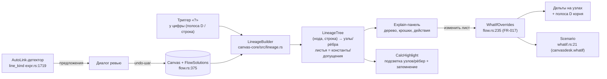

# PRD-0007: Цепочка расчёта цифры — explain-дерево происхождения любого значения, сценарии в моменте, автосвязь и режим защиты

- **Статус:** в анализе
- **Тип:** PRD (документ требований продукта; реализация оформляется отдельным `FR-047` по шаблону `docs/change-requests/cr-template.md`; структура — единый шаблон `docs/prd/TEMPLATE.md`)
- **Приоритет:** критично
- **Владелец:** агент (оформление по запросу владельца, сессия 2026-09-21)
- **Источник:** запрос владельца от 2026-09-21 — «Сейчас рассказывал жене концепт развития функции main stage в сторону визуализации цепочки расчёта любой цифры из модели. При защите бюджетов под продукты и проекты нужно уметь молниеносно отвечать за любую цифру, понимая всю глубину своего расчёта. При этом делать это по формулам в Excel сложно — там нет функционала для визуализации цепочки появления цифры… Моя идея: на схеме для моделирования можно взять любую расчётную цифру, нажать на вопрос рядом с ней и получить детализацию всех переменных входящих в её расчёт и всей цепочки этого расчёта… Мы с Лёшей Кимом — моим аналитиком финансовых продуктов в СвязьОН, считали юнит-экономику для продукта "Аренда устройства". В расчёте кроме базовых цифр был ещё расчёт рисков невыплат арендных взносов и вообще полного невозврата устройства на базе NPL 90+, коэффициенты стоимости сдачи устройства в трейд-ин и многое другое. Таблиц у нас было примерно 5 таблиц и полноценно в каждой разбирался только Лёша. Встреч по этому продукту было 3 или 4 и каждую новую итерацию расчётов мы проходили по одним и тем же вопросам от CEO, CFO и CCO — как вы посчитали эту цифру, почему эта цифра такая и т.д. Очевидно, когда принимаются решения о выделении бюджетов в 100-250-500 миллионов, каждая цифра определяет будет ли принято положительное решение или нет. И цифры должны быть настолько прозрачными, чтобы решение можно было принять за минуты, а не за часы споров». Дополнительно зафиксированы ответы владельца на 8 уточняющих вопросов (та же сессия): триггер — «комбо» (панель с деревом + синхронная подсветка рёбер на канвасе); глубина — полное рекурсивное дерево до констант и допущений; допущения — обычные листовые узлы без визуального спец-типа; what-if — полный менеджер сценариев (именованные варианты, сравнение таблицей, возврат в один клик); связи — автосвязь (система находит совпадающие имена строк и предлагает связать); отдельный режим защиты бюджета — да; соотношение с FR-044 — цепочка расчёта есть частный случай связей (рёбер зависимостей) и LOD, одна концепция; метрика успеха — комбо (время до ответа + доля цифр с раскрытой цепочкой + число вариаций сценария за встречу).
- **Связанные документы:** FR-017 (`what-if`, реализовано CP6), fr-044-mainstage-fan-readability-qualified-refs.md (панель «Как считается», подсветка зависимостей, qualified refs), fr-045-node-anatomy-data-source-unmapped-calc-trace.md (R-4 прозрачность расчёта, R-5 нотация «Объект.Поле»), FR-042 (`bundles.rs`, main stage, LOD-0), PRD-0002 (пучки/main stage), PRD-0004 (анатомия зон A–E, LOD L0/L1/L2, полоса D), PRD-0006 (design-токены, ThemeColors v2), PRD-0001 (внешние данные — вне скоупа, по решению владельца), ADR-0007/0008, `docs/SPEC.md` §5.1/§6.2/§6.3, `docs/interface-objects/node.md`, `docs/interface-objects/edge.md`
- **Создан:** 2026-09-21
- **Обновлён:** 2026-09-21

---

## 1. Резюме

Защита бюджета — это экзамен на происхождение цифр: когда на кону решение о 100–500 млн, каждый вопрос «почему эта цифра такая?» должен закрываться за минуты, а не за часы споров. Сегодня владелец решает эту задачу в Excel и связке из 5 таблиц, где цепочку появления цифры нужно восстанавливать в голове или рисовать статичную картинку в презентации; на каждой итерации расчёта комитет CEO/CFO/CCO задаёт одни и те же вопросы, и полноценно в каждой таблице разбирается только автор расчёта. PRD-0007 переносит этот экзамен в CanvasDesk и делает его выигрышным: у любой вычисляемой цифры модели появляется триггер «?», открывающий **полную цепочку расчёта** — рекурсивное дерево происхождения от выбранной цифры до исходных констант и допущений, с живыми значениями, формулами и квалифицированными адресами «Объект.Поле» на узлах.

Решение реализовано как **комбо** (выбор владельца): справа — панель с деревом, на канвасе — синхронная подсветка узлов и рёбер цепочки с затемнением остального (паттерн `FocusView`), так что объяснение не отрывается от контекста модели. Дерево — не новая сущность, а **проекция уже существующих связей**: рёбра потока значений (FR-014), построчные зависимости Numi-строк (FR-013), спиллы параметров (FR-029) и адресованные входы собираются чистой функцией в lineage-модель. Листья дерева — константы и допущения (NPL 90+, коэффициент трейд-ина) — обычные узлы без спец-типа (решение владельца), отличающиеся только отсутствием формулы. Прямо из дерева допущение можно изменить в моменте: подмена идёт через рантайм-механизм what-if FR-017 (`WhatIfOverrides`), база не мутируется, дельты видны и в дереве, и в полосе результата; вариации сохраняются как именованные сценарии с таблицей сравнения и возвратом в один клик — это уже работающая инфраструктура FR-017, PRD-0007 лишь подводит к ней контекст дерева.

Две поддерживающие механики замыкают сценарий продуктового комитета. **Автосвязь** решает боль «5 таблиц и полноценно разбирается только автор»: детектор сканирует именованные присваивания Numi-строк (`name = …`) всех расчётных нод канваса, находит совпадающие имена и предлагает связи через диалог ревью — подтверждённые рёбра создаются одним undo-шагом. **Режим защиты** готовит цепочку к большому экрану: крупная типографика, пошаговое раскрытие уровней дерева (клик = следующий уровень) и скрытие служебных строк — чтобы CPO показывал расчёт, а не интерфейс.

PoC-граница: один канвас (межканвасная автосвязь — v2), без изменений движка расчётов (`flow.rs`/`expr.rs` — только чтение), без загрузки внешних данных («загрузка данных из внешних источников остаётся на будущее» — решение владельца, PRD-0001 — отдельный трек), формат `.canvas` не расширяется (сценарии уже сериализуются в `canvasdesk.whatif`). Позиционирование относительно направления «LOD-политика и связи» (PRD-0004, fr-044/fr-045): цепочка расчёта — частный случай связей и LOD; explain-механика наследует панель «Как считается» одной ноды (fr-044) и обобщает её на полное дерево любой цифры, не дублируя и не заменяя её.

---

## 2. Контекст и проблема

### 2.1 Как это выглядит сегодня

**Модель и расчёт.** Ноды и рёбра — `Node` (`crates/canvas-core/src/model.rs:171`) и `Edge` (`crates/canvas-core/src/model.rs:501`). Расчёт — DAG-движок FR-014: топологическая сортировка `topo_sort` (`crates/canvas-core/src/flow.rs:78`, ошибка цикла `CycleError` `flow.rs:65`), прямой прогон `propagate` (`flow.rs:223`) и построчная версия `propagate_with_lines_data` (`flow.rs:375`) — каждая строка Numi-листа получает своё значение. Адресация входов: `inbound_slots`/`inbound_slots_with_lines` (`flow.rs:539/555`), спиллы параметров шаблонных нод `param_spills` (`flow.rs:698`), неподставленные входы `unmapped_inputs_with_data` (`flow.rs:758`). Именованные присваивания строк (`name = expr`) — семантика переменных: `NumiLineKind::Assignment { name }` (`crates/canvas-core/src/expr.rs:1699`), детектор рода строки `line_kind` (`expr.rs:1719`).

**Что уже показывает прозрачность расчёта.** Панель «Как считается» у приёмника в main stage с группами «Переменные · входящие значения» / «Расчёт · формулы» и подсветка зависимостей кликом по формуле (fr-044, этап-ядро canvas-core реализовано: раскладка веера и коридор в `bundles.rs`, интеграция `dataref.rs`) — но только для одной ноды и только внутри main stage. Те же две группы в теле ноды на LOD L2 (fr-045 R-4). Квалифицированные адреса «Объект.Поле» — единая точка сборки `display_ref` (`crates/canvas-core/src/dataref.rs:108`, `InputRef` `dataref.rs:157`, `FormulaDisplay` `dataref.rs:205`). Пучки рёбер и main stage — FR-042 (`EdgeBundleIndex` `crates/canvas-core/src/bundles.rs:293`, `main_stage_rect` `bundles.rs:258`, подсветка доминантного ребра `dominant_edge` `bundles.rs:360`). What-if сценарии — FR-017, реализовано (CP6): структуры `Scenario`/`StaleOverride` (`crates/canvas-core/src/whatif.rs:21/31`), сериализация в `canvasdesk.whatif` (`scenarios_from_canvas`/`scenarios_to_canvas` `whatif.rs:39/70`), валидация протухших override'ов (`validate_scenario` `whatif.rs:119`), рантайм-подмены `WhatIfOverrides` (`flow.rs:235`) и `whatif_virtual_text` (`flow.rs:276`), дельты формата `50% → 83% (+33пп)`, нижний бар с именованными сценариями, таблицей сравнения и Apply одним undo-шагом, MCP-инструменты `ln_set_override`/`ln_set_param`/`whatif_scenario_create`/`ln_deltas`.

**Отображение цифр.** Итог ноды — полоса результата D (контракт PRD-0004 F-6); построчные результаты — рядом со строками тела (FR-013); построчные порты — правый рейл по `result_row_y` (`crates/canvas-render/src/text.rs:225`, FR-025). Затемнение нерелевантного — готовый паттерн `FocusView` (`crates/canvas-render/src/cards.rs:675`, `FOCUS_DIM_FLOOR = 0.35` `cards.rs:661`). Цвета — через `ThemeColors` v2 (PRD-0006, FR-046 v1); подписи — через i18n RU/EN (FR-040).

### 2.2 Чего не хватает

1. **Триггера «почему?» у цифры.** Ни полоса D, ни построчные ряды, ни значения на портах не дают доступа к происхождению значения: чтобы объяснить цифру, инженер вручную идёт по нодам и строкам вспять. У owner'а в кейсе на это уходили часы и личное присутствие аналитика.
2. **Рекурсивного дерева происхождения.** Панель fr-044 показывает входы одной ноды; `value_path` (`flow.rs:870`) находит только кратчайший путь между двумя заданными нодами без дерева, строк и чисел на ветках. Нет чистой функции, которая для произвольной цифры строит полный ациклический подграф её происхождения до листьев.
3. **Синхронной подсветки «дерево ↔ канвас»** для произвольной цифры вне main stage: подсветка зависимостей fr-044 живёт в stage и ограничена парой нод пучка.
4. **What-if в контексте дерева.** Сценарии FR-017 адресуются из нижнего бара строкой ноды; нет связки «этот лист дерева, который я сейчас показываю комитету, → изменить → вариация сценария с дельтой именно в этом поддереве».
5. **Автосвязи по именам.** Связи проводятся только вручную (drag, зона CR-003, авто-стороны CR-008); совпадающие имена переменных между нодами-«таблицами» не обнаруживаются и не предлагаются — ручная расшивка межтабличных зависимостей и есть боль «5 таблиц».
6. **Режима защиты.** Main stage — детализация пары нод; крупной типографики, пошагового раскрытия цепочки и скрытия служебных (проза) строк нет — показывать расчёт с проектора не на чем.

### 2.3 Зацепки в коде и документации

- `value_path` (`flow.rs:870`) — готовый BFS-паттерн upstream-обхода по рёбрам; обобщается в дерево заменой «родителей» на полный сбор входов с построчной адресацией.
- `inbound_slots_with_lines` (`flow.rs:555`) + `whatif_virtual_text` (`flow.rs:276`) — готовые функции адресации «нода + строка»: узел дерева напрямую маппится в override-цель FR-017 `(node, line, expr)`.
- Инфраструктура сценариев FR-017 переиспользуется целиком: создание/валидация/дельты/сравнение/MCP — новых механизмов хранения не нужно.
- Панель «Как считается» и `StageCalcFocus` (fr-044) — готовый паттерн подсветки зависимостей; PRD-0007 обобщает его с пары нод stage на рекурсивное поддерево основного канваса.
- `line_kind` (`expr.rs:1719`) — детектор именованных присваиваний для автосвязи: чистая функция, вердикт совпадает с движком.
- `display_ref` (`dataref.rs:108`) — подписи узлов дерева «Объект.Поле» без новой нотации.
- `EdgeBundleIndex` (`bundles.rs:293`) + `dominant_edge` (`bundles.rs:360`) — подсветка цепочки совместима с LOD-0 агрегацией: внутри пучка подсвечивается доминантное ребро, бейдж `×N` сохраняется.
- `FocusView` (`cards.rs:675`) — прецедент затемнения нерелевантного фона для комбо-подсветки и режима защиты.
- Токены `ThemeColors` v2 (FR-046), модалка настроек FR-039, i18n FR-040, undo FR-006 (`pending_undo`/`restore_canvas`), MCP `graph_validate`/`edges_list` (FR-032) — готовые поверхности для новых элементов.
- Модалка настроек FR-039 (разделы «Связи и порты») — место для тумблера автосвязи; `user-docs/hotkeys.md` + `HOTKEYS` (`crates/canvas-app/src/lib.rs`) — синк хоткея режима защиты.

---

## 3. Цели и метрики успеха

| # | Цель | Метрика |
|---|---|---|
| G1 | Молниеносный ответ на «почему цифра такая?» | От клика по «?» до полностью построенного дерева ≤ 3 с на модели 200 нод / 600 рёбер (замер демо-сценария §15); вопрос комитета закрывается ≤ 2 мин без выхода из канваса |
| G2 | Покрытие: объяснима любая цифра | 100% вычисляемых цифр (полоса D, построчные результаты) имеют доступный триггер «?»; на 100% ациклических цепочек дерево доходит до листьев (констант/допущений); цикл отображается терминальным узлом ошибки |
| G3 | Вариации в моменте | ≥ 5 именованных вариаций сценария показано за одну встречу без выхода из explain-режима (против 3–4 встреч-итераций кейса владельца); каждая вариация — с дельтой к базе |
| G4 | Автосвязь экономит ручную расшивку | На эталоне «5 таблиц юнит-экономики» детектор находит ≥ 80% целевых межтабличных зависимостей (recall по подготовленному списку), точность предложений ≥ 90% (precision по ревью-диалогу) |
| G5 | Не просадить кадр и построение | 60 fps пан/зум при 1000 нод / 3000 рёбер (замер `--stress`, бюджет `SPEC.md` §6.3); построение дерева ≤ 100 мс на той же модели; подсветка не ломает LOD-0 агрегацию пучков |
| G6 | Без поломки формата | Round-trip `.canvas` зелёный; новых сериализуемых полей нет — сценарии живут в существующем `canvasdesk.whatif` (FR-017) |
| G7 | Совместимость с существующими режимами | main stage (FR-042), панель «Как считается» (fr-044), what-if бар (FR-017), wheel-меню — без регрессий; оверлеи взаимоисключимы (паттерн Q6 FR-042) |

---

## 4. Пользователи и сценарии

1. **CPO / Head of Product** (основная персона, герой CJM §6) — защищает бюджеты продуктов на продуктовом комитете; должен молниеносно отвечать на вопросы CEO/CFO/CCO «почему цифра такая» и «что если», не вспоминая расчёт, а показывая его. Ему нужны: клик → полная цепочка; смена допущения в моменте; читаемость с проектора.
2. **Аналитик финансовых моделей** (прототип роли — аналитик финансовых продуктов, кейс «Аренда устройства») — собирает модель из нескольких нод-таблиц (риск NPL 90+, трейд-ин, платёжная сетка); нуждается в автосвязи по совпадающим именам, чтобы расшить межтабличные зависимости за минуты, и в том, чтобы каждая его цифра была «доказуемой» без личного присутствия на каждой встрече.
3. **CEO / CFO / CCO** (наблюдатели решения) — канвас не трогают; читают дерево с экрана; задают «а если X = Y?» — ожидают мгновенного показа вариации, а не «вернёмся с ответом после встречи».
4. **ИИ-агент (MCP)** — строит и валидирует модели программно (FR-032/FR-033); объяснение происхождения цифры текстовой выдачей делает агента полноценным участником подготовки к защите (could, F-9).

---

## 5. User stories и критерии приёмки

### US-1. Открыть цепочку любой цифры

> **Как** CPO на продуктовом комитете, **я хочу** нажать «?» рядом с любой цифрой модели и увидеть полную цепочку её расчёта, **чтобы** отвечать на вопросы «почему такая» за минуты, не восстанавливая расчёт по памяти.

**Acceptance criteria:**
- AC-1.1: триггер «?» доступен у полосы результата D (итог ноды) и у каждого построчного результата Numi-листа; появляется на hover/выделении (LOD L1+ по политике PRD-0004), клик открывает explain-панель.
- AC-1.2: панель открывает дерево, корень которого — выбранная цифра с текущим значением; построение ≤ 3 с на модели 200 нод (G1).
- AC-1.3: открытие панели не мутирует модель и не требует выхода из текущего масштаба; закрытие — Esc, клик по фону, крестик панели.
- AC-1.4: у цифры без входов (лист-константа) панель показывает единственный узел с пометкой «исходное значение» — триггер никогда не «повисает» (D1).

### US-2. Пройти вглубь до допущения

> **Как** CPO, **я хочу** раскрывать цепочку вглубь до исходных констант и допущений (NPL 90+, коэффициент трейд-ина), **чтобы** показать комитету всю глубину расчёта и чем именно «набита» каждая цифра.

**Acceptance criteria:**
- AC-2.1: дерево строится рекурсивно до листьев; узел дерева — (нода, строка): расчётные узлы показывают формулу строки, значение и квалифицированный адрес («Объект.Поле», `display_ref`), листья — значение без формулы.
- AC-2.2: допущения и константы — обычные узлы без визуального спец-типа (решение владельца); их отличает только отсутствие формулы; спец-семантика (владелец/подтверждение) — вне PoC (§10).
- AC-2.3: клик по узлу — фокус на его поддереве, навигация «вверх к корню» доступна хлебными крошками; глубина не ограничена.
- AC-2.4: цикл в данных — терминальный узел «цикл» с указанием ребра (источник `CycleError`, `flow.rs:65`), построение не зависает.
- AC-2.5: неподставленные входы (`unmapped_inputs`, `flow.rs:747`) — терминальные узлы «значение не подставлено» в стиле fr-045 R-3.

### US-3. Видеть цепочку на канвасе (комбо)

> **Как** CPO, **я хочу**, чтобы при открытой панели соответствующие узлы и рёбра подсвечивались прямо на канвасе, **чтобы** объяснение не отрывалось от модели и комитет видел структуру связей.

**Acceptance criteria:**
- AC-3.1: при открытой панели все ноды и рёбра цепочки подсвечены на канвасе (единая подсветка из lineage-модели), остальной канвас затемнён (паттерн `FOCUS_DIM_FLOOR`, `cards.rs:661`).
- AC-3.2: внутри пучка LOD-0 (FR-042) подсвечивается доминантное ребро (`dominant_edge`, `bundles.rs:360`); бейдж `×N` читаем; подсветка не пересобирает геометрию рёбер.
- AC-3.3: дерево и подсветка строятся из одного снапшота модели — рассинхрон невозможен (инвариант F-5); правки модели на живой канвас инвалидируют панель и подсветку атомарно.
- AC-3.4: подсветка различима без цвета (толщина/маркер) и по контрасту ≥ 3:1 на обеих темах (CR-007).

### US-4. Поменять допущение в моменте

> **Как** CPO, **я хочу** прямо из дерева изменить лист-допущение и показать вариацию сценария с дельтой к базе, **чтобы** на вопрос CFO «а если NPL вырастет до X?» ответить показом, а не обещанием.

**Acceptance criteria:**
- AC-4.1: у каждого листа есть действие «изменить»: inline-поле подменяет значение через рантайм-механизм FR-017 (`WhatIfOverrides`, `flow.rs:235`); базовая модель не мутируется (инвариант FR-017).
- AC-4.2: после подмены дерево и подсветка показывают пересчитанные значения; дельты — в формате FR-017 (`50% → 83% (+33пп)`) на затронутых узлах дерева и в полосе D корня.
- AC-4.3: вариация сохраняется как именованный сценарий (`Scenario`, `whatif.rs:21`), переключение/сравнение — таблицей сравнения FR-017; возврат к базе — одним действием; Apply — осознанная мутация `.canvas` одним undo-шагом (семантика FR-017 сохранена).
- AC-4.4: связка работает из режима защиты без выхода из него (G3: ≥ 5 вариаций за встречу).

### US-5. Связать таблицы по совпадающим именам (автосвязь)

> **Как** аналитик финансовых моделей, **я хочу**, чтобы система нашла совпадающие имена переменных между моими нодами-таблицами и предложила провести связи, **чтобы** расшить межтабличные зависимости за минуты, а не за вечер ручного сопоставления.

**Acceptance criteria:**
- AC-5.1: команда «Найти связи по именам» (палитра/меню канваса) запускает детектор по всем расчётным нодам канваса: совпадение точных имён присваиваний (`NumiLineKind::Assignment`, `expr.rs:1699`).
- AC-5.2: результаты — в диалоге ревью: список предложений «исток → приёмник (строка/слот)» с процентом совпадения имён; каждое предложение принимается или отклоняется индивидуально; ничего не создаётся без подтверждения (D5).
- AC-5.3: подтверждённые связи создаются одним undo-шагом (паттерн FR-033/FR-006); адресация — существующие механизмы потока (`to:<param>`/`$N`, FR-029).
- AC-5.4: детектор не предлагает связи, создающие цикл (`creates_value_cycle`, `flow.rs:909`), и не предлагает дубликаты существующих рёбер.
- AC-5.5: тумблер детектора — в настройках FR-039 (раздел «Связи и порты»); по умолчанию — предложения только по запросу (без фонового сканирования в PoC).

### US-6. Показать цепочку с проектора (режим защиты)

> **Как** CPO, **я хочу** включить режим защиты, в котором цепочка показывается крупно и по шагам, **чтобы** комитет читал расчёт с большого экрана, а не всматривался в интерфейс.

**Acceptance criteria:**
- AC-6.1: тумблер «Режим защиты» доступен из открытой explain-панели; хоткей — решение §11-Q4 (синк `HOTKEYS` + `user-docs/hotkeys.md`).
- AC-6.2: типографика дерева и подсвеченных цифр канваса увеличивается (шаг ×1.5 от базовой, значения из токенов PRD-0006); служебные строки (проза, `NumiLineKind::Prose`) в дереве скрываются.
- AC-6.3: пошаговое раскрытие: клик/пробел = следующий уровень дерева от корня; кнопка «раскрыть всё»; состояние шагов не сериализуется.
- AC-6.4: выход — Esc; после выхода обычный вид модели восстановлен полностью (подсветка, зум, панель).

---

## 6. CJM (Customer Journey Map) — обязательный раздел

Персона CJM — **CPO / Head of Product** (§4, персона 1); канал — desktop, показ с проектора на продуктовом комитете. CJM зафиксирован для PoC-границы и пересматривается после первых юзабилити-прогонов этапа X2 (§13, демо-точка).

### 6.1 Краткий CJM (шаги)

| # | Этап | Действие пользователя | Поверхность |
|---|---|---|---|
| 1 | Подготовка | Аналитик собирает модель из нод-таблиц, прогоняет автосвязь, подтверждает предложения | канвас + диалог ревью |
| 2 | Вопрос комитета | CFO: «почему стоимость подписки = N?» — CPO наводит на цифру | канвас (полоса D / построчный ряд) |
| 3 | Открытие цепочки | Клик «?» → панель с деревом + подсветка цепочки на канвасе | explain-панель + канвас |
| 4 | Прогулка вглубь | Клик по узлам: формулы → переменные → допущения (NPL, трейд-ин) | explain-панель |
| 5 | «А если?» | CFO задаёт вариацию; CPO меняет лист в дереве | explain-панель |
| 6 | Показ вариации | Дельты на узлах и в полосе корня; сохранение как сценарий | канвас + what-if (FR-017) |
| 7 | Решение | Возврат к базе, следующая цифра или фиксация сценария | explain-панель / закрытие |

### 6.2 Детальный CJM (мысли, эмоции, боли, точки отвала)

Шкала эмоций: от −2 (резко негативные) до +2 (восторг).

| Этап | Действия | Мысли | Эмоции | Боли | Точка отвала (условие → реакция) | Возможности |
|---|---|---|---|---|---|---|
| 1. Подготовка | Автосвязь по именам, ревью | «Система сама нашла половину связей между таблицами» | облегчение (+1) | Страх мусорных связей «на автопилоте» | D1: детектор предлагает ложные связи → доверие к функции падает → митигация: ревью-диалог AC-5.2, precision ≥ 90% (G4), откат undo AC-5.3 | Обучение на подтверждениях (v2) |
| 2. Вопрос комитета | Наведение на цифру | «Сейчас покажу» | собранность (0) | Память не держит 5 таблиц | D2: у цифры нет «?» — вопрос повисает в тишине → митигация: покрытие 100% F-1/G2, AC-1.1 | История недавних объяснений (v2) |
| 3. Открытие цепочки | Клик «?» | «Вот она, вся цепочка — и на канвасе тоже» | контроль (+1) | Раньше: скриншот из Excel, статичный | D3: дерево строится заметно дольше 3 с на большой модели → пауза в разговоре → митигация: G1/G5 (≤ 100 мс), инкрементальное раскрытие ветвей §12 | Предзагрузка дерева по hover (v2) |
| 4. Прогулка вглубь | Клик по узлам | «NPL 90+ — вот лист, вот кто его ест» | ясность (+2) | Раньше: глубина только в голове аналитика | D4: дерево обрывается на середине глубины → вопрос комитета остаётся → митигация: рекурсивность до листьев AC-2.1/G2, циклы и unmapped — терминальные узлы AC-2.4/2.5 | Пометка «допущение» как флаг (v2, §10) |
| 5. «А если?» | Изменение листа | «Меняю прямо здесь — база не трогается» | уверенность (+1) | Страх испортить базовый расчёт при живом комитете | D5: подмена случайно мутирует базу → паника, расчёт «сломан» → митигация: рантайм-override AC-4.1 (инвариант FR-017), Apply — отдельное осознанное действие AC-4.3 | Дельта-превью до подтверждения (v2) |
| 6. Показ вариации | Чтение дельт | «Смотри: NPL +2пп → подписка +180₽, вот вся цепочка» | восторг (+2) | Раньше: «вернёмся с ответом после встречи» | D6: дельты не видны на канвасе, только в панели → комитет не видит масштаб → митигация: дельты в полосе D корня и на затронутых узлах AC-4.2 | Сводная таблица всех открытых вариаций (v2) |
| 7. Решение | Возврат к базе | «Решение приняли за 20 минут, а не за 3 встречи» | удовлетворение (+2) | — | D7: после выхода модель в «непонятном» состоянии (сценарий активен) → митигация: возврат к базе одним действием AC-4.3, состояние сценария всегда видно в баре FR-017 | Экспорт цепочки в слайд (v2, §10) |

### 6.3 Трассировка точек отвала

Каждая точка отвала CJM обязана иметь митигацию в требованиях (§8) или рисках (§12): D1 → AC-5.2/AC-5.3/G4/§12; D2 → F-1/G2/AC-1.1; D3 → G1/G5/§12 (инкрементальные ветви); D4 → F-2/AC-2.1/AC-2.4/AC-2.5; D5 → F-6/AC-4.1/AC-4.3; D6 → AC-4.2; D7 → AC-4.3.

---

## 7. Решение

### 7.1 Концептуальная схема

Ключевые свойства:

1. **Цепочка = проекция связей, а не новая сущность.** Дерево собирается из уже существующих рёбер потока значений (FR-014), построчных зависимостей Numi-строк, спиллов (FR-029) и адресованных входов; ничего в движке не меняется. Это и есть слияние с направлением «LOD-политика и связи» (решение владельца): explain — это LOD-фокус на подграфе связей, а подсветка цепочки — операция над рёбрами.
2. **Комбо без рассинхрона.** Панель и канвас-подсветка — два рендера одной `LineageTree` одного снапшота модели (инвариант F-5); правки инвалидируют оба представления атомарно по паттерну инвалидации `EdgeBundleIndex` (FR-042).
3. **Листья — константы и допущения без спец-типа** (решение владельца): различие только в отсутствии формулы; вся governance-семантика (владелец цифры, подтверждение) — осознанный non-goal PoC (§10).
4. **Сценарии в моменте — надстройка над FR-017**, а не новый механизм: override-цель узла дерева `(node, line)` — это ровно адресация `WhatIfOverrides`; дельты, именованные сценарии, таблица сравнения и Apply уже реализованы.
5. **Режим защиты = ручное управление LOD дерева**: пошаговое раскрытие уровней и укрупнение типографики из токенов; концептуально тот же приём, что LOD L0/L1/L2 PRD-0004, применённый к дереву.

### 7.2 Точка интеграции в архитектуре

| Элемент | Решение |
|---|---|
| Lineage-модель | Новый чистый модуль `canvas-core/src/lineage.rs`: `LineageNode`, `LineageTree`, `build_lineage(canvas, flow_data, root: (node_id, Option<line>)) -> Result<LineageTree, LineageError>`; входы — `Canvas` + построчные решения (`propagate_with_lines_data` `flow.rs:375`) + `inbound_slots_with_lines` (`flow.rs:555`) + `param_spills` (`flow.rs:698`) + `unmapped_inputs_with_data` (`flow.rs:758`); обход upstream BFS (обобщение `value_path` `flow.rs:870`); без сетевого и платформенного кода |
| Триггер «?» | Отрисовка в рендере полосы D и построчных рядов (`text.rs`, паттерн построчных портов FR-025); hit-zone не конфликтует с портами (зоны разнесены) |
| Explain-панель | Screen-space панель-оверлей справа (дерево, хлебные крошки, действия листов); взаимоисключимость с main stage / wheel / what-if баром — реестр модальностей по паттерну Q6 FR-042 (F-10) |
| Подсветка | Оверлей `CalcHighlight` в `canvas-render`: подсветка узлов/рёбер из `LineageTree` + затемнение (`FocusView`-паттерн, `cards.rs:675`); в пучке — доминантное ребро (`bundles.rs:360`); геометрия рёбер не пересобирается |
| What-if | Без нового формата: подмена листа → `WhatIfOverrides` (`flow.rs:235`)/`whatif_virtual_text` (`flow.rs:276`); сценарии — `Scenario` (`whatif.rs:21`) в `canvasdesk.whatif`; дельты и таблица сравнения — UI FR-017 |
| Автосвязь | Модуль `canvas-core/src/autolink.rs`: скан `line_kind` (`expr.rs:1719`) по расчётным нодам, матч точных имён присваиваний, фильтры (циклы `creates_value_cycle` `flow.rs:909`, дубликаты); UI — диалог ревью; создание рёбер — батч одним undo-шагом (паттерн FR-033/FR-006); тумблер — настройки FR-039 |
| Режим защиты | Состояние в `canvas-app` (не сериализуется): крупная типографика из токенов PRD-0006, пошаговое раскрытие уровней, скрытие `NumiLineKind::Prose`-строк дерева; хоткей — с синком `HOTKEYS`/`user-docs/hotkeys.md` |
| Undo | Создание связей автосвязи и Apply сценария — по одному undo-шагу (паттерн FR-006); открытие панели и шаги раскрытия — не undo-события |
| MCP | Контракты не ломаются: `graph_validate`/`edges_list` (FR-032) видят рёбра автосвязи как обычные; что-if-инструменты FR-017 уже покрывают подмены; текстовая выдача дерева — `explain_number` (F-9, could, §11-Q5) |
| Токены/i18n | Все новые цвета (подсветка, дельты, фон панели) — через `ThemeColors` v2 (FR-046); все строки — ключи RU/EN (FR-040) |

### 7.3 Отвергнутые варианты

| Вариант | Вердикт | Причина |
|---|---|---|
| Полноэкранный оверлей «рентген» вместо панели + подсветки | отвергнуто (владелец выбрал «комбо») | теряется контекст модели; комбинированный вид сохраняет и дерево, и структуру связей на канвасе |
| Спец-тип узла «допущение» с владельцем и статусом подтверждения | отвергнуто (владелец выбрал «как листья») | governance-семантика замедляет показ; PoC — скорость объяснения; кандидат v2 при появлении требования аудита |
| Хранение lineage-кэша в `.canvas` | отвергнуто | происхождение детерминировано моделью; кэш дублирует истину и ломает round-trip/совместимость |
| Автосвязь без подтверждения (молча создавать рёбра) | отвергнуто | риск ложных связей подрывает доверие к модели; ревью-диалог даёт precision ≥ 90% (G4) |
| Explain только внутри main stage (расширение fr-044) | отвергнуто | main stage модален и ограничен парой нод пучка; объяснять нужно произвольную цифру без входа в stage; панель fr-044 остаётся для локального контекста соединения |
| Поверхность explain на базе внешних данных (Excel-импорт чисел) | вне скоупа | решение владельца: «загрузка данных из внешних источников остаётся на будущее»; PRD-0001 — отдельный трек |
| Новый сценарный движок вместо переиспользования FR-017 | отвергнуто | инфраструктура сценариев FR-017 реализована и тестируется; дублирование удвоило бы поддержку и сериализацию |

---

## 8. Функциональные требования

| ID | Требование | Приоритет | Приёмка |
|---|---|---|---|
| F-1 | Триггер «?» у полосы результата D и у каждого построчного результата всех расчётных нод; покрытие 100% вычисляемых цифр; у листа-константы — панель одного узла | must | AC-1.1, AC-1.4, G2 |
| F-2 | Модуль `lineage.rs`: полное рекурсивное дерево происхождения до листьев; корень — любая цифра (итог ноды или строка); цикл и unmapped — терминальные узлы; построение ≤ 100 мс на 1000 нод / 3000 рёбер | must | AC-2.1, AC-2.4, AC-2.5, G1, G5 |
| F-3 | Узлы дерева: формула строки + значение + квалифицированный адрес («Объект.Поле», `display_ref`); листья — значение без формулы, без спец-типа (решение владельца) | must | AC-2.1, AC-2.2 |
| F-4 | Комбо-подсветка: панель + синхронная подсветка узлов/рёбер цепочки на канвасе с затемнением остального; в пучке — доминантное ребро; LOD-0 не ломается | must | AC-3.1, AC-3.2, G5 |
| F-5 | Инвариант единого источника: панель и подсветка строятся из одной `LineageTree` одного снапшота; атомарная инвалидация при правках модели | must | AC-3.3 |
| F-6 | What-if из дерева: подмена листа через `WhatIfOverrides` (FR-017), дельты в дереве и полосе D корня, именованные сценарии, таблица сравнения, возврат к базе одним действием, Apply — одним undo-шагом | should | AC-4.1–AC-4.4, G3 |
| F-7 | Автосвязь по именам: детектор точных совпадений присваиваний, диалог ревью, создание рёбер одним undo-шагом, фильтры циклов/дубликатов, тумблер в настройках FR-039 | should | AC-5.1–AC-5.5, G4 |
| F-8 | Режим защиты: типографика ×1.5 из токенов, пошаговое раскрытие уровней, скрытие прозаических строк, выход Esc с полным восстановлением вида | should | AC-6.1–AC-6.4 |
| F-9 | MCP-выдача объяснения текстом (`explain_number`: линейная развёртка дерева с адресами и значениями) | could | §11-Q5, персона 4 §4 |
| F-10 | Интеграция: взаимоисключимость explain-панели с main stage/wheel/what-if баром (реестр модальностей FR-042 Q6); без регрессий fr-044/fr-045/FR-017 | must | G7 |
| F-11 | Токены и i18n: новые цвета — только через `ThemeColors` v2; все строки — ключи RU/EN; контраст подсветки ≥ 3:1, различимость без цвета | must | AC-3.4, G7 |

---

## 9. Нефункциональные требования

1. **Архитектура/wasm.** `lineage.rs` и `autolink.rs` — чистые детерминированные функции в `canvas-core` (без платформенного и сетевого кода); рендер-надстройки — в `canvas-render`/`canvas-app` по существующим паттернам; wasm-гейт `scripts/wasm_gate.sh` зелёный (ADR-0011), токен-линт `scripts/token_lint.sh` зелёный (FR-046).
2. **Производительность.** Дерево строится за один батч-обход (без per-frame аллокаций); панель и подсветка потребляют готовую `LineageTree`; инкрементальное раскрытие ветвей — повторный обход только поддерева; регресс-замер `--stress` (T5) не хуже baseline (G5, `SPEC.md` §6.3).
3. **Формат.** `.canvas` не расширяется (G6): происхождение вычисляется, сценарии сериализуются существующим `canvasdesk.whatif` (FR-017); round-trip Obsidian — зелёный.
4. **Детерминизм/TDD.** Тесты до реализации (AGENTS.md): `build_lineage` — линейная цепочка, ромб (несколько потребителей одной переменной), спиллы параметров, unmapped-входы, цикл, лист-константа, корень-строка vs корень-итог; `autolink` — точное совпадение, отсутствие циклов/дубликатов, детерминизм порядка предложений; крайние случаи: нода без результата, строка-проза как корень (показ ошибки выбора), 1000+ узлов дерева.
5. **Доступность.** Контраст подсветки/дельт/панели ≥ 3:1 на обеих темах (CR-007); подсветка различима без цвета (толщина/маркер) — преемственность FR-016 v2; навигация деревом с клавиатуры (крошки + стрелки) — базово.
6. **i18n.** Все новые строки (панель, диалог ревью, режим защиты, «?») — через ключи RU/EN (FR-040); хардкод запрещён.
7. **Зависимости/безопасность.** Новых зависимостей нет (allowlist ADR-0008 не расширяется); сети нет (AGENTS.md) — внешние данные вне скоупа по решению владельца.

## 10. Non-goals

- **Не загружаем внешние данные.** Датасеты/Excel/DAC-БД — вне скоупа: «загрузка данных из внешних источников остаётся на будущее» (решение владельца 2026-09-21); подключение — трек PRD-0001/FR-045 R-2.
- **Не делаем Git-синхронизацию и облачное шарение расчётов.** PRD-0005 отложен владельцем; показ комитета — локальный, с одного рабочего места.
- **Не экспортируем цепочку в PNG/PDF/слайд в PoC.** Владелец выбрал только «режим защиты»; экспорт — кандидат v2 (CJM §6.2, этап 7).
- **Не меняем движок расчётов.** `flow.rs`/`expr.rs` — только чтение готовых решений; новые семантики потока запрещены.
- **Не вводим governance допущений** (владелец цифры, статус подтверждения, аудиторский след): решение владельца «допущения — как листья»; кандидат v2.
- **Не строим межканвасную автосвязь в PoC.** Детектор работает в пределах одного канваса; связи между документами (file-ссылки) — v2.
- **Не заменяем панель «Как считается» fr-044 и группы fr-045 R-4.** Explain-панель обобщает их идею на произвольную цифру; локальные поверхности остаются как есть.
- **Не делаем фоновое автосканирование имён.** В PoC детектор запускается по команде (AC-5.5) — без неожиданных оверлеев при редактировании.
- **Не анимируем раскрытие дерева и подсветку в PoC.** Кандидат v2 после обкатки.

## 11. Открытые вопросы

- **Q1.** Поверхность панели: правая dock-панель с ресайзом или плавающее окно поверх канваса? Влияет на затемнение и модальности (F-10). Решение владельца по демо X2.
- **Q2.** Матч автосвязи: только точные имена присваиваний или + квалифицированные «Объект.Поле» и единицы измерения как фильтр точности? Влияет на precision (G4). Предложение: точные имена + совпадение единиц как бонус-признак в ревью.
- **Q3.** Поведение «?» у цифры без входов: панель одного узла (AC-1.4, предложение) или глушение триггера? Влияет на предсказуемость (D2).
- **Q4.** Хоткей режима защиты: свободная клавиша или только тумблер панели? Синк `HOTKEYS` (`lib.rs`) + `user-docs/hotkeys.md` обязателен.
- **Q5.** MCP `explain_number`: в PoC (перевод F-9 в should) или v2? Решение по демо X4; приоритет — ручной сценарий комитета.
- **Q6.** Демо-гейт владельца: после X2 (панель + подсветка) или после X3 (сценарии из дерева)? Предложение: X2 — раньше проверить главный сценарий «почему цифра такая».

## 12. Риски и митигации

| Риск | Влияние | Митигация |
|---|---|---|
| Ложные предложения автосвязи подрывают доверие | Данные, UX | Ревью-диалог с индивидуальным подтверждением (AC-5.2), precision-цель G4, фильтры циклов/дубликатов (AC-5.4), откат одним undo (AC-5.3) |
| Дерево взрывается на плотных моделях (сотни входов) | Читаемость, перф | Свёрнутые ветви с счётчиками, инкрементальное раскрытие (§9.2), лимит времени построения G5, тест 1000+ узлов (§9.4) |
| Конфликт модальностей (main stage / wheel / what-if бар / explain) | UX, слики | Реестр взаимоисключимых оверлеев по паттерну Q6 FR-042 (F-10), интеграционные тесты (G7) |
| Рассинхрон дерева и канваса при правках на живой модели | Доверие к показу | Инвариант F-5 (одна `LineageTree` одного снапшота), атомарная инвалидация по паттерну `EdgeBundleIndex` (FR-042), тест AC-3.3 |
| Подсветка рёбер дорого пересобирает геометрию | Перф (G5) | Оверлей поверх существующей геометрии без пересборки; доминантное ребро пучка вместо пера рёбер (AC-3.2) |
| Режим защиты скрывает нужное (комитет не видит контекст) | UX | Скрытие только прозаических строк (AC-6.2), полный выход без следов (AC-6.4), демо-точка X2 |
| Дельты what-if в дереве конфликтуют с дельтами бара FR-017 | Консистентность UI | Один источник дельт — `ln_deltas` FR-017; дерево лишь отображает; интеграционный тест связки (G7) |
| Регресс привычных поверхностей (fr-044/045/FR-017) | Совместимость | F-10 без регрессий; существующие панели не меняются; скрин-аудит до/после |

## 13. Дорожная карта

| Этап | Содержание | Результат |
|---|---|---|
| X0 | FR-047 по шаблону `cr-template.md` (фиксация решений Q1–Q6); ADR не требуется (новых зависимостей и правил архитектуры нет) | Разрешение на реализацию |
| X1 | `lineage.rs`: модель `LineageTree` + `build_lineage` (DAG/спиллы/unmapped/циклы/строки) + тесты §9.4 | Чистое ядро, доступное агенту |
| X2 | Триггер «?» F-1 + explain-панель + комбо-подсветка F-4/F-5 (токены, i18n) | **Демо-точка владельцу (Q6)**: G1/G2 замер на демо-сценарии |
| X3 | What-if из дерева F-6: подмены, дельты, сценарии, сравнение, возврат | US-4, G3 |
| X4 | Автосвязь F-7: детектор + диалог ревью + батч-создание + настройка | US-5, G4 (решение по Q5/MCP) |
| X5 | Режим защиты F-8 (+ F-9, если Q5 → PoC) | US-6 |
| X6 | Интеграция F-10, аудит регрессий, доки §14, приёмка §15 (G1–G7) | Закрытие PoC |

## 14. Точки входа в документацию (обязательные обновления при реализации)

- `docs/change-requests/fr-047-calc-chain-explain.md` — реализационный FR (создаётся на X0).
- `docs/interface-objects/node.md` — §3/§4 (триггер «?» у полосы D и построчных рядов); `docs/interface-objects/edge.md` — §3/§4 (подсветка цепочки, доминантное ребро в пучке).
- `docs/SPEC.md` — §5.1 (не расширяется — фиксация решения), §6.3 (бюджеты построения дерева), §8 (модальности: explain-панель).
- `docs/prd/README.md` — индекс каталога PRD (статус, ссылка, связи между PRD); `docs/index.md` — ссылка на этот PRD.
- `user-docs/interface.md`, `user-docs/hotkeys.md` (+ синк `HOTKEYS`, `crates/canvas-app/src/lib.rs`) — explain-панель, автосвязь, режим защиты.
- `docs/ACCEPTANCE.md` — приёмочный чек-лист PoC (демо-сценарий юнит-экономики).
- Онбординг (`onboarding_ui.rs`, FR-028) — вопрос владельцу по правилу AGENTS.md: добавлять ли шаг «объясни цифру» в тур.

## 15. Проверка (Definition of Done PoC)

- [ ] Демо-сценарий юнит-экономики (эталон владельца: 5 нод-таблиц, цепочка «стоимость подписки», допущения NPL/трейд-ин): от «?» до полной цепочки ≤ 3 с; вопрос «почему цифра такая» закрыт без выхода из канваса (G1, G2).
- [ ] ≥ 5 именованных вариаций сценария за одну сессию из дерева, каждая с дельтой к базе; возврат к базе одним действием (G3, US-4).
- [ ] Автосвязь на эталоне «5 таблиц»: recall ≥ 80% / precision ≥ 90% по ревью; создание подтверждённых связей одним undo-шагом (G4, US-5).
- [ ] Юнит-тесты: `build_lineage` (все случаи §9.4), `autolink` (детерминизм, фильтры), инвариант F-5 (одна модель для панели и подсветки).
- [ ] Интеграционные тесты: edges + main stage + what-if бар — зелёные; объяснение уходит/возвращается без следов (G7).
- [ ] `cargo test --workspace`, clippy, fmt — зелёные; `scripts/wasm_gate.sh` и `scripts/token_lint.sh` — зелёные.
- [ ] Стресс-замер: 1000 нод / 3000 рёбер → 60 fps пан/зум, построение дерева ≤ 100 мс (G5).
- [ ] Round-trip `.canvas` зелёный; новых сериализуемых полей нет (G6).
- [ ] Контраст подсветки/дельт ≥ 3:1 на обеих темах; различимость без цвета (AC-3.4).
- [ ] Все точки входа §14 обновлены; вопросы онбординга и Q1–Q6 закрыты в FR.

## 16. История изменений

- `2026-09-21` — агент: создан документ (PRD-0007), статус `в анализе`; аудит прозрачности расчёта по коду (`flow.rs`, `expr.rs`, `whatif.rs`, `dataref.rs`, `bundles.rs`, `model.rs`) и FR-017/fr-044/fr-045/FR-042; концепция «?» → lineage-дерево → комбо-подсветка → сценарии → автосвязь → режим защиты; CJM с трассировкой D1–D7; требования F-1..F-11; дорожная карта X0–X6. Решения владельца зафиксированы в поле «Источник» (8 уточняющих вопросов сессии 2026-09-21).

## 17. Источники истины

- Запрос владельца (сессия 2026-09-21) — дословная постановка в поле «Источник»; там же — решения по 8 уточняющим вопросам (триггер-комбо, полное дерево, листья-допущения, менеджер сценариев, автосвязь, режим защиты, слияние с направлением LOD/связей, комбинированная метрика).
- FR-017 `docs/change-requests/fr-017-what-if-scenarios.md` — реализованные сценарии: override-механика, дельты, именованные сценарии, `canvasdesk.whatif`, MCP.
- fr-044 `docs/change-requests/fr-044-mainstage-fan-readability-qualified-refs.md` — панель «Как считается», подсветка зависимостей, qualified refs «Объект.Поле».
- fr-045 `docs/change-requests/fr-045-node-anatomy-data-source-unmapped-calc-trace.md` — R-3 pending-состояние, R-4 группы прозрачности, R-5 нотация «Объект.Поле».
- FR-042 `docs/change-requests/fr-042-edge-lod-main-stage.md` — пучки, main stage, реестр модальностей (Q6), инвалидация `EdgeBundleIndex`.
- PRD-0002 (пучки/main stage), PRD-0004 (анатомия A–E, LOD L0/L1/L2, полоса D), PRD-0006 (токены `ThemeColors` v2), PRD-0001 (внешние данные — отдельный трек).
- `docs/adr/adr-0007-pivot-math-modeling.md`, `adr-0008-math-computing-stack.md` — позиционирование матмоделирования и стек.
- `docs/SPEC.md` — §5.1 (модель и расширения), §6.2 (zoom-LOD), §6.3 (бюджеты производительности), §8 (модальности).
- `docs/interface-objects/node.md` (§3–§5: структура, взаимодействия, состояния), `docs/interface-objects/edge.md` (§3–§5).
- Код: `crates/canvas-core/src/model.rs:171` (`Node`), `:501` (`Edge`); `crates/canvas-core/src/flow.rs:65` (`CycleError`), `:78` (`topo_sort`), `:223` (`propagate`), `:235` (`WhatIfOverrides`), `:276` (`whatif_virtual_text`), `:375` (`propagate_with_lines_data`), `:555` (`inbound_slots_with_lines`), `:698` (`param_spills`), `:747/758` (`unmapped_inputs*`), `:870` (`value_path`), `:909` (`creates_value_cycle`); `crates/canvas-core/src/expr.rs:1699` (`NumiLineKind`), `:1719` (`line_kind`); `crates/canvas-core/src/whatif.rs:21/31/39/70/119/157`; `crates/canvas-core/src/dataref.rs:108/157/205`; `crates/canvas-core/src/bundles.rs:115/258/293/360`; `crates/canvas-render/src/cards.rs:661/675` (`FOCUS_DIM_FLOOR`/`FocusView`); `crates/canvas-render/src/text.rs:225` (`result_row_y`).
- FR/CR: FR-006 (undo), FR-013 (Numi), FR-014 (поток/DAG), FR-016 (индикаторы — стиль различимости без цвета), FR-025 (построчные порты), FR-029 (именованные выходы/спиллы), FR-032/FR-033 (MCP graph), FR-039 (настройки), FR-040 (i18n), CR-003/CR-007/CR-008 (зона портов, контраст, авто-стороны).
- Внешние референсы (качественные): Excel «Trace Precedents» — отсутствие визуализации цепочки как исходная проблема; Tableau/Power BI «Explain Data» — паттерн объяснения значения по запросу; Obsidian Graph View — локальный подграф из полного графа.

