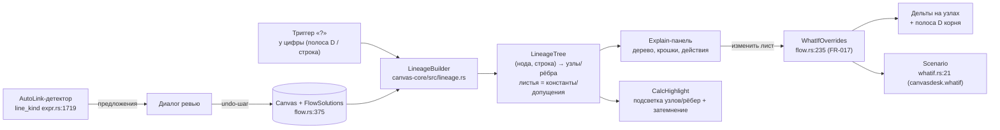

# PRD-0007: Цепочка расчёта цифры — explain-дерево происхождения любого значения, сценарии в моменте, автосвязь и режим защиты

- **Статус:** в анализе
- **Тип:** PRD (документ требований продукта; реализация оформляется отдельным `FR-048` по шаблону `docs/change-requests/cr-template.md`; структура — единый шаблон `docs/prd/TEMPLATE.md`)
- **Приоритет:** критично
- **Владелец:** агент (оформление по запросу владельца, сессия 2026-09-21)
- **Источник:** запрос владельца от 2026-09-21 — «Сейчас рассказывал жене концепт развития функции main stage в сторону визуализации цепочки расчёта любой цифры из модели. При защите бюджетов под продукты и проекты нужно уметь молниеносно отвечать за любую цифру, понимая всю глубину своего расчёта. При этом делать это по формулам в Excel сложно — там нет функционала для визуализации цепочки появления цифры… Моя идея: на схеме для моделирования можно взять любую расчётную цифру, нажать на вопрос рядом с ней и получить детализацию всех переменных входящих в её расчёт и всей цепочки этого расчёта… Мы с Лёшей Кимом — моим аналитиком финансовых продуктов в СвязьОН, считали юнит-экономику для продукта "Аренда устройства". В расчёте кроме базовых цифр был ещё расчёт рисков невыплат арендных взносов и вообще полного невозврата устройства на базе NPL 90+, коэффициенты стоимости сдачи устройства в трейд-ин и многое другое. Таблиц у нас было примерно 5 таблиц и полноценно в каждой разбирался только Лёша. Встреч по этому продукту было 3 или 4 и каждую новую итерацию расчётов мы проходили по одним и тем же вопросам от CEO, CFO и CCO — как вы посчитали эту цифру, почему эта цифра такая и т.д. Очевидно, когда принимаются решения о выделении бюджетов в 100-250-500 миллионов, каждая цифра определяет будет ли принято положительное решение или нет. И цифры должны быть настолько прозрачными, чтобы решение можно было принять за минуты, а не за часы споров». Дополнительно зафиксированы ответы владельца на 8 уточняющих вопросов (та же сессия): триггер — «комбо» (панель с деревом + синхронная подсветка рёбер на канвасе); глубина — полное рекурсивное дерево до констант и допущений; допущения — обычные листовые узлы без визуального спец-типа; what-if — полный менеджер сценариев (именованные варианты, сравнение таблицей, возврат в один клик); связи — автосвязь (система находит совпадающие имена строк и предлагает связать); отдельный режим защиты бюджета — да; соотношение с FR-044 — цепочка расчёта есть частный случай связей (рёбер зависимостей) и LOD, одна концепция; метрика успеха — комбо (время до ответа + доля цифр с раскрытой цепочкой + число вариаций сценария за встречу).
- **Связанные документы:** FR-017 (`what-if`, реализовано CP6), fr-044-mainstage-fan-readability-qualified-refs.md (панель «Как считается», подсветка зависимостей, qualified refs), fr-045-node-anatomy-data-source-unmapped-calc-trace.md (R-4 прозрачность расчёта, R-5 нотация «Объект.Поле»), FR-042 (`bundles.rs`, main stage, LOD-0), PRD-0002 (пучки/main stage), PRD-0004 (анатомия зон A–E, LOD L0/L1/L2, полоса D), PRD-0006 (design-токены, ThemeColors v2), PRD-0001 (внешние данные — вне скоупа, по решению владельца), ADR-0007/0008, `docs/SPEC.md` §5.1/§6.2/§6.3, `docs/interface-objects/node.md`, `docs/interface-objects/edge.md`
- **Создан:** 2026-09-21
- **Обновлён:** 2026-09-21

---

## 1. Резюме

Защита бюджета — это экзамен на происхождение цифр: когда на кону решение о 100–500 млн, каждый вопрос «почему эта цифра такая?» должен закрываться за минуты, а не за часы споров. Сегодня владелец решает эту задачу в Excel и связке из 5 таблиц, где цепочку появления цифры нужно восстанавливать в голове или рисовать статичную картинку в презентации; на каждой итерации расчёта комитет CEO/CFO/CCO задаёт одни и те же вопросы, и полноценно в каждой таблице разбирается только автор расчёта. PRD-0007 переносит этот экзамен в CanvasDesk и делает его выигрышным: у любой вычисляемой цифры модели появляется триггер «?», открывающий **полную цепочку расчёта** — рекурсивное дерево происхождения от выбранной цифры до исходных констант и допущений, с живыми значениями, формулами и квалифицированными адресами «Объект.Поле» на узлах.

Решение реализовано как **комбо** (выбор владельца): справа — панель с деревом, на канвасе — синхронная подсветка узлов и рёбер цепочки с затемнением остального (паттерн `FocusView`), так что объяснение не отрывается от контекста модели. Дерево — не новая сущность, а **проекция уже существующих связей**: рёбра потока значений (FR-014), построчные зависимости Numi-строк (FR-013), спиллы параметров (FR-029) и адресованные входы собираются чистой функцией в lineage-модель. Листья дерева — константы и допущения (NPL 90+, коэффициент трейд-ина) — обычные узлы без спец-типа (решение владельца), отличающиеся только отсутствием формулы. Прямо из дерева допущение можно изменить в моменте: подмена идёт через рантайм-механизм what-if FR-017 (`WhatIfOverrides`), база не мутируется, дельты видны и в дереве, и в полосе результата; вариации сохраняются как именованные сценарии с таблицей сравнения и возвратом в один клик — это уже работающая инфраструктура FR-017, PRD-0007 лишь подводит к ней контекст дерева.

Две поддерживающие механики замыкают сценарий продуктового комитета. **Автосвязь** решает боль «5 таблиц и полноценно разбирается только автор»: детектор сканирует именованные присваивания Numi-строк (`name = …`) всех расчётных нод канваса, находит совпадающие имена и предлагает связи через диалог ревью — подтверждённые рёбра создаются одним undo-шагом. **Режим защиты** готовит цепочку к большому экрану: модальное окно поверх канваса с тем же деревом-графом нод с ветками, укрупнённым, пошаговое раскрытие уровней (клик = следующий уровень) и скрытие служебных строк — чтобы CPO показывал расчёт, а не интерфейс.

PoC-граница: один канвас (межканвасная автосвязь — v2), без изменений движка расчётов (`flow.rs`/`expr.rs` — только чтение), без загрузки внешних данных («загрузка данных из внешних источников остаётся на будущее» — решение владельца, PRD-0001 — отдельный трек), формат `.canvas` не расширяется (сценарии уже сериализуются в `canvasdesk.whatif`). Позиционирование относительно направления «LOD-политика и связи» (PRD-0004, fr-044/fr-045): цепочка расчёта — частный случай связей и LOD; explain-механика наследует панель «Как считается» одной ноды (fr-044) и обобщает её на полное дерево любой цифры, не дублируя и не заменяя её.

---

## 2. Контекст и проблема

### 2.1 Как это выглядит сегодня

**Модель и расчёт.** Ноды и рёбра — `Node` (`crates/canvas-core/src/model.rs:171`) и `Edge` (`crates/canvas-core/src/model.rs:501`). Расчёт — DAG-движок FR-014: топологическая сортировка `topo_sort` (`crates/canvas-core/src/flow.rs:78`, ошибка цикла `CycleError` `flow.rs:65`), прямой прогон `propagate` (`flow.rs:223`) и построчная версия `propagate_with_lines_data` (`flow.rs:375`) — каждая строка Numi-листа получает своё значение. Адресация входов: `inbound_slots`/`inbound_slots_with_lines` (`flow.rs:539/555`), спиллы параметров шаблонных нод `param_spills` (`flow.rs:698`), неподставленные входы `unmapped_inputs_with_data` (`flow.rs:758`). Именованные присваивания строк (`name = expr`) — семантика переменных: `NumiLineKind::Assignment { name }` (`crates/canvas-core/src/expr.rs:1699`), детектор рода строки `line_kind` (`expr.rs:1719`).

**Что уже показывает прозрачность расчёта.** Панель «Как считается» у приёмника в main stage с группами «Переменные · входящие значения» / «Расчёт · формулы» и подсветка зависимостей кликом по формуле (fr-044, этап-ядро canvas-core реализовано: раскладка веера и коридор в `bundles.rs`, интеграция `dataref.rs`) — но только для одной ноды и только внутри main stage. Те же две группы в теле ноды на LOD L2 (fr-045 R-4). Квалифицированные адреса «Объект.Поле» — единая точка сборки `display_ref` (`crates/canvas-core/src/dataref.rs:108`, `InputRef` `dataref.rs:157`, `FormulaDisplay` `dataref.rs:205`). Пучки рёбер и main stage — FR-042 (`EdgeBundleIndex` `crates/canvas-core/src/bundles.rs:293`, `main_stage_rect` `bundles.rs:258`, подсветка доминантного ребра `dominant_edge` `bundles.rs:360`). What-if сценарии — FR-017, реализовано (CP6): структуры `Scenario`/`StaleOverride` (`crates/canvas-core/src/whatif.rs:21/31`), сериализация в `canvasdesk.whatif` (`scenarios_from_canvas`/`scenarios_to_canvas` `whatif.rs:39/70`), валидация протухших override'ов (`validate_scenario` `whatif.rs:119`), рантайм-подмены `WhatIfOverrides` (`flow.rs:235`) и `whatif_virtual_text` (`flow.rs:276`), дельты формата `50% → 83% (+33пп)`, нижний бар с именованными сценариями, таблицей сравнения и Apply одним undo-шагом, MCP-инструменты `ln_set_override`/`ln_set_param`/`whatif_scenario_create`/`ln_deltas`.

**Отображение цифр.** Итог ноды — полоса результата D (контракт PRD-0004 F-6); построчные результаты — рядом со строками тела (FR-013); построчные порты — правый рейл по `result_row_y` (`crates/canvas-render/src/text.rs:225`, FR-025). Затемнение нерелевантного — готовый паттерн `FocusView` (`crates/canvas-render/src/cards.rs:675`, `FOCUS_DIM_FLOOR = 0.35` `cards.rs:661`). Цвета — через `ThemeColors` v2 (PRD-0006, FR-046 v1); подписи — через i18n RU/EN (FR-040).

### 2.2 Чего не хватает

1. **Триггера «почему?» у цифры.** Ни полоса D, ни построчные ряды, ни значения на портах не дают доступа к происхождению значения: чтобы объяснить цифру, инженер вручную идёт по нодам и строкам вспять. У owner'а в кейсе на это уходили часы и личное присутствие аналитика.
2. **Рекурсивного дерева происхождения.** Панель fr-044 показывает входы одной ноды; `value_path` (`flow.rs:870`) находит только кратчайший путь между двумя заданными нодами без дерева, строк и чисел на ветках. Нет чистой функции, которая для произвольной цифры строит полный ациклический подграф её происхождения до листьев.
3. **Синхронной подсветки «дерево ↔ канвас»** для произвольной цифры вне main stage: подсветка зависимостей fr-044 живёт в stage и ограничена парой нод пучка.
4. **What-if в контексте дерева.** Сценарии FR-017 адресуются из нижнего бара строкой ноды; нет связки «этот лист дерева, который я сейчас показываю комитету, → изменить → вариация сценария с дельтой именно в этом поддереве».
5. **Автосвязи по именам.** Связи проводятся только вручную (drag, зона CR-003, авто-стороны CR-008); совпадающие имена переменных между нодами-«таблицами» не обнаруживаются и не предлагаются — ручная расшивка межтабличных зависимостей и есть боль «5 таблиц».
6. **Режима защиты.** Main stage — детализация пары нод; крупной типографики, пошагового раскрытия цепочки и скрытия служебных (проза) строк нет — показывать расчёт с проектора не на чем.

### 2.3 Зацепки в коде и документации

- `value_path` (`flow.rs:870`) — готовый BFS-паттерн upstream-обхода по рёбрам; обобщается в дерево заменой «родителей» на полный сбор входов с построчной адресацией.
- `inbound_slots_with_lines` (`flow.rs:555`) + `whatif_virtual_text` (`flow.rs:276`) — готовые функции адресации «нода + строка»: узел дерева напрямую маппится в override-цель FR-017 `(node, line, expr)`.
- Инфраструктура сценариев FR-017 переиспользуется целиком: создание/валидация/дельты/сравнение/MCP — новых механизмов хранения не нужно.
- Панель «Как считается» и `StageCalcFocus` (fr-044) — готовый паттерн подсветки зависимостей; PRD-0007 обобщает его с пары нод stage на рекурсивное поддерево основного канваса.
- `line_kind` (`expr.rs:1719`) — детектор именованных присваиваний для автосвязи: чистая функция, вердикт совпадает с движком.
- `display_ref` (`dataref.rs:108`) — подписи узлов дерева «Объект.Поле» без новой нотации.
- `EdgeBundleIndex` (`bundles.rs:293`) + `dominant_edge` (`bundles.rs:360`) — подсветка цепочки совместима с LOD-0 агрегацией: внутри пучка подсвечивается доминантное ребро, бейдж `×N` сохраняется.
- `FocusView` (`cards.rs:675`) — прецедент затемнения нерелевантного фона для комбо-подсветки и режима защиты.
- Токены `ThemeColors` v2 (FR-046), модалка настроек FR-039, i18n FR-040, undo FR-006 (`pending_undo`/`restore_canvas`), MCP `graph_validate`/`edges_list` (FR-032) — готовые поверхности для новых элементов.
- Модалка настроек FR-039 (разделы «Связи и порты») — место для тумблера автосвязи; `user-docs/hotkeys.md` + `HOTKEYS` (`crates/canvas-app/src/lib.rs`) — синк хоткея режима защиты.

---

## 3. Цели и метрики успеха

| # | Цель | Метрика |
|---|---|---|
| G1 | Молниеносный ответ на «почему цифра такая?» | От клика по «?» до полностью построенного дерева ≤ 3 с на модели 200 нод / 600 рёбер (замер демо-сценария §15); построение асинхронное — UI не блокируется (решение владельца); вопрос комитета закрывается ≤ 2 мин без выхода из канваса |
| G2 | Покрытие: объяснима любая цифра | 100% вычисляемых цифр (полоса D, построчные результаты) имеют доступный триггер «?»; на 100% ациклических цепочек дерево доходит до листьев (констант/допущений); цикл отображается терминальным узлом ошибки |
| G3 | Вариации в моменте | ≥ 5 именованных вариаций сценария показано за одну встречу без выхода из explain-режима (против 3–4 встреч-итераций кейса владельца); каждая вариация — с дельтой к базе |
| G4 | Автосвязь экономит ручную расшивку | На эталоне «5 таблиц юнит-экономики» детектор находит ≥ 80% целевых межтабличных зависимостей (recall по подготовленному списку), точность предложений ≥ 90% (precision по ревью-диалогу) |
| G5 | Не просадить кадр и построение | 60 fps пан/зум при 1000 нод / 3000 рёбер (замер `--stress`, бюджет `SPEC.md` §6.3); бюджет чистой сборки дерева ≤ 100 мс на той же модели (в UI — асинхронно с индикатором, решение владельца); подсветка не ломает LOD-0 агрегацию пучков |
| G6 | Без поломки формата | Round-trip `.canvas` зелёный; новых сериализуемых полей нет — сценарии живут в существующем `canvasdesk.whatif` (FR-017) |
| G7 | Совместимость с существующими режимами | main stage (FR-042), панель «Как считается» (fr-044), what-if бар (FR-017), wheel-меню — без регрессий; оверлеи взаимоисключимы (паттерн Q6 FR-042) |

---

## 4. Пользователи и сценарии

1. **CPO / Head of Product** (основная персона, герой CJM §6) — защищает бюджеты продуктов на продуктовом комитете; должен молниеносно отвечать на вопросы CEO/CFO/CCO «почему цифра такая» и «что если», не вспоминая расчёт, а показывая его. Ему нужны: клик → полная цепочка; смена допущения в моменте; читаемость с проектора.
2. **Аналитик финансовых моделей** (прототип роли — аналитик финансовых продуктов, кейс «Аренда устройства») — собирает модель из нескольких нод-таблиц (риск NPL 90+, трейд-ин, платёжная сетка); нуждается в автосвязи по совпадающим именам, чтобы расшить межтабличные зависимости за минуты, и в том, чтобы каждая его цифра была «доказуемой» без личного присутствия на каждой встрече.
3. **CEO / CFO / CCO** (наблюдатели решения) — канвас не трогают; читают дерево с экрана; задают «а если X = Y?» — ожидают мгновенного показа вариации, а не «вернёмся с ответом после встречи».
4. **ИИ-агент (MCP)** — строит и валидирует модели программно (FR-032/FR-033); объяснение происхождения цифры текстовой выдачей делает агента полноценным участником подготовки к защите (could, F-9).

---

## 5. User stories и критерии приёмки

### US-1. Открыть цепочку любой цифры

> **Как** CPO на продуктовом комитете, **я хочу** нажать «?» рядом с любой цифрой модели и увидеть полную цепочку её расчёта, **чтобы** отвечать на вопросы «почему такая» за минуты, не восстанавливая расчёт по памяти.

**Acceptance criteria:**
- AC-1.1: триггер «?» доступен у полосы результата D (итог ноды) и у каждого построчного результата Numi-листа; появляется только по наведению курсора на цифру (hover-only — решение владельца, раунд да/нет 2026-09-21), постоянно видимым не показывается; клик по «?» открывает explain-панель; фолбэк-триггер (решение владельца, Q8: У1 — да): клик по самой цифре также открывает explain-панель — единственный путь на тач-устройствах без hover.
- AC-1.2: панель открывает дерево, корень которого — выбранная цифра с текущим значением; построение асинхронное (решение владельца — максимальная производительность): панель открывается сразу с «честным лоадером» (решение владельца, Q8: У5 — да): ротация 10–15 подписей этапов построения (набор — 12 ключей i18n RU/EN, без фейкового прогресс-бара; примеры: «Начали собирать дерево…», «Проверяем все ветки…», «Ищем неподставленные входы…», «Готовим подсветку на канвасе…»); UI не блокируется; дерево готово ≤ 3 с на модели 200 нод (G1); затемнение канваса и подсветка появляются атомарно с готовым деревом (У5 — да).
- AC-1.3: открытие панели не мутирует модель и не требует выхода из текущего масштаба; закрытие — Esc, клик по фону, крестик панели.
- AC-1.4: у цифры без входов (лист-константа) панель показывает единственный узел с пометкой «исходное значение» — триггер никогда не «повисает» (D2).

### US-2. Пройти вглубь до допущения

> **Как** CPO, **я хочу** раскрывать цепочку вглубь до исходных констант и допущений (NPL 90+, коэффициент трейд-ина), **чтобы** показать комитету всю глубину расчёта и чем именно «набита» каждая цифра.

**Acceptance criteria:**
- AC-2.1: дерево строится рекурсивно до листьев; узел дерева — (нода, строка): числовое значение показывается на каждом узле (решение владельца, раунд да/нет 2026-09-21); расчётные узлы дополнительно показывают формулу строки и квалифицированный адрес («Объект.Поле», `display_ref`), листья — значение без формулы.
- AC-2.2: допущения и константы — обычные узлы без визуального спец-типа (решение владельца); их отличает только отсутствие формулы; если в строке указан источник/автор значения, он отображается на листе (решение владельца, раунд да/нет 2026-09-21); спец-семантика (владелец/подтверждение) — вне PoC (§10).
- AC-2.3: клик по узлу — фокус на его поддереве, навигация «вверх к корню» доступна хлебными крошками; авто-раскрытие выполняется до лимита глубины (по умолчанию 3 уровня; значение настраивается в настройках FR-039 — решение владельца, раунд да/нет 2026-09-21), глубже — ручное разворачивание ветвей; полного ограничения глубины нет.
- AC-2.4: цикл в данных — терминальный узел «цикл» с указанием ребра (источник `CycleError`, `flow.rs:65`), построение не зависает.
- AC-2.5: неподставленные входы (`unmapped_inputs`, `flow.rs:747`) — терминальные узлы «значение не подставлено» в стиле fr-045 R-3.

### US-3. Видеть цепочку на канвасе (комбо)

> **Как** CPO, **я хочу**, чтобы при открытой панели соответствующие узлы и рёбра подсвечивались прямо на канвасе, **чтобы** объяснение не отрывалось от модели и комитет видел структуру связей.

**Acceptance criteria:**
- AC-3.1: при открытой панели все ноды и рёбра цепочки подсвечены на канвасе (единая подсветка из lineage-модели), остальной канвас затемнён (паттерн `FOCUS_DIM_FLOOR`, `cards.rs:661`).
- AC-3.2: внутри пучка LOD-0 (FR-042) подсвечивается доминантное ребро (`dominant_edge`, `bundles.rs:360`); бейдж `×N` читаем; подсветка не пересобирает геометрию рёбер.
- AC-3.3: дерево и подсветка строятся из одного снапшота модели — рассинхрон панель↔подсветка невозможен (инвариант F-5). Кэширование оверлея (решение владельца, финал раунда 2): данные оверлея кэшируются — панель и подсветка рендерятся из кэшированного снапшота и не перестраиваются сами; при любом изменении модели при открытой панели — правки на канвасе (панель — оверлей, канвас доступен), правки MCP-агентом (FR-005/FR-032/FR-033), внешняя перезапись файла (watcher), подмена листа (AC-4.1), Apply сценария — без исключений (решение владельца, Q8: У3 — «если открыта панель, чип нужен») — появляется оповещение-чип «Данные изменены — требуется обновление оверлея»; клик по чипу перестраивает оверлей из нового снапшота; если корневая цифра перестала существовать, обновление закрывает панель с сообщением, повторное открытие — через «?».
- AC-3.4: подсветка различима без цвета (толщина/маркер) и по контрасту ≥ 3:1 на обеих темах (CR-007).

### US-4. Поменять допущение в моменте

> **Как** CPO, **я хочу** прямо из дерева изменить лист-допущение и показать вариацию сценария с дельтой к базе, **чтобы** на вопрос CFO «а если NPL вырастет до X?» ответить показом, а не обещанием.

**Acceptance criteria:**
- AC-4.1: у каждого листа есть действие «изменить»: inline-поле подменяет значение через рантайм-механизм FR-017 (`WhatIfOverrides`, `flow.rs:235`); базовая модель не мутируется (инвариант FR-017).
- AC-4.2: после подмены канвас пересчитывается сразу (живая модель): значения и дельты в формате FR-017 (`50% → 83% (+33пп)`) — в полосе D корня; панель и подсветка остаются на кэшированном снапшоте с чипом «Данные изменены» (У3 — чип при любом изменении при открытой панели, AC-3.3) и показывают пересчитанные значения и дельты на затронутых узлах дерева после обновления оверлея кликом по чипу.
- AC-4.3: вариация сохраняется как именованный сценарий (`Scenario`, `whatif.rs:21`) в бандле (`canvasdesk.whatif`) и переживает перезагрузку (подтверждено владельцем, раунд да/нет 2026-09-21); переключение/сравнение — таблицей сравнения FR-017; возврат к базе — одним действием; Apply — осознанная мутация `.canvas` одним undo-шагом (семантика FR-017 сохранена).
- AC-4.4: связка работает из режима защиты без выхода из него (G3: ≥ 5 вариаций за встречу).

### US-5. Связать таблицы по совпадающим именам (автосвязь)

> **Как** аналитик финансовых моделей, **я хочу**, чтобы система нашла совпадающие имена переменных между моими нодами-таблицами и предложила провести связи, **чтобы** расшить межтабличные зависимости за минуты, а не за вечер ручного сопоставления.

**Acceptance criteria:**
- AC-5.1: команда «Найти связи по именам» (палитра/меню канваса) запускает детектор по всем расчётным нодам канваса: совпадение точных имён присваиваний (`NumiLineKind::Assignment`, `expr.rs:1699`).
- AC-5.2: результаты — в диалоге ревью: список предложений «исток → приёмник (строка/слот)» с процентом совпадения имён; каждое предложение принимается или отклоняется индивидуально; пакетные действия «Принять все» / «Отклонить все» (решение владельца, раунд 2); «Отклонить все» обратимо до закрытия диалога — кнопка «Вернуть все» восстанавливает отклонённые предложения одного сеанса диалога (решение владельца, Q8: У8 — да; после закрытия отклонённые возвращаются фоновой перепроверкой AC-5.5); ничего не создаётся без подтверждения (D1).
- AC-5.3: подтверждённые связи создаются одним undo-батом (паттерн FR-033/FR-006); откат пачки — тоже одним шагом, но с подтверждением: перед откатом подсвечиваются связи, которые будут отменены (решение владельца, раунд 2); отдельные принятые связи можно удалять вручную в любой момент — это обычные рёбра; адресация — существующие механизмы потока (`to:<param>`/`$N`, FR-029).
- AC-5.4: детектор не предлагает связи, создающие цикл (`creates_value_cycle`, `flow.rs:909`), и не предлагает дубликаты существующих рёбер.
- AC-5.5: детектор работает в фоновом режиме (решение владельца, раунд 2 — вместо «только по запросу»): запуск с дебаунсом после правок модели, в т.ч. после переименования строк — предложения перепроверяются автоматически (решение владельца, П8); новые предложения накапливаются в ненавязчивом индикаторе-бейдже, показ ревью — по клику; тумблер фонового режима и команда «Найти связи по именам» — в настройках FR-039 (раздел «Связи и порты»); фон не создаёт связей сам — только через ревью (D1).

### US-6. Показать цепочку с проектора (режим защиты)

> **Как** CPO, **я хочу** включить режим защиты, в котором цепочка показывается крупно и по шагам, **чтобы** комитет читал расчёт с большого экрана, а не всматривался в интерфейс.

**Acceptance criteria:**
- AC-6.1: тумблер «Режим защиты» доступен в шапке открытого окна проверки цепочки (§7.2: плавающее окно поверх полноэкранного канваса — решение владельца, 2026-09-22, У9 v4); запуск — одним действием (тумблер/кнопка или хоткей, без захода в настройки — решение владельца, раунд да/нет 2026-09-21) и переводит то же окно в состояние защиты (Defense поверх Ready); хоткей — решение §11-Q4 (синк `HOTKEYS` + `user-docs/hotkeys.md`).
- AC-6.2: типографика дерева в состоянии защиты увеличивается (шаг ×1.5 от базовой, значения из токенов PRD-0006); служебные строки (проза, `NumiLineKind::Prose`) в дереве скрываются; представление дерева не меняется — тот же граф нод с ветками, что и в обычном виде окна проверки (решение владельца по итерациям прототипа У9, 2026-09-22), укрупнение применяется ко всему графу (узлы и ветки).
- AC-6.3: пошаговое раскрытие: клик/пробел = следующий уровень дерева от корня; кнопка «раскрыть всё»; состояние шагов не сериализуется.
- AC-6.4: Esc — выход из защиты: окно возвращается к обычному виду (Ready), шаги раскрытия не сохраняются; ✕ или клик по затемнённому фону — полное закрытие окна (в обычном виде окна Esc/✕/клик по фону тоже закрывают); канвас после выхода — без изменений: подсветка, зум и панорамирование как до входа, следов режима нет.

---

## 6. CJM (Customer Journey Map) — обязательный раздел

Персона CJM — **CPO / Head of Product** (§4, персона 1); соучастники: аналитик финансовых моделей (персона 2 — акт I), CEO/CFO/CCO (персона 3 — наблюдатели акта II). Канал — desktop, показ с проектора на продуктовом комитете. CJM детализирован до трёх актов и 14 шагов (решение владельца, сессия 2026-09-21, раунд 3: «детально спроектировать CJM»); структура пересматривается после первых юзабилити-прогонов этапа X2 (§13, демо-точка).

Три акта: **Акт I «Подготовка»** (аналитик + CPO, дни до комитета) — модель, автосвязь, покрытие, репетиция; **Акт II «Комитет»** (CPO ведёт, комитет задаёт вопросы, 20–60 минут) — объяснение, вариации, решение; **Акт III «После решения»** (минуты) — фиксация применённого сценария в модели. Ключевой принцип акта II — **непрерывность показа**: любая деградация (медленное построение, устаревшие данные, случайное закрытие) либо не видна комитету, либо отыгрывается одним действием за ≤ 1–3 с (§6.7).

### 6.1 Краткий CJM (шаги)

| # | Этап (акт) | Действие пользователя | Поверхность | Бюджет времени |
|---|---|---|---|---|
| 1 | Сборка модели (I) | Аналитик собирает ноды-таблицы; фоновый детектор накапливает предложения связей | канвас + бейдж-индикатор | фон, без участия |
| 2 | Ревью автосвязи (I) | Открытие диалога по бейджу; приём/отклонение предложений (поштучно, «Принять все»/«Отклонить все»); undo-бат | диалог ревью | 2–5 мин |
| 3 | Контроль покрытия (I) | Включение индикатора «Цепочки: N%» (opt-in, F-12); ручная добивка связей | канвас + индикатор | 1–3 мин |
| 4 | Генеральная репетиция (I) | Прогон «?» по ключевым цифрам: дерево, листья, источники/авторы | explain-панель + канвас | 10–15 мин |
| 5 | Вопрос комитета (II) | CFO задаёт вопрос; CPO наводит на цифру — hover-«?» | канвас (полоса D / построчный ряд) | ≤ 2 с |
| 6 | Открытие цепочки (II) | Клик «?» → асинхронное построение → дерево + подсветка + затемнение | explain-панель + канвас | ≤ 3 с (G1) |
| 7 | Прогулка вглубь (II) | Клик по узлам: формулы → переменные → допущения (NPL, трейд-ин); крошки — возврат к корню | explain-панель | 10–60 с на ветвь |
| 8 | Доказательство допущения (II) | Показ листа с источником/автором значения (NPL 90+, трейд-ин) | explain-панель | ≤ 5 с |
| 9 | «А если?» (II) | Изменение листа в дереве → override FR-017 → дельты на узлах и полосе D | explain-панель | ≤ 10 с |
| 10 | Сравнение и выбор (II) | 2–5 именованных вариаций; таблица сравнения FR-017; сохранение сценариев | канвас + what-if бар | 1–5 мин |
| 11 | Возмущение модели в показе (II) | Правка модели (коллега/MCP/файл) при открытой панели → чип «Данные изменены»; клик — обновление | чип на панели | ≤ 3 с |
| 12 | Случайное закрытие (II) | Esc/клик мимо → панель закрыта; повторный «?» — мгновенно из сессионного кэша | explain-панель | ≤ 1 с |
| 13 | Решение и возврат (II) | Возврат к базе одним действием; обсуждение решения | канвас + what-if бар | ≤ 2 с |
| 14 | Фиксация итога (III) | Apply выбранного сценария (один undo-шаг) или осознанный отказ; сценарии в бандле | what-if бар / панель | ≤ 30 с |

### 6.2 Детальный CJM (мысли, эмоции, боли, точки отвала)

Шкала эмоций: от −2 (резко негативные) до +2 (восторг).

| Этап | Действия | Мысли | Эмоции | Боли | Точка отвала (условие → реакция) | Возможности |
|---|---|---|---|---|---|---|
| 1. Сборка модели (аналитик) | Ноды-таблицы, строки-переменные; фон копит предложения | «Система сама видит пересечения таблиц» | облегчение (+1) | Страх мусорных связей «на автопилоте» | D1: детектор предлагает ложные связи → доверие к функции падает → митигация: ревью-диалог AC-5.2, precision ≥ 90% (G4), откат undo AC-5.3, фон не создаёт связей сам (§10) | Обучение на подтверждениях (v2) |
| 2. Ревью автосвязи (аналитик) | Диалог по бейджу: предложения с процентом совпадения; приём пачкой или поштучно | «Принял пачку — и знаю, как откатить одним шагом» | контроль (+1) | Усталость от длинного списка (12+ предложений) | D10: список перегружен → массовое «Принять все» по ошибке → митигация: откат пачки с подтверждением и подсветкой отменяемого (AC-5.3); группировка/сортировка (У7 — отложено владельцем на будущее, 2026-09-22; до решения — поведение прототипа `docs/prototypes/ux-review-dialog.html`: группировка по паре нод, сортировка по имени переменной); возврат отклонённых до закрытия (У8 — да, AC-5.2) | Приоритизация предложений по уверенности (v2) |
| 3. Контроль покрытия (аналитик) | Индикатор «Цепочки: N%»; добивка «не связано» вручную | «Вижу, где цепочка рвётся — до комитета, а не на нём» | собранность (0) | Дыры в связях обнаруживаются в последний момент | D4-предвестник: разрыв покрытия найден поздно → сюрприз на комитете → митигация: индикатор F-12 (opt-in, G2), терминальный узел «не связано» (AC-2.5) | Автоподсказка «эта цифра не объяснима» (v2) |
| 4. Генеральная репетиция (CPO + аналитик) | Прогон «?» по ключевым цифрам; проверка листьев, источников, формулировок | «Завтра отвечаю показом, не памятью» | уверенность (+1) | На репетиции всплывают пробелы в источниках и формулировках | D4: дерево обрывается, лист без источника → вопрос комитета рискует повиснуть → митигация: рекурсивность до листьев (AC-2.1/G2), источник/автор на листе (AC-2.2), лимит глубины (FR-039) | Чек-лист готовности цепочки (v2) |
| 5. Вопрос комитета (CFO → CPO) | Наведение на цифру — появляется «?» | «Сейчас покажу» | собранность (0) | Память не держит 5 таблиц; все смотрят на экран | D8: «?» не нашли в момент вопроса (hover неочевиден) → пауза, доверие падает → митигация: покрытие 100% (F-1/G2), онбординг-шаг (§14), фолбэк-клик по цифре (У1 — да) | История недавних объяснений (v2) |
| 6. Открытие цепочки (CPO) | Клик «?» → честный лоадер (ротация подписей этапов) → дерево + синхронная подсветка + затемнение | «Вот она, вся цепочка — и на канвасе тоже» | контроль (+1) | Раньше: скриншот из Excel, статичная картинка | D3: построение дольше 3 с → пауза в разговоре → митигация: G1/G5 (≤ 100 мс), асинхронность (AC-1.2), честный лоадер с ротацией подписей (У5 — да), инкрементальное раскрытие (§12). D11: проектор блёклит подсветку/шрифт → задние ряды не читают → митигация: контраст ≥ 3:1 (AC-3.4), ×1.5 в режиме защиты (AC-6.2), проверка на проекторе в X2 | Предзагрузка дерева по hover (v2) |
| 7. Прогулка вглубь (CPO) | Клик по узлам: формулы → переменные → допущения; крошки | «NPL 90+ — вот лист, вот кто его ест» | ясность (+2) | Глубина расчёта раньше жила только в голове аналитика | D4: дерево обрывается на середине глубины → вопрос комитета остаётся → митигация: рекурсивность до листьев AC-2.1/G2, циклы и unmapped — терминальные узлы AC-2.4/2.5 | Пометка «допущение» как флаг (v2, §10) |
| 8. Доказательство допущения (CPO) | Показ листа: значение + источник/автор (если указан) | «Это не с потолка — вот откуда цифра» | ясность (+2) | «Откуда взята эта цифра?» — обязательный вопрос комитета | D13: источник/автор не заполнен → лист без подписи → митигация: AC-2.2 (показ того, что указано), полнота источников — практика модели, контрольная точка — репетиция (шаг 4); governance листов — non-goal (§10) | Бейдж «подтверждено» (v2, вне PoC) |
| 9. «А если?» (CFO → CPO) | Изменение листа прямо в дереве → override → дельты | «Меняю прямо здесь — база не трогается» | уверенность (+1) | Страх испортить базовый расчёт при живом комитете | D5: подмена случайно мутирует базу → паника, расчёт «сломан» → митигация: рантайм-override AC-4.1 (инвариант FR-017), Apply — отдельное осознанное действие AC-4.3 | Дельта-превью до подтверждения (v2) |
| 10. Сравнение и выбор (CPO + комитет) | 2–5 именованных вариаций; таблица сравнения; сохранение сценариев | «Смотри: NPL +2пп → подписка +180₽, вот вся цепочка» | восторг (+2) | Раньше: «вернёмся с ответом после встречи» | D6: дельты не видны на канвасе, только в панели → комитет не видит масштаб → митигация: дельты в полосе D корня и на затронутых узлах AC-4.2, таблица сравнения FR-017 | Сводная таблица всех открытых вариаций (v2) |
| 11. Возмущение модели в показе (микро-этап) | Коллега/MCP правит модель при открытой панели → чип «Данные изменены»; клик по чипу — обновление | «Панель честно сообщает: данные устарели» | собранность (0) | Показ устаревшими цифрами — худший удар по доверию | D9: правки при открытой панели остались незамеченными → решение по устаревшим цифрам → митигация: кэш + чип + обновление по клику (AC-3.3/F-5), чип при любом изменении при открытой панели — включая MCP-правки, перезапись файла и правки из самой панели (У3 — да) | Авто-обновление при простое (v2) |
| 12. Случайное закрытие панели (микро-этап) | Esc/клик по фону мимо → панель закрылась; повторный «?» — из сессионного кэша | «Секунда — и всё на месте» | −1 → +1 | Потерять «вид момента» перед комитетом | D12: панель закрыта случайно, дерево строится заново → пауза → митигация: сессионный кэш снапшота (AC-3.3, §9.2) — переоткрытие ≤ 1 с без перестройки; раскрытие — по умолчанию (Q7-ж) | Восстановление «как было» (v2) |
| 13. Решение и возврат к базе (CPO) | Возврат к базе одним действием; комитет принимает решение | «Решение приняли за 20 минут, а не за 3 встречи» | удовлетворение (+2) | — | D7: после выхода модель в «непонятном» состоянии (сценарий активен) → митигация: возврат к базе одним действием AC-4.3, состояние сценария всегда видно в баре FR-017 | Экспорт цепочки в слайд (v2, §10) |
| 14. Фиксация итога (CPO/аналитик) | Apply выбранного сценария одним undo-шагом — или осознанный отказ; сценарии уже в бандле | «Всё, что решили, — зафиксировано в модели» | удовлетворение (+1) | Страх, что решение потеряется между встречами-итерациями | D7-хвост: Apply незаметно мутирует `.canvas` → митигация: Apply — осознанная мутация одним undo-шагом (AC-4.3), round-trip G6, сценарии переживают перезагрузку (AC-4.3) | Авто-протокол встречи по сценариям (v2) |

### 6.3 Трассировка точек отвала

Каждая точка отвала CJM обязана иметь митигацию в требованиях (§8) или рисках (§12); митигации, ожидавшие решений владельца (Q8 — закрыт 2026-09-22), помечены. D1 → AC-5.2/AC-5.3/G4/§12/§10; D2 → F-1/G2/AC-1.1; D3 → G1/G5/AC-1.2 (честный лоадер, У5 — да)/§12 (инкрементальные ветви); D4 → F-2/AC-2.1/AC-2.4/AC-2.5/F-12; D5 → F-6/AC-4.1/AC-4.3; D6 → AC-4.2; D7 → AC-4.3/G6; D8 → F-1/G2/AC-1.1 (фолбэк-клик, У1 — да)/§14 (онбординг); D9 → AC-3.3/F-5; D10 → AC-5.3/AC-5.2 (У8 — да)/У7 (отложено владельцем на будущее)/G4; D11 → AC-3.4/AC-6.2/§12 (проектор)/У9 (закрыт 2026-09-22 — v4); D12 → AC-3.3/§9.2/Q7-ж; D13 → AC-2.2/§10 (граница ответственности функции — репетиция, шаг 4).

### 6.4 Состояния explain-оверлея (машина состояний)

```mermaid
stateDiagram-v2
    [*] --> Closed
    Closed --> Hover: наведение на цифру — виден «?» (hover-only)
    Closed --> Loading: клик по самой цифре — фолбэк-триггер (У1 — да; единственный путь на таче)
    Hover --> Loading: клик «?»
    Loading --> Ready: снапшот построен, ≤ 3 с (G1), UI не блокируется
    Ready --> Stale: любое изменение модели — канвас/MCP/файл/подмена листа/Apply → чип «Данные изменены»
    Stale --> Ready: клик по чипу — перестройка из нового снапшота
    Ready --> Closed: Esc / клик по фону / крестик
    Stale --> Closed: Esc / клик по фону / крестик
    Closed --> Ready: повторный «?» — из сессионного кэша, ≤ 1 с (AC-3.3)
    Ready --> Defense: тумблер «Режим защиты» в шапке окна, одним действием (AC-6.1)
    Defense --> Ready: Esc — окно возвращается к обычному виду (AC-6.4)
    Defense --> Closed: ✕ / клик по фону — полное закрытие (AC-6.4)
```

Состояния: **Closed** — окна проверки нет; **Hover** — «?» виден только под курсором (решение владельца); клик по самой цифре — альтернативный триггер (фолбэк У1 — да); **Loading** — окно проверки открыто сразу с «честным лоадером»: ротация 10–15 подписей этапов построения (AC-1.2, У5 — да); **Ready (fresh)** — окно и подсветка рендерят кэшированный снапшот; **Stale** — модель изменилась, снапшот помечен чипом, данные не перерисовываются сами (AC-3.3/F-5); **Defense** — режим защиты поверх Ready (AC-6.1–6.4): то же окно проверки — тот же граф нод с ветками, укрупнённый (×1.5) и с пошаговым раскрытием уровней, проза скрыта; снапшот сохраняется. Архитектура оверлеев (решение владельца, 2026-09-22 — фидбэк по У9 v4 «зачем делить экран на две стороны»): канвас — полноэкранный (как в `docs/prototypes/prototype-mainstage-anatomy.html`), окно проверки цепочки расчёта цифры и main stage открываются поверх него как оверлеи; боковых панелей нет — У9 закрыт.

Правила переходов (детализация UX; пометки: «да» — решение владельца, Q8 — закрыт 2026-09-22, У7 отложено):

- чип «Данные изменены» — закреплённая полоса сверху панели, не перекрывает дерево (У4 — да); клик по чипу — единственный путь из Stale в Ready;
- чип возникает при любом изменении модели, пока открыта панель (решение владельца, Q8: У3 — «если открыта панель, чип нужен»): правки на канвасе, MCP-агент, перезапись файла, подмена листа, Apply из бара или панели — без исключений; оверлей обновляется только кликом по чипу (согласуется с «при изменении любом», финал раунда 2);
- в Loading канвас не затемняется — затемнение и подсветка появляются атомарно с готовым деревом (У5, Q8 — переформулировано с практическим примером; один снапшот F-5);
- повторный «?» на другую цифру в Ready/Stale — перестройка на новый корень: одна панель — один корень (У6 — да);
- переход в Closed не уничтожает снапшот: повторный «?» открывает Ready из сессионного кэша ≤ 1 с (AC-3.3, §9.2); раскрытие ветвей при переоткрытии — по умолчанию (лимит глубины FR-039), UI-состояние не восстанавливается (Q7-ж);
- режим защиты открывается поверх Ready одним действием (тумблер в шапке окна); окно одно — объяснение и защита в нём, снапшот сохраняется; выход — Esc (обычный вид окна), ✕/клик по фону (полное закрытие); канвас не изменяется (решение владельца, 2026-09-22 — У9 закрыт, v4).

### 6.5 Карта модальностей (реестр F-10)

| Событие | Поведение explain-панели |
|---|---|
| Открытие main stage (FR-042) | панель закрывается, снапшот остаётся в сессионном кэше; возврат через «?» — из кэша ≤ 1 с (У10 — да) |
| Открытие wheel-меню | панель уходит на второй план до завершения жеста; выбор действия не сбрасывает кэш |
| What-if бар (FR-017) | сосуществует всегда — единый слой override (§7.1 п.7); дельты — один источник (`ln_deltas`) |
| Диалог ревью автосвязи | модален поверх канваса; панель прячется на время диалога |
| Модалка настроек (FR-039) | поверх; панель остаётся под ней; чип «Данные изменены» работает и под модалкой |
| Режим защиты | состояние окна проверки поверх полноэкранного канваса (§6.4): то же окно укрупняется до ×1.5, проза скрыта, пошаговое раскрытие; снапшот сохраняется (решение владельца, 2026-09-22 — У9 закрыт, прототип v4 `docs/prototypes/ux-defense-mode.html`); другие оверлеи недоступны |

Синхронизация канвас↔дерево: дерево→канвас — подсветка узлов/рёбер (AC-3.1); канвас→дерево — клик по подсвеченной ноде выделяет и подводит соответствующий узел дерева (У2 — да, решение владельца).

### 6.6 Краевые траектории (деградации и ошибки)

| Ситуация | Поведение оверлея | Требование |
|---|---|---|
| Цикл в данных | терминальный узел «цикл» с ребром-источником, построение не зависает | AC-2.4 |
| Неподставленный вход | терминальный узел «значение не подставлено» | AC-2.5 |
| Переменная без входящего ребра | терминальный узел «не связано» | §7.1 п.6 |
| Корневая цифра удалена при открытой панели | клик по чипу закрывает панель с сообщением; повторное открытие — через «?» | AC-3.3 |
| Внешнее изменение модели | чип «Данные изменены», кэш не перерисовывается сам | AC-3.3/F-5 |
| Дерево 1000+ узлов | ветви свёрнуты со счётчиками, раскрытие ручное, бюджет G5 соблюдён | §12/G5 |
| Проектор / задние ряды | ×1.5 (режим защиты), контраст ≥ 3:1, различимость без цвета | AC-6.2/AC-3.4 |
| Тач-устройство (нет hover) | фолбэк: клик по цифре открывает панель | У1 — да (AC-1.1) |
| Строка-проза выбрана как корень | панель с ошибкой выбора, без дерева | §9.4 |
| Цифра без входов (константа) | панель одного узла «исходное значение» | AC-1.4 (Q3) |
| Повторный «?» на другую цифру | перестройка на новый корень, старый снапшот заменяется | У6 — да (решение владельца) |

### 6.7 Хронометраж сцены комитета (бюджеты времени)

| Сцена | Бюджет | Источник |
|---|---|---|
| Вопрос комитета → CPO начинает ответ (наведение + клик + готовность дерева) | ≤ 5 с | G1 + шаги 5–6 |
| Полное дерево на модели 200 нод / 600 рёбер | ≤ 3 с | G1 |
| Вариация «а если X?» → дельты на узлах и полосе D | ≤ 10 с | G3 |
| Возврат к базе | ≤ 2 с, одно действие | AC-4.3 |
| Переоткрытие панели из сессионного кэша (случайное закрытие / смена модальности) | ≤ 1 с | AC-3.3, §9.2 |
| Вход/выход режима защиты | ≤ 1 с, одним действием | AC-6.1/AC-6.4 |

---

## 7. Решение

### 7.1 Концептуальная схема

Ключевые свойства:

1. **Цепочка = проекция связей, а не новая сущность.** Дерево собирается из уже существующих рёбер потока значений (FR-014), построчных зависимостей Numi-строк, спиллов (FR-029) и адресованных входов; ничего в движке не меняется. Это и есть слияние с направлением «LOD-политика и связи» (решение владельца): explain — это LOD-фокус на подграфе связей, а подсветка цепочки — операция над рёбрами.
2. **Комбо без рассинхрона.** Панель и канвас-подсветка — два рендера одной `LineageTree` одного снапшота модели (инвариант F-5). Оверлей кэшируется (решение владельца, финал раунда 2): правки модели при открытой панели не перестраивают дерево сами — появляется чип «Данные изменены», обновление по клику; показ комитету не «прыгает» под ногами, а устаревание данных всегда видимо. Инвалидация снапшота — по паттерну `EdgeBundleIndex` (FR-042).
3. **Листья — константы и допущения без спец-типа** (решение владельца): различие только в отсутствии формулы; вся governance-семантика (владелец цифры, подтверждение) — осознанный non-goal PoC (§10).
4. **Сценарии в моменте — надстройка над FR-017**, а не новый механизм: override-цель узла дерева `(node, line)` — это ровно адресация `WhatIfOverrides`; дельты, именованные сценарии, таблица сравнения и Apply уже реализованы.
5. **Режим защиты = ручное управление LOD дерева**: пошаговое раскрытие уровней и укрупнение типографики из токенов — без смены представления (тот же граф нод с ветками, решение владельца 2026-09-22); концептуально тот же приём, что LOD L0/L1/L2 PRD-0004, применённый к дереву.
6. **Ограничения проекции приняты владельцем** (раунд да/нет 2026-09-21: «да, если возможно — с пониманием ограничений»): дерево видит только то, что соединено связями; переменная без входящего ребра отображается терминальным узлом «не связано» — автосвязь F-7 достраивает цепочку после ревью; спиллы/адресованные входы попадают в дерево, но только через существующие механизмы потока; движок расчётов не меняется, поэтому гарантии дерева = гарантии графа связей.
7. **Ограничения переиспользования what-if приняты владельцем** (раунд да/нет 2026-09-21): слой override в дереве — ровно один, общий с баром FR-017 (`WhatIfOverrides`); правка листа из дерева пишет в активный сценарий (если активен) либо создаёт безымянную активную вариацию; параллельные независимые what-if-слои (дерево + бар одновременно с разными значениями) не поддерживаются — вне PoC.

### 7.2 Точка интеграции в архитектуре

| Элемент | Решение |
|---|---|
| Lineage-модель | Новый чистый модуль `canvas-core/src/lineage.rs`: `LineageNode`, `LineageTree`, `build_lineage(canvas, flow_data, root: (node_id, Option<line>)) -> Result<LineageTree, LineageError>`; входы — `Canvas` + построчные решения (`propagate_with_lines_data` `flow.rs:375`) + `inbound_slots_with_lines` (`flow.rs:555`) + `param_spills` (`flow.rs:698`) + `unmapped_inputs_with_data` (`flow.rs:758`); обход upstream BFS (обобщение `value_path` `flow.rs:870`); без сетевого и платформенного кода |
| Триггер «?» | Отрисовка в рендере полосы D и построчных рядов (`text.rs`, паттерн построчных портов FR-025); hit-zone не конфликтует с портами (зоны разнесены) |
| Explain-панель | Плавающее окно проверки поверх полноэкранного канваса — паттерн main stage (дерево, хлебные крошки, действия листов); терминологическая связка: далее по тексту «панель» = это плавающее окно проверки (правая dock-панель и разбиение экрана «канвас + панель» исключены — решение владельца 2026-09-22, фидбэк по У9 v4, попутно закрыт Q1); данные оверлея — сессионный кеш в памяти (снапшот `LineageTree` + чип устаревания, AC-3.3), UI-состояние окна не сериализуется (Q7-ж, §7.3); взаимоисключимость с main stage / wheel / what-if баром — реестр модальностей по паттерну Q6 FR-042 (F-10) |
| Подсветка | Оверлей `CalcHighlight` в `canvas-render`: подсветка узлов/рёбер из `LineageTree` + затемнение (`FocusView`-паттерн, `cards.rs:675`); в пучке — доминантное ребро (`bundles.rs:360`); геометрия рёбер не пересобирается |
| What-if | Без нового формата: подмена листа → `WhatIfOverrides` (`flow.rs:235`)/`whatif_virtual_text` (`flow.rs:276`); сценарии — `Scenario` (`whatif.rs:21`) в `canvasdesk.whatif`; дельты и таблица сравнения — UI FR-017 |
| Автосвязь | Модуль `canvas-core/src/autolink.rs`: фоновый скан `line_kind` (`expr.rs:1719`) по расчётным нодам с дебаунсом после правок (решение владельца), матч точных имён присваиваний, перепроверка предложений при переименовании, фильтры (циклы `creates_value_cycle` `flow.rs:909`, дубликаты); UI — индикатор новых предложений + диалог ревью («Принять все/Отклонить все»); создание рёбер — батч одним undo-шагом, откат пачки — с подтверждением и подсветкой (паттерн FR-033/FR-006); тумблеры — настройки FR-039 |
| Режим защиты | Состояние Defense окна проверки в `canvas-app` (не сериализуется): крупная типографика из токенов PRD-0006, пошаговое раскрытие уровней, скрытие `NumiLineKind::Prose`-строк дерева, представление дерева не меняется (тот же граф нод с ветками); окно одно — объяснение и защита в нём; хоткей — с синком `HOTKEYS`/`user-docs/hotkeys.md` |
| Undo | Создание связей автосвязи и Apply сценария — по одному undo-бату (паттерн FR-006); откат пачки автосвязи — с подтверждением и подсветкой отменяемого (решение владельца); открытие панели и шаги раскрытия — не undo-события |
| MCP | Контракты не ломаются: `graph_validate`/`edges_list` (FR-032) видят рёбра автосвязи как обычные; что-if-инструменты FR-017 уже покрывают подмены; текстовая выдача дерева — `explain_number` (F-9, must — в той же итерации, решение владельца) |
| Токены/i18n | Все новые цвета (подсветка, дельты, фон панели) — через `ThemeColors` v2 (FR-046); все строки — ключи RU/EN (FR-040) |

### 7.3 Отвергнутые варианты

| Вариант | Вердикт | Причина |
|---|---|---|
| Полноэкранный оверлей «рентген» вместо панели + подсветки | отвергнуто (владелец выбрал «комбо») | теряется контекст модели; комбинированный вид сохраняет и дерево, и структуру связей на канвасе |
| Спец-тип узла «допущение» с владельцем и статусом подтверждения | отвергнуто (владелец выбрал «как листья») | governance-семантика замедляет показ; PoC — скорость объяснения; кандидат v2 при появлении требования аудита |
| Хранение lineage-кэша в `.canvas` | отвергнуто | происхождение детерминировано моделью; кэш дублирует истину и ломает round-trip/совместимость |
| Персистентный кеш UI-состояния панели (в `.canvas` или sidecar-файле) | отвергнуто для PoC (вердикт коллегии экспертов по запросу владельца, Q7-ж) | протухание после правок (обязательна валидация/чистка ID узлов), новый артефакт и логика инвалидации без подтверждённой потребности — CJM показывает, что объяснение — живой ответ «здесь и сейчас», а не возобновляемая сессия чтения; прецедент — шаги режима защиты не сериализуются (AC-6.3). Сессионный кеш в памяти уже покрывает повторное открытие панели (AC-3.3); персистентный — кандидат v2 (хранение вне `.canvas` по хешу файла, валидация ID при восстановлении, лимит размера) |
| Автосвязь без подтверждения (молча создавать рёбра) | отвергнуто | риск ложных связей подрывает доверие к модели; ревью-диалог даёт precision ≥ 90% (G4) |
| Explain только внутри main stage (расширение fr-044) | отвергнуто | main stage модален и ограничен парой нод пучка; объяснять нужно произвольную цифру без входа в stage; панель fr-044 остаётся для локального контекста соединения |
| Поверхность explain на базе внешних данных (Excel-импорт чисел) | вне скоупа | решение владельца: «загрузка данных из внешних источников остаётся на будущее»; PRD-0001 — отдельный трек |
| Новый сценарный движок вместо переиспользования FR-017 | отвергнуто | инфраструктура сценариев FR-017 реализована и тестируется; дублирование удвоило бы поддержку и сериализацию |

---

## 8. Функциональные требования

| ID | Требование | Приоритет | Приёмка |
|---|---|---|---|
| F-1 | Триггер «?» у полосы результата D и у каждого построчного результата всех расчётных нод; покрытие 100% вычисляемых цифр; у листа-константы — панель одного узла | must | AC-1.1, AC-1.4, G2 |
| F-2 | Модуль `lineage.rs`: полное рекурсивное дерево происхождения до листьев; корень — любая цифра (итог ноды или строка); цикл и unmapped — терминальные узлы; бюджет чистой сборки ≤ 100 мс на 1000 нод / 3000 рёбер; в UI построение асинхронное с индикатором (решение владельца) | must | AC-2.1, AC-2.4, AC-2.5, G1, G5 |
| F-3 | Узлы дерева: значение на каждом узле + формула строки + квалифицированный адрес («Объект.Поле», `display_ref`) на расчётных; листья — значение (с источником/автором, если указан) без формулы и спец-типа (решение владельца); авто-раскрытие до настраиваемого лимита глубины (по умолчанию 3, настройка FR-039) | must | AC-2.1, AC-2.2, AC-2.3 |
| F-4 | Комбо-подсветка: панель + синхронная подсветка узлов/рёбер цепочки на канвасе с затемнением остального; в пучке — доминантное ребро; LOD-0 не ломается | must | AC-3.1, AC-3.2, G5 |
| F-5 | Инвариант единого источника: панель и подсветка рендерятся из одной кэшированной `LineageTree` одного снапшота; при любом изменении модели снапшот не перестраивается автоматически — появляется чип «Данные изменены», клик обновляет оверлей из нового снапшота (решение владельца, финал раунда 2) | must | AC-3.3 |
| F-6 | What-if из дерева: подмена листа через `WhatIfOverrides` (FR-017), дельты в дереве и полосе D корня, именованные сценарии, таблица сравнения, возврат к базе одним действием, Apply — одним undo-шагом | should | AC-4.1–AC-4.4, G3 |
| F-7 | Автосвязь по именам: фоновый детектор с дебаунсом (перепроверка при переименовании), индикатор новых предложений, диалог ревью с «Принять все/Отклонить все», создание рёбер одним undo-батом (откат — с подтверждением и подсветкой), фильтры циклов/дубликатов, тумблер в настройках FR-039 | should | AC-5.1–AC-5.5, G4 |
| F-8 | Режим защиты: запуск одним действием — состояние Defense окна проверки, открытой поверх полноэкранного канваса (тумблер/кнопка или хоткей — решение владельца), типографика ×1.5 из токенов, пошаговое раскрытие уровней, скрытие прозаических строк, представление дерева не меняется (тот же граф нод с ветками), выход Esc/✕/клик по фону без изменений канваса | should | AC-6.1–AC-6.4 |
| F-9 | MCP-выдача объяснения текстом (`explain_number`: линейная развёртка дерева с адресами и значениями) — в скоупе PoC (решение владельца, раунд да/нет 2026-09-21: «MCP-инструменты в ту же итерацию») | must | §11-Q5 (закрыт), персона 4 §4 |
| F-10 | Интеграция: взаимоисключимость explain-панели с main stage/wheel/what-if баром (реестр модальностей FR-042 Q6); без регрессий fr-044/fr-045/FR-017 | must | G7 |
| F-11 | Токены и i18n: новые цвета — только через `ThemeColors` v2; все строки — ключи RU/EN; контраст подсветки ≥ 3:1, различимость без цвета | must | AC-3.4, G7 |
| F-12 | Индикатор покрытия цепочками: счётчик «Цепочки: N%» (доля вычисляемых цифр, чья цепочка доходит до листьев) в углу канваса; отображается только при включённой настройке в FR-039 (opt-in — решение владельца, раунд 2) | should | G2 |

---

## 9. Нефункциональные требования

1. **Архитектура/wasm.** `lineage.rs` и `autolink.rs` — чистые детерминированные функции в `canvas-core` (без платформенного и сетевого кода); рендер-надстройки — в `canvas-render`/`canvas-app` по существующим паттернам; wasm-гейт `scripts/wasm_gate.sh` зелёный (ADR-0011), токен-линт `scripts/token_lint.sh` зелёный (FR-046).
2. **Производительность.** Дерево строится за один батч-обход (без per-frame аллокаций); панель и подсветка потребляют готовую `LineageTree`; сессионный кеш снапшота живёт, пока открыта панель, память O(узлов дерева) — повторное открытие панели в той же сессии без перестройки (AC-3.3); инкрементальное раскрытие ветвей — повторный обход только поддерева; регресс-замер `--stress` (T5) не хуже baseline (G5, `SPEC.md` §6.3).
3. **Формат.** `.canvas` не расширяется (G6): происхождение вычисляется, сценарии сериализуются существующим `canvasdesk.whatif` (FR-017); round-trip Obsidian — зелёный.
4. **Детерминизм/TDD.** Тесты до реализации (AGENTS.md): `build_lineage` — линейная цепочка, ромб (несколько потребителей одной переменной), спиллы параметров, unmapped-входы, цикл, лист-константа, корень-строка vs корень-итог; `autolink` — точное совпадение, отсутствие циклов/дубликатов, детерминизм порядка предложений, перепроверка после переименования строки, дебаунс фонового запуска; крайние случаи: нода без результата, строка-проза как корень (показ ошибки выбора), 1000+ узлов дерева.
5. **Доступность.** Контраст подсветки/дельт/панели ≥ 3:1 на обеих темах (CR-007); подсветка различима без цвета (толщина/маркер) — преемственность FR-016 v2; навигация деревом с клавиатуры (крошки + стрелки) — базово.
6. **i18n.** Все новые строки (панель, диалог ревью, режим защиты, «?») — через ключи RU/EN (FR-040); хардкод запрещён.
7. **Зависимости/безопасность.** Новых зависимостей нет (allowlist ADR-0008 не расширяется); сети нет (AGENTS.md) — внешние данные вне скоупа по решению владельца.

## 10. Non-goals

- **Не загружаем внешние данные.** Датасеты/Excel/DAC-БД — вне скоупа: «загрузка данных из внешних источников остаётся на будущее» (решение владельца 2026-09-21); подключение — трек PRD-0001/FR-045 R-2.
- **Не делаем Git-синхронизацию и облачное шарение расчётов.** PRD-0005 отложен владельцем; показ комитета — локальный, с одного рабочего места.
- **Не экспортируем цепочку в PNG/PDF/слайд.** Решение владельца (раунд да/нет 2026-09-21): «пока оставим это на будущее» — за пределами PoC без статуса кандидата v2; в CJM (§6.2, этап 7) остаётся как возможность.
- **Не меняем движок расчётов.** `flow.rs`/`expr.rs` — только чтение готовых решений; новые семантики потока запрещены.
- **Не вводим governance допущений** (владелец цифры, статус подтверждения, аудиторский след): решение владельца «допущения — как листья»; кандидат v2.
- **Не строим межканвасную автосвязь в PoC.** Детектор работает в пределах одного канваса; связи между документами (file-ссылки) — v2.
- **Не заменяем панель «Как считается» fr-044 и группы fr-045 R-4.** Explain-панель обобщает их идею на произвольную цифру; локальные поверхности остаются как есть.
- **Не создаём связи из фонового режима без ревью.** Фон (решение владельца, раунд 2) только обнаруживает предложения и показывает индикатор; создание — всегда через диалог ревью, включая «Принять все» (D1).
- **Не анимируем раскрытие дерева и подсветку в PoC.** Кандидат v2 после обкатки.

## 11. Открытые вопросы

- **Q1. Закрыт** (решение владельца, 2026-09-22, фидбэк по У9 v4): плавающее окно проверки поверх полноэкранного канваса — паттерн main stage; правая dock-панель и разбиение экрана исключены (§7.2). Влияние на затемнение и модальности (F-10) — учтено в §6.5.
- **Q2.** Матч автосвязи: только точные имена присваиваний или + квалифицированные «Объект.Поле» и единицы измерения как фильтр точности? Влияет на precision (G4). Предложение: точные имена + совпадение единиц как бонус-признак в ревью.
- **Q3.** Поведение «?» у цифры без входов: панель одного узла (AC-1.4, предложение) или глушение триггера? Влияет на предсказуемость (D2).
- **Q4.** Хоткей режима защиты: свободная клавиша или только тумблер панели? Синк `HOTKEYS` (`lib.rs`) + `user-docs/hotkeys.md` обязателен.
- **Q5. Закрыт** (решение владельца, раунд да/нет 2026-09-21): MCP `explain_number` — в PoC, F-9 переведён в must.
- **Q6.** Демо-гейт владельца: после X2 (панель + подсветка) или после X3 (сценарии из дерева)? Предложение: X2 — раньше проверить главный сценарий «почему цифра такая».
- **Q7. Раунд да/нет (2026-09-21) — закрыт полностью.** Решения владельца (раунд 2): (а) «Принять все/Отклонить все» — да (AC-5.2); (б) перепроверка при переименовании — да (AC-5.5); (в) индикатор покрытия — да, opt-in настройка (F-12); (д) детектор — в фоне (AC-5.5 пересмотрен); (е) undo-бат — да, с подтверждением и подсветкой отменяемого (AC-5.3); (з) запрет циклов через `creates_value_cycle` — да (AC-5.4); (и) режим защиты только в рендере — да (F-8). Финал раунда 2: (г) инвариант F-5 — данные оверлея кэшируются, при любом изменении модели (канвас/MCP/перезапись файла/Apply) — чип «Данные изменены», обновление оверлея по клику (AC-3.3); (ж) сериализация UI-состояния панели — нет (решение владельца); вопрос «делать ли кеш?» рассмотрен коллегией экспертов: сессионный кеш в памяти — да (покрыт AC-3.3), персистентный кеш — нет для PoC, кандидат v2 с валидацией ID и лимитом размера (§7.3).
- **Q8. Раунд 3 — UX/CJM (2026-09-21/22, «детально спроектировать CJM»).** Детализация §6 выполнена (акты/14 шагов/D8–D13/§6.4–6.7). Закрыто решениями владельца (три партии): **У1 — да** — фолбэк-триггер «клик по цифре открывает панель» (AC-1.1); **У3 — да** — «если открыта панель — чип нужен»: чип при любом изменении без исключений, следствие («канвас живой сразу, оверлей по клику по чипу») подтверждено владельцем (AC-3.3/AC-4.2); **У4 — да** — чип-полоса сверху; **У6 — да** — повторный «?» — новый корень; **У10 — да** — main stage → сессионный кэш ≤ 1 с; **У2 — да** — обратная синхронизация канвас→дерево (§6.5); **У5 — да** с дополнением владельца — «честный лоадер»: ротация 10–15 подписей этапов построения в Loading, затемнение атомарно с деревом (AC-1.2); **У8 — да** — «Отклонить все» обратимо «Вернуть все» до закрытия диалога (AC-5.2). Отдельно вынесены на HTML-прототипы (созданы, §14): **У9 — закрыт (2026-09-22)** — режим защиты; итерации прототипа `docs/prototypes/ux-defense-mode.html`: v1-список отклонён, v2 — дерево-граф, v3 — модальность, v3.1 — фикс (в v3 окно фактически не открывалось — класс состояния вешался на #app, а CSS-селектор оверлея его не видел), v4 — по фидбэку владельца «зачем делить экран на две стороны»: полноэкранный канвас как в `prototype-mainstage-anatomy.html`, окно проверки цепочки и main stage — оверлеи поверх одного канваса, режим защиты — состояние окна (×1.5, пошаговое раскрытие); полный сценарий проверен в headless-браузере; **У7 — отложено владельцем на будущее (2026-09-22)** — группировка/сортировка предложений ревью-диалога (прототип `docs/prototypes/ux-review-dialog.html`): решение не блокирует Q8 и вынесено в отдельную будущую итерацию; до решения поведение — как в прототипе (группировка по паре нод «исток → приёмник», сортировка по имени переменной). **Итог — Q8 закрыт (2026-09-22):** У1/У2/У3/У4/У5/У6/У8/У10 — да; У9 — закрыт (v4); У7 — отложено владельцем.

## 12. Риски и митигации

| Риск | Влияние | Митигация |
|---|---|---|
| Ложные предложения автосвязи подрывают доверие | Данные, UX | Ревью-диалог (индивидуально + «Принять все/Отклонить все», AC-5.2), precision-цель G4, фильтры циклов/дубликатов (AC-5.4), откат пачки с подтверждением и подсветкой (AC-5.3); фон не создаёт связей сам — только индикатор (AC-5.5) |
| Фоновое сканирование просаживает кадр при активном редактировании | Перф (G5) | Дебаунс после правок, скан только именованных присваиваний (`line_kind`) вне кадра рендера, тумблер фонового режима в настройках (AC-5.5) |
| Дерево взрывается на плотных моделях (сотни входов) | Читаемость, перф | Свёрнутые ветви с счётчиками, инкрементальное раскрытие (§9.2), лимит времени построения G5, тест 1000+ узлов (§9.4) |
| Конфликт модальностей (main stage / wheel / what-if бар / explain) | UX, слики | Реестр взаимоисключимых оверлеев по паттерну Q6 FR-042 (F-10), интеграционные тесты (G7) |
| Рассинхрон дерева и канваса при правках на живой модели | Доверие к показу | Инвариант F-5 (одна кэшированная `LineageTree` одного снапшота): правки не перестраивают панель сами — чип «Данные изменены», обновление по клику (AC-3.3); инвалидация снапшота по паттерну `EdgeBundleIndex` (FR-042), тест AC-3.3 |
| Подсветка рёбер дорого пересобирает геометрию | Перф (G5) | Оверлей поверх существующей геометрии без пересборки; доминантное ребро пучка вместо пера рёбер (AC-3.2) |
| Режим защиты скрывает нужное (комитет не видит контекст) | UX | Окно проверки поверх канваса — выход не изменяет канвас: подсветка и зум как до входа (AC-6.4); скрытие только прозаических строк (AC-6.2); демо-точка X2 |
| Дельты what-if в дереве конфликтуют с дельтами бара FR-017 | Консистентность UI | Один источник дельт — `ln_deltas` FR-017; дерево лишь отображает; интеграционный тест связки (G7) |
| Регресс привычных поверхностей (fr-044/045/FR-017) | Совместимость | F-10 без регрессий; существующие панели не меняются; скрин-аудит до/после |
| Триггер «?» не обнаружен в момент вопроса (hover-only неочевиден) | Adoption (D8) | Покрытие 100% (F-1/G2), онбординг-шаг «объясни цифру» (§14, вопрос владельцу), фолбэк-клик по цифре (У1 — да, AC-1.1) |
| Контраст теряется на проекторе (washout, задние ряды) | UX (D11) | Контраст ≥ 3:1 на обеих темах (AC-3.4), ×1.5 и крупная типографика режима защиты (AC-6.2), различимость без цвета, проверка на проекторе в демо X2 |

## 13. Дорожная карта

| Этап | Содержание | Результат |
|---|---|---|
| X0 | FR-048 по шаблону `cr-template.md` (фиксация решений Q1–Q8 — что закрыто на момент X0); ADR не требуется (новых зависимостей и правил архитектуры нет) | Разрешение на реализацию |
| X1 | `lineage.rs`: модель `LineageTree` + `build_lineage` (DAG/спиллы/unmapped/циклы/строки) + тесты §9.4 | Чистое ядро, доступное агенту |
| X2 | Триггер «?» F-1 + explain-панель + комбо-подсветка F-4/F-5 + честный лоадер (У5) (токены, i18n, настройка лимита глубины в FR-039) | **Демо-точка владельцу (Q6)**: G1/G2 замер на демо-сценарии |
| X3 | What-if из дерева F-6: подмены, дельты, сценарии, сравнение, возврат | US-4, G3 |
| X4 | Автосвязь F-7: детектор + диалог ревью (группировка/сортировка — У7 отложено владельцем на будущее; до решения — поведение прототипа `ux-review-dialog.html`: группировка по паре нод, сортировка по имени переменной) + батч-создание + настройка | US-5, G4 |
| X5 | Режим защиты F-8 (состояние Defense окна проверки поверх полноэкранного канваса — решение владельца, У9 закрыт 2026-09-22, v4; представление — дерево-граф нод с ветками) | US-6 |
| X6 | Интеграция F-10, MCP `explain_number` (F-9, must), аудит регрессий, доки §14, приёмка §15 (G1–G7) | Закрытие PoC |

## 14. Точки входа в документацию (обязательные обновления при реализации)

- `docs/change-requests/fr-048-calc-chain-explain.md` — реализационный FR (создаётся на X0; номер FR-047 занят темами-пресетами PRD-0006 D4).
- `docs/prototypes/ux-review-dialog.html` (У7), `docs/prototypes/ux-defense-mode.html` (У9 — закрыт, v4: база — движок `prototype-mainstage-anatomy.html` — полноэкранный канвас с main stage; окно проверки цепочки и main stage — оверлеи поверх одного канваса; режим защиты — состояние окна: ×1.5, пошаговое раскрытие; полный сценарий проверен в headless-браузере) — интерактивные HTML-прототипы UX-решений Q8; решение по У7 отложено владельцем на будущее (2026-09-22).
- `docs/interface-objects/node.md` — §3/§4 (триггер «?» у полосы D и построчных рядов); `docs/interface-objects/edge.md` — §3/§4 (подсветка цепочки, доминантное ребро в пучке).
- `docs/SPEC.md` — §5.1 (не расширяется — фиксация решения), §6.3 (бюджеты построения дерева), §8 (модальности: explain-панель).
- `docs/prd/README.md` — индекс каталога PRD (статус, ссылка, связи между PRD); `docs/index.md` — ссылка на этот PRD.
- `user-docs/interface.md`, `user-docs/hotkeys.md` (+ синк `HOTKEYS`, `crates/canvas-app/src/lib.rs`) — explain-панель, автосвязь, режим защиты.
- `docs/ACCEPTANCE.md` — приёмочный чек-лист PoC (демо-сценарий юнит-экономики).
- Онбординг (`onboarding_ui.rs`, FR-028) — вопрос владельцу по правилу AGENTS.md: добавлять ли шаг «объясни цифру» в тур.

## 15. Проверка (Definition of Done PoC)

- [ ] Демо-сценарий юнит-экономики (эталон владельца: 5 нод-таблиц, цепочка «стоимость подписки», допущения NPL/трейд-ин): от «?» до полной цепочки ≤ 3 с; вопрос «почему цифра такая» закрыт без выхода из канваса (G1, G2).
- [ ] Честный лоадер: при открытии панели — ротация 12 подписей этапов построения (ключи i18n RU/EN), затемнение атомарно с готовым деревом (AC-1.2, У5).
- [ ] ≥ 5 именованных вариаций сценария за одну сессию из дерева, каждая с дельтой к базе; возврат к базе одним действием (G3, US-4).
- [ ] Автосвязь на эталоне «5 таблиц»: recall ≥ 80% / precision ≥ 90% по ревью; фон с дебаунсом; «Принять все/Отклонить все» с обратимостью «Вернуть все» до закрытия диалога (У8); создание пачкой одним undo-шагом, откат пачки — с подтверждением и подсветкой (G4, US-5).
- [ ] Юнит-тесты: `build_lineage` (все случаи §9.4), `autolink` (детерминизм, фильтры, перепроверка при переименовании), инвариант F-5 (одна модель для панели и подсветки).
- [ ] Индикатор покрытия «Цепочки: N%» включается настройкой (opt-in) и корректно считается на демо-модели (F-12, G2).
- [ ] Интеграционные тесты: edges + main stage + what-if бар — зелёные; объяснение уходит/возвращается без следов (G7).
- [ ] Кэш оверлея: правка модели при открытой панели (канвас/MCP/перезапись файла/подмена листа/Apply) показывает чип «Данные изменены», клик обновляет оверлей из нового снапшота; удаление корня закрывает панель с сообщением (AC-3.3, F-5, У3).
- [ ] `cargo test --workspace`, clippy, fmt — зелёные; `scripts/wasm_gate.sh` и `scripts/token_lint.sh` — зелёные.
- [ ] Стресс-замер: 1000 нод / 3000 рёбер → 60 fps пан/зум, бюджет чистой сборки дерева ≤ 100 мс, построение в UI асинхронное (G5).
- [ ] Round-trip `.canvas` зелёный; новых сериализуемых полей нет (G6).
- [ ] Контраст подсветки/дельт ≥ 3:1 на обеих темах; различимость без цвета (AC-3.4).
- [ ] Режим защиты: вход одним действием — состояние Defense окна проверки поверх полноэкранного канваса (паттерн main stage) с тем же деревом-графом нод с ветками (укрупнённое), пошаговое раскрытие уровней (клик/пробел), выход Esc/✕/клик по фону без изменений канваса (AC-6.1–AC-6.4, У9 закрыт).
- [ ] Все точки входа §14 обновлены; вопросы онбординга и Q1–Q8 закрыты в FR.
- [ ] MCP `explain_number` возвращает линейную развёртку дерева с адресами и значениями (F-9, must — решение владельца).

## 16. История изменений

- `2026-09-21` — агент: создан документ (PRD-0007), статус `в анализе`; аудит прозрачности расчёта по коду (`flow.rs`, `expr.rs`, `whatif.rs`, `dataref.rs`, `bundles.rs`, `model.rs`) и FR-017/fr-044/fr-045/FR-042; концепция «?» → lineage-дерево → комбо-подсветка → сценарии → автосвязь → режим защиты; CJM с трассировкой D1–D7; требования F-1..F-11; дорожная карта X0–X6. Решения владельца зафиксированы в поле «Источник» (8 уточняющих вопросов сессии 2026-09-21).
- `2026-09-21` — агент: раунд из 20 да/нет-вопросов владельца (10 продуктовых + 10 архитектурных). Зафиксированы решения: триггер «?» — только по наведению (hover-only); числовое значение на каждом узле дерева; лимит глубины авто-раскрытия (по умолчанию 3) с настройкой в FR-039; источник/автор — на листьях-допущениях; экспорт PNG/PDF — «на будущее» (non-goal §10); сценарии сохраняются в бандле — подтверждено (уже реализовано в FR-017); режим защиты — запуск одним действием; построение дерева — асинхронное с индикатором (G1/G5/F-2 скорректированы); MCP `explain_number` — в той же итерации (F-9 → must, Q5 закрыт); ограничения проекции связей и единого what-if-слоя приняты владельцем (§7.1, п.6–7). Пункты (а)–(и) раунда, требующие пояснений, вынесены в Q7. Реализационный FR перенумерован FR-047 → FR-048 (номер FR-047 занят темами-пресетами PRD-0006 D4).
- `2026-09-21` — агент: раунд 2 по Q7. Закрыты: (а) «Принять все/Отклонить все» — да (AC-5.2); (б) перепроверка при переименовании — да (AC-5.5); (в) индикатор покрытия — да, opt-in настройка (новый F-12, should); (д) детектор автосвязи — в фоновом режиме с дебаунсом (AC-5.5 пересмотрен, non-goal заменён на «фон не создаёт связей без ревью»); (е) undo-бат — да, откат пачки с подтверждением и подсветкой отменяемого (AC-5.3); (з) запрет циклов — да; (и) режим защиты только в рендере — да. А1 (проекция) и А5 (единый what-if-слой) подтверждены.
- `2026-09-21` — агент: финал раунда 2 — Q7 закрыт полностью. (г) F-5 — решение владельца «кэширование данных оверлея»: панель и подсветка рендерятся из кэшированного снапшота, при любом изменении модели (канвас/MCP/перезапись файла/Apply) — чип «Данные изменены — требуется обновление оверлея», клик перестраивает оверлей; при удалённом корне обновление закрывает панель с сообщением; AC-3.3/F-5/§7.1 п.2/§7.2/§9.2/§12/§15 скорректированы (авто-перестройка заменена на «кэш + чип + клик» — показ комитету не «прыгает», устаревание всегда видимо). (ж) сериализация UI-состояния панели — нет (решение владельца); вопрос «делать ли кеш?» рассмотрен коллегией экспертов: сессионный кеш в памяти — да (уже покрыт AC-3.3), персистентный кеш (`.canvas`/sidecar) — отвергнут для PoC (протухание ID, новый артефакт без подтверждённой потребности в CJM, прецедент AC-6.3), кандидат v2 с валидацией ID и лимитом размера (новая строка §7.3). Следующий шаг — X0: FR-048.
- `2026-09-21` — агент: раунд 3 — детализация UX/CJM по запросу владельца («нужно детально спроектировать CJM»). §6 перестроен: три акта (Подготовка / Комитет / После решения), 14 шагов (было 7) с бюджетами времени и ролями; новые точки отвала D8 («?» не нашли — обнаружаемость hover), D9 (возмущение модели в показе — чип AC-3.3), D10 (перегрузка ревью-диалога 12+ предложений), D11 (проектор/washout), D12 (случайное закрытие панели — сессионный кэш ≤ 1 с), D13 (источник/автор не заполнен); новые разделы: §6.4 машина состояний оверлея (Closed/Hover/Loading/Ready/Stale/Defense), §6.5 карта модальностей (реестр F-10) с синхронизацией канвас↔дерево, §6.6 краевые траектории (11 ситуаций), §6.7 хронометраж комитета (вопрос→ответ ≤ 5 с; переоткрытие из кэша ≤ 1 с; вариация ≤ 10 с). Трассировка D1–D13 дополнена. Исправлены неверные ссылки на D-точки: AC-1.4 (D1→D2), AC-5.2 (D5→D1). Открыт Q8 — 10 UX-вопросов У1–У10. Push ранее отложенных коммитов выполнен (3ac77a4..c4aea53).
- `2026-09-21` — агент: раунд 3, вторая партия — ответы владельца на У1–У10. Приняты: У1 — фолбэк-триггер «клик по цифре открывает панель» (AC-1.1, §6.4, §6.6, D8); У3 — в формулировке владельца «если открыта панель — чип нужен»: чип при любом изменении модели при открытой панели без исключений, включая подмену листа и Apply (AC-3.3/AC-4.2 скорректированы: канвас — живой сразу, оверлей — только по клику по чипу); У4 — чип как закреплённая полоса сверху панели; У6 — повторный «?» на другую цифру перестраивает на новый корень; У10 — main stage закрывает панель, возврат из сессионного кэша ≤ 1 с. Переформулированы с пояснениями и повторно вынесены (Q8 открыт): У2 (обратная синхронизация канвас→дерево), У5 (затемнение атомарно с деревом — практический пример), У7 (группировка в ревью-диалоге), У8 (обратимость «Отклонить все» — обоснование), У9 (панель видима в режиме защиты — привязка к D11/шагу 6 CJM). Дорожная карта X0 и DoD переведены на Q1–Q8.
- `2026-09-22` — агент: раунд 3, третья партия — финал У-ответов. Приняты: У3 подтверждено владельцем («ок» — следствие «канвас живой сразу, оверлей по клику по чипу» принято); У2 — да (обратная синхронизация канвас→дерево, §6.5); У5 — да с новым требованием владельца «честный лоадер»: ротация 10–15 подписей этапов построения в Loading (AC-1.2: 12 ключей i18n RU/EN, без фейкового прогресс-бара; затемнение атомарно с деревом); У8 — да («Вернуть все» обратимо до закрытия диалога, AC-5.2). Переведены в режим HTML-прототипов (под вопросом до просмотра): У7 (группировка/сортировка ревью-диалога — `docs/prototypes/ux-review-dialog.html`) и У9 (панель видима в режиме защиты — `docs/prototypes/ux-defense-mode.html`); прототипы созданы интерактивными (RU), X4/X5 содержат решение по итогам просмотра. Q8 остаётся открытым только по У7/У9. DoD дополнен: честный лоадер, «Вернуть все».
- `2026-09-22` — агент: итерация прототипа У9 по фидбэку владельца («режим защиты должен выглядеть так же как дерево нод с ветками»): `docs/prototypes/ux-defense-mode.html` v2 — дерево цепочки рендерится графом нод с ветками (SVG-ветки, узлы-карточки) одинаково в обычном режиме и в защите, списочное представление с отступами удалено; защита укрупняет тот же граф (×1.35) с пошаговым раскрытием уровней (клик по узлу/пробел/кнопка, AC-6.3), укрупнение цифр канваса ×1.5 и скрытие прозы сохранены (AC-6.2), Esc — полный выход (AC-6.4); добавлена демонстрация обратной синхронизации канвас→дерево (У2 — да: клик по подсвеченной ноде канваса подводит к узлу дерева). AC-6.2/§6.4/§6.5/§7.1 п.5/§8/F-8/X5/DoD дополнены единым представлением дерева (граф нод с ветками); подвопрос У9 о видимости панели остаётся открытым до просмотра v2.
- `2026-09-22` — агент: вторая итерация У9 — решение владельца: «режим защиты — это модальное окно», а не связка «канвас + панель рядом». `docs/prototypes/ux-defense-mode.html` v3: защита открывается модальным окном поверх затемнённого канваса (Esc/✕/клик по фону — выход, панель возвращается), дерево-граф переезжает из панели в тело окна без смены представления (тот же граф нод с ветками, ×1.35), пошаговое раскрытие сохранено (клик/пробел/кнопка); панель на время защиты прячется (паттерн диалога ревью), снапшот сохраняется. У9 закрыт; AC-6.1/AC-6.2/AC-6.4/§6.4 (состояние и правила)/§6.5/§8/F-8/X5/DoD/§12/§14 скорректированы; Q8 остаётся открытым только по У7.
- `2026-09-22` — агент: фикс У9 v3.1 по фидбэку владельца («У9 v3 так и не работает как я предполагал») — фидбэк оказался буквальным: в v3 модальное окно не открывалось вовсе. Причина: класс состояния `defense-on` вешался на `#app`, а оверлей модалки является соседом `#app`, поэтому CSS-селектор `.defense-on .overlay` не срабатывал никогда — клик по тумблеру лишь прятал дерево из панели. v3.1: класс перенесён на `body`; прототип прогнан в headless-браузере по полному сценарию (открытие тумблером → оверлей виден → пробел/клик по узлу/кнопка — шаги 2/3/4 → «Раскрыть всё» → Esc/✕/клик по фону — выход с полным возвратом панели и подсветки, У2-вспышка). Попутно AC-6.2 доведена до буквального ×1.5 (в v2/v3 был ×1.35): граф центрируется в окне и вписывается в него с потолком ×1.5 (сетка окна плотнее — полное дерево помещается при ×1.5); полное дерево компонуется один раз за вход, шаги раскрытия только включают видимость узлов/веток (позиции стабильны, ничего не «прыгает»); появление узлов и прорисовка веток анимированы; исправлен двойной шаг по пробелу (фокус на кнопке «Следующий уровень» + пробел давали сразу два уровня); скролл страницы под оверлеем заблокирован. Семантика AC-6.1–AC-6.4 не менялась.
- `2026-09-22` — агент: третья итерация У9 — v4 по фидбэку владельца («не понимаю, зачем ты сейчас делишь экран на две стороны, канвас должен идти как в примере prototypes/prototype-mainstage-anatomy.html, поверх него может открываться main stage и/или проверка цепочки расчёта цифры. визуализируй так»). `docs/prototypes/ux-defense-mode.html` v4 переписан на базе движка `prototype-mainstage-anatomy.html` без изменений: полноэкранный канвас (камера пан/зум, LOD, пучки ×N, main stage с веером и панелью «Как считается»), боковая панель удалена; проверка цепочки расчёта цифры — плавающее окно поверх канваса по паттерну main stage: вход — клик по цифре в полосе результата ноды (У1) или кнопка (AC-6.1), внутри — дерево-граф нод с ветками (то же представление), авто-раскрытие 3 уровня (FR-039) с ручным 4-м, режим защиты — состояние того же окна (тумблер в шапке): ×1.5 с вписыванием (AC-6.2), проза скрыта, пошаговое раскрытие пробел/клик/кнопка (AC-6.3); выход — Esc (обычный вид окна), ✕/клик по фону (полное закрытие), канвас без следов (AC-6.4). Дерево демо: «Стоимость.Итог 4 687 200 ₽» (выручка · план USD → источники уровня 4); для остальных нод дерево строится из trace-строк. Main stage демонстрируется на том же канвасе («и/или» владельца); взаимоисключимость оверлеев — F-10. Полный сценарий прогнан в headless-браузере (вход цифрой/кнопкой → Ready → защита ×1.5 → уровни 2/3/4 → Esc/✕/фон → main stage → Esc; ошибок консоли нет). Попутно закрыт Q1 (поверхность объяснения — плавающее окно поверх канваса). PRD: AC-6.1/AC-6.2/AC-6.4, §6.4 (машина состояний: Defense → Closed по ✕/фону), §6.5, §7.2 (Explain-панель — плавающее окно + терминологическая связка; Режим защиты — состояние Defense), §8 (F-8, риск), §11 (Q1 закрыт, Q8-У9), X5, DoD, §17 синхронизированы; README прототипов обновлён.
- `2026-09-22` — агент: решение владельца по У7 — «отложить на будущее»: вопрос группировки/сортировки предложений ревью-диалога не блокирует Q8 и вынесен в отдельную будущую итерацию; до решения поведение — как в прототипе `docs/prototypes/ux-review-dialog.html` (группировка по паре нод «исток → приёмник», сортировка по имени переменной). **Q8 закрыт**: У1–У6/У8/У10 — да, У9 — закрыт (v4), У7 — отложено владельцем; открытых вопросов раунда 3 не осталось. Синхронизированы: CJM Шаг 2 (митигация), трассировка D10, §6.4 (шапка правил переходов), §11 (Q8 — итог), §13 (X4), §14, §17; README прототипов обновлён.

## 17. Источники истины

- Запрос владельца (сессия 2026-09-21) — дословная постановка в поле «Источник»; там же — решения по 8 уточняющим вопросам (триггер-комбо, полное дерево, листья-допущения, менеджер сценариев, автосвязь, режим защиты, слияние с направлением LOD/связей, комбинированная метрика).
- Раунд уточнений владельца (сессия 2026-09-21, чат) — ответы на 20 да/нет-вопросов (10 продуктовых + 10 архитектурных); зафиксированы в §3/§5/§7.1/§8/§10/§11/§13; пункты, требовавшие пояснений, — Q7 (закрыт финалом раунда 2: кэш оверлея + чип «Данные изменены» + обновление по клику; сериализация UI-состояния — нет, сессионный кеш — да, персистентный — кандидат v2).
- Раунд 3 (сессия 2026-09-21/22, чат, три партии) — запрос владельца «детально спроектировать CJM»: детализация §6 (три акта, 14 шагов, D8–D13, машина состояний §6.4, модальности §6.5, краевые траектории §6.6, хронометраж §6.7); вопросы У1–У10 — Q8. Итог: У1/У2/У3/У4/У6/У8/У10 — да; У5 — да с «честным лоадером» (AC-1.2); У7/У9 — решение по HTML-прототипам `docs/prototypes/ux-review-dialog.html` и `ux-defense-mode.html`; итерация 2026-09-22 — фидбэк владельца по У9 («дерево нод с ветками») → прототип v2 с единым дерево-графом; вторая итерация — У9 закрыт: режим защиты — модальное окно (v3); фикс v3.1 — в v3 окно фактически не открывалось (класс состояния не достигал селектора оверлея), запуск проверен в headless-браузере, укрупнение доведено до ×1.5 (AC-6.2); третья итерация v4 — фидбэк владельца «зачем делить экран на две стороны»: канвас — полноэкранный как в prototype-mainstage-anatomy.html, окно проверки цепочки и main stage — оверлеи поверх одного канваса, режим защиты — состояние окна; У9 закрыт, попутно закрыт Q1 (поверхность объяснения — плавающее окно поверх канваса); финал Q8 (2026-09-22) — У7 отложено владельцем на будущее (до решения — поведение прототипа `ux-review-dialog.html` как эталон), Q8 закрыт.
- FR-017 `docs/change-requests/fr-017-what-if-scenarios.md` — реализованные сценарии: override-механика, дельты, именованные сценарии, `canvasdesk.whatif`, MCP.
- fr-044 `docs/change-requests/fr-044-mainstage-fan-readability-qualified-refs.md` — панель «Как считается», подсветка зависимостей, qualified refs «Объект.Поле».
- fr-045 `docs/change-requests/fr-045-node-anatomy-data-source-unmapped-calc-trace.md` — R-3 pending-состояние, R-4 группы прозрачности, R-5 нотация «Объект.Поле».
- FR-042 `docs/change-requests/fr-042-edge-lod-main-stage.md` — пучки, main stage, реестр модальностей (Q6), инвалидация `EdgeBundleIndex`.
- PRD-0002 (пучки/main stage), PRD-0004 (анатомия A–E, LOD L0/L1/L2, полоса D), PRD-0006 (токены `ThemeColors` v2), PRD-0001 (внешние данные — отдельный трек).
- `docs/adr/adr-0007-pivot-math-modeling.md`, `adr-0008-math-computing-stack.md` — позиционирование матмоделирования и стек.
- `docs/SPEC.md` — §5.1 (модель и расширения), §6.2 (zoom-LOD), §6.3 (бюджеты производительности), §8 (модальности).
- `docs/interface-objects/node.md` (§3–§5: структура, взаимодействия, состояния), `docs/interface-objects/edge.md` (§3–§5).
- Код: `crates/canvas-core/src/model.rs:171` (`Node`), `:501` (`Edge`); `crates/canvas-core/src/flow.rs:65` (`CycleError`), `:78` (`topo_sort`), `:223` (`propagate`), `:235` (`WhatIfOverrides`), `:276` (`whatif_virtual_text`), `:375` (`propagate_with_lines_data`), `:555` (`inbound_slots_with_lines`), `:698` (`param_spills`), `:747/758` (`unmapped_inputs*`), `:870` (`value_path`), `:909` (`creates_value_cycle`); `crates/canvas-core/src/expr.rs:1699` (`NumiLineKind`), `:1719` (`line_kind`); `crates/canvas-core/src/whatif.rs:21/31/39/70/119/157`; `crates/canvas-core/src/dataref.rs:108/157/205`; `crates/canvas-core/src/bundles.rs:115/258/293/360`; `crates/canvas-render/src/cards.rs:661/675` (`FOCUS_DIM_FLOOR`/`FocusView`); `crates/canvas-render/src/text.rs:225` (`result_row_y`).
- FR/CR: FR-006 (undo), FR-013 (Numi), FR-014 (поток/DAG), FR-016 (индикаторы — стиль различимости без цвета), FR-025 (построчные порты), FR-029 (именованные выходы/спиллы), FR-032/FR-033 (MCP graph), FR-039 (настройки), FR-040 (i18n), CR-003/CR-007/CR-008 (зона портов, контраст, авто-стороны).
- Внешние референсы (качественные): Excel «Trace Precedents» — отсутствие визуализации цепочки как исходная проблема; Tableau/Power BI «Explain Data» — паттерн объяснения значения по запросу; Obsidian Graph View — локальный подграф из полного графа.

