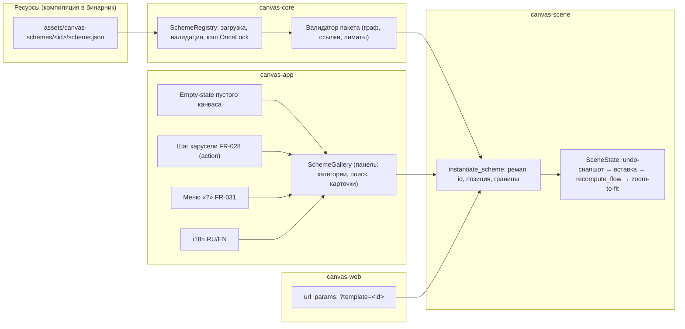

# PRD-0008: Шаблоны готовых схем — библиотека канвасов со связями и расчётами как точка входа онбординга

- **Статус:** в анализе
- **Тип:** PRD (документ требований продукта; реализация оформляется отдельным `FR-<NNN>` по шаблону `docs/change-requests/cr-template.md`)
- **Приоритет:** важно
- **Владелец:** danku13 (владелец продукта)
- **Источник:** запрос владельца (сессия 2026-09-21): «нужно проработать концепцию шаблонов готовых схем со связями и расчётами, которые можно сразу открыть на canvas и которые станут частью онбординга»
- **Связанные документы:** FR-028 (онбординг-карусель, зарезервированное действие v2), FR-018/FR-019/FR-020 (шаблоны одиночных нод), FR-029 (value-порты `fromOutput`/`toParam`), FR-025 (`fromLine`), FR-017 (what-if), FR-031 (меню «?»), FR-006 (undo), PRD-0003 (всеядный импорт графов), PRD-0006 (design-токены), `docs/SPEC.md` §5.1 (расширения формата), §6.3 (бюджеты)
- **Создан:** 2026-09-21
- **Обновлён:** 2026-09-21

---

## 1. Резюме

CanvasDesk умеет считать: Numi-листы в текстовых нодах (`canvasdesk.expr`, FR-013), value-рёбра с адресацией строки и именованного порта (FR-025/FR-029), поток значений с анализом узких мест (FR-016) и what-if сценариями (FR-017). Но новичок этого не видит: первый экран — пустой канвас с приветственной заметкой и двумя файловыми нодами (`seed_canvas`, `crates/canvas-scene/src/scene.rs:191`), и ни одной живой расчётной цепочки. Чтобы «пощупать расчёты», пользователь должен сам узнать о Numi-грамматике, нарисовать ноды, соединить их — барьер, который онбординг-карусель FR-028 смягчает рассказом, но не даёт преодолеть делом.

Предлагается третий слой шаблонной системы — **шаблоны готовых схем**: целые сцены (ноды + связи + Numi-расчёты + группы), поставляемые с приложением как данные и открываемые в текущий канвас в один клик. Ключевые отличия от существующих шаблонных нод FR-018/019: там манифест описывает **одну** ноду с параметрами и формулой; здесь — **граф** документа в подмножестве JSON Canvas, собираемый инстансером с ремапом идентификаторов. Принцип: **шаблон = контент, а не функциональность** — схема собирается только из существующих типов нод и рёбер, не требует новых механизмов движка и потому дёшево верифицируется автотестами.

Распределение: формат пакета схемы + валидатор + реестр (canvas-core), чистый инстансер с ремапом id и одним undo-шагом (canvas-scene), галерея по образцу существующей палитры `TemplatePanel` (canvas-app), стартовый набор из 6 схем в 3 категориях с oracle-тестами значений. Онбординг-интеграция четырьмя поверхностями: действие на шаге карусели FR-028 (механизм `action` уже зарезервирован, `crates/canvas-app/src/onboarding_ui.rs:27`), empty-state при пустом канвасе, пункт в меню «?» (FR-031) и `?template=` URL-параметр web-сборки.

Граница PoC: built-in библиотека + галерея + вставка в текущий канвас одним undo-шагом + стартовый набор + онбординг-мост. За границей (v2): сохранение выделения пользователя как собственного шаблона, интерактивные чек-точки тура поверх схемы-тура (FR-028 v2), MCP-инструменты открытия шаблонов агентом, пользовательские каталоги шаблонов. Приложение одно-документное, поэтому «открыть схему» означает «вставить схему в текущий канвас», а не «сменить документ» — это осознанное упрощение, закрывающее 90% ценности без мульти-документной архитектуры.

---

## 2. Контекст и проблема

### 2.1 Как это выглядит сегодня

Шаблонная система имеет два работающих слоя. Первый — **шаблоны одиночных архитектурных нод** (FR-018/019/020): реестр `TemplateRegistry` (`crates/canvas-core/src/templates.rs:483`), манифесты `assets/templates/com.canvasdesk.*` (45 каталогов) с params-схемой, Numi-формулой и секцией `outputs`; функция `instantiate` (`templates.rs:924`) порождает одну text-ноду с расширением `canvasdesk.template`. UI — палитра `TemplatePanel` (`crates/canvas-app/src/template_ui.rs:103`) с категориями-чипами, поиском и строками-предложениями.

Второй слой — **онбординг FR-028**: карусель из 8 шагов (`ONBOARDING_STEPS`, `crates/canvas-app/src/onboarding_ui.rs:39`) поверх затемнённого канваса, флаги `onboarding_done`/`onboarding_defers` в `config.toml`, перезапуск из меню «?» (FR-031). Механика шагов уже предусматривает hook: «Зарезервированный `action` для v2 — интерактивная чек-точка демо-канваса» (`onboarding_ui.rs:27-28`), но сам v2 не реализован, и тур остаётся чисто рассказным.

Стартовая поверхность — `SceneState::load_or_seed_with_storage` (`scene.rs:814`, `:821`): если файла нет, сеется `seed_canvas` — заметка «Добро пожаловать» и две файловые ноды на `docs/SPEC.md`/`docs/TASKS.md`. Расчётный конвейер при этом полноценен: построчный Numi-движок с единицами измерения (`expr.rs:925` parse, `:1186` eval, `:1268` eval_lines_in с inbound-окружением), value-рёбра с адресацией строки (`Edge.from_line`, `crates/canvas-core/src/model.rs:501`) и именованных портов (`from_output`/`to_param`, FR-029), единая точка пересчёта `recompute_flow` (`scene.rs:334`) над `FlowSolutions` (`crates/canvas-core/src/flow.rs:328`), анализ узких мест (FR-016), what-if со сценариями и дельта-бейджами (FR-017). Undo — снапшоты `Canvas` до мутации (`scene.rs:226`).

### 2.2 Чего не хватает

1. **Формата пакета целой схемы.** Манифесты FR-019 описывают одну ноду; структуры «манифест + граф нод/рёбер» не существует, как и валидатора такого пакета.
2. **Реестра схем.** Нет загрузки встроенного каталога (аналога `TemplateRegistry` для схем) — ни источника данных, ни кэша, ни API перечисления.
3. **Мульти-инстансера.** `instantiate` FR-018 порождает одну ноду с фиксированным id. Для схемы нужен ремап идентификаторов N нод и M рёбер без коллизий с текущим канвасом, позиционирование bounding box в точку вставки и пересчёт потока.
4. **Галереи схем.** Палитра `TemplatePanel` вставляет одиночные ноды; сцене-карточке нужен другой примитив показа (превью-описание, число нод/рёбер, категория) и другое действие («Открыть», а не «Вставить ноду»).
5. **Empty-state.** UI пустого канваса не существует: `nodes.is_empty()` встречается только в тестах (`app.rs:13020`); новичок видит голое полотно.
6. **Моста онбординг → шаблоны.** Шаг карусели «Шаблоны» рассказывает о палитре нод, но не открывает ничего; зарезервированное поле `action` (`onboarding_ui.rs:27`) не задействовано.
7. **Web-точки входа.** `parse_query` (`crates/canvas-web/src/url_params.rs:215`) не знает параметра шаблона — нельзя поделиться ссылкой «открой демо-схему».

### 2.3 Зацепки в коде и документации

- **Паттерн реестра как данных** — `TemplateRegistry` с компиляцией ассетов и кэшем (`templates.rs:483`, прецедент FR-047: реестр тем-пресетов на `include_str!` + `OnceLock`) переносится на схемы без новых решений.
- **Генератор свободных id** — `next_free_id` (`scene.rs:178`) уже обобщён на префиксы `note`/`file` — основа ремапа.
- **Undo-инфраструктура** — снапшоты до мутации (`scene.rs:226`): вставка схемы становится одним шагом истории бесплатно.
- **Value-рёбра и порты** — `Edge` (`model.rs:501`) с `from_line`/`from_output`/`to_param`: связность схем выражается существующей моделью, формат `.canvas` не расширяется.
- **Единая точка пересчёта** — `recompute_flow` (`scene.rs:334`): после вставки значения считаются сами.
- **Всеядный импорт (PRD-0003/FR-043)** — параллельная задача «внешний формат → граф канваса»; ремап id и валидация графа — общие примитивы, контракты стоит сверить.
- **Палитра UI** — `TemplatePanel` (`template_ui.rs:103`): категории-чипы, поиск, клавиатурная навигация — образец для галереи.
- **i18n** — паттерн ключей `crates/canvas-app/src/i18n.rs` (RU/EN) обязателен для названий и описаний схем в галерее.

---

## 3. Цели и метрики успеха

| # | Цель | Метрика |
|---|---|---|
| G1 | Сократить путь «запуск → первая живая расчётная цепочка на экране» | ≤ 2 клика и ≤ 30 секунд из пустого канваса (сейчас путь отсутствует: новичок не встречает ни одной формулы) |
| G2 | Библиотека содержательна, а не витрина | ≥ 6 встроенных схем в ≥ 3 категориях; каждая проходит автотест: валидация манифеста → инстанциация в пустой канвас → `recompute_flow` → oracle-равенство контрольных значений |
| G3 | Вставка безопасна и обратима | ровно 1 undo-шаг на открытие схемы; 0 коллизий id на всех схемах (автотест перебора на непустом канвасе) |
| G4 | Онбординг ведёт к делу | из шага карусели FR-028 галерея открывается действием `action`; при 0 нод канваса показывается empty-state с входом в галерею |
| G5 | Web-паритет без сети | схемы компилируются в бинарник (wasm-гейт зелёный), 0 сетевых запросов, суммарный вес ассетов схем ≤ 100 КБ |
| G6 | Формат не страдает | вставленная схема сохраняется в валидный JSON Canvas 1.0 (round-trip Obsidian; расширения только `canvasdesk.*` — SPEC §5.1) |
| G7 | Вставка не роняет кадр | инстанциация схемы на 200 нод ≤ 50 мс (тест-бюджет, замер в release-профиле) |

---

## 4. Пользователи и сценарии

**Персона 1 — Илья, новичок (герой CJM).** Открыл CanvasDesk впервые, о Numi не слышал, боится «сломать». Ему нужно за минуту увидеть, что продукт умеет считать, и попробовать сам: поменять вход — увидеть пересчёт. От фичи: понятная карточка «Живые расчёты» в empty-state, открытие в один клик, подписи-подсказки прямо в схеме.

**Персона 2 — Марина, оценивающий/чемпион.** Присматривает инструмент для команды, показывает демо коллеге за 2 минуты. Ей нужен «выигрышный сценарий»: открыть готовую осмысленную схему (юнит-экономика, ёмкость сервиса), покрутить what-if, показать дельты. От фичи: галерея из меню «?», схемы с живыми цепочками и сценариями.

**Персона 3 — Архей, опытный пользователь.** Ведёт сметы и мини-расчёты постоянно; типовую заготовку (бюджет проекта, смета) удобнее взять готовой и доправить, чем собирать с нуля. От фичи: вставка схемы поверх текущего канваса со сдвигом, аккуратный undo, отсутствие конфликтов id с его содержимым.

**Персона 4 — MCP-агент.** В перспективе (v2, could): по просьбе пользователя открывает демо-схему (`templates_list`/`templates_apply`), чтобы проиллюстрировать ответ живым канвасом. В PoC — вне скоупа, но API реестра проектируется пригодным для вызова без UI.

---

## 5. User stories и критерии приёмки

### US-1. Первая схема из пустого канваса

> **Как** новичок (Илья), **я хочу** на пустом канвасе увидеть карточку «Начните с шаблона» и открыть схему одним кликом, **чтобы** сразу увидеть живые расчёты, а не пустое полотно.

**Acceptance criteria:**
- AC-1.1: при `canvas.nodes.is_empty()` по центру вьюпорта отрисовывается empty-state (действие «Открыть галерею схем», подсказка «двойной клик — заметка»); исчезает при первой ноде.
- AC-1.2: клик открывает галерею; клик по схеме вставляет её в канвас; первое контрольное значение видно без прокрутки (zoom-to-fit на содержимое).
- AC-1.3: до и после вставки `recompute_flow` даёт oracle-значение контрольной ячейки схемы (автотест).

### US-2. Демо для коллеги из меню «?»

> **Как** оценивающий (Марина), **я хочу** открыть галерею схем из меню «?» и запустить «выигрышную» схему, **чтобы** за 2 минуты показать расчёты и what-if без подготовки.

**Acceptance criteria:**
- AC-2.1: меню «?» (FR-031) содержит пункт «Галерея схем»; открывает ту же галерею, что и empty-state.
- AC-2.2: в составе набора есть схема с приглашением к what-if; открытие и смена сценария не требуют правки формул.

### US-3. Вставка заготовки поверх рабочего канваса

> **Как** опытный пользователь (Архей), **я хочу** вставить схему-заготовку рядом с текущим содержимым, **чтобы** доработать её под свою задачу без риска для существующих нод.

**Acceptance criteria:**
- AC-3.1: id вставленных нод/рёбер не совпадают с существующими (ремап через `next_free_id`, `scene.rs:178`); схема вставляется bounding box'ом в центр вьюпорта без пересечений с выделением.
- AC-3.2: открытие схемы — ровно один undo-шаг; Ctrl+Z возвращает канвас в точное прежнее состояние (снапшот-паттерн `scene.rs:226`).
- AC-3.3: value-рёбра схемы ссылаются только на ноды схемы (нет тихих переподключений к чужим нодам).

### US-4. Тур ведёт к действию

> **Как** новичок, **я хочу** на шаге карусели о шаблонах нажать «Попробовать» и попасть в галерею, **чтобы** тур закончился живой схемой, а не рассказом.

**Acceptance criteria:**
- AC-4.1: шаг «Шаблоны» карусели FR-028 несёт `action`, открывающий галерею; механизм резервации (`onboarding_ui.rs:27-28`) задействован без переписывания машины состояний.
- AC-4.2: после открытия галереи карусель закрывается; прогресс тура сохраняется (поведение «Пропустить» не меняется).

### US-5. Ссылка на демо в web (v2-приоритет, в PoC — за кадром)

> **Как** оценщик, **я хочу** поделиться ссылкой `?template=<id>`, **чтобы** коллега открыл демо-схему без объяснений.

**Acceptance criteria:**
- AC-5.1: `parse_query` распознаёт `template=<id>`; при старте web-сборки схема вставляется после инициализации сцены; неизвестный id — мягкий отказ (тост, пустой канвас).
- AC-5.2: поведение покрывается юнит-тестом парсера и интеграционным тестом инстансера.

---

## 6. CJM (Customer Journey Map) — обязательный раздел

Персона CJM — **Илья, новичок (§4, Персона 1)**; канал — desktop (web-вариант отличается только точкой входа `?template=`). CJM зафиксирован для PoC-границы и пересматривается после первых юзабилити-прогонов (этап T5 дорожной карты §13).

### 6.1 Краткий CJM (шаги)

| # | Этап | Действие пользователя | Поверхность |
|---|---|---|---|
| 1 | Запуск | открывает приложение впервые; видит пустой канвас с empty-state | канвас (empty-state) |
| 2 | Выбор | кликает «Начните с шаблона» | empty-state → галерея |
| 3 | Знакомство | читает карточки схем, выбирает «Живые расчёты» | галерея (диалог) |
| 4 | Открытие | клик «Открыть»; схема появляется, зум подгоняется | канвас |
| 5 | Проба | меняет входное число в Numi-строке; видит пересчёт цепочки | канвас (нода) |
| 6 | Углубление | жмёт what-if (приглашение из схемы), смотрит дельты | нижний бар (FR-017) |
| 7 | Сохранение | сохраняет канвас как свой файл | ОС-диалог / Ctrl+S |

### 6.2 Детальный CJM (мысли, эмоции, боли, точки отвала)

| Этап | Действия | Мысли | Эмоции | Боли | Точка отвала (условие → реакция) | Возможности |
|---|---|---|---|---|---|---|
| 1. Запуск | смотрит на empty-state | «Пусто… и что дальше?» | растерянность (−1) | страх чистого листа | D1: пустой канвас без подсказок → закрыл и не вернулся | empty-state с одной главной кнопкой |
| 2. Выбор | открывает галерею | «О, тут есть готовое» | любопытство (+1) | боязнь сложного UI | D2: галерея перегружена/непонятны категории → закрывает | ≤ 3 категории, карточки с одним предложением смысла |
| 3. Знакомство | читает карточки | «Какая мне нужна?» | интерес (+1) | незнание терминов | D3: жаргон («mm1», «проливание») → пропуск схемы | описания на языке задачи («сколько выдержит сервер»), не движка |
| 4. Открытие | вставляет схему | «Вжух — и всё связано» | восторг (+2) | страх испортить канвас | D4: схема затёрла/смешалась с существующим → паника | вставка одним undo-шагом; на пустом канвасе рисков нет |
| 5. Проба | правит вход | «Я поменял 1000 → 2500 и всё пересчиталось!» | восторг (+2) | не понимает, что можно править | D5: не понял, что числа живые → схема «мертва» для него | подсказка в схеме: «поменяйте число — цепочка пересчитается» |
| 6. Углубление | пробует what-if | «Это же сценарии!» | вовлечённость (+2) |_second what-if неочевиден_ | D6: what-if не нашёл → ценность недополучена | приглашающая нода в схеме-демо со ссылкой на режим |
| 7. Сохранение | сохраняет файл | «Это теперь мой рабочий файл» | удовлетворение (+1) | — | D7: сохранение перезаписало demo-файл неожиданно → недоверие | схема вставляется в текущий документ пользователя; явный Ctrl+S |

### 6.3 Трассировка точек отвала

Каждая точка отвала CJM имеет митигацию в требованиях или рисках: D1 → F-6 (empty-state) + G1; D2 → F-4 (галерея с категориями) + §7.2 (≤ 3 категории в PoC); D3 → F-5 (описания схем на языке задачи, i18n F-7); D4 → F-3 (один undo-шаг, ремап id) + G3; D5 → F-5 (подсказки внутри схем набора — обязательное требование к контенту) + G2 (oracle-тесты гарантируют живость); D6 → F-5 (схема what-if демо) + US-2 AC-2.2; D7 → §10 (non-goal «смена документа») + US-3 AC-3.2.

---

## 7. Решение

### 7.1 Концептуальная схема

### 7.2 Точка интеграции в архитектуре

| Элемент | Решение |
|---|---|
| Формат пакета | `assets/canvas-schemes/<reverse-dns>/scheme.json` — один файл: метаданные (id, name_ru/en, description_ru/en, category, tags, version, accent) + `content` {`nodes[]`, `edges[]`} в подмножестве JSON Canvas 1.0 (типы нод `text`/`group`; рёбра с `fromLine`/`fromOutput`/`toParam` по FR-025/FR-029). Расширения формата `.canvas` — нулевые (SPEC §5.1) |
| Реестр | `canvas-core`: новый модуль `schemes.rs` рядом с `templates.rs` — `SchemeRegistry` по паттерну `TemplateRegistry` (`templates.rs:483`) и FR-047 (компиляция ассетов, кэш `OnceLock`, чистые функции, 0 I/O в hot path); ассеты инклюдятся на этапе компиляции (wasm-совместимо, G5) |
| Валидатор | чистая функция: уникальность id схемы и нод, рёбра ссылаются на ноды схемы, типы нод из белого списка, лимит ≤ 200 нод и ≤ 400 рёбер на схему, обязательные RU/EN-поля; вызывается на загрузке реестра и в тестах |
| Инстансер | `canvas-scene`: чистая функция `instantiate_scheme(manifest, &Canvas, origin) -> (Vec<Node>, Vec<Edge>)` — ремап `scheme.json`-id → `next_free_id` (`scene.rs:178`), сдвиг bounding box к origin, копия нод/рёбер; апплаер в `SceneState`: undo-снапшот (`scene.rs:226`) → вставка → `recompute_flow` (`scene.rs:334`) → zoom-to-fit содержимого |
| Галерея | `canvas-app`: `scheme_gallery_ui.rs` по образцу `TemplatePanel` (`template_ui.rs:103`) — категории-чипы (≤ 3 в PoC), поиск, карточки (имя, описание 1-2 строки, категория, счётчик нод/рёбер, кнопка «Открыть»); цвета — слоты `ThemeColors` v2, без новых констант (правило PRD-0006) |
| Онбординг-мосты | empty-state при `nodes.is_empty()` (canvas-app); шаг карусели FR-028 с `action = открыть галерею` (резервация `onboarding_ui.rs:27`); пункт меню «?» (FR-031, `app.rs:869`); каждый вход ведёт в одну и ту же галерею |
| Web | `canvas-web`: поле `template` в `WebParams` (`url_params.rs:215`), авто-вставка после инициализации сцены; неизвестный id — тост, не паника |
| Локализация | названия/описания/категории схем — `name_ru`/`name_en`, `description_ru`/`description_en` в манифесте; UI-строки галереи — ключи i18n (паттерн `i18n.rs`); содержимое Numi-листов схем — интернациональные имена переменных (Q1) |
| MCP | вне PoC; реестр без UI-зависимостей оставляет путь к `schemes_list`/`schemes_apply` (v2) |

**Стартовый набор (6 схем, 3 категории)** — контент PoC, каждая с oracle-тестами (G2) и подсказкой-приглашением к правке (D5):

| id | Категория | Суть | Демонстрирует |
|---|---|---|---|
| `intro-calculations` | Онбординг | «Живые расчёты»: пользователи × сессии → нагрузка → итог; 5-6 нод | Numi-строки, value-рёбра, пересчёт при правке |
| `intro-whatif` | Онбординг | «Сценарии»: бюджет проекта с приглашением к what-if; 5 нод | FR-017: override строки, дельта-бейджи |
| `capacity-service` | Архитектура | «Ёмкость сервиса»: users → rps → LB/DB/Cache → латентность; ~10 нод | mm1-функция, порты `outputs`, узкие места (FR-016) |
| `project-budget` | Планирование | «Бюджет проекта»: этапы в группах, статьи, резерв 15%, итог; ~12 нод | группы, суммы, проценты |
| `unit-economics` | Бизнес | «Юнит-экономика»: price/COGS/CAC/conv → LTV, CAC:LTV, payback; ~9 нод | производные метрики, сравнение с нормативом |
| `renovation-estimate` | Планирование | «Смета ремонта»: площади × расценки, материалы, итог; ~10 нод | единицы измерения (м², руб) Numi |

### 7.3 Отвергнутые варианты

| Вариант | Вердикт | Причина |
|---|---|---|
| Шаблон = отдельный `.canvas`-файл, «открыть как документ» | отклонён | приложение одно-документное (`SceneState` держит один `Canvas`); вкладки/мульти-документ — чужая большая фича; плюс потери при незасейвленной работе |
| Новый бинарный/специальный формат схем | отклонён | дублирование формата документа; JSON Canvas-подмножество переиспользует сериализацию и валидацию, шаблоны читаются тем же кодом |
| Демо-канвас FR-028 v2 как хардкод в коде онбординга | отклонён | контент в коде не верифицируется oracle-тестами и дублирует библиотеку; вместо этого v2-чек-точки лягут поверх схемы-тура из библиотеки |
| PNG-превью схем в ресурсах | отклонён (PoC) | вес бинарника (бюджет G5) и рассинхрон с реальным содержимым; PoC-карточка текстовая + счётчики, программное превью-миниатюра — v2 |
| Вставка схем через MCP `graph_apply_batch` (FR-033) в PoC | отложена | FR-033 адресует агентов, а не онбординг; но контракт инстансера проектируется переиспользуемым для него (v2, Q5) |

---

## 8. Функциональные требования

| ID | Требование | Приоритет | Приёмка |
|---|---|---|---|
| F-1 | Формат пакета схемы: `scheme.json` (метаданные RU/EN + `content.nodes[]`/`content.edges[]` в JSON Canvas-подмножестве) и валидатор (уникальность, ссылки, белый список типов, лимиты) | must | US-1 AC-1.3; тесты валидатора |
| F-2 | Реестр built-in схем `SchemeRegistry` (canvas-core): компиляция ассетов, кэш, API перечисления/получения без UI | must | G2, G5; тест реестра |
| F-3 | Инстансер: чистая функция ремапа id + позиционирование; апплаер — один undo-шаг, `recompute_flow`, zoom-to-fit | must | US-3 AC-3.1/3.2; G3, G7 |
| F-4 | Галерея схем (панель): категории, поиск, карточки, кнопка «Открыть»; клавиатура и Esc по паттернам существующих панелей | must | US-2 AC-2.1; инвариант-тесты панелей |
| F-5 | Стартовый набор: 6 схем (§7.2) с oracle-тестами значений и подсказками-приглашениями внутри | must | G2; тест перебора схем |
| F-6 | Empty-state пустого канваса с входом в галерею | must | US-1 AC-1.1 |
| F-7 | i18n RU/EN: манифесты (`name_*`, `description_*`), категории, UI-строки галереи | should | US-1/US-2; тесты i18n-ключей |
| F-8 | Онбординг-мост: `action` на шаге карусели, пункт меню «?» | should | US-4 AC-4.1/4.2 |
| F-9 | Web: `?template=<id>` — авто-вставка при старте, мягкий отказ на неизвестный id | should | US-5 AC-5.1 |
| F-10 | «Сохранить выделение как шаблон» + пользовательские каталоги (`~/.canvasdesk/schemes/`, FR-020-паттерн) | could | v2, вне PoC |

---

## 9. Нефункциональные требования

1. **Архитектура/wasm:** реестр и валидатор — в `canvas-core`, чистые функции без I/O (инварианты тестируемости по образцу `templates.rs`); ассеты — компиляция в бинарник, `scripts/wasm_gate.sh` зелёный; платформенно-специфичной логики нет.
2. **Производительность:** вставка ≤ 50 мс на 200 нод (G7, release-замер); реестр инициализируется один раз (`OnceLock`); галерея не пересобирает списки на каждый кадр (паттерн кэширования `settings_ui`).
3. **Формат:** JSON Canvas 1.0 не расширяется; все ноды/рёбра схемы — стандартные объекты; расширения только существующие `canvasdesk.*` (SPEC §5.1); round-trip Obsidian не деградирует (G6).
4. **Безопасность/сеть:** схемы — статический встроенный контент, 0 сетевых запросов; секреты и внешние пути не сериализуются.
5. **Лицензии/зависимости:** новых зависимостей нет; ассеты — собственный контент репозитория.
6. **Детерминизм/TDD:** инстансер и валидатор — чистые функции; тесты до реализации (AGENTS.md); oracle-значения схем фиксируются в тестах.
7. **A11y/токены:** все цвета галереи и empty-state — через `ThemeColors` v2 и дизайн-токены (PRD-0006, правило потока §7.1); контраст по CR-007; токен-линт зелёный.

---

## 10. Non-goals

- **Мульти-документность/вкладки** — «открыть схему» = вставка в текущий канвас; смена документа не входит (одно-документная архитектура, §7.3).
- **Маркетплейс/облако шаблонов** — без сети по правилам репозитория; встроенный каталог + (v2) локальные пользовательские файлы.
- **Редактор схем в UI** — авторинг схем выполняется в репозитории (JSON-файлы + тесты), не в приложении.
- **Новые типы нод/рёбер** — схемы собираются только из существующих примитивов; потребности движка фиксируются отдельными FR, а не через контент.
- **Шаблонные ноды FR-019 внутри схем (PoC)** — в PoC белый список типов `text`/`group`; композиция схем с архитектурными шаблонами — v2 (требует инстанциации манифестов внутри схемы).
- **Рендер-превью галереи** — программные миниатюры и PNG — v2.
- **Локализация содержимого Numi-листов** — названия/описания двуязычны, переменные схем — латиница (Q1); полный перевод формул — вне скоупа.

---

## 11. Открытые вопросы

| # | Вопрос | Варианты | Влияние | Кто решает |
|---|---|---|---|---|
| Q1 | Язык содержимого схем: переменные Numi — латиница, подписи/заметки в схемах — RU+EN дубли или RU-первично? | (a) заметки двуязычные (вес ×1.5); (b) RU-первично, EN — v2; (c) интернациональные схемы с минимумом текста | вес ассетов (G5), объём набора (F-5) | владелец |
| Q2 | Финальный состав 6 схем §7.2 (темы/порядок) | заменить/добавить темы под аудиторию (архитекторы vs аналитики) | контент F-5, CJM | владелец |
| Q3 | Поведение «Открыть» при непустом канвасе: (a) сразу вставлять в центр вьюпорта + undo; (b) мини-диалог «вставить сюда / отменить» | (a) меньше трения; (b) страх D4 у осторожных | UX вставки F-3 | владелец (предложение: a) |
| Q4 | Первый запуск: сохранять ли `seed_canvas` (заметка + 2 файловые ноды, `scene.rs:191`) при отсутствии файла, или заменять empty-state + онбордингом? | (a) seed остаётся, empty-state только при 0 нод; (b) seed убирается у новых пользователей (файла нет → сразу empty-state) | точка входа US-1, преемственность FR-028 | владелец |
| Q5 | MCP-инструменты `schemes_list`/`schemes_apply` — включать в PoC или отложить в v2? | (a) v2 (предложение); (b) сразу — агентная петля «покажи демо» | скоуп FR, реестр API | владелец |

---

## 12. Риски и митигации

| Риск | Влияние | Митигация |
|---|---|---|
| Коллизии id при вставке в непустой канвас | сломанные рёбра, потеря данных | ремап всех id через `next_free_id` (`scene.rs:178`); автотест вставки всех схем в заранее заполненный канвас (G3) |
| Дрейф схем от эволюции формата/движка | «мертвые» схемы у пользователей | валидатор F-1 + oracle-тесты G2 в общем прогоне CI; схемы ломаются громко, а не тихо |
| Вес бинарника wasm | медленная первая загрузка web | лимит ≤ 100 КБ (G5); текстовый JSON сжимается; запрет PNG-превью (§7.3) |
| Перегруз новичка галереей | D2/D3 CJM | ≤ 3 категорий, карточка = одно предложение; описания на языке задачи; отбор набора владельцем (Q2) |
| Схемы конфликтуют с токен-линтом (hex-цвета в ресурсах) | падение гейта PRD-0006 | цвет нод схем — только пресеты JSON Canvas «1»..«6»; произвольный hex запрещён контрактом валидатора (прецедент исключения FR-018 зафиксирован точечно) |
| Вставка больших схем роняет кадр | D4-подобное недоверие | лимит 200 нод в валидаторе; бюджет-тест G7; вставка единым снапшотом без промежуточных состояний |

---

## 13. Дорожная карта

| Этап | Содержание | Результат |
|---|---|---|
| T0 | Оформление реализационного FR (следующий свободный номер, шаблон `cr-template.md`) | Разрешение на реализацию |
| T1 | Ядро (canvas-core): формат `scheme.json`, валидатор, `SchemeRegistry` + тесты | G2-инфраструктура |
| T2 | Инстансер и апплаер (canvas-scene): ремап, позиция, undo, `recompute_flow`, zoom-to-fit + тесты | G3, G7 |
| T3 | Галерея (canvas-app): панель, категории, поиск, empty-state, меню «?», i18n | US-1, US-2, US-4 |
| T4 | Стартовый набор: 6 схем + oracle-тесты; heft-замер G7 | F-5, G2 |
| T5 | Web: `?template=`; демо-гейт (ручная приёмка), точки входа §14 | F-9, G5, G6 |
| T6 | v2: сохранение выделения как шаблона (F-10), чек-точки тура FR-028 v2 поверх схемы-тура, MCP `schemes_*`, программные превью | Отдельные FR |

---

## 14. Точки входа в документацию (обязательные обновления при реализации)

- `docs/change-requests/fr-<NNN>-canvas-scheme-templates.md` — реализационный FR (создаётся на T0).
- `docs/SPEC.md` — §5 (формат: ассеты схем, отсутствие расширений `.canvas`), §6 (бюджеты G7), §8 (входы галереи).
- `docs/interface-objects/` — новый `scheme-gallery.md` + актуализация `onboarding.md` (шаг с `action`).
- `user-docs/quick-start.md` — сценарий «первые шаги через шаблон»; синк `README`/`index`.
- `docs/ACCEPTANCE.md` — секция приёмки FR.
- `docs/prd/README.md` — статус этого PRD; `docs/index.md` — строка каталога.
- `worklog.md` репозитория — запись реализации по правилам AGENTS.md.

---

## 15. Проверка (Definition of Done PoC)

- [ ] Демо-сценарий 1: чистый профиль → запуск → empty-state → «Живые расчёты» → правка входа → пересчёт виден (≤ 2 кликов, ≤ 30 с — G1).
- [ ] Демо-сценарий 2: непустой канвас → меню «?» → галерея → «Бюджет проекта» → вставка без коллизий → один Ctrl+Z откатывает (G3).
- [ ] Демо-сценарий 3: шаг карусели «Шаблоны» → «Попробовать» → галерея → схема открыта (US-4).
- [ ] Все 6 схем проходят oracle-тесты (парсинг → инстанс → `recompute_flow` → контрольные значения) — G2.
- [ ] Гейты зелёные: `cargo fmt --all --check`, `cargo clippy --workspace --all-targets -- -D warnings`, `cargo test --workspace`, `scripts/wasm_gate.sh`, `scripts/mcp_wasm_gate.sh`, токен-линт.
- [ ] Round-trip: канвас со вставленными схемами сохраняется и читается (JSON Canvas валиден, расширения только `canvasdesk.*`) — G6.
- [ ] Вес ассетов схем ≤ 100 КБ — G5; вставка 200-нодовой схемы ≤ 50 мс (release) — G7.
- [ ] Точки входа §14 закрыты; индексы PRD/CR актуализированы.

---

## 16. История изменений

- `2026-09-21` — агент (сессия владельца): создан документ (PRD-0008), статус `в анализе`; концепция шаблонов готовых схем: формат пакета, реестр, инстансер, галерея, 6 схем, онбординг-мосты; 5 открытых вопросов к владельцу (Q1-Q5).

## 17. Источники истины

- Запрос владельца (сессия 2026-09-21): «нужно проработать концепцию шаблонов готовых схем со связями и расчётами, которые можно сразу открыть на canvas и которые станут частью онбординга» — постановка PRD.
- `crates/canvas-scene/src/scene.rs:178` (`next_free_id`), `:191` (`seed_canvas`), `:218`/`:226` (`SceneState`, undo), `:334` (`recompute_flow`), `:814`/`:821` (`load_or_seed`) — стартовая поверхность и точки интеграции.
- `crates/canvas-core/src/model.rs:203` (`Node`), `:501` (`Edge`, `from_line`/`from_output`), `:763` (`Canvas`) — модель графа документа.
- `crates/canvas-core/src/expr.rs:925`/`:1186`/`:1268` — Numi-движок; `crates/canvas-core/src/flow.rs:328` (`FlowSolutions`) — поток значений.
- `crates/canvas-core/src/templates.rs:334`/`:483`/`:924` — паттерн реестра и инстанса одиночных нод (FR-018/019).
- `crates/canvas-app/src/onboarding_ui.rs:27`/`:39` — карусель FR-028 и резервация `action`; `crates/canvas-app/src/template_ui.rs:103` (`TemplatePanel`) — образец панели; `app.rs:869` (`HelpMenuState`) — меню «?».
- `crates/canvas-web/src/url_params.rs:215` (`parse_query`) — web-точка входа.
- `docs/SPEC.md` §5.1, §6.3; `docs/prd/README.md` (правила каталога, связи PRD); FR-025/FR-029 (value-рёбра), FR-016/FR-017 (анализ/what-if), FR-031 (меню «?»), FR-033 (batch-применение — переиспользование контракта в v2).
