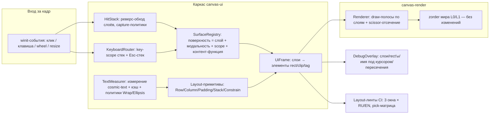

# PRD-0009: Слои, вёрстка и UI kit — системное решение z-index и наложений

- **Статус:** в работе (U0–U3 выполнены — FR-051/FR-052/FR-053; U4 UI kit/DebugOverlay — следующим этапом)
- **Тип:** PRD (документ требований продукта; реализация оформляется отдельным `FR-<NNN>` по шаблону `docs/change-requests/cr-template.md`)
- **Приоритет:** критично (инфраструктура для всех UI-фич: каждая новая поверхность сейчас повышает риск регрессий z-типа)
- **Владелец:** агент (по запросу владельца)
- **Источник:** запрос владельца 2026-09-22, дословно: «при разработке проекта регулярно сталкиваемся с проблемой z-index, правильной вёрстки текстов и форм под ними, налезания одних элементов на другие и т.д. требуется глубоко проработать эти проблемы и найти решение, возможно в рамках создания UI kit связанного с дизайн-системой. Предложи варианты решений, дай плюсы и минусы, какие решения можно совместить, чтобы минимизировать проблемы»
- **Связанные документы:** PRD-0006 (design-токены, `ThemeColors` v2), PRD-0007 (defense mode — будущий модальный оверлей), PRD-0002/FR-042 (main stage + реестр взаимоисключимых модальностей Q6), FR-049 (галерея схем), CR-006 (select поверх виджетов), CR-010 (клип заголовка), CR-011 (палитровые заливки), CR-015 (what-if бар/тост), ADR-0011 (wasm-гейт), `design/tokens/dimensions.json`, `docs/plans/` M5 (политика airspace П7), `docs/SPEC.md` §6 (бюджеты рендера)
- **Создан:** 2026-09-22
- **Обновлён:** 2026-09-22

---

## 1. Резюме

UI-слой CanvasDesk вырос до 20+ одновременно возможных поверхностей (панели, меню, модалки, оверлеи, тосты, тултипы, палитры) поверх самописного wgpu-рендера, но каркас, который в зрелых UI-фреймворках решает вопросы «кто кого перекрывает и кто получит клик», здесь не выделен: порядок отрисовки задан физическим порядком кода в двух местах (`crates/canvas-app/src/app.rs:11905–12260` — сборка списков, `crates/canvas-render/src/renderer.rs:1368–1442` — проходы), приоритет ввода — тремя ручными реестрами (цепочка веток в `on_left_button`, Esc-лестница в `on_key`, ручной предикат `cursor_over_screen_surface`), системного клиппинга нет вообще, а ширины текста оцениваются эвристиками. Результат — класс проблем из запроса владельца: z-index-регрессии, налезания, переполнения текста, непредсказуемая деградация на узких окнах. История уже содержит документированные регрессии этого типа (баг T14, регрессия 136e9fb, «каша» stage, тултип поверх затемнения).

Предлагается не заменять UI, а достроить недостающий каркас из четырёх взаимно усиливающих подсистем: (1) **декларативный реестр поверхностей** — каждая поверхность регистрируется один раз с указанием слоя, модальности и keyboard-scope, из чего автоматически выводятся порядок отрисовки, приоритет ввода, Esc-стек, wheel-предикат и airspace виджетов; (2) **layout-примитивы + измеренный текст + системный клиппинг** — микро-движок вёрстки (Row/Column/Padding/Stack) поверх реального измерения cosmic-text вместо эвристик и scissor-отсечение вместо ручных клампов; (3) **UI kit компонентов** с контрактами токенов PRD-0006 (цвета — только слоты `ThemeColors` v2, отступы — только scale из `dimensions.json`, слой и модальность — только из реестра); (4) **инструментальный контур** — debug-оверлей слоёв/хитов одной клавишей и layout-линты в CI (headless-тесты, ловящие налезания и переполнения до слияния).

Суть ответа на вопрос владельца «какие решения совместить»: ни одно из рассмотренных решений по отдельности не закрывает весь класс проблем — слои без примитивов вёрстки убирают z-регрессии, но оставляют налезания внутри панелей; примитивы без реестра не решают приоритет ввода; kit без линтов деградирует. Принимается комбинация (1)+(2)+(3)+(4) поэтапно (U0–U5, §13), с сознательными отказами: egui (двойной текстовый рендер, конфликт с PRD-0006, вес wasm), retained-дерево виджетов и flexbox-движок taffy (отложено в v2 за совместимым интерфейсом примитивов). PoC-граница: рендер мира (карточки/рёбра/z-сегменты `canvas-render/src/zorder.rs`) не трогается, мигрируются 6 репрезентативных поверхностей, новых runtime-зависимостей нет.

---

## 2. Контекст и проблема

### 2.1 Как это выглядит сегодня

UI — самописный immediate-mode-подобный слой: за кадр приложение заново собирает списки квадов и текстов, рендер исполняет их одним render-pass. Порядок «кто поверх кого» задан не декларативно, а **физическим порядком кода в двух местах**:

- сборка кадра — `WindowEvent::RedrawRequested` (`crates/canvas-app/src/app.rs:11827`): линейное наращивание screen-списков в порядке `settings_overlay` (app.rs:11916) → `scheme_gallery_overlay`/`empty_state` (11917/11921) → `canvas_menu_overlay` (11928) → `help_menu`+`docs` (11936) → `onboarding` (11946) → `palette` (11954) → `search` (11960) → `template_panel`+`wheel` (11967) → `hints` (11977) → `whatif` (11984) → тултипы (11994) → диалог (12035) → тост (12086) → main stage (12123–12170) → drop-ghosts (12170) → widgets airspace (12301) → `FrameOverlay` (12374);
- исполнение — `Renderer::render` (`crates/canvas-render/src/renderer.rs:615`): сетка (1368) → рёбра (1375) → z-сегменты `cards/thumbs/text` по плану `zorder::plan_z_order` (1377–1385) → мир-хвост (1388) → снапшоты виджетов (1397) → guides (1403) → сектора wheel (1410) → screen-квады панелей (1413) и тексты (1416–1421) → миникарта (1426) → main stage (1434–1437).

Ввод координируется **тремя ручными реестрами**, не связанными с порядком отрисовки механически:

- клик — длинная if-цепочка `on_left_button` (`app.rs:8888`): 25+ веток в порядке «сначала UI, потом канвас» (галерея 8923 → онбординг 8931 → empty-state 8967 → main stage 8990 → поиск 9025 → wheel 9051 → палитра шаблонов 9107 → help 9246 → docs 9293 → what-if 9331 → кнопки 9338 → настройки 9377 → хоткеи 9465 → миникарта 9475 → диалог 9489 → `selective_hit` 9510 → … → drag ноды 9993);
- клавиатура — `on_key` (`app.rs:7898`) с приоритетной лестницей (7901–8136) и **Esc-цепочкой из 10 шагов** (8139–8226: main stage → help-меню → docs → палитра → flyout → док палитры → контекст-меню → настройки → хоткеи → what-if → wheel);
- wheel/hover — ручной предикат `cursor_over_screen_surface` (`app.rs:3726–3859`, перечислены все rect'ы заново) и точечное глушение hover при открытых диалогах (`app.rs:10519–10523`).

Текста: шейпинг через glyphon 0.6/cosmic-text 0.12 с кэшами (`canvas-render/src/text.rs:1259`, `CacheKey` :998), но ширины для вёрстки в UI-модулях **оцениваются эвристиками, а не измеряются**: `template_ui.rs:77–79` (`chars().count()*7.5+20`), `whatif_ui.rs:64–67` и `docs_ui.rs:410–415` (`0.62·кегль`), `app.rs:8611` (`char_w = 7.2`). Перенос у screen-текстов выключен (`Wrap::None` — text.rs:1665/1903/1960/2007/2040), усечение — ручное по символам (`whatif_ui.rs:126–132`, `lib.rs:1009`, `app.rs:176`).

Клиппинга нет системно: `rg "scissor"` по `crates/` даёт **0 совпадений** — контент удерживается ручными клампами: тултип клампится к краю окна (`app.rs:12005`), чипы галереи срезаются с `break` (`scheme_gallery_ui.rs:158–166`), хвост what-if бара ужимается closure-клампом (`whatif_ui.rs:190–198`), чипы категорий палитры срезаются (`template_ui.rs:687–690`). Вёрстка — ручная математика в каждом модуле с литеральными константами: `settings_ui.rs:726–825`, `template_ui.rs:662–752` (`PANEL_WIDTH 340`, `ROW_HEIGHT 46`…), `scheme_gallery_ui.rs:128–193`, `search_ui.rs:294–335` (вырожденные rect'ы на узком окне, :302–307), `hints_ui.rs:256–272`, `app.rs:11091–11108` (диалог фиксированной высоты `h = 150.0` — не адаптируется под текст). Resize обрабатывается пассивным пересчётом «на кадр» (`app.rs:11783–11788`), min-size окна не задан (`app.rs:12597` — нет `with_min_inner_size`).

Дизайн-токены (PRD-0006) внедрены: `canvas-core/src/tokens.rs` (parity-тест с `design/tokens/*.json`, :195–471), `ThemeColors` v2 ~36 слотов (`canvas-render/src/theme.rs:11–94`), 7 тем-пресетов (FR-047). Остались острова мимо слотов: stage-порты берут старые компонентные константы `SELECTION_BORDER`/`FLOW_EDGE_COLOR`/`EDGE_COLOR` (`app.rs:8529–8534`), hover-состояния собираются самодельным посветлением (`hover_fill`, `app.rs:858`), 6 hex-литералов в web-CSS (`crates/canvas-web/index.html:120–160`), метрики текста вне токенов (`docs_ui.rs:410–415`).

История регрессий z-типа документирована прямо в коде: «фикс наложения тамбнейлов и текста» (`renderer.rs:940–946` + `zorder.rs:1–15`), «регрессия 136e9fb: порты и мировые оверлеи не входили ни в один draw-диапазон и исчезали» (`zorder.rs:164–171`), «баг T14: тамбнейлы и тексты последнего сегмента перекроют полупрозрачный фон панели» (`zorder.rs:161–167`), «регрессия "каши" в stage» — stage рисовался под текстом финального сегмента (`app.rs:12115–12122`, `renderer.rs:1429–1436`), «тултип "просвечивает" поверх затемнения» (`app.rs:11988–11993`), плюс CR-006 (select-заливка поверх виджетов), CR-011 (захардкоженные палитровые заливки ломали светлую тему), CR-015 (тост налезал на what-if бар — `app.rs:12099–12103`).

### 2.2 Чего не хватает

1. **Реестра поверхностей.** Поверхность определяется распределённо: функция отрисовки + ветка в `on_left_button` + ветка(и) в `on_key`/Esc-цепочке + пункт в `cursor_over_screen_surface` + возможно правка `FrameOverlay`/`renderer.rs`. Нет структуры «поверхность = слой + модальность + scope», добавление новой поверхности требует правок в 3–5 местах, и пропуск любого места даёт регрессию именно того класса, о котором пишет владелец (клик «сквозь» попап, элемент не там слое, Esc закрывает не то).
2. **Слоёной модели.** Нет перечисления полос z-порядка и правил «кто выше кого»; порядок выводится из чтения двух файлов. Взаимоисключимость модальностей решена точечно (реестр Q6 FR-042), а не механикой слоёв.
3. **Семантики захвата ввода.** Нет capture-модели («модальная поверхность блокирует всё под собой», «немодальная пропускает клик мимо себя в канвас»); каждый гейт написан вручную, модальность частичная (hover глушится списком поверхностей, а не правилом).
4. **Системного клиппинга.** Scissor-отсечения нет; каждая панель сама придумывает, как не рисовать мимо границ, и часть контента молча срезается (`break`-клампы) или налезает.
5. **Измерения текста.** Вёрстка строится на константных оценках ширины; RU/EN-переключение (FR-040) и user-контент делают оценки неверными — переполнения и обрезки ловятся в рантайме глазами.
6. **Примитивов вёрстки.** Row/Column/Padding/Stack/Spacer отсутствуют; совокупная математика прямоугольников размазана по 10+ модулям и не переиспользуется.
7. **Токенов геометрии и состояний.** `dimensions.json` существует, но spacing/radius не потребляются UI-оверлеями; слоты hover/active/disabled в `ThemeColors` не выделены (состояния собираются ad-hoc).
8. **Отладочного и регрессионного контура.** Нет визуализации слоёв/rect'ов/хитов (отлаживать наложения можно только глазами), layout-инварианты проверяются точечно (`app.rs:12752`, `app.rs:12978`), системных headless-линтов «интерактивные rect'ы не пересекаются, текст вписан» нет.

### 2.3 Зацепки в коде и документации

- **Контракт `FrameOverlay`** (`renderer.rs:128–151`) — уже документированный буфер между сборкой и рендером; слоёная модель встраивается над ним без ломки рендера мира.
- **`zorder::plan_z_order`** (`canvas-render/src/zorder.rs:185–412` с тестами) — решает частную задачу z-порядка внутри мира (текст/тамбнейл/порт); сохраняется как есть, слой L0/L1 не затрагивает — подтверждает принцип «слои поверх, не вместо».
- **`ThemeColors` v2 + parity-тест** (`theme.rs:401 v2_slots_match_tokens_in_both_themes`) — готовая точка расширения слотами состояний (hover/active/disabled) и геометрии (spacing/radius) с сохранением контраст-машины (`theme.rs:244–250`).
- **`design/tokens/dimensions.json`** — уже существует как источник геометрических токенов (паритет проверен в `tokens.rs`); расширение spacing-scale — данные, не код.
- **Реестр взаимоисключимых модальностей (Q6 FR-042)** — прецедент формализации «какие оверлеи могут сосуществовать»; реестр поверхностей PRD-0009 обобщает его.
- **Airspace-политика виджетов П7** (`docs/plans/` M5, `app.rs:12262–12308`) — уже описывает «кто владеет экранной областью поверх виджетов»; включается в capture-модель как готовое правило.
- **Headless-GPU smoke-тесты** (`canvas-render/tests/zorder_smoke.rs` с пиксельной проверкой «текст под перекрывающей карточкой») — образец техники для будущих слоевых smoke-тестов; layout-линты же пойдут без GPU (чистая геометрия).
- **Большой блок UI-тестов** (`app.rs:12724–14284`: `centered_box_stays_inside_rect` :12752, `measure_layout_consts_match_render` :12978) — уже сложившаяся культура проверки вёрстки; линты обобщают её.
- **Defense mode (PRD-0007)** — ближайший будущий потребитель: новый модальный оверлей, который по текущим правилам потребовал бы правок во всех ручных реестрах; после PRD-0009 — одной регистрации.

---

## 3. Цели и метрики успеха

| # | Цель | Метрика |
|---|---|---|
| G1 | Добавление новой UI-поверхности — одна регистрация | Демо: новая поверхность (справка «о сборке») добавляется правками ровно в 1 месте (регистрация в реестре) и 1 функции контента; 0 правок в `on_left_button`, Esc-цепочке, `cursor_over_screen_surface`, `renderer.rs` |
| G2 | 0 кликов «сквозь» попапы | Автотест pick-матрицы: для каждой поверхности с политикой Block/Capture клик по точке канваса под ней не доходит до `selective_hit` — assert на UiFrame, без GPU |
| G3 | 0 новых z-регрессий | Все существующие тесты z-порядка зелёные на каждом этапе (zorder.rs:185–412, `zorder_smoke`, stage-тест app.rs:13740); новые поверхности проходят линт пересечений слоёв |
| G4 | RU/EN не ломает вёрстку | Layout-линт: в canonical сценах (3 размера окна × 2 языка) 0 переполнений текста (по измерению, не эвристике) и 0 выходов rect'ов за вьюпорт |
| G5 | Клиппинг системный | В мигрированных панелях 0 ручных клампов (`take`/`break`-срезы) и 0 ручных клампов к краю окна; контент клипуется scissor/TextBounds-политикой |
| G6 | Наложения видны до запуска | Debug-оверлей (одна клавиша) показывает слои, rect'ы, имя поверхности под курсором; layout-линт в CI ловит пересечение интерактивных rect'ов одного слоя |
| G7 | Цена по весу и скорости | 0 новых runtime-зависимостей PoC; прирост wasm-бина ≤ 100 КБ; 60 fps не деградирует (smoke-гейт SPEC §6.3) |
| G8 | Миграция репрезентативна | ≥ 6 поверхностей переведены на реестр+примитивы (галерея схем, поиск, настройки, help/docs, what-if бар, палитра шаблонов) — grep-аудит: в этих модулях 0 вычислений rect'ов литеральной арифметикой вне примитивов |

---

## 4. Пользователи и сценарии

- **П1 — разработчик/агент CanvasDesk** (основная персона, герой CJM §6): добавляет и меняет UI-поверхности, мигрирует панели, разбирает регрессии наложений. Мотивация: править одно место вместо пяти, видеть наложения сразу, не бояться трогать `app.rs`.
- **П2 — владелец/конечный пользователь**: потребляет результат — интерфейс без налезаний, с предсказуемым поведением на узком окне и при RU/EN; репортит дефекты вида «кнопка перекрыта», «текст вылез».
- **П3 — ИИ-агент (MCP)**: контента канваса не касается (поверхности UI — вне MCP-инструментов); для него значимо, что пик-математика поверхностей становится чистой функцией и её можно вызывать из headless-сессий (`canvas-mcp-headless`) при UI-автотестах.

Сценарий-обрамление: владелец запрашивает новые модальные поверхности (defense mode PRD-0007, диалоги ревью автосвязи) — каждая из них сегодня обязана быть вручную вписана в 3 реестра ввода и порядок отрисовки; после реализации PRD-0009 — декларируется в реестре и получает корректный z-порядок, захват ввода, Esc-поведение и airspace-правила автоматически.

## 5. User stories и критерии приёмки

### US-1. Поверхность добавляется одной регистрацией

> **Как** разработчик (П1), **я хочу** зарегистрировать новую UI-поверхность в одном месте — с указанием слоя, модальности и keyboard-scope, — чтобы порядок отрисовки, приоритет ввода, Esc-поведение и airspace выводились автоматически.

**Acceptance criteria:**
- AC-1.1: существует реестр поверхностей (`SurfaceRegistry`), где объявлены все экранные поверхности с атрибутами (слой, модальность, scope); сборка кадра и ввод строятся из реестра, а не из рассыпанных веток.
- AC-1.2: демо-поверхность (справка «о сборке») добавлена без правок `on_left_button`, Esc-цепочки `on_key`, `cursor_over_screen_surface`, `FrameOverlay`/`renderer.rs` (проверка диффом).
- AC-1.3: клик по канвасу под открытой Block-поверхностью не доходит до `selective_hit`; клик мимо немодальной PassThrough-поверхности доходит (поведение нынешних дока/хоткеев сохранено, G2).

### US-2. Наложение видно в отладке немедленно

> **Как** разработчик (П1), **я хочу** одной клавишей включить оверлей слоёв и хит-зон, чтобы увидеть rect'ы, слои и имя поверхности под курсором, не читая порядок вызовов.

**Acceptance criteria:**
- AC-2.1: клавиша (F9) рисует поверх кадра рамки rect'ов по слоям с подписью поверхности и слоя; под курсором выводится «слой/поверхность/элемент».
- AC-2.2: оверлей подсвечивает пересечения интерактивных rect'ов одного слоя (жёлтая рамка) — источник линта G6.
- AC-2.3: оверлей доступен и в wasm-сборке (`canvas-web` переиспользует `App`).

### US-3. Узкое окно деградирует предсказуемо

> **Как** конечный пользователь (П2), **я хочу**, чтобы при сужении окна панели сжимались/скрывались по одним и тем же правилам, а не налезали друг на друга.

**Acceptance criteria:**
- AC-3.1: layout-линт прогоняет canonical сцены при ширинах 1280×800 / 1024×640 / 800×560: 0 пересечений интерактивных rect'ов одного слоя, 0 выходов за вьюпорт (G4/G6).
- AC-3.2: каждая поверхность объявляет политику деградации (compact/scroll/clip/hide) из фиксированного перечня; «молчаливый срез» контента `break`-клампом в мигрированных панелях запрещён (G5).
- AC-3.3: min-size окна задан (`with_min_inner_size`), ниже которого layout-линт требует hide-политики, а не сжатия (закрывает вырожденные rect'ы `search_ui.rs:302–307`).

### US-4. Текст вписывается по измерению, а не эвристике

> **Как** разработчик (П1), **я хочу** вёрстку от реальной ширины текста (cosmic-text measurement) с политиками Wrap/Ellipsis/MinWidth, чтобы RU/EN-переключение и user-контент не вызывали переполнений.

**Acceptance criteria:**
- AC-4.1: `TextMeasurer` даёт измеренную ширину/высоту строки для любого (текст, шрифт, кегль, макс-ширина) с кэшем; эвристики `0.62·кегль`/`7.5/символ`/`7.2` в мигрированных модулях заменены измерением (G8, grep-аудит).
- AC-4.2: политики усечения — из перечня (Wrap с лимитом строк / Ellipsis «…» / Clip); ручное `truncate_chars` по символам в мигрированных панелях удалено.
- AC-4.3: линт G4 проходит для RU и EN одновременно в одной сессии (переключение языка — часть canonical сцен).

### US-5. Новая модальность (defense mode) встаёт в каркас декларативно

> **Как** владелец (П2), **я хочу**, чтобы будущий модальный оверлей PRD-0007 (defense mode) получил корректный z-порядок, захват ввода, Esc-поведение и взаимоисключимость с main stage из реестра, — чтобы реализация PRD-0007 не воспроизводила ручную вписку в 3 реестра.

**Acceptance criteria:**
- AC-5.1: контракт «модальная поверхность PRD-0007 = запись реестра (слой Modal, политика Block, scope) + функция контента» зафиксирован в `docs/interface-objects/` и применён к main stage как образцу.
- AC-5.2: pick-матрица G2 автоматически включает новую поверхность без правки теста (перебор идёт по реестру).
- AC-5.3: взаимоисключимость оверлеев (реестр Q6 FR-042) выражается политиками слоёв Modal; конфликтующие записи реестра ловятся тестом.

---

## 6. CJM (Customer Journey Map) — обязательный раздел

Персона CJM — **разработчик/агент CanvasDesk (П1)**; канал — рабочий процесс разработки (контекст: самописный UI, параллельные агенты, app.rs ≈ 14 300 строк). CJM зафиксирован для PoC-границы (этапы U1–U5 §13) и пересматривается после миграции первой пары панелей.

### 6.1 Краткий CJM (шаги)

| # | Этап | Действие пользователя | Поверхность |
|---|---|---|---|
| 1 | Замечает дефект | Получает репорт «элемент налез/клик прошёл сквозь меню» (или видит сам) | вне продукта → канвас |
| 2 | Ищет источник | Читает порядок сборки кадра и проходов рендера, ищет свою поверхность | `app.rs` / `renderer.rs` / `zorder.rs` |
| 3 | Правит | Меняет порядок вызовов/ветку ввода/константы rect'ов | `app.rs` (2–5 мест) |
| 4 | Проверяет | Запускает приложение, кликает сценарии руками, меняет размер окна, RU/EN | desktop-приложение |
| 5 | Ловит волну | Обнаруживает, что правка порядка сломала соседнюю поверхность | `app.rs` |
| 6 | Доводит | Повторяет 2–5; добавляет точечный тест (если не забыл) | тесты app.rs |
| 7 | (Цель) Работает в каркасе | Регистрирует поверхность, смотрит оверлей отладки, линт в CI подтверждает | реестр + debug-оверлей |

### 6.2 Детальный CJM (мысли, эмоции, боли, точки отвала)

| Этап | Действия | Мысли | Эмоции | Боли | Точка отвала (условие → реакция) | Возможности |
|---|---|---|---|---|---|---|
| 1. Репорт дефекта | Читает repro | «Опять что-то перекрыло что-то» | раздражение (−1) | repro неточен, наложение зависит от окна/языка | D1: дефект не воспроизводится на моём окне → правка «по догадке» | Оверлей отладки сразу показывает участников наложения (US-2) |
| 2. Поиск источника | Читает RedrawRequested + render | «Порядок = порядок кода в двух файлах; а хит-тест — в третьем» | уныние (−1) | 3 несвязанных реестра; легко пропустить | D2: нашёл отрисовку, пропустил `cursor_over_screen_surface` → клики по-прежнему проходят сквозь | Реестр поверхностей: одно объявление = все контуры (US-1) |
| 3. Правка | Двигает вызовы, правит ветку | «Подниму-ка его выше» | надежда (+1) | порядок хрупкий, у каждой ветки свои неявные зависимости | D3: правка порядка сломала соседнюю поверхность (возврат этапа 1) | Слои фиксированы: перестановка внутри слоя безопасна, между слоями — декларация (F-2) |
| 4. Проверка руками | Кликает, тянет окно, RU/EN | «На 1280 нормально, а на 900?» | тревога (−1) | комбинаторика окно×язык×поверхность непроверяема руками | D4: RU-текст вылез за чип, починка эвристикой ломает EN → возврат этапа 3 | Layout-линт в CI проверяет 3 окна × 2 языка без рук (G4) |
| 5. Волна регрессий | Чинит соседей | «Каждая правка в app.rs — лотерея» | фрустрация (−2) | страх перед app.rs замедляет все UI-фичи | D5: откат правки, дефект остаётся → loss of trust в свой же код | Пик-матрица как тест: регрессия видна в CI до слияния (G2/G6) |
| 6. Доводка | Повторяет цикл | «Ну хоть тест добавлю» | усталость (−1) | точечные тесты не складываются в систему | D6: похожий дефект всплывает в другом модуле через месяц | Примитивы+кит: правильная вёрстка получается по умолчанию (F-7/F-8) |
| 7. Работа в каркасе (цель) | Регистрация, оверлей, линт зелёный | «Поверхность встала сама — и порядок, и ввод, и Esc» | облегчение (+2) | новый контур надо выучить (обучение — цена миграции) | — | Витрина компонентов (gallery) как живая документация (F-8) |

### 6.3 Трассировка точек отвала

Каждая точка отвала обязана иметь митигацию в требованиях (§8) или рисках (§12): D1 → F-10 (debug-оверлей), AC-2.1; D2 → F-1 (реестр поверхностей), G1; D3 → F-2/F-3 (слои + capture-политики), R-4 (сохранение существующих z-тестов); D4 → F-6/F-7 (измерение текста, примитивы), G4 (линт RU/EN); D5 → F-11 (pick-матрица и линты в CI), R-5 (двухконтурность на время миграции); D6 → F-8 (UI kit с контрактами), G8 (миграция 6 панелей); цена обучения нового контура → R-6 (документация `docs/ui-kit.md`, витрина gallery) и §12.

---

## 7. Решение

### 7.1 Концептуальная схема

Поток: события ввода маршрутизируются через HitStack/KeyboardRouter, которые спрашивают реестр поверхностей (в реверс-порядке слоёв) и применяют capture-политики; поверхности наполняют UiFrame через layout-примитивы с измеренным текстом; рендер исполняет UiFrame полосами слоёв с scissor-отсечением, где мир (L0/L1) исполняется существующим конвейером без изменений; UiFrame же — источник правды для debug-оверлея и headless-линтов CI.

### 7.2 Анализ вариантов решения (плюсы/минусы, совместимость)

Ответ на прямой вопрос владельца: «какие решения существуют, чем хороши/плохи, что совместить». Варианты перечислены от частных к системным.

**V-1. Точечные фиксы (статус-кво+)** — продолжать править налезания по мере репортов (как сделано в CR-006/CR-010/CR-011/CR-015).

| Плюсы | Минусы |
|---|---|
| 0 затрат на инфраструктуру, мгновенный старт | Каждый фикс — правка в 3–5 местах; стоимость растёт с числом поверхностей (их уже 20+) |
| Не меняет ничего для существующих тестов | Не устраняет корень: следующий дефект того же класса неизбежен (история: T14, 136e9fb, «каша» stage) |
| Понятен каждому участнику | Параллельные агенты конфликтуют в app.rs; доля z-дефектов в репортах не снижается |

**V-2. Взять готовый UI-toolkit (egui поверх wgpu)**

| Плюсы | Минусы |
|---|---|
| Layout, клиппинг, z-стек и виджеты «из коробки» | Второй текстовый рендер (egui-глифоны против glyphon) — рассинхрон метрик мира и UI |
| Богатая экосистема виджетов | Конфликт с дизайн-системой PRD-0006: свой стиль поверх egui-стиля = двойная система токенов |
| Проверен на тысячах проектов | Вес wasm +~1–2 МБ (бюджеты G7), историческое решение «egui НЕ используется» подтверждается |
| | Эстетика канваса (кастомные квады/SDF) всё равно требует кастомных виджетов — половина плюса теряется |

**V-3. Retained-дерево виджетов + layout-движок (taffy/flexbox, путь Flutter/Slint)**

| Плюсы | Минусы |
|---|---|
| Системное решение вёрстки: flex/grid, инкрементальный relayout | Полное переписывание UI-слоя (все 20+ поверхностей) — несопоставимо с PoC |
| Дерево само даёт z-порядок и hit-тест | Новый runtime-стиль состояний (diff/patch) — сложность отладки |
| Ближайший шаг к «настоящему» UI-фреймворку | taffy — новая зависимость в wasm-бандле; flexbox избыточен для 8–10 панелей |
| | Текущий immediate-подход (пересборка «на кадр») фактически работает — проблема не в нём, а в отсутствии каркаса |

**V-4. Слоёная модель + реестр поверхностей (ядро z-проблемы)** — фиксированный enum полос `UiLayer` (Мир → Мир-оверлеи → Виджеты → Панели → Попапы → Модали → Drag → Тосты → Debug), каждая поверхность регистрируется с `(слой, модальность, scope)`; draw-порядок и hit-порядок выводятся из реестра (draw — по возрастанию, hit — реверс), capture-политики per-layer (Modal блокирует всё ниже; Capture глотает клик в своих rect'ах; PassThrough пропускает мимо себя; Passive не перехватывает).

| Плюсы | Минусы |
|---|---|
| Убивает класс «клик сквозь попап» и «не тот слой» механикой, а не внимательностью | Фиксированные полосы требуют дисциплины: новая полоса = мини-RFC |
| Одна регистрация вместо 3–5 мест (G1) | Инерция миграции: пока не все поверхности в реестре — два контура |
| Механически выводит Esc-стек, wheel-предикат, airspace-правила | Не решает вёрстку и переполнения внутри панелей (нужен V-5) |
| Дёшево: ~200–300 строк чистого кода + переподключение вызовов | |

**V-5. Layout-примитивы + измеренный текст + системный клиппинг (ядро вёрстки)** — микро-движок Row/Column/Padding/Stack/Spacer/Constrain, вычисляющий rect'ы от слота родителя; TextMeasurer на cosmic-text (реальные ширины, кэш, политики Wrap/Ellipsis); scissor-отсечение полосами в renderer.

| Плюсы | Минусы |
|---|---|
| Налезания внутри панелей исчезают по построению (rect'ы распределяются, а не угадываются) | Миграция каждой панели — ручная работа (компенсируется поэтапностью) |
| RU/EN и шрифты перестают быть источником дефектов (G4) | Примитивы могут не выразить экзотику (polar-геометрия wheel, «хвост» what-if) → нужен escape-hatch |
| Scissor заменяет ручные клампы и «молчаливые срезы» | Scissor-батчинг может добавить draw-calls — нужен бюджет (R-1) |
| Интерфейс совместим с taffy в будущем (те же слоты/constraints) | |

**V-6. UI kit компонентов с контрактами токенов (ядро согласованности)** — Panel/Button/IconButton/Dropdown/Chip/Toast/Tooltip/Modal, у каждого: цвета только слоты `ThemeColors` v2 (+ новые слоты состояний), отступы/радиусы только из spacing-scale (`design/tokens/dimensions.json`), слой и модальность только из реестра, текст только через TextMeasurer, клип свой.

| Плюсы | Минусы |
|---|---|
| Правильный результат «по умолчанию»: новый экран собирается из компонентов и не может нарушить правила | Объём работ: 8–10 компонентов с состояниями |
| Прямое продолжение PRD-0006: закрывает оставшиеся острова (hover-состояния, stage-константы) | Риск переобобщения: компонент «на всякий случай» с 20 параметрами |
| Витрина-галерея (все компоненты × состояния × RU/EN × темы) = живая документация и QA-сцена | Дублирование с существующими модулями на время миграции |

**V-7. Инструментальный контур: debug-оверлей + layout-линты + pick-матрица в CI**

| Плюсы | Минусы |
|---|---|
| Регрессии вёрстки/z ловятся в CI до слияния (headless, без GPU — чистая геометрия UiFrame) | Линты требуют, чтобы поверхности отдавали UiFrame (зависит от V-4) |
| Оверлей превращает наложение из «мистики» в «два rect'а с именами» (D1) | Линты дают false-positive на намеренных пересечениях — нужны явные исключения |
| Дёшево: тесты уже частично есть (`app.rs:12752`, `:12978`) — обобщение, а не новый класс | Golden-image пиксельные сравнения — хрупки и тяжелы (осознанно вынесены в v2) |

**Матрица совместимости и принятая комбинация.**

| | V-4 слои | V-5 вёрстка | V-6 кит | V-7 линты | V-3 taffy (v2) |
|---|---|---|---|---|---|
| **V-4 слои** | — | усиливает (клип-полосы слоёв) | даёт слой/модальность компонентам | даёт UiFrame как источник правды | не мешает (дерево живёт внутри поверхности) |
| **V-5 вёрстка** | | — | компоненты строятся из примитивов | линты проверяют результат примитивов | альтернативная реализация за тем же интерфейсом |
| **V-6 кит** | | | — | компоненты = готовые canonical сцены линта | компоненты переносятся |
| **V-7 линты** | | | | — | безразличен |

Принимается **комбинация V-4 + V-5 + V-6 + V-7** — они не альтернативы, а уровни одного каркаса: V-4 отвечает на «кто кого перекрывает и кто получит ввод», V-5 — на «как вёрстка не налезает», V-6 — на «как не вернуть старые практики», V-7 — на «как это остаётся верным после нас». V-1 сохраняется как тактика внутри поэтапной миграции (fix по ходу переноса панели). V-3 (taffy) откладывается в v2 сознательно: интерфейс примитивов V-5 выбран совместимым с taffy-слотами, эскалация возможна без переписывания потребителей. V-2 (egui) отвергнут навсегда (в рамках текущей архитектуры) — причины исторические + конфликт с PRD-0006 + вес.

### 7.3 Точка интеграции в архитектуре

| Элемент | Решение |
|---|---|
| Новый крейт `crates/canvas-ui` | Чистая геометрия: `SurfaceRegistry`, `UiLayer`, `Modality`, `UiFrame`, `HitStack`, `KeyboardRouter`, layout-примитивы, `TextMeasurer` (cosmic-text уже в workspace; без wgpu — headless-тестируемо). Зависимости: `canvas-core` (токены). Симметрия: `canvas-core` — модель мира, `canvas-ui` — модель экрана |
| Слои (`UiLayer`) | Мир(L0) → Мир-оверлеи(L1) → Виджеты(L2) → Панели(L3) → Попапы(L4) → Модали(L5) → Drag(L6) → Тосты(L7) → Debug(L8). Внутри L0/L1 существующий `zorder::plan_z_order` сохраняется без изменений; wheel-сектора и guides переезжают в L1/L4 по смыслу |
| Модальности (`CapturePolicy`) | `Block` (модальная: глотает всё под собой — онбординг, галерея, настройки, диалог, main stage, defense), `Capture` (глотает клик в своих rect'ах, мимо — пропускает: док палитры, хоткеи, what-if бар), `PassThrough` (не перехватывает: empty-state), `Passive` (не интерактивна: тосты) — формализация нынешнего поведения app.rs:8923–9510 |
| Keyboard-scope | Каждая поверхность объявляет scope (перехват клавиш) и участвует в автоматическом Esc-стеке (реверс-порядок реестра); NUMI-хоткеи канваса — дефолтный scope. Текущая лестница app.rs:7901–8226 выводится из реестра |
| Рендер | `canvas-render`: draw-полосы по слоям над существующими проходами; scissor-отсечение бакетами по клип-прямоугольникам (новый проход рядом с renderer.rs:1413); `FrameOverlay` (renderer.rs:128–151) расширяется полосами без ломки мира |
| Токены v3 | `ThemeColors` v2 дополняется слотами состояний (hover/active/disabled на существующие поверхности) — parity-тест theme.rs:401 продолжается; spacing/radius/elevation — из `design/tokens/dimensions.json` (расширение JSON + паритет в tokens.rs) |
| Миграция | Инкрементально: U2 подключает реестр как единственный диспетчер (адаптеры к старым поверхностям с первого дня), U5 переносит 6 поверхностей (галерея схем, поиск, настройки, help/docs, what-if бар, палитра шаблонов) — остальные догоняются тем же способом без отдельного PRD |
| Отладка | DebugOverlay (F9) читает UiFrame (не рендер) — работает и в headless; layout-линты: canonical сцены 3 окна × RU/EN + pick-матрица модальностей; витрина `?ui=gallery` (web) / пункт меню «?» (desktop) |
| Веб | `canvas-web` переиспользует `App`/`canvas-ui` автоматически; DOM-тулбар хранилища (index.html:121–160) вне скоупа (другой контур, своя CSS-иерархия) |

### 7.4 Отвергнутые варианты

| Вариант | Вердикт | Причина |
|---|---|---|
| V-1 точечные фиксы как стратегия | отвергнут | Не устраняет корень; история регрессий (§2.1) показывает линейный рост стоимости; сохраняется только как тактика внутри миграции |
| V-2 egui | отвергнут | Двойной текстовый рендер; конфликт с дизайн-системой PRD-0006; +1–2 МБ wasm; историческое решение подтверждается |
| V-3 retained-дерево + taffy в PoC | отложен (v2) | Переписывание 20+ поверхностей несоразмерно; избыточность для 8–10 панелей; интерфейс примитивов V-5 держит дверь открытой |
| Числовые z-index (вместо слоёв) | отвергнут | Возврат к статус-кво в явном виде: числа рассинхронизируются так же, как порядок вызовов сегодня |
| DOM-оверлеи поверх канваса (web) | отвергнут | Двойной ввод/координатные системы; в desktop не работает; раскол контура на два |

## 8. Функциональные требования

| ID | Требование | Приоритет | Приёмка |
|---|---|---|---|
| F-1 | Реестр поверхностей `SurfaceRegistry` (canvas-ui): каждая экранная поверхность объявлена записью (id, слой, capture-политика, keyboard-scope, политика деградации); реестр — единственное место добавления поверхности | must | US-1 AC-1.1, AC-1.2; G1 |
| F-2 | Слоёная модель `UiLayer` (9 полос §7.3); draw-порядок выводится из реестра (по возрастанию), порядок в RedrawRequested перестаёт быть источником z | must | US-1 AC-1.1; G3 |
| F-3 | `HitStack` — реверс-обход слоёв с capture-политиками (`Block`/`Capture`/`PassThrough`/`Passive`); заменяет приоритетную if-цепочку `on_left_button` и глушение hover списком (app.rs:10519) правилом | must | US-1 AC-1.3; G2 |
| F-4 | `KeyboardRouter` — key-scope стек, автоматический Esc-стек из реестра; текущая лестница on_key (app.rs:7898–8226) выводится из реестра; NUMI-хоткеи канваса не затронуты | must | US-1 AC-1.1; US-5 AC-5.2 |
| F-5 | Scissor-клиппинг в renderer: отсечение по клип-прямоугольникам элементов бакетами (минимум switch'ей scissor-rect), клип-политика элемента обязательна в UiFrame | must | US-3 AC-3.2; G5 |
| F-6 | `TextMeasurer` (canvas-ui): измерение ширины/высоты через cosmic-text (`FontSystem` аргументом, кэш по (текст, шрифт, кегль, ширина)), политики `Wrap(max_lines)`/`Ellipsis`/`Clip`; замена эвристик в мигрированных модулях | must | US-4 AC-4.1, AC-4.2 |
| F-7 | Layout-примитивы: `EdgeInsets`, `Row{gap, align}`, `Column{gap, align}`, `Padding`, `Stack{align}`, `Spacer`, `Constrain(min/max)`, `Box`; вычисление rect'ов от слота родителя в UiFrame; escape-hatch `Custom(rect)` с линт-исключением | must | US-3 AC-3.1; G8 |
| F-8 | UI kit v1 (canvas-ui): `Panel`, `Button`, `IconButton`, `Dropdown`, `Chip`, `Toast`, `Tooltip`, `Modal` — контракты: цвета только слоты `ThemeColors` v2 (+новые слоты состояний), отступы/радиусы только spacing-scale, слой/модальность из реестра, текст через F-6; витрина-галерея (компоненты × состояния × RU/EN × темы) | should | US-2 AC-2.2; G8; D6 |
| F-9 | Токены: `ThemeColors` дополняется слотами состояний (hover/active/disabled); `design/tokens/dimensions.json` расширяется spacing/radius/elevation-scale с паритет-тестом в tokens.rs; миграция островов (app.rs:8529–8534, hover_fill app.rs:858, web-CSS hex) — в пределах затронутых поверхностей | should | US-4 AC-4.1; G8 |
| F-10 | DebugOverlay (F9-клавиша, `?ui=debug` в web): рамки rect'ов по слоям, подписи «слой/поверхность», имя под курсором, подсветка пересечений интерактивных rect'ов одного слоя; читает UiFrame (работает headless) | should | US-2 AC-2.1–AC-2.3; D1 |
| F-11 | Layout-линты в CI (headless, без GPU): (a) canonical сцены 3 окна × RU/EN — 0 пересечений интерактивных rect'ов одного слоя, 0 переполнений текста, 0 выходов за вьюпорт; (b) pick-матрица: для каждой Block/Capture-поверхности клик под ней не доходит до канваса; (c) min-size окно: hide-политики вместо вырожденных rect'ов | must | US-3 AC-3.1, AC-3.3; US-4 AC-4.3; G4, G6 |
| F-12 | Миграция 6 поверхностей на реестр+примитивы: галерея схем, поиск, настройки, help/docs, what-if бар, палитра шаблонов (включая strip/flyout); остальной состав — тем же способом по графику после PoC | must | G8; US-5 AC-5.1 |

---

## 9. Нефункциональные требования

1. **Архитектура/wasm:** `canvas-ui` — чистая геометрия без wgpu/winit (нейтрален, headless-тестируем); wasm-гейт `scripts/wasm_gate.sh` (ADR-0011) обязателен; `TextMeasurer` принимает `&mut FontSystem` аргументом (владелец инстанса — text.rs canvas-render), новых зависимостей PoC не добавляет.
2. **Производительность:** бюджеты SPEC §6.3 — 60 fps не деградирует; scissor-бакетирование держит число switch'ей scissor-rect в пределах O(клип-регионов слоя), а не O(элементов); измерение текста кэшируется (по образцу CacheKey text.rs:998), повторное измерение — только на смену контента/окна; UiFrame собирается за кадр без аллокаций сверх текущей практики (переиспользование Vec).
3. **Формат:** формат документа JSON Canvas не затрагивается (PRD о UI-слое, не о контенте); MCP-инструменты не меняются.
4. **Безопасность:** сетевых обращений нет; debug-оверлей не выводит чувствительных данных (только имена поверхностей/rect'ы).
5. **Лицензии/зависимости:** allowlist ADR-0008 соблюдается; cosmic-text уже в workspace; taffy (если v2) — отдельный ADR до реализации.
6. **Детерминизм/TDD:** HitStack/KeyboardRouter/линты — чистые функции с тестами до реализации (AGENTS.md); линты детерминированы (фиксированные окна/языки/шрифты); контраст состояний проверяется существующей контраст-машиной PRD-0006 (theme.rs:244–250).

---

## 10. Non-goals

- **Не заменяем рендер мира:** z-планировщик `zorder::plan_z_order`, проходы cards/thumbs/text, LOD — без изменений (слои L0/L1 = существующий конвейер как есть); PRD — о каркасе над миром, не о его внутренней архитектуре.
- **Не внедряем egui/taffy/DOM-оверлеи** (V-2/V-3/DOM): причины §7.4; taffy — сознательно отложен в v2 за совместимым интерфейсом примитивов.
- **Не строим retained-дерево виджетов:** immediate-пересборка кадра сохраняется; реестр — декларация поверхностей, не дерево инстансов.
- **Не делаем golden-image пиксельные регрессии:** хрупкость и стоимость вне PoC; layout-линты по геометрии дают 80% защиты за 5% цены (v2-опция поверх витрины).
- **Не мигрируем все 20+ поверхностей в PoC:** 6 репрезентативных (F-12) покрывают все классы (модалки, доки, бары, попапы); остальные — механическое продолжение тем же способом.
- **Не трогаем DOM-тулбар canvas-web** (index.html:121–160): отдельный контур со своей CSS-иерархией, вне wgpu-рендера.
- **Не реализуем defense mode:** это PRD-0007; PRD-0009 лишь гарантирует, что его оверлей встанет одной регистрацией (US-5).
- **Не меняем анимации/motion-токены:** motion.json и тайминги используются как есть.

---

## 11. Открытые вопросы

Все вопросы, влияющие на архитектуру, закрываются до старта FR (Q-дефолты зафиксированы для непрерывности; финальное решение — за владельцем).

| # | Вопрос | Варианты | Дефолт PoC | Влияние |
|---|---|---|---|---|
| Q1 | Где живёт каркас: новый крейт `canvas-ui` vs модуль в canvas-app? | (a) крейт; (b) модуль | (a) — чистые тесты без окна/wgpu, симметрия canvas-core↔canvas-ui, естественная граница зависимостей | Затрагивает Cargo-топологию и wasm-гейт (обе таргет-сборки) |
| Q2 | Scissor: системный клиппинг в renderer vs продолжение ручных клампов? | (a) scissor-бакеты; (b) оставить клампы | (a) — единственное системное решение G5; бюджет draw-calls контролируется бакетированием (R-1) | Касается canvas-render; риск деградации перфа проверяется smoke-гейтом до массовой миграции |
| Q3 | Темп миграции: инкрементально vs big-bang? | (a) поэтапно (реестр-диспетчер с адаптерами с U2, панели — по одной); (b) big-bang | (a) — big-bang запрещён (R-2, параллельные агенты, 14К строк app.rs) | Сроки U5; цена двухконтурности (R-5) |
| Q4 | KeyboardRouter: сразу вся лестница on_key vs только новые поверхности? | (a) весь on_key на router в U5; (b) поэтапно с поверхностями | (a) — двойная лестница дольше U5 — источник рассинхронов; NUMI-хоткеи не трогаем | Объём U5; риск регрессий клавиатуры (R-4) |
| Q5 | Витрина компонентов: релизная фича меню «?» vs debug-only? | (a) доступна всегда (пункт «О интерфейсе»); (b) только debug-сборки | (a) — полезна для баг-репортов пользователей и приёмки владельцем; стоимость нулевая после U4 | Незначимое; влияет только на i18n-строки |
| Q6 | Источник истины ширины текста: измерение cosmic-text vs калиброванные таблицы метрик? | (a) измерение+кэш; (b) таблицы | (a) — таблицы снова дрейфуют со шрифтами; кэш снимает цену измерения | G4; производительность (NF-2) |

---

## 12. Риски и митигации

| Риск | Влияние | Митигация |
|---|---|---|
| R-1: scissor-бакетирование добавляет draw-calls → деградация fps на панельных сценах | среднее | Бакеты по клип-регионам слоёв (не по элементам); smoke-гейт fps до/после на canonical сценах; fallback — консервативное объединение бакетов |
| R-2: миграция затягивается; параллельные агенты правят app.rs → конфликты | высокое | Инкрементальные этапы U2–U5 (каждый самодостаточен и зелёный); реестр — точка стыка с минимальным диффом; ребейз-дисциплина AGENTS.md |
| R-3: примитивы не выражают экзотику (polar-геометрия wheel, «хвост» what-if, drop-сетка) | среднее | Escape-hatch `Custom(rect)` с линт-исключением и комментарием-обоснованием; миграция экзотики — последней, по факту потребности |
| R-4: регрессии существующих z-тестов и клавиатурной лестницы | высокое | Тесты zorder.rs:185–412, zorder_smoke, stage-тест app.rs:13740 — зелёные на каждом этапе (TDD-красная нить); Esc-поведение покрывается тестом реестра до вывода лестницы |
| R-5: двухконтурность (реестр + старые цепочки) на время миграции рассинхронизируется | среднее | U2 делает реестр единственным диспетчером с первого дня (старые поверхности — адаптеры, отрисовка/ввод уже через реестр); период двухконтурности минимален и тестирован |
| R-6: порог входа в новый контур для агентов/разработчиков | низкое | `docs/ui-kit.md` с примерами «добавь поверхность за 3 шага»; витрина-галерея как живой образец; PRD-0009 §7.3 — карта решений |

---

## 13. Дорожная карта

| Этап | Содержание | Результат |
|---|---|---|
| U0 | FR-<NNN> по шаблону `cr-template.md` (номер — следующий свободный в `docs/change-requests/index-cr-fr.md`); фиксация layer-стека и capture-политик | Разрешение на реализацию |
| U1 | Крейт `canvas-ui`: `UiLayer`, `SurfaceRegistry`, `CapturePolicy`, `UiFrame`, `HitStack`, `KeyboardRouter` — чистые структуры + модульные тесты (pick-матрица на модельных поверхностях) | Каркас без интеграции; 0 правок рендера |
| U2 | Интеграция: RedrawRequested собирает UiFrame из реестра (адаптеры к существующим поверхностям); renderer исполняет полосы слоёв; on_left_button/on_key/wheel-предикат читают HitStack/Router; существующие z-тесты зелёные | Один диспетчер; регрессий нет (G3) |
| U3 | TextMeasurer + токены (слоты состояний, spacing/radius-scale, паритет dimensions.json) + layout-примитивы; пилот миграции: галерея схем (модалка) и what-if бар (Capture) | G4 на пилотах; G5 на пилотах |
| U4 | UI kit v1 (F-8) + DebugOverlay (F-10) + витрина-галерея; перенос пилотов на кит | G6 (оверлей); кит покрыт линтом |
| U5 | Миграция оставшихся 4 поверхностей (поиск, настройки, help/docs, палитра шаблонов) + вывод лестницы on_key на KeyboardRouter (Q4-a) + layout-линты в CI (F-11) + `docs/ui-kit.md` + interface-objects (контракт US-5) + ретро | G1–G8; DoD §15 |

---

## 14. Точки входа в документацию (обязательные обновления при реализации)

- `docs/change-requests/fr-<NNN>-ui-layering-uikit.md` — реализационный FR (создаётся на U0).
- `docs/ui-kit.md` — новый гайд каркаса: слой/модальность/примитивы/кит/линты, примеры «3 шага до поверхности».
- `docs/prd/README.md` — индекс каталога PRD (статус, ссылка) + связи с PRD-0006/0007.
- `docs/index.md` — ссылка на этот PRD (раздел «PRD — требования продукта»).
- `docs/interface-objects/` — контракт поверхности в реестре (дополнение к node.md/edge.md/…: общий документ `surface-registry.md`).
- `user-docs/` — hotkeys.md (F9 debug-оверлей), interface.md (витрина).
- `docs/ACCEPTANCE.md` — приёмочные сценарии US-1–US-5.
- `docs/SPEC.md` §6 — бюджеты рендера с scissor-полосами (если меняются цифры).

---

## 15. Проверка (Definition of Done PoC)

- [ ] G1: демо-поверхность добавлена правками ровно в реестре + 1 функции контента (дифф-проверка; 0 правок вводных цепочек/renderer).
- [ ] G2: pick-матрица автотестом: Block/Capture-поверхности перехватывают клик под собой; PassThrough/Passive — нет.
- [ ] G3: все существующие z-тесты (zorder.rs:185–412, zorder_smoke, stage-тест) зелёные на merge.
- [ ] G4: layout-линт: 3 окна (1280×800, 1024×640, 800×560) × RU/EN — 0 пересечений интерактивных rect'ов одного слоя, 0 переполнений, 0 выходов за вьюпорт.
- [ ] G5: в мигрированных панелях 0 ручных клампов/срезов (grep-аудит `take(`/`break`-клампы/`truncate_chars`).
- [ ] G6: F9-оверлей показывает слои/rect'ы/имя под курсором; пересечения подсвечены; работает в wasm.
- [ ] G7: 0 новых runtime-зависимостей; wasm-бин прирост ≤ 100 КБ; fps smoke-гейт зелёный.
- [ ] G8: ≥ 6 поверхностей на реестре+примитивах (grep-аудит отсутствия литеральной rect-математики в их модулях).
- [ ] Гейты: `cargo fmt --all --check`, clippy `-D warnings`, `cargo test --workspace`, `scripts/wasm_gate.sh`, `scripts/mcp_wasm_gate.sh` — зелёные.
- [ ] Точки входа §14 закрыты; round-trip Obsidian не затронут (формат не менялся — smoke).

---

## 16. История изменений

- `2026-09-22` — агент: этап **U3 выполнен** (FR-053): TextMeasurer (реальный шейпинг cosmic-text + кэш + Ellipsis), layout-примитивы (Row/Column/Stack/Constrain/SqueezeTail), токены spacing/radius + слоты состояний (паритет обеих тем), пилоты галерея/what-if на примитивах и измеренном тексте; G4-линт 3 окна × RU/EN и G5-аудит на пилотах — зелёные; гейты ветки и wasm-гейты зелёные.
- `2026-09-22` — агент: этап **U3 начат** (FR-053) — приказ владельца «Продолжай u3»: TextMeasurer (F-6) + layout-примитивы (F-7) + токены состояний/spacing/radius (F-9 в пределах пилотов) + пилотная миграция галерея схем/what-if бар; гейты этапа — G4/G5 на пилотах.
- `2026-09-22` — агент: создан документ (PRD-0009), статус `в анализе`; таксономия проблем UI-слоя по коду (§2), анализ 7 вариантов с плюсами/минусами и матрицей совместимости (§7.2), принята комбинация слои+вёрстка+кит+линты (V-4+V-5+V-6+V-7), дорожная карта U0–U5.
- `2026-09-22` — агент: этап **U2 выполнен** (FR-052, merge 03bd216/f7008e4, CI 12/12): renderer исполняет draw-полосы слоёв (ScreenBand), RedrawRequested собирает экран в полосы из реестра, on_left_button/on_key/wheel/hover — через HitStack/KeyboardRouter/esc_stack; 20 поверхностей на реестре; X2-окно проверки цепочки (параллельная волна) интегрировано через реестр без правок X2-кода — проверка живучести единого диспетчера.
- `2026-09-22` — агент: этап **U2** начат (FR-052) — приказ владельца «Продолжи u2»: интеграция каркаса как единственного диспетчера (реестр-адаптеры всех поверхностей, `UiFrame` в RedrawRequested, draw-полосы слоёв в renderer, HitStack в on_left_button/wheel/hover, KeyboardRouter+esc_stack в on_key); нормализованные дельты порядка зафиксированы в FR-052.
- `2026-09-22` — агент: статус `в работе` — владелец приказал «оформляй и реализуй U0 и U1»; U0 — реализационный FR-051 (layer-стек 9 полос, capture-политики, карта переносов egui/iced/Ribir — Приложение А FR); U1 — крейт `crates/canvas-ui` (UiLayer, CapturePolicy, SurfaceRegistry, UiFrame, HitStack, KeyboardRouter + TDD-тесты pick-матрицы), каркас без интеграции.

## 17. Источники истины

- Запрос владельца 2026-09-22 (сессия web-e10bc589) — дословная постановка в шапке; ключевые слова: z-index, вёрстка текстов и форм, налезания, UI kit, связка с дизайн-системой, «какие решения совместить».
- `crates/canvas-app/src/app.rs` — сборка кадра (:11827, :11905–12260), цепочка ввода (:8888, :8923–10012), лестница клавиатуры (:7898, :7901–8226), wheel-предикат (:3726–3859), hover-глушение (:10519–10523), stage-регрессия (:12115–12122), диалог (:11091–11108), тесты (:12724–14284).
- `crates/canvas-render/src/renderer.rs` — контракт `FrameOverlay` (:128–151), проходы (:1368–1442), виджеты (:1397); `src/zorder.rs` — планировщик мира (:1–15, :161–171, тесты :185–412); `src/text.rs` — кэши (:998, :1259), Wrap::None (:1665+), bounds (:2171–2232); `src/theme.rs` — `ThemeColors` v2 (:11–94), parity (:401), контраст (:244–250).
- Модули вёрстки с ручной математикой: `settings_ui.rs:726–825`, `template_ui.rs:662–752` (+ эвристика :77–79), `scheme_gallery_ui.rs:128–193` (+ срез :158–166), `search_ui.rs:294–335`, `whatif_ui.rs:152–205` (+ :64–67), `hints_ui.rs:256–272`, `docs_ui.rs:410–415`, `lib.rs:169–203`.
- `crates/canvas-core/src/tokens.rs` — примитивы токенов + parity (:195–471); `design/tokens/dimensions.json` — геометрические токены.
- Документы: `docs/prd/prd-0006-design-system-tokens.md` (§2.1 аудит бродячих констант), `docs/prd/prd-0007-calc-chain-explain.md` (defense mode — будущий модальный потребитель), PRD-0002/FR-042 Q6 (реестр модальностей), CR-006/CR-010/CR-011/CR-015 (прецеденты дефектов класса), `docs/plans/` M5 П7 (airspace виджетов), `docs/SPEC.md` §6 (бюджеты), ADR-0008 (зависимости), ADR-0011 (wasm-гейт).
- Внешние референсы подходов (таксономия, не зависимость): egui (immediate-mode toolkit), taffy (flexbox, Dioxus Labs), Flutter/Slint (retained-дерево), Material 3/Radix (слой elevation/spacing) — использованы в §7.2 как плюсы/минусы альтернатив.

